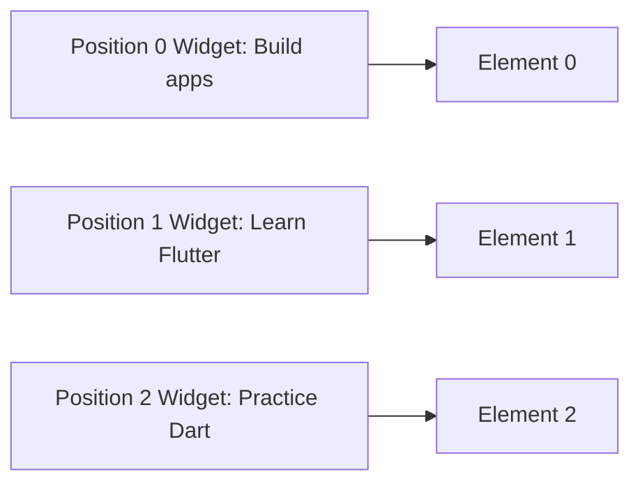
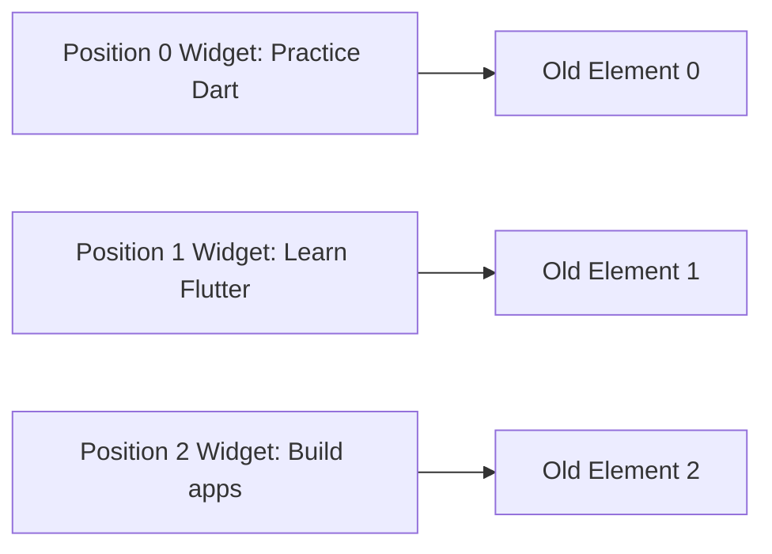
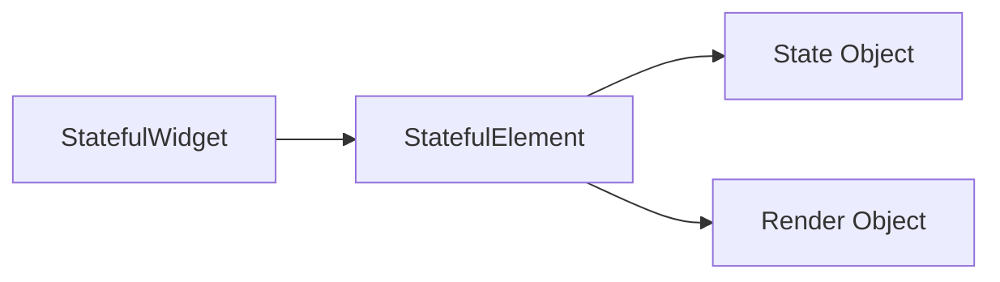
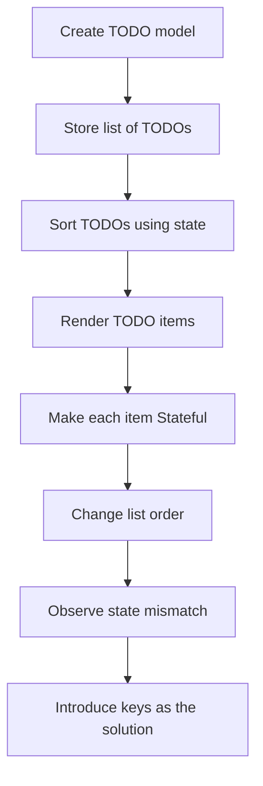
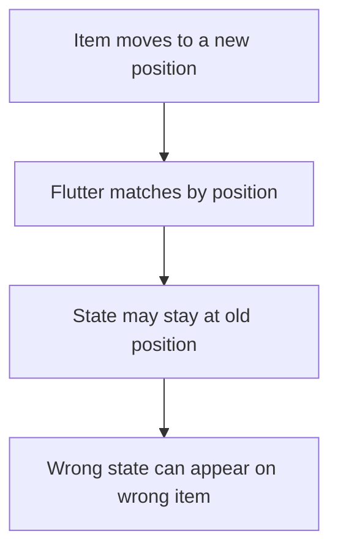
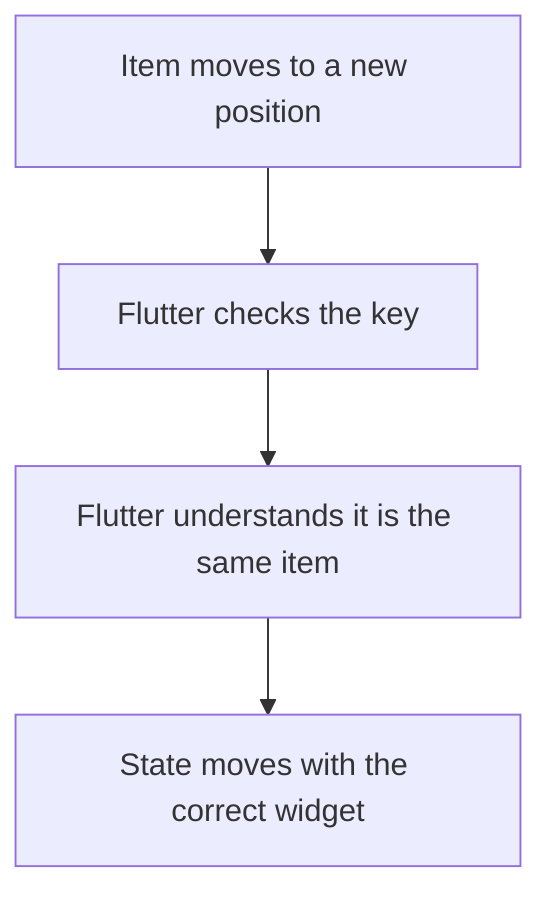

# Understanding Keys: Setup

## Overview

This lecture introduces the problem that **keys** are designed to solve in Flutter.

To understand keys properly, we first need to understand how Flutter connects widgets to elements during rebuilds. By default, Flutter tries to reuse existing elements based on a widget's **runtime type** and **position** in the widget tree.

This works well in many cases. However, it can cause problems when a list of `StatefulWidget` items is reordered, inserted, or removed.

The lecture sets up a TODO app demo where items can be sorted in different orders. This creates the perfect scenario for understanding why keys are sometimes necessary.

---

## Why Keys Matter

Keys are related to how Flutter matches widgets with existing elements.

Without keys, Flutter mainly asks:

> “Is there a widget of the same type at the same position?”

With keys, Flutter can ask:

> “Is this the same logical widget as before, even if its position changed?”

This difference becomes important when working with dynamic lists.

---

## Core Problem Diagram

```mermaid id="keys_setup_problem"
flowchart TD
    A[Widget Tree Rebuilds] --> B[Flutter compares new widgets with existing elements]
    B --> C{Same type and same position?}

    C -->|Yes| D[Reuse existing Element]
    C -->|No| E[Create or replace Element]

    D --> F[State stays attached to that position]
    F --> G[Problem: state may belong to the wrong list item after reordering]

    H[Keys] --> I[Give widgets stable identity]
    I --> J[Flutter can match items even when positions change]
```



---

## Demo Context

The demo app contains a list of TODO items.

Each TODO item has text, and the list can be sorted in ascending or descending order.

For example:

```dart id="todo_model"
class Todo {
  const Todo(this.text);

  final String text;
}
```

The app stores a list of dummy TODOs:

```dart id="todo_list"
final _todos = const [
  Todo('Learn Flutter'),
  Todo('Practice Dart'),
  Todo('Build apps'),
];
```

The order can be changed by pressing a button.

---

## Sorting the TODO List

The lecture uses an `order` state to decide whether the TODO items should be displayed in ascending or descending order.

A copy of the original TODO list is sorted instead of mutating the original list directly.

```dart id="sort_todos"
List<Todo> get _orderedTodos {
  final sortedTodos = List.of(_todos);

  sortedTodos.sort((a, b) {
    final comparison = a.text.compareTo(b.text);

    if (_order == Order.ascending) {
      return comparison;
    }

    return -comparison;
  });

  return sortedTodos;
}
```

This is important because `sort()` changes the list it is called on.

By using `List.of(_todos)`, the original list remains unchanged in memory.

---

## Example Widget Setup

```dart id="keys_demo_widget"
enum Order {
  ascending,
  descending,
}

class KeysDemo extends StatefulWidget {
  const KeysDemo({super.key});

  @override
  State<KeysDemo> createState() => _KeysDemoState();
}

class _KeysDemoState extends State<KeysDemo> {
  var _order = Order.ascending;

  final _todos = const [
    Todo('Learn Flutter'),
    Todo('Practice Dart'),
    Todo('Build apps'),
  ];

  List<Todo> get _orderedTodos {
    final sortedTodos = List.of(_todos);

    sortedTodos.sort((a, b) {
      final comparison = a.text.compareTo(b.text);

      if (_order == Order.ascending) {
        return comparison;
      }

      return -comparison;
    });

    return sortedTodos;
  }

  void _changeOrder() {
    setState(() {
      _order = _order == Order.ascending
          ? Order.descending
          : Order.ascending;
    });
  }

  @override
  Widget build(BuildContext context) {
    return Column(
      children: [
        TextButton.icon(
          onPressed: _changeOrder,
          icon: const Icon(Icons.swap_vert),
          label: const Text('Change Order'),
        ),
        for (final todo in _orderedTodos)
          TodoItem(todo.text),
      ],
    );
  }
}
```

---

## The Important Detail

The TODO items are rendered with a `for` loop:

```dart id="todo_loop"
for (final todo in _orderedTodos)
  TodoItem(todo.text),
```

At first, this looks fine.

But if `TodoItem` is a `StatefulWidget`, each item may hold internal state.

For example:

```dart id="todo_item_stateful"
class TodoItem extends StatefulWidget {
  const TodoItem(this.text, {super.key});

  final String text;

  @override
  State<TodoItem> createState() => _TodoItemState();
}
```

The state may store something internal, such as:

* A random color
* A checkbox value
* An animation state
* A text field value
* An expanded/collapsed state

This is where the problem begins.

---

## Position-Based Matching

By default, Flutter matches widgets by their position in the tree.

Imagine the list starts like this:

```text id="initial_order"
Position 0: Build apps
Position 1: Learn Flutter
Position 2: Practice Dart
```

Flutter creates elements for each position:



Now the user changes the sort order:

```text id="changed_order"
Position 0: Practice Dart
Position 1: Learn Flutter
Position 2: Build apps
```

Without keys, Flutter sees widgets of the same type at the same positions.

So it may reuse the existing elements by position:



The elements are reused, but their internal state may now be attached to the wrong TODO item.

---

## Why This Is a Problem

The visible text may update correctly, but the internal state can stay with the old position.

For example, imagine each TODO item gets a random color when its state is first created.

Initial order:

| Position | TODO Text     | State Color |
| -------- | ------------- | ----------- |
| 0        | Build apps    | Blue        |
| 1        | Learn Flutter | Green       |
| 2        | Practice Dart | Red         |

After sorting without keys:

| Position | TODO Text     | State Color |
| -------- | ------------- | ----------- |
| 0        | Practice Dart | Blue        |
| 1        | Learn Flutter | Green       |
| 2        | Build apps    | Red         |

The colors stayed with the positions, not with the logical TODO items.

This is the bug that keys solve.

---

## Why the Bug Appears with Stateful Widgets

This issue matters most when list items are `StatefulWidget`s.

A `StatelessWidget` has no internal state to preserve incorrectly.

But a `StatefulWidget` has a `State` object connected to an element.



If Flutter reuses the wrong element, the wrong state may stay attached to the wrong widget configuration.

---

## Stateful List Item Example

```dart id="stateful_todo_item"
class TodoItem extends StatefulWidget {
  const TodoItem(this.text, {super.key});

  final String text;

  @override
  State<TodoItem> createState() => _TodoItemState();
}

class _TodoItemState extends State<TodoItem> {
  late final Color color;

  @override
  void initState() {
    super.initState();

    // Example only:
    // This color is created once and stored in the State object.
    color = Colors.primaries[widget.text.length % Colors.primaries.length];
  }

  @override
  Widget build(BuildContext context) {
    return ListTile(
      leading: CircleAvatar(backgroundColor: color),
      title: Text(widget.text),
    );
  }
}
```

The `color` is stored inside the state object.

If the TODO items are reordered without keys, the state may stay at the old position instead of moving with the correct TODO item.

---

## What This Lecture Is Setting Up

This lecture does not fully solve the issue yet.

Instead, it prepares the scenario:

1. Create a list of TODO items.
2. Render them in a column.
3. Add a button that changes the order.
4. Make each item a `StatefulWidget`.
5. Observe that Flutter may reuse state based on position.
6. Understand why keys are needed.



---

## Key Concept: Widget Identity vs Element Identity

A widget is just a configuration object.

An element is the long-lived object that connects a widget to the running UI.

Without keys, Flutter usually identifies widgets by:

* Their runtime type
* Their position in the tree

With keys, Flutter can identify widgets by:

* Their runtime type
* Their key

This helps Flutter preserve the correct element and state when list items move.

---

## Important Mental Model

Without keys:



With keys:



---

## Key Points

* Keys are connected to Flutter's widget-element matching process.
* Flutter rebuilds widget trees frequently.
* Elements are reused when possible.
* By default, Flutter often matches widgets by type and position.
* This can cause problems in reordered lists of `StatefulWidget`s.
* Stateful list items can keep state such as color, checkbox value, input text, or animation state.
* Without keys, that state may stay attached to the wrong position.
* Keys give Flutter a stable identity for widgets.
* This lecture focuses on creating the problem before applying the solution.

---

## Tips

* Build the demo app while following the lecture.
* First observe the bug without keys.
* Pay attention to which data belongs to the widget and which data belongs to the state.
* Remember that the issue is most visible with `StatefulWidget`s.
* Do not use keys everywhere blindly.
* Use keys when widget identity matters across reorder, insertion, or removal.

---

## Notes

This setup is important because keys can feel confusing if you only learn the syntax.

The real purpose of keys becomes clear when you see Flutter preserve the wrong state after a list changes order.

The key problem is not that Flutter cannot rebuild the UI. Flutter can rebuild the UI correctly. The problem is that Flutter may reuse an existing element and state object for a different logical item because the item moved to a different position.

Keys solve this by giving Flutter a stable way to recognize which widget is which.

---

## Summary

This lecture prepares the foundation for understanding Flutter keys.

Flutter normally reuses elements based on widget type and position. This is efficient, but it can cause incorrect state behavior when `StatefulWidget` items in a list are reordered, inserted, or removed.

By building a TODO list that can change order, the lecture creates a clear scenario where Flutter's default reconciliation behavior can fail.

This sets up the motivation for keys: keys allow Flutter to preserve the correct state for the correct widget, even when that widget moves in the tree.
