# Which Problem Do Keys Solve?

## Overview

Keys solve a very specific problem in Flutter:

> When `StatefulWidget`s are reordered, inserted, or removed, Flutter may reuse the wrong element and keep the wrong `State` object attached to the wrong widget.

By default, Flutter tries to reuse elements for performance. It usually matches widgets by:

* Their runtime type
* Their position in the tree

This works well for simple and static widget trees. But it can break when a list of `StatefulWidget`s changes order.

Keys give widgets a stable identity so Flutter can correctly match each widget with its existing element and state, even if its position changes.

---

## The Core Problem

When widgets are reordered, Flutter may keep the same element structure and only update which widget each element points to.

This is efficient, but it can become incorrect when those widgets have internal state.

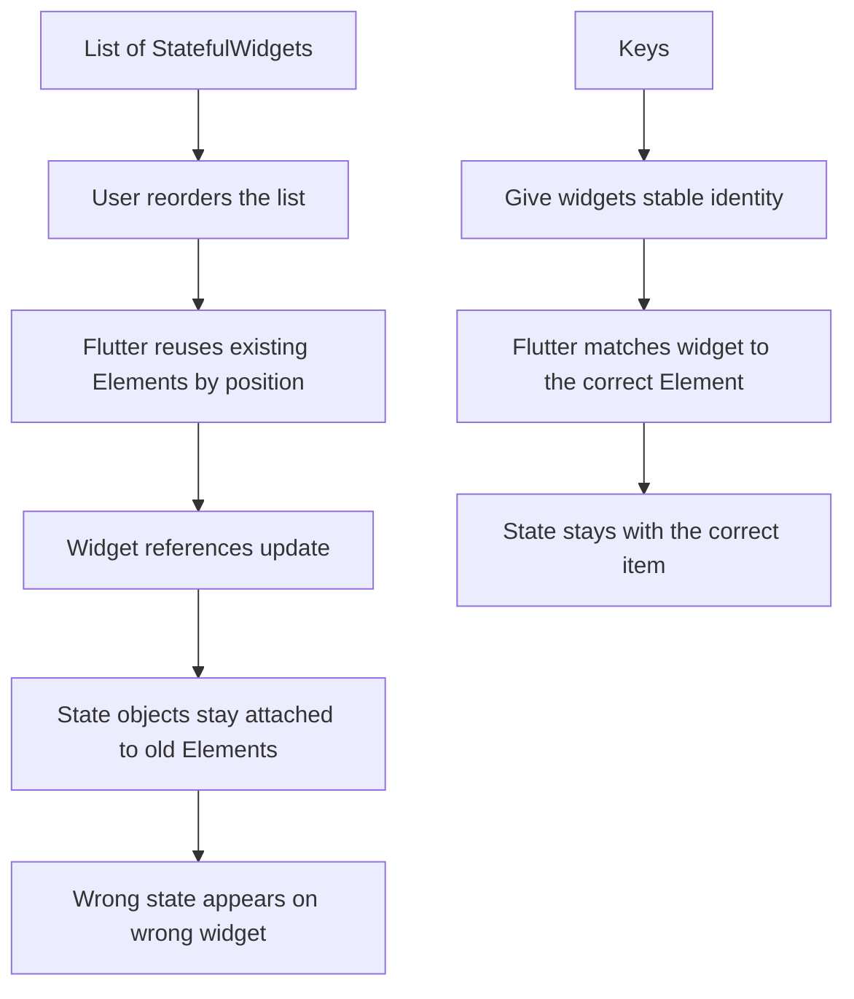

---

## Why Flutter Reuses Elements

Flutter does not recreate elements unnecessarily.

If a list still contains the same number of widgets and the same widget types, Flutter tries to reuse the existing elements.

For example, imagine a TODO list with three items:

```text id="todo_original"
Position 0: TodoItem A
Position 1: TodoItem B
Position 2: TodoItem C
```

Flutter creates elements for these positions:

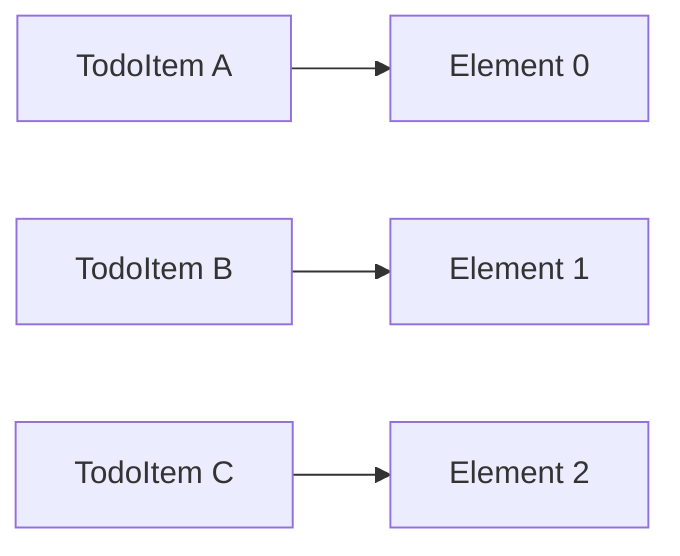

Now the list is reordered:

```text id="todo_reordered"
Position 0: TodoItem C
Position 1: TodoItem B
Position 2: TodoItem A
```

Without keys, Flutter may reuse the same element positions:

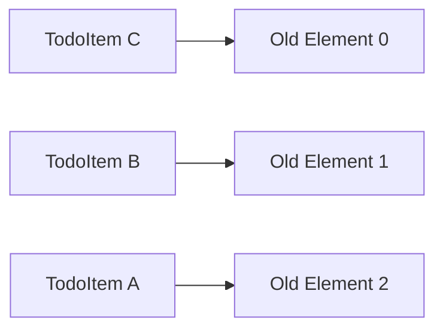

This is good for performance because Flutter avoids recreating all elements.

For stateless widgets, this usually works fine.

But for stateful widgets, this can cause a state mismatch.

---

## Why Stateless Widgets Usually Work Fine

If the list items are `StatelessWidget`s, there is no internal state object to preserve.

Flutter can simply update the element's widget reference and rebuild the displayed content.

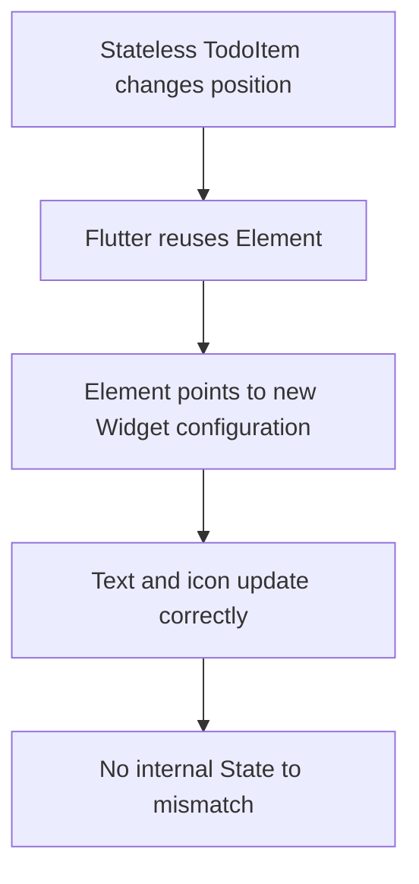

Because there is no separate `State` object, nothing can accidentally stay attached to the wrong item.

---

## Where the Problem Starts: Stateful Widgets

The issue appears when each list item is a `StatefulWidget`.

For example, imagine each TODO item has a checkbox:

```dart id="checkable_todo_item"
class CheckableTodoItem extends StatefulWidget {
  const CheckableTodoItem({
    super.key,
    required this.text,
  });

  final String text;

  @override
  State<CheckableTodoItem> createState() => _CheckableTodoItemState();
}

class _CheckableTodoItemState extends State<CheckableTodoItem> {
  var _isChecked = false;

  @override
  Widget build(BuildContext context) {
    return CheckboxListTile(
      value: _isChecked,
      onChanged: (value) {
        setState(() {
          _isChecked = value ?? false;
        });
      },
      title: Text(widget.text),
    );
  }
}
```

Here, `_isChecked` is stored inside the `State` object.

That `State` object is not directly attached to the widget object.
It is attached to the element.

---

## Widget, Element, and State Relationship

A `StatefulWidget` does not hold its own mutable state directly.

Instead, Flutter creates a separate `State` object and connects it to the element.

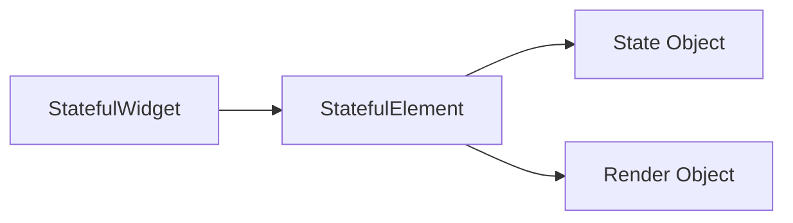

This means:

> The state belongs to the element, not directly to the widget instance.

That detail is the key to understanding the bug.

---

## The Bug Without Keys

Imagine this initial list:

| Position | Widget     | State   |
| -------- | ---------- | ------- |
| 0        | TodoItem A | State A |
| 1        | TodoItem B | State B |
| 2        | TodoItem C | State C |

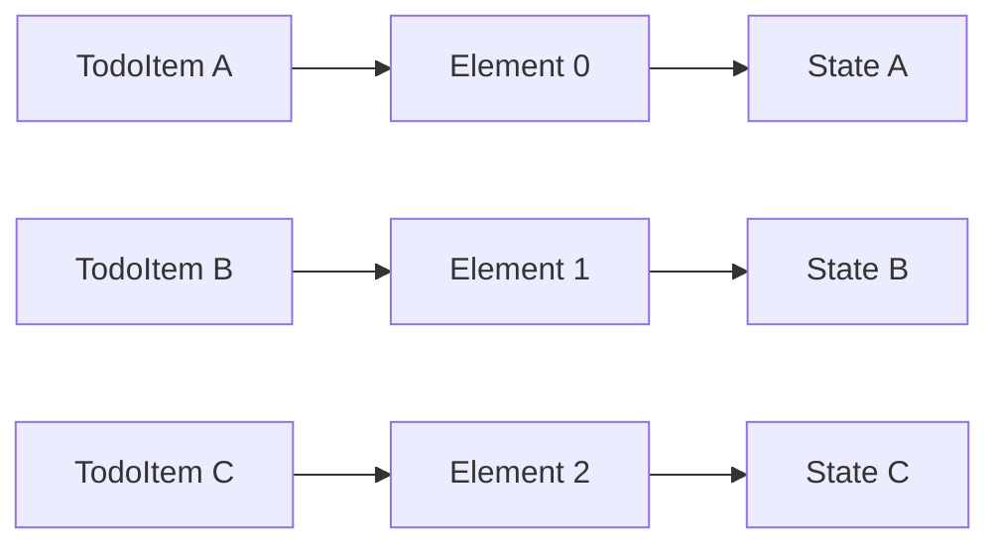

Now suppose the user checks **TodoItem A**.

```text id="checked_before"
TodoItem A: checked
TodoItem B: unchecked
TodoItem C: unchecked
```

Then the list is reordered:

| Position | New Widget | Reused Element | Existing State |
| -------- | ---------- | -------------- | -------------- |
| 0        | TodoItem C | Element 0      | State A        |
| 1        | TodoItem B | Element 1      | State B        |
| 2        | TodoItem A | Element 2      | State C        |

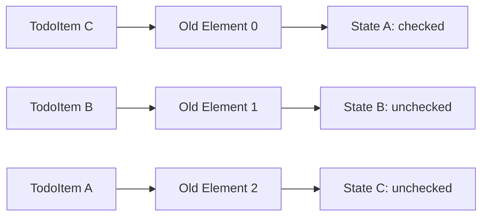

Now the checked state appears on **TodoItem C**, even though the user originally checked **TodoItem A**.

This is the problem keys solve.

---

## Why This Happens

Flutter is trying to optimize performance.

When the list is reordered, Flutter sees:

* Same number of widgets
* Same widget type
* Same general tree structure

So it keeps the existing elements and only updates their widget references.

But the state objects stay connected to the old elements.

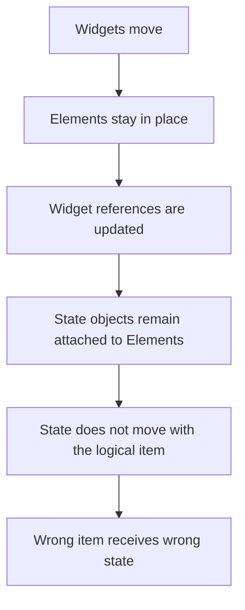

---

## Removing an Item Causes the Same Problem

The same issue can happen when an item is removed from the middle or beginning of a list.

Before removal:

| Position | Widget     | State   |
| -------- | ---------- | ------- |
| 0        | TodoItem A | State A |
| 1        | TodoItem B | State B |
| 2        | TodoItem C | State C |

After removing `TodoItem A`:

| Position | Widget     | Reused Element | Existing State |
| -------- | ---------- | -------------- | -------------- |
| 0        | TodoItem B | Element 0      | State A        |
| 1        | TodoItem C | Element 1      | State B        |

The widgets shifted upward, but the states stayed attached to their old element positions.

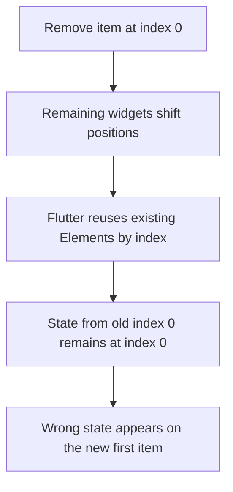

---

## What Keys Do

Keys give Flutter a stable identity for each widget.

Instead of only asking:

> “Is this the same widget type at the same position?”

Flutter can also ask:

> “Does this widget have the same key as before?”

With keys, Flutter can move the correct element and state together with the correct widget.

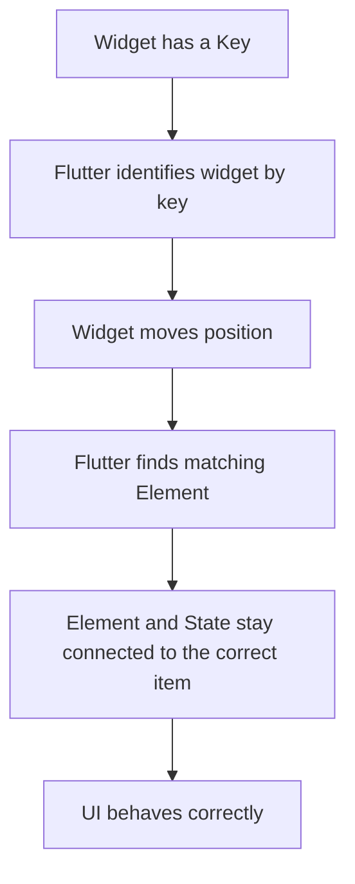

---

## Example: Adding a Key

Without a key:

```dart id="without_key"
for (final todo in orderedTodos)
  CheckableTodoItem(text: todo.text),
```

With a key:

```dart id="with_key"
for (final todo in orderedTodos)
  CheckableTodoItem(
    key: ValueKey(todo.text),
    text: todo.text,
  ),
```

Now Flutter can recognize each TODO item by its key.

If the item moves, Flutter can preserve the correct state for that item.

---

## Correct Matching With Keys

Initial order:

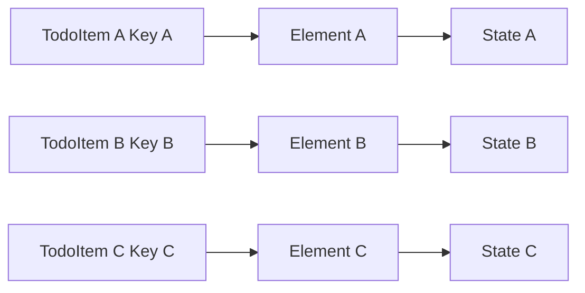

After reordering:

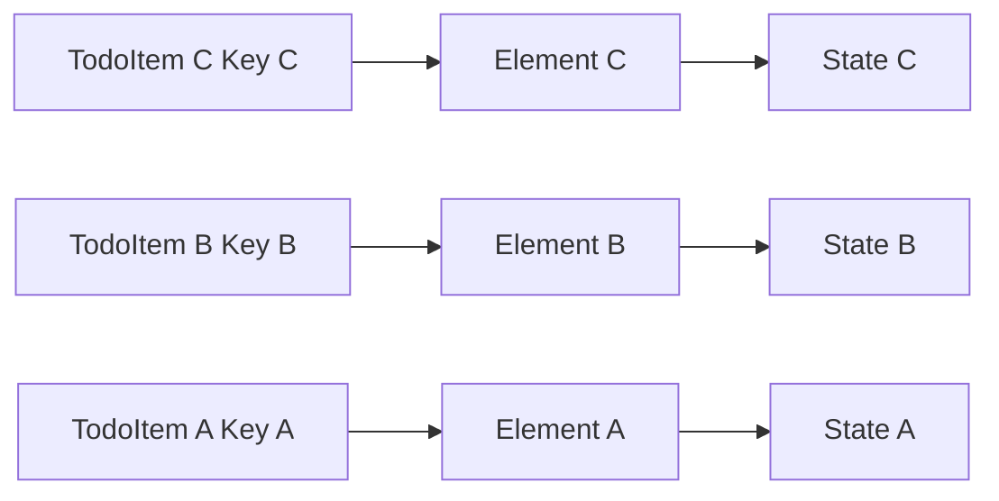

The state now follows the correct logical item.

---

## The Real Problem Keys Solve

Keys do not exist to make every widget faster.

They exist to help Flutter preserve identity correctly when the normal position-based matching is not enough.

Keys are useful when widgets:

* Move to a different position
* Are inserted into a list
* Are removed from a list
* Are reordered dynamically
* Hold internal state
* Need to preserve animations, focus, input values, or checkbox state

---

## Important Clarification

Keys are usually not needed for simple static layouts.

For example:

```dart id="no_key_needed"
Column(
  children: const [
    Text('Title'),
    Text('Subtitle'),
    Icon(Icons.star),
  ],
)
```

This layout does not need keys because the structure is stable and there is no ambiguous stateful list behavior.

Keys matter when Flutter might otherwise confuse one widget with another during reconciliation.

---

## Key Points

* Flutter reuses elements for performance.
* State objects are attached to elements, not directly to widget instances.
* Without keys, Flutter often matches widgets by type and position.
* Reordering a list can cause state to stay at the old position.
* Removing an item can shift widgets into positions with the wrong state.
* This problem mainly affects `StatefulWidget`s.
* `StatelessWidget`s usually do not suffer from this issue because they have no internal state.
* Keys give widgets a stable identity.
* With keys, Flutter can match the correct widget to the correct element and state.

---

## Practical Mental Model

Without keys:

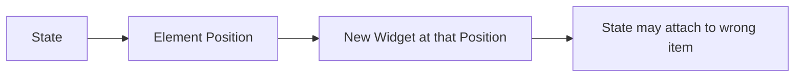

With keys:

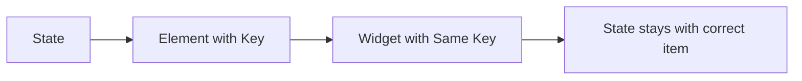

Simple version:

> Without keys, state follows position.
> With keys, state follows identity.

---

## Notes

This problem can be difficult to notice because the visible text may still update correctly. The UI may look mostly right until each item stores internal state.

Examples of internal state include:

* Checkbox selection
* Text field input
* Focus state
* Animation progress
* Expanded or collapsed state
* Random color generated in `initState()`

If that state is stored inside each item widget, Flutter needs a reliable way to know which state belongs to which item.

That reliable identity is provided by keys.

---

## Summary

Keys solve the problem of incorrect state reuse.

When Flutter rebuilds a dynamic list, it tries to reuse elements for performance. Without keys, it usually matches widgets by type and position. If stateful widgets are reordered, inserted, or removed, this can cause the wrong `State` object to remain attached to the wrong logical item.

Keys fix this by giving each widget a stable identity. With keys, Flutter can match widgets to their correct existing elements, so state stays with the correct item even when the widget moves in the tree.
