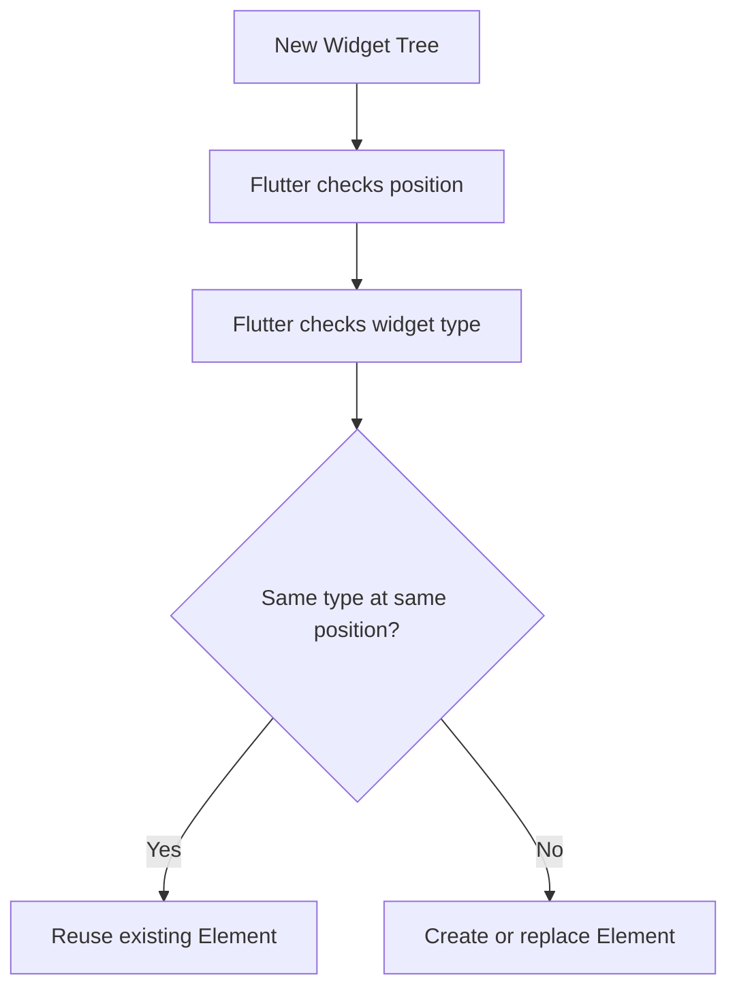
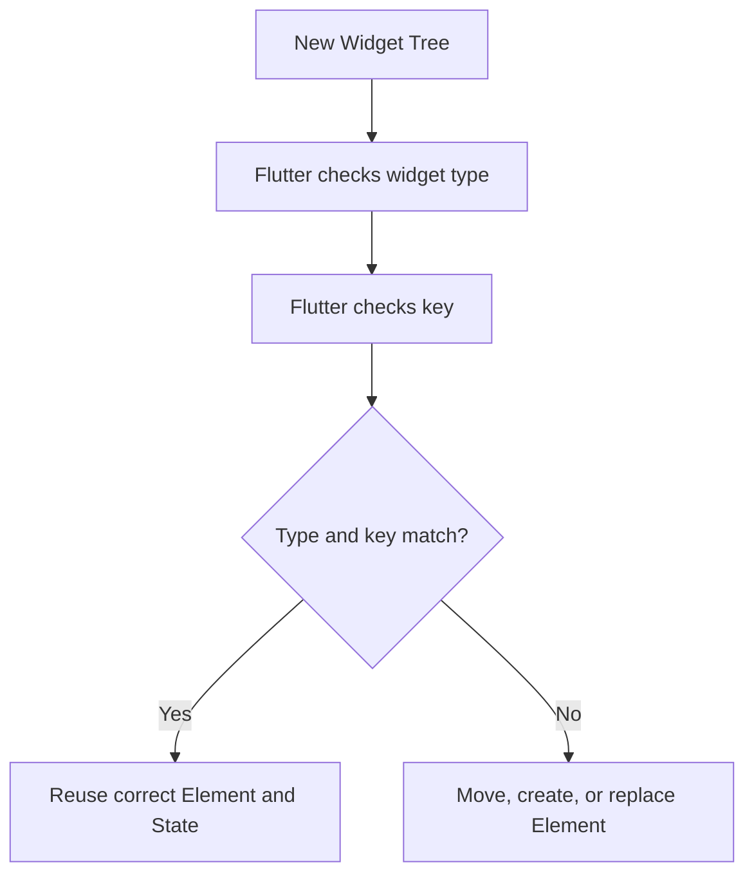
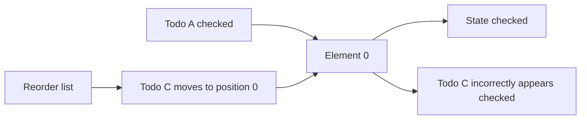
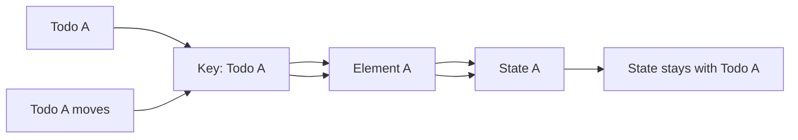
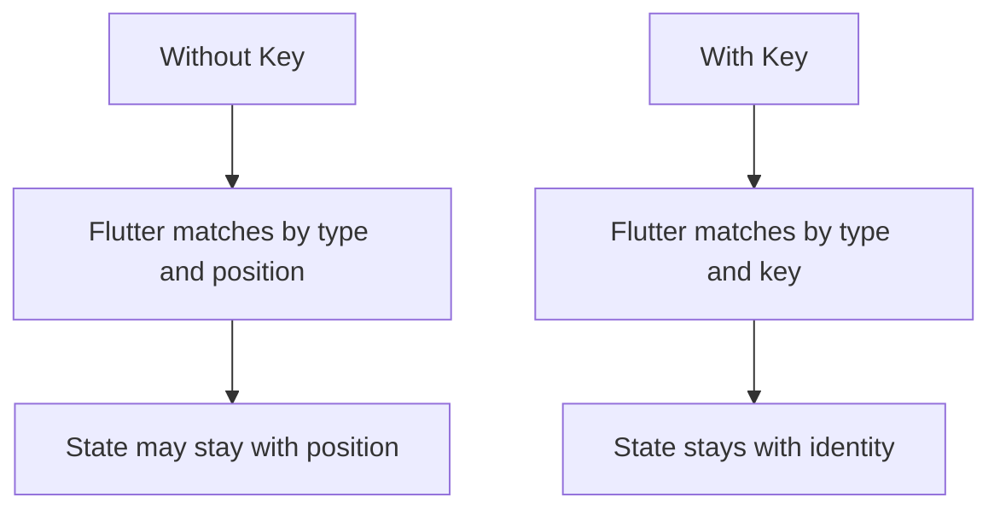

# Understanding and Using Keys

## Overview

Keys are used in Flutter to give widgets a stable identity during rebuilds.

By default, Flutter decides whether an element can be reused by checking the widget's **type** and **position** in the widget tree. This works in many cases, but it can fail when `StatefulWidget`s are reordered, inserted, or removed.

Keys solve this problem by giving Flutter an additional way to match widgets with their existing elements and state.

In simple terms:

> Keys help Flutter know which widget is which.

---

## Why Keys Are Needed

Without keys, Flutter usually matches widgets like this:



This means that if two widgets of the same type swap positions, Flutter may still reuse the existing elements at those positions.

That can cause a problem when those widgets have internal state.

---

## How Keys Change the Matching Process

When a widget has a key, Flutter also compares the key during reconciliation.



With keys, Flutter can preserve the correct element and state even if a widget moves to a different position.

---

## The Problem Without Keys

Imagine a list of checkable TODO items.

Each item is a `StatefulWidget` that stores its own checked state.

Initial list:

| Position | Widget | State     |
| -------- | ------ | --------- |
| 0        | Todo A | Checked   |
| 1        | Todo B | Unchecked |
| 2        | Todo C | Unchecked |

After reordering without keys:

| Position | Widget | State     |
| -------- | ------ | --------- |
| 0        | Todo C | Checked   |
| 1        | Todo B | Unchecked |
| 2        | Todo A | Unchecked |

The checked state stayed with the position, not with the correct TODO item.



---

## The Fix: Add a Key

To fix this, give each TODO item a stable key.

```dart id="value_key_example"
for (final todo in orderedTodos)
  CheckableTodoItem(
    key: ValueKey(todo.text),
    todo: todo,
  ),
```

Now Flutter can identify each item by its key.

If the item moves, its element and state can move with it.



---

## Where to Place the Key

The key should be placed on the widget whose identity needs to be preserved.

Usually, this means placing the key on the **top-level widget inside the list**.

Correct:

```dart id="correct_key_placement"
for (final todo in orderedTodos)
  CheckableTodoItem(
    key: ValueKey(todo.text),
    todo: todo,
  ),
```

Incorrect:

```dart id="wrong_key_placement"
class CheckableTodoItem extends StatefulWidget {
  const CheckableTodoItem({
    super.key,
    required this.todo,
  });

  final Todo todo;

  @override
  State<CheckableTodoItem> createState() => _CheckableTodoItemState();
}

class _CheckableTodoItemState extends State<CheckableTodoItem> {
  @override
  Widget build(BuildContext context) {
    return ListTile(
      title: Text(
        widget.todo.text,
        key: ValueKey(widget.todo.text), // Too deep; does not solve parent state mismatch
      ),
    );
  }
}
```

The key must be attached to the widget that owns or connects to the state you want Flutter to preserve.

---

## Common Types of Keys

Flutter provides several key types.

The most common ones are:

* `ValueKey`
* `ObjectKey`
* `UniqueKey`
* `GlobalKey`

---

## 1. ValueKey

`ValueKey` identifies a widget using a specific value.

This is the most common key for list items.

```dart id="value_key"
CheckableTodoItem(
  key: ValueKey(todo.id),
  todo: todo,
)
```

Use `ValueKey` when each item has a stable unique value, such as:

* Database ID
* API ID
* Username
* Slug
* Unique text value

Best practice:

```dart id="best_value_key"
key: ValueKey(todo.id)
```

Using an ID is better than using display text because text may change or may not be unique.

---

## 2. ObjectKey

`ObjectKey` identifies a widget using an object.

```dart id="object_key"
CheckableTodoItem(
  key: ObjectKey(todo),
  todo: todo,
)
```

This can be useful when each list item is represented by a unique model object.

However, `ValueKey` with a stable ID is usually preferred because it is simpler and more explicit.

---

## 3. UniqueKey

`UniqueKey` creates a key that is unique every time it is created.

```dart id="unique_key"
CheckableTodoItem(
  key: UniqueKey(),
  todo: todo,
)
```

This forces Flutter to treat the widget as completely new.

That means the old element and state will not be reused.

Use `UniqueKey` only when you intentionally want to discard old state and create fresh state.

Do not use it for normal list identity.

Bad for preserving list item state:

```dart id="bad_unique_key"
key: UniqueKey()
```

Why?

Because a new key is created on every build, so Flutter cannot match the widget with its previous element.

---

## 4. GlobalKey

`GlobalKey` gives a widget a globally unique identity across the entire widget tree.

It can also be used to access a widget's state or render object.

Example:

```dart id="global_key"
final formKey = GlobalKey<FormState>();

Form(
  key: formKey,
  child: TextFormField(),
)
```

Then you can access the form state:

```dart id="form_key_usage"
formKey.currentState?.validate();
```

`GlobalKey` is powerful, but it should be used carefully.

Use it for cases like:

* Forms
* Accessing a specific widget state
* Moving a widget across different parts of the tree while preserving state

Avoid using `GlobalKey` for normal list items because it has more overhead and can make the widget tree harder to manage.

---

## Key Types Comparison

| Key Type    | Uses                             | Best For                      | Warning                                  |
| ----------- | -------------------------------- | ----------------------------- | ---------------------------------------- |
| `ValueKey`  | A stable value                   | Most dynamic lists            | Value must be unique and stable          |
| `ObjectKey` | A model object                   | Object-based identity         | Depends on object identity/equality      |
| `UniqueKey` | Always new identity              | Forcing fresh state           | Do not use if you want to preserve state |
| `GlobalKey` | Global identity and state access | Forms and rare advanced cases | Use sparingly                            |

---

## Recommended Key Choice

For most Flutter apps, use `ValueKey`.

Best:

```dart id="recommended_key"
key: ValueKey(todo.id)
```

Acceptable in a simple demo:

```dart id="demo_key"
key: ValueKey(todo.text)
```

Less ideal for production:

```dart id="less_ideal_key"
key: ObjectKey(todo)
```

Usually wrong for preserving list state:

```dart id="usually_wrong_key"
key: UniqueKey()
```

---

## Full Example

```dart id="full_key_example"
class Todo {
  const Todo({
    required this.id,
    required this.text,
  });

  final String id;
  final String text;
}

class TodoList extends StatefulWidget {
  const TodoList({super.key});

  @override
  State<TodoList> createState() => _TodoListState();
}

class _TodoListState extends State<TodoList> {
  var _ascending = true;

  final _todos = const [
    Todo(id: 'todo-1', text: 'Learn Flutter'),
    Todo(id: 'todo-2', text: 'Practice Dart'),
    Todo(id: 'todo-3', text: 'Build apps'),
  ];

  List<Todo> get _orderedTodos {
    final sortedTodos = List.of(_todos);

    sortedTodos.sort((a, b) {
      final comparison = a.text.compareTo(b.text);
      return _ascending ? comparison : -comparison;
    });

    return sortedTodos;
  }

  void _changeOrder() {
    setState(() {
      _ascending = !_ascending;
    });
  }

  @override
  Widget build(BuildContext context) {
    return Column(
      children: [
        TextButton.icon(
          onPressed: _changeOrder,
          icon: const Icon(Icons.swap_vert),
          label: const Text('Change Order'),
        ),
        for (final todo in _orderedTodos)
          CheckableTodoItem(
            key: ValueKey(todo.id),
            todo: todo,
          ),
      ],
    );
  }
}
```

---

## Checkable TODO Item

```dart id="checkable_todo_item"
class CheckableTodoItem extends StatefulWidget {
  const CheckableTodoItem({
    super.key,
    required this.todo,
  });

  final Todo todo;

  @override
  State<CheckableTodoItem> createState() => _CheckableTodoItemState();
}

class _CheckableTodoItemState extends State<CheckableTodoItem> {
  var _isChecked = false;

  @override
  Widget build(BuildContext context) {
    return CheckboxListTile(
      value: _isChecked,
      onChanged: (value) {
        setState(() {
          _isChecked = value ?? false;
        });
      },
      title: Text(widget.todo.text),
    );
  }
}
```

Because each `CheckableTodoItem` has a stable `ValueKey`, Flutter can keep the correct `_isChecked` state attached to the correct TODO item.

---

## Why Widget Constructors Should Accept Keys

Most custom widgets should accept a `key` parameter and forward it to the superclass.

```dart id="accept_key"
class CheckableTodoItem extends StatefulWidget {
  const CheckableTodoItem({
    super.key,
    required this.todo,
  });

  final Todo todo;

  @override
  State<CheckableTodoItem> createState() => _CheckableTodoItemState();
}
```

This allows the parent widget to provide a key when needed.

Without this, the parent cannot easily assign a key to your custom widget.

---

## Rules for Choosing Key Values

A good key value should be:

* Unique among sibling widgets
* Stable across rebuilds
* Directly connected to the data item
* Not randomly generated every build

Good:

```dart id="good_keys"
ValueKey(todo.id)
ValueKey(user.id)
ValueKey(product.sku)
```

Bad:

```dart id="bad_keys"
ValueKey(Random().nextInt(1000))
UniqueKey()
ValueKey(DateTime.now())
```

These bad examples change too often, so Flutter cannot use them to preserve identity correctly.

---

## When You Need Keys

Use keys when widgets of the same type can change position or identity.

Common cases:

* Reorderable lists
* Dismissible list items
* Insertable/removable list items
* Stateful list items
* Animated list changes
* Form fields inside dynamic lists
* Checkboxes inside dynamic lists

Example:

```dart id="dismissible_key"
Dismissible(
  key: ValueKey(todo.id),
  onDismissed: (_) => removeTodo(todo.id),
  child: CheckableTodoItem(todo: todo),
)
```

`Dismissible` requires a key because Flutter must know exactly which item is being dismissed.

---

## When You Usually Do Not Need Keys

You usually do not need keys for stable static layouts.

```dart id="no_keys_needed"
const Column(
  children: [
    Text('Title'),
    SizedBox(height: 12),
    Text('Subtitle'),
  ],
)
```

This widget tree does not reorder, insert, or remove stateful children dynamically, so keys are unnecessary.

---

## Important Mental Model



Simple version:

> Without keys, Flutter asks: “Is this the same type at this position?”
> With keys, Flutter also asks: “Is this the same identity?”

---

## Key Points

* Keys are additional identity markers for widgets.
* Flutter uses keys during reconciliation.
* Keys help Flutter match widgets with the correct elements.
* Correct element matching preserves the correct state.
* `ValueKey` is the most common key for dynamic lists.
* Use stable IDs whenever possible.
* `ObjectKey` can use a model object as identity.
* `UniqueKey` forces Flutter to create fresh state.
* `GlobalKey` is powerful but should be used sparingly.
* Put the key on the widget whose identity and state must be preserved.

---

## Notes

Keys are not needed everywhere.

They are mainly needed when Flutter's default position-based matching is not enough. This usually happens when widgets of the same type are dynamically reordered, inserted, or removed.

For most list-based use cases, `ValueKey` with a unique data ID is the best solution.

Avoid random or constantly changing key values because they prevent Flutter from preserving state correctly.

---

## Summary

Keys help Flutter correctly match widgets to their existing elements during rebuilds.

Without keys, Flutter often matches widgets by type and position. This can cause incorrect state behavior when `StatefulWidget`s move around in a list.

By adding a stable key, such as `ValueKey(todo.id)`, Flutter can preserve the correct element and state for each item, even when the list order changes.

The most practical key for everyday Flutter development is `ValueKey`, while `GlobalKey` should be reserved for special cases such as forms or advanced state access.
