# Mutating Values in Memory and Making Sense of `var`, `final`, and `const`

## Overview

This lecture explains an important Dart concept that often confuses beginners: the difference between `var`, `final`, and `const`.

These keywords are not only about how variables are declared. They also affect how values are stored, reassigned, and mutated in memory.

Understanding this concept is especially important in Flutter because UI updates depend on state changes and rebuilds. A value may change in memory, but Flutter will not update the UI unless a rebuild is triggered, usually by calling `setState()`.

---

## Core Idea

In Dart, a variable does not directly contain a complex object like a list.

Instead, the variable usually stores a reference to an object in memory.

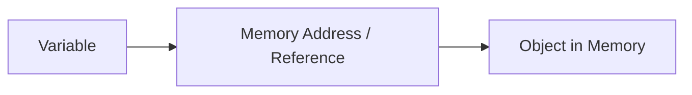

For example:

```dart id="list_reference"
final numbers = [1, 2, 3];
```

The variable `numbers` points to a list object in memory.

---

## `var`, `final`, and `const` at a Glance

| Keyword | Can Reassign Variable? |        Can Mutate Object? | When Is Value Known? |
| ------- | ---------------------: | ------------------------: | -------------------- |
| `var`   |                    Yes | Yes, if object is mutable | Runtime              |
| `final` |                     No | Yes, if object is mutable | Runtime              |
| `const` |                     No |                        No | Compile time         |

Simple version:

> `var` = the variable can point to something else.
> `final` = the variable cannot point to something else.
> `const` = the variable and the value are deeply fixed.

---

## Understanding `var`

A variable declared with `var` can be reassigned.

```dart id="var_example"
var name = 'Alice';

name = 'Bob'; // OK
```

The variable `name` first points to the string `'Alice'`, then it points to `'Bob'`.

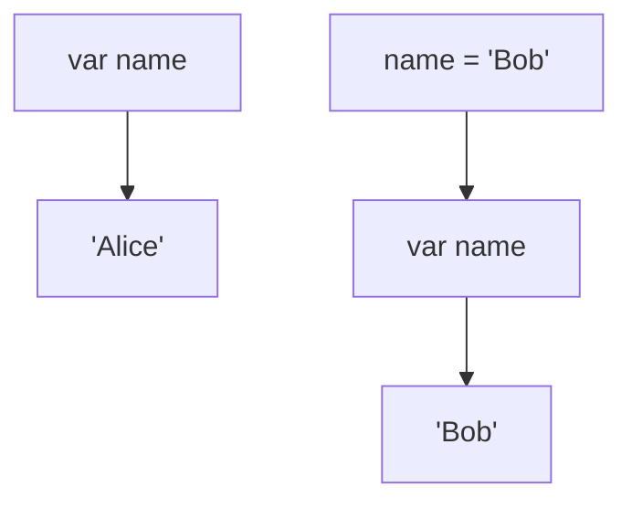

With `var`, reassignment is allowed.

---

## `var` with Lists

```dart id="var_list"
var numbers = [1, 2, 3];

numbers.add(4);      // OK: mutates the existing list
numbers = [5, 6, 7]; // OK: assigns a new list
```

Two different things happen here:

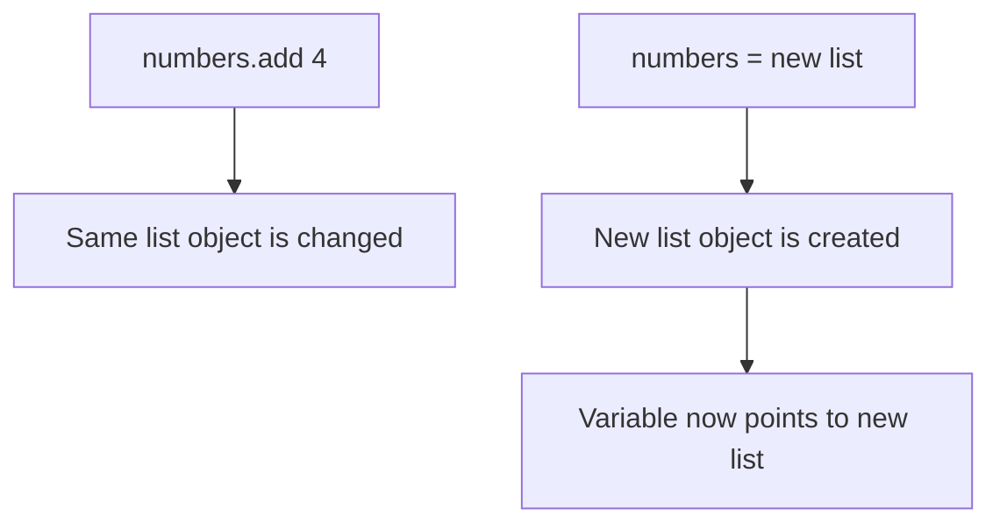

With `var`, both mutation and reassignment are allowed.

---

## Understanding `final`

A variable declared with `final` can only be assigned once.

```dart id="final_example"
final name = 'Alice';

name = 'Bob'; // ERROR
```

`final` locks the variable reference.

It prevents the variable from pointing to a different value later.

---

## `final` Does Not Always Mean Immutable

This is the most important part:

```dart id="final_list_mutation"
final numbers = [1, 2, 3];

numbers.add(4); // OK
```

This is allowed because you are not assigning a new list to `numbers`.

You are modifying the existing list object in memory.

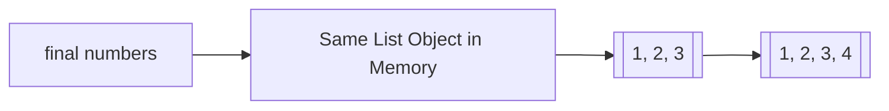

But this is not allowed:

```dart id="final_list_reassign"
final numbers = [1, 2, 3];

numbers = [4, 5, 6]; // ERROR
```

Why?

Because this would make `numbers` point to a new list object.

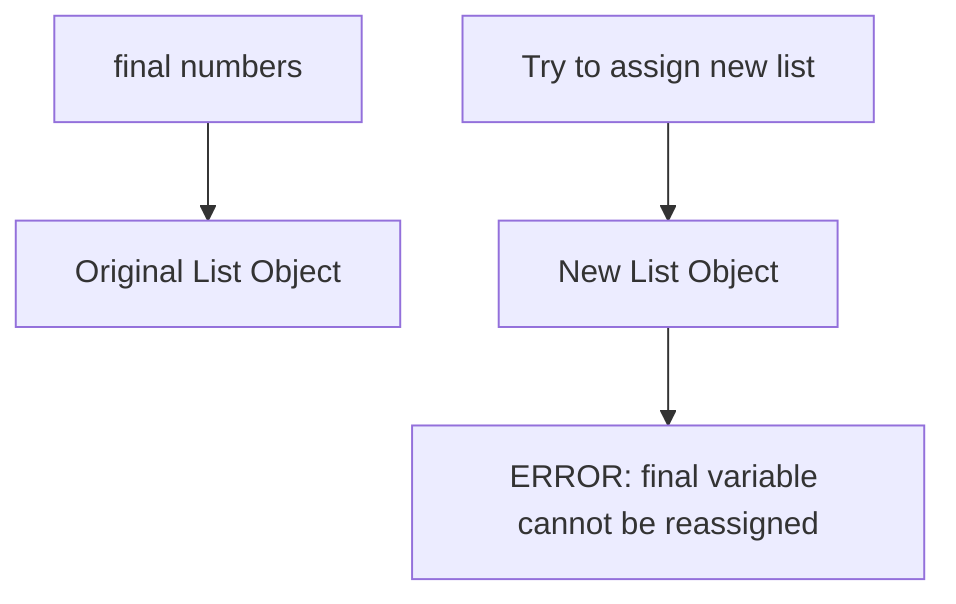

---

## Final Means the Variable Is Fixed, Not Always the Object

A good mental model:

> `final` protects the variable reference.
> It does not automatically protect the object behind that reference.

Example:

```dart id="final_mutable_object"
final todos = <String>[];

todos.add('Learn Flutter'); // OK
todos.add('Practice Dart'); // OK

// todos = []; // ERROR
```

The list itself can change because `List` is mutable.

But the variable `todos` cannot be reassigned to another list.

---

## Understanding `const`

`const` is stricter than `final`.

A `const` value is a compile-time constant.

```dart id="const_example"
const pi = 3.14159;
```

This value is known before the app runs.

You cannot reassign it:

```dart id="const_reassign_error"
const pi = 3.14159;

pi = 3.14; // ERROR
```

You also cannot mutate a `const` collection:

```dart id="const_list_error"
const numbers = [1, 2, 3];

numbers.add(4); // Runtime error: Cannot add to an unmodifiable list
```

---

## `const` Makes the Value Immutable

With `const`, the value itself cannot be changed.

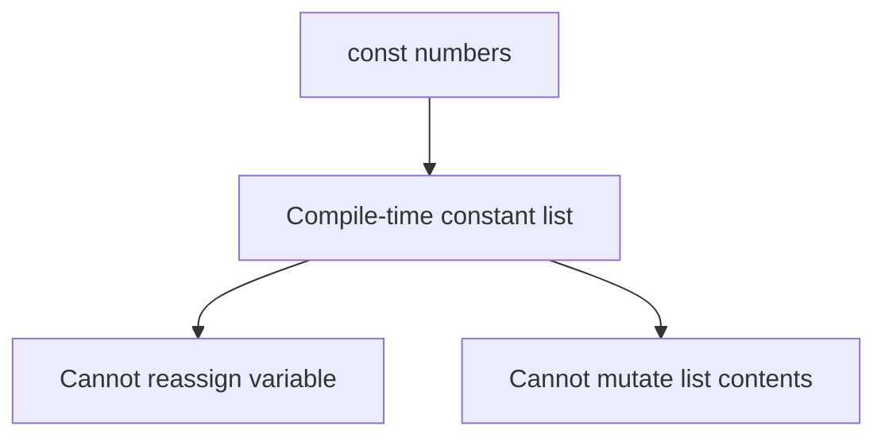

So this is different from `final`.

```dart id="final_vs_const_list"
final finalNumbers = [1, 2, 3];
finalNumbers.add(4); // OK

const constNumbers = [1, 2, 3];
constNumbers.add(4); // ERROR
```

---

## `final numbers = const [...]`

You can also combine `final` and `const`.

```dart id="final_const_list"
final numbers = const [1, 2, 3];

numbers.add(4); // ERROR
// numbers = [4, 5, 6]; // ERROR
```

Here:

* `final` means the variable cannot be reassigned.
* `const` means the list object cannot be mutated.

This is similar to writing:

```dart id="const_shortcut"
const numbers = [1, 2, 3];
```

---

## Memory Model

When you create a list, Dart stores that list somewhere in memory.

```dart id="memory_model_var"
var users = ['Max'];
```

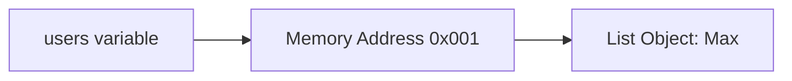

If you reassign the variable:

```dart id="memory_model_reassign"
users = ['Anna'];
```

A new list object is created.

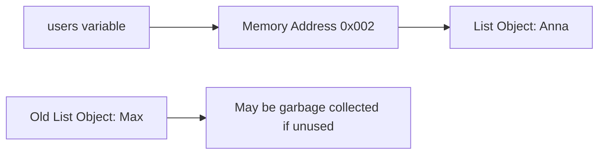

The old list may eventually be removed from memory if nothing else uses it.

This automatic cleanup process is called **garbage collection**.

---

## Mutating an Existing Object

Now compare reassignment with mutation.

```dart id="memory_model_mutation"
final users = ['Max'];

users.add('Anna');
```

This does not create a new list.

It changes the existing list object.

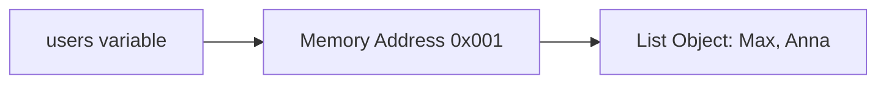

The variable still points to the same object in memory.

Only the internal content of that object changed.

---

## Reassignment vs Mutation

| Operation    | Example             | Creates New Object? | Allowed with `final`? |
| ------------ | ------------------- | ------------------: | --------------------: |
| Reassignment | `users = ['Anna']`  |                 Yes |                    No |
| Mutation     | `users.add('Anna')` |                  No |                   Yes |
| Sorting      | `users.sort()`      |                  No |                   Yes |
| Clearing     | `users.clear()`     |                  No |                   Yes |

This is why methods like `.add()`, `.sort()`, and `.clear()` can still work on a `final List`.

They mutate the object.
They do not reassign the variable.

---

## Why This Matters in Flutter

In Flutter, changing data in memory is not enough to update the UI.

Flutter only rebuilds when it is told to rebuild.

Usually, this means calling `setState()`.

```dart id="bad_flutter_mutation"
class _TodoState extends State<TodoScreen> {
  final List<String> _todos = [];

  void _addTodo() {
    _todos.add('New Todo');
  }

  @override
  Widget build(BuildContext context) {
    return Column(
      children: [
        for (final todo in _todos)
          Text(todo),
      ],
    );
  }
}
```

This code changes the list in memory, but the UI may not update because `setState()` was not called.

---

## Correct Flutter Example

```dart id="correct_flutter_mutation"
class _TodoState extends State<TodoScreen> {
  final List<String> _todos = [];

  void _addTodo() {
    setState(() {
      _todos.add('New Todo');
    });
  }

  @override
  Widget build(BuildContext context) {
    return Column(
      children: [
        for (final todo in _todos)
          Text(todo),
      ],
    );
  }
}
```

Now Flutter knows that state changed and that the widget should rebuild.

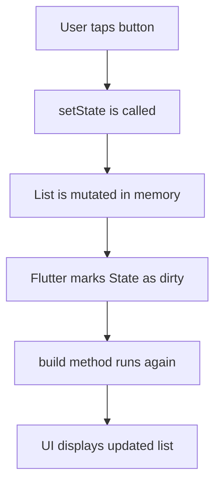

---

## Important Clarification

`setState()` does not change the data by itself.

The data changes because of your code inside the callback.

```dart id="setstate_clarification"
setState(() {
  _todos.add('New Todo');
});
```

The purpose of `setState()` is to tell Flutter:

> Something changed. Please rebuild this widget.

---

## `const` Widgets in Flutter

In Flutter, `const` can also be used with widgets.

```dart id="const_widget"
return const Text('Hello');
```

This tells Dart and Flutter that the widget configuration is constant.

That means this widget object can be reused instead of being recreated each time.

---

## Why `const` Widgets Help

Widgets are immutable configuration objects.

If a widget is marked as `const`, Flutter knows its configuration cannot change.

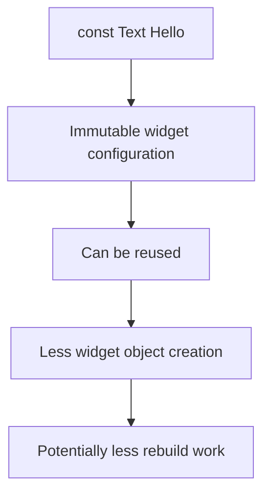

This does not mean the entire screen never rebuilds.

It means the constant widget configuration does not need to be recreated.

---

## Example: Const Widget Optimization

Without `const`:

```dart id="without_const_widget"
Text('Hello')
```

A new widget object may be created whenever `build()` runs.

With `const`:

```dart id="with_const_widget"
const Text('Hello')
```

Dart can reuse the same constant widget instance.

This is why Flutter often suggests adding `const` where possible.

---

## When You Cannot Use `const`

You cannot use `const` if a value is only known at runtime.

```dart id="cannot_use_const"
final name = getUserName();

Text(name); // Cannot be const because name is runtime data
```

You also cannot use `const` when the widget depends on changing state.

```dart id="state_no_const"
Text('Count: $_count'); // Not const because _count changes at runtime
```

---

## `const` in Widget Trees

You can make an entire widget list const if all children are const.

```dart id="const_children"
return const Column(
  children: [
    Text('Flutter Internals'),
    SizedBox(height: 16),
    Text('Understanding var, final, and const'),
  ],
);
```

This is cleaner than writing `const` before every child.

---

## Why `List.of()` Was Used in the Keys Demo

In the keys demo, the original TODO list should not be changed.

But the `sort()` method mutates the list it is called on.

Bad:

```dart id="bad_sort_original"
final todos = [
  Todo('Learn Flutter'),
  Todo('Practice Dart'),
  Todo('Build apps'),
];

todos.sort((a, b) => a.text.compareTo(b.text)); // Mutates original list
```

Better:

```dart id="copy_before_sort"
final sortedTodos = List.of(todos);

sortedTodos.sort((a, b) => a.text.compareTo(b.text));
```

This creates a copy first.

Then only the copy is sorted.

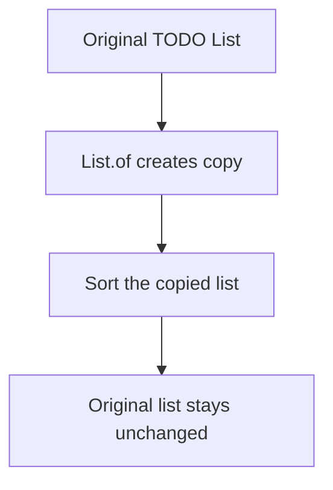

This is useful when you want to display data in a different order without changing the source list.

---

## Common Mistake: Thinking `final List` Is Immutable

This is a very common misunderstanding:

```dart id="final_list_not_immutable"
final items = <String>[];

items.add('A'); // OK
items.add('B'); // OK
```

This works because the variable is final, not the list object.

To create an immutable list, use `const` when possible:

```dart id="const_immutable_list"
const items = ['A', 'B'];
```

Or use immutable collection patterns when data is created at runtime.

---

## Practical Rules

Use `var` when:

* The variable needs to be reassigned.
* The value may point to a different object later.

Use `final` when:

* The variable should only be assigned once.
* The object may still be mutable.
* You want safer, clearer code.

Use `const` when:

* The value is known at compile time.
* The value should never change.
* You want immutable values or reusable constant widgets.

---

## Mental Model

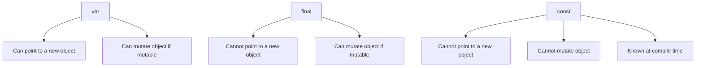

Simple version:

> `var` allows reassignment.
> `final` locks the reference.
> `const` locks the reference and the value.

---

## Key Points

* `var` allows reassignment.
* `final` prevents reassignment.
* `final` does not always make the object immutable.
* A `final List` can still be changed with `.add()`, `.sort()`, or `.remove()`.
* `const` creates compile-time constants.
* `const` collections cannot be modified.
* Mutating data in memory does not automatically update the Flutter UI.
* Use `setState()` to tell Flutter that a rebuild is needed.
* `const` widgets help Flutter reuse fixed widget configurations.
* Methods like `.sort()` mutate the original list, so use `List.of()` when you need a copy.

---

## Notes

The difference between reassignment and mutation is essential.

Reassignment means the variable points to a different object.

Mutation means the same object in memory changes internally.

`final` prevents reassignment, but it does not prevent mutation of mutable objects.

`const` is stronger because it creates deeply immutable compile-time values.

In Flutter, this matters because your data can change in memory without the UI changing. Flutter only updates the UI when a rebuild is scheduled.

---

## Summary

`var`, `final`, and `const` control different levels of change.

`var` allows a variable to be reassigned.
`final` prevents reassignment but still allows mutation if the object is mutable.
`const` creates a compile-time constant that cannot be reassigned or mutated.

In Flutter, understanding this distinction helps explain why mutating a list does not automatically update the UI and why `setState()` is needed.

It also explains why `const` widgets are useful: they represent fixed widget configurations that Flutter can safely reuse.
