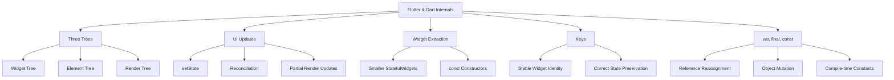
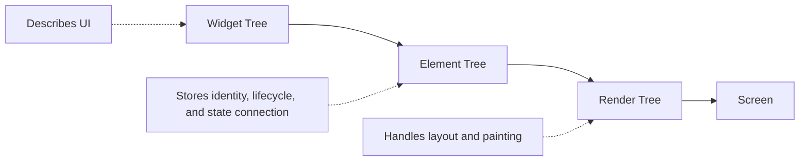
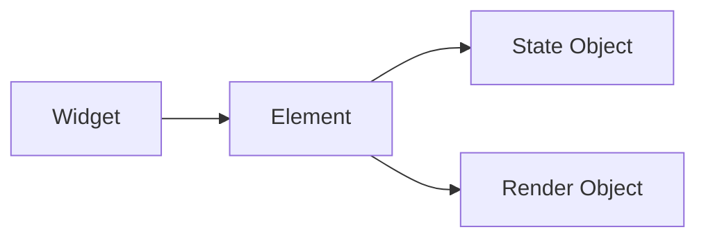
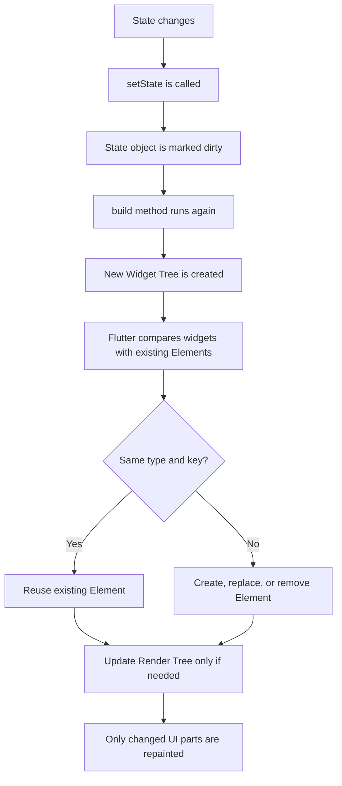
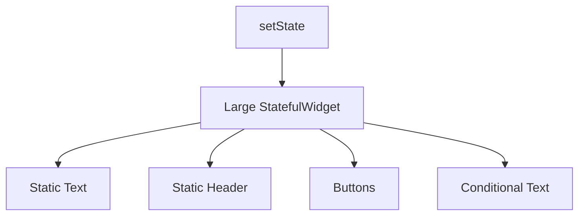
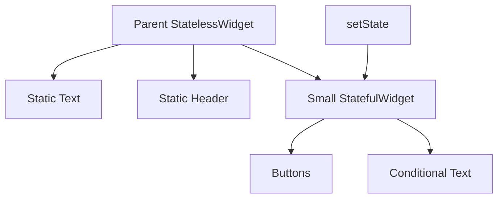
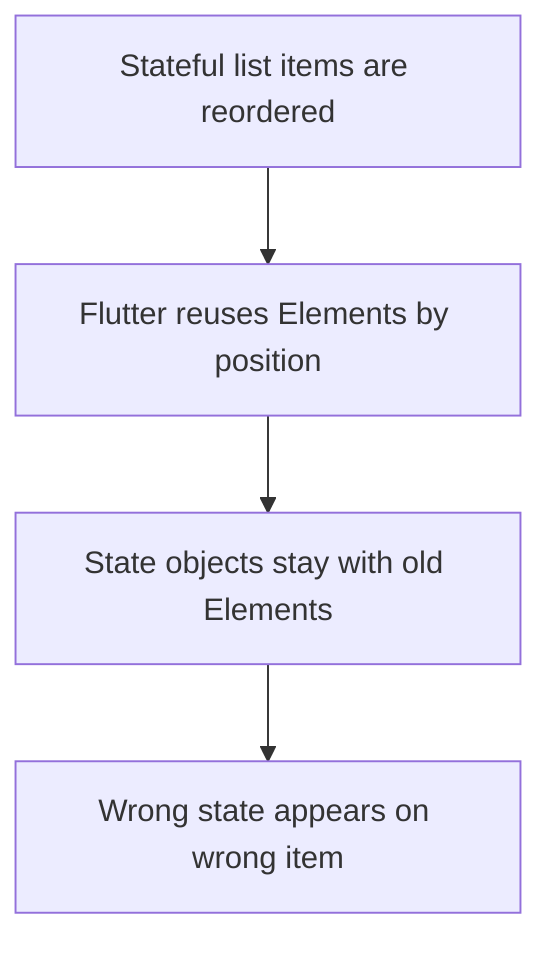
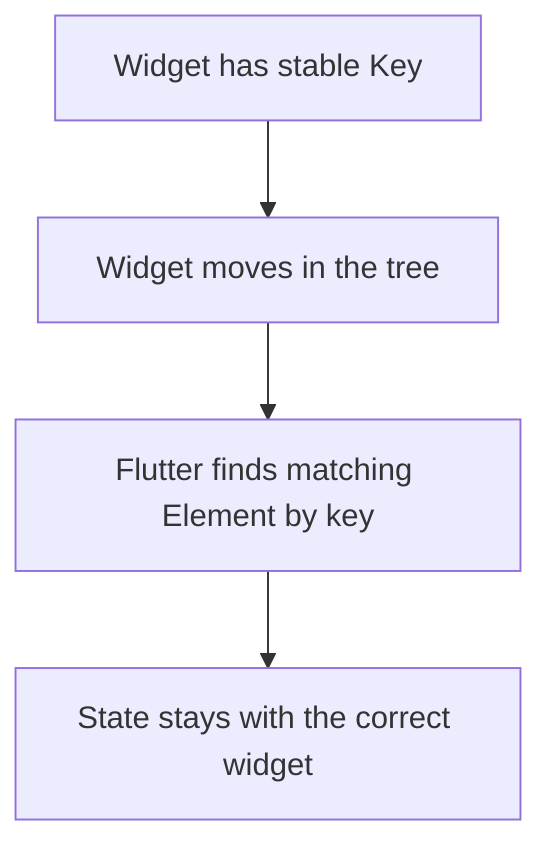
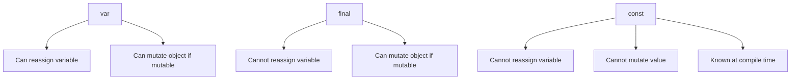
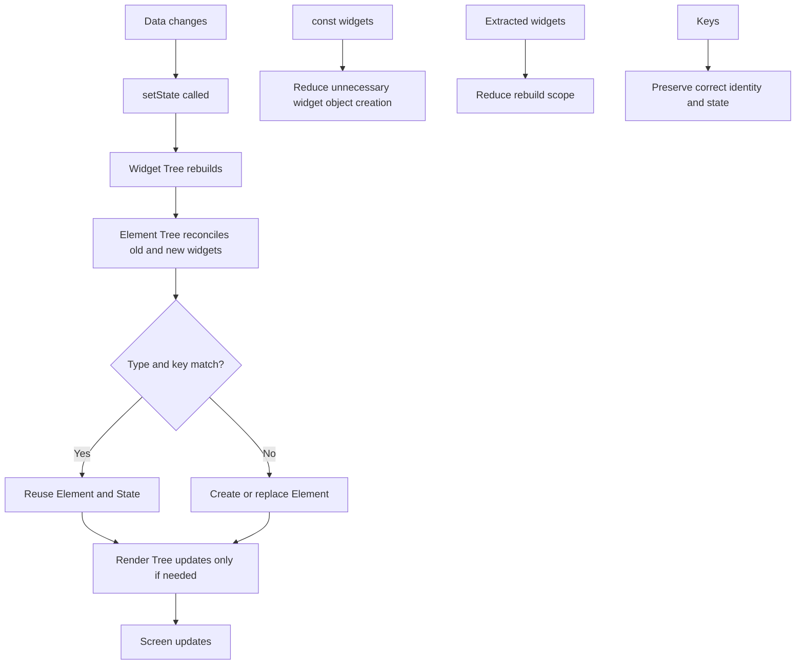

# Module Summary: Flutter & Dart Internals

## Overview

This module explored some of the most important internal concepts behind Flutter and Dart.

Instead of only focusing on how to write widgets, this module explained how Flutter manages widgets behind the scenes, how UI updates work, why keys are sometimes necessary, and how Dart handles values in memory.

The main goal of this module was to help you understand **why Flutter behaves the way it does** when widgets rebuild, state changes, or lists are reordered.

---

## What This Module Covered

This module focused on five major topics:

1. Flutter's three-tree architecture
2. How Flutter updates the UI
3. Refactoring widgets to avoid unnecessary rebuilds
4. Understanding and using keys
5. Understanding `var`, `final`, and `const`



---

## 1. The Three Trees

Flutter internally works with three connected trees:

* **Widget Tree**
* **Element Tree**
* **Render Tree**

Each tree has a different responsibility.



---

## Widget Tree

The **Widget Tree** is the tree you create in your Flutter code.

Widgets are lightweight and immutable. They describe what the UI should look like.

Example:

```dart id="widget_tree_example"
Column(
  children: const [
    Text('Hello'),
    Icon(Icons.star),
  ],
)
```

The Widget Tree can be rebuilt frequently because widgets are cheap to create.

---

## Element Tree

The **Element Tree** is managed by Flutter.

Elements are longer-lived than widgets. They connect widgets to the running app and help Flutter decide what needs to be updated.

The Element Tree is important because it connects:

* Widgets
* State objects
* Render objects
* Positions in the tree



---

## Render Tree

The **Render Tree** is responsible for the actual visual work.

It handles:

* Layout
* Size
* Position
* Painting
* Hit testing

The Render Tree is more expensive to update, so Flutter tries to touch it only when needed.

---

## Three Trees Summary Table

| Tree         | Main Role                     | Managed By | Rebuilt Often?           |
| ------------ | ----------------------------- | ---------- | ------------------------ |
| Widget Tree  | Describes UI                  | Developer  | Yes                      |
| Element Tree | Tracks identity and lifecycle | Flutter    | Reused when possible     |
| Render Tree  | Lays out and paints UI        | Flutter    | Updated only when needed |

---

## 2. How Flutter Updates the UI

Flutter updates the UI when state changes.

The most common way to trigger a UI update is by calling `setState()`.

```dart id="setstate_example"
setState(() {
  _counter++;
});
```

Calling `setState()` does not immediately repaint the entire screen.

Instead, Flutter marks the related `State` object as dirty and schedules a rebuild.

---

## UI Update Flow



---

## Rebuild Does Not Mean Full Repaint

A very important lesson from this module is:

> A widget rebuild does not mean the entire screen is repainted.

When `build()` runs again, Flutter creates a new widget configuration. Then it compares that configuration with the existing Element Tree.

If most widgets still match, Flutter reuses their elements and avoids unnecessary Render Tree updates.

---

## 3. Extracting Widgets to Avoid Unnecessary Builds

This module also showed that you can write better Flutter code by moving state closer to the part of the UI that actually changes.

If a large `StatefulWidget` contains many static widgets, calling `setState()` will cause the whole `build()` method to run again.

Before refactoring:



After refactoring:



Now only the smaller widget rebuilds when its state changes.

---

## Best Practice: Keep StatefulWidgets Small

A good Flutter habit is:

> Put state where it is needed, not higher than necessary.

This makes your UI:

* Easier to understand
* Easier to debug
* More efficient
* More reusable

---

## `const` Constructors

Using `const` is another simple optimization.

```dart id="const_widget_example"
return const Text('Hello');
```

A `const` widget has a fixed configuration. Dart and Flutter can safely reuse it instead of creating a new widget object every time.

Use `const` whenever the widget and all of its constructor arguments are known at compile time.

---

## 4. Understanding Keys

Keys are connected to Flutter's reconciliation process.

By default, Flutter matches widgets with elements based on:

* Widget type
* Position in the tree

This is usually enough for static layouts.

But it can cause bugs when `StatefulWidget`s are reordered, inserted, or removed from a list.

---

## The Problem Without Keys

Imagine a list of checkable TODO items.

Each item has its own internal checked state.

Without keys, Flutter may keep state attached to the old position instead of the correct item.



Example:

| Position | Before Reorder | State     |
| -------- | -------------- | --------- |
| 0        | Todo A         | Checked   |
| 1        | Todo B         | Unchecked |
| 2        | Todo C         | Unchecked |

After reordering without keys:

| Position | After Reorder | State     |
| -------- | ------------- | --------- |
| 0        | Todo C        | Checked   |
| 1        | Todo B        | Unchecked |
| 2        | Todo A        | Unchecked |

The checked state stayed with the position, not with the correct TODO item.

---

## The Solution: Keys

Keys give widgets a stable identity.

```dart id="value_key_example"
CheckableTodoItem(
  key: ValueKey(todo.id),
  todo: todo,
)
```

With keys, Flutter can match widgets by type and key, not only by position.



Simple mental model:

> Without keys, state follows position.
> With keys, state follows identity.

---

## Common Key Types

| Key Type    | Purpose                          | Common Use                 |
| ----------- | -------------------------------- | -------------------------- |
| `ValueKey`  | Uses a stable value              | Dynamic lists with IDs     |
| `ObjectKey` | Uses an object as identity       | Model-based identity       |
| `UniqueKey` | Always creates a new identity    | Force fresh state          |
| `GlobalKey` | Global identity and state access | Forms, rare advanced cases |

For most normal list items, use:

```dart id="recommended_value_key"
key: ValueKey(todo.id)
```

Avoid random or constantly changing keys because they prevent Flutter from preserving state correctly.

---

## 5. Understanding `var`, `final`, and `const`

This module also explained how Dart stores and changes values in memory.

The key distinction is between:

* Reassigning a variable
* Mutating an existing object

---

## `var`

A `var` variable can be reassigned.

```dart id="var_example"
var numbers = [1, 2, 3];

numbers.add(4);      // OK: mutates existing list
numbers = [5, 6, 7]; // OK: reassigns variable
```

With `var`, both mutation and reassignment are allowed.

---

## `final`

A `final` variable cannot be reassigned.

```dart id="final_example"
final numbers = [1, 2, 3];

numbers.add(4);      // OK
// numbers = [5, 6, 7]; // ERROR
```

This is allowed because `.add()` mutates the existing list object. It does not assign a new list to the variable.

Important:

> `final` protects the variable reference, not necessarily the object.

---

## `const`

A `const` value is a compile-time constant.

```dart id="const_example"
const numbers = [1, 2, 3];

// numbers.add(4); // ERROR
```

With `const`, the value itself cannot be changed.

---

## `var`, `final`, and `const` Summary



| Keyword | Reassignment | Object Mutation    | Example           |
| ------- | ------------ | ------------------ | ----------------- |
| `var`   | Allowed      | Allowed if mutable | `var list = []`   |
| `final` | Not allowed  | Allowed if mutable | `final list = []` |
| `const` | Not allowed  | Not allowed        | `const list = []` |

---

## Why This Matters in Flutter

Changing data in memory does not automatically update the UI.

For example:

```dart id="bad_state_mutation"
final items = <String>[];

void addItem() {
  items.add('New Item');
}
```

The list changes in memory, but Flutter will not rebuild the UI unless you call `setState()`.

Correct:

```dart id="correct_state_mutation"
void addItem() {
  setState(() {
    items.add('New Item');
  });
}
```

`setState()` tells Flutter that something changed and the widget should rebuild.

---

## Unified Mental Model

All concepts in this module connect together.



---

## Key Takeaways

* Flutter uses three trees to manage UI efficiently.
* Widgets are immutable descriptions of the UI.
* Elements are longer-lived and connect widgets to state and render objects.
* Render objects handle layout and painting.
* `setState()` schedules a rebuild, but does not repaint the whole screen.
* Flutter uses reconciliation to reuse elements where possible.
* Extracting widgets helps reduce unnecessary rebuild scope.
* `const` widgets help Flutter reuse fixed widget configurations.
* Keys are needed when stateful widgets move in dynamic lists.
* `ValueKey` with a stable ID is the most common key choice.
* `var`, `final`, and `const` control reassignment and mutability differently.
* Mutating a `final` list is allowed, but it does not automatically trigger a UI rebuild.

---

## Tips

* Revisit the three-tree concept whenever rebuild behavior feels confusing.
* Use Flutter DevTools to observe rebuilds in real apps.
* Keep `StatefulWidget`s as small as practical.
* Use `const` constructors whenever possible.
* Add keys to stateful dynamic list items.
* Prefer `ValueKey(item.id)` for list items.
* Avoid `UniqueKey()` unless you intentionally want fresh state.
* Remember that `final List` does not mean immutable list.
* Always call `setState()` when state changes should update the UI.

---

## Notes

These concepts are foundational for understanding advanced Flutter development.

State management tools like Provider, Riverpod, and Bloc still rely on Flutter's widget tree, element tree, rebuild system, and inherited widget mechanisms.

Once you understand Flutter internals, these tools become easier to reason about because you know what they are doing underneath.

---

## Final Summary

This module explained how Flutter manages and updates the UI internally.

You learned that Flutter uses the Widget Tree to describe the UI, the Element Tree to preserve identity and lifecycle, and the Render Tree to handle layout and painting.

You also learned how `setState()` triggers rebuilds, how Flutter uses reconciliation to avoid unnecessary render updates, and how extracting widgets can reduce rebuild scope.

The module also explained why keys are needed when working with dynamic stateful lists and how `ValueKey`, `ObjectKey`, `UniqueKey`, and `GlobalKey` differ.

Finally, you learned the difference between `var`, `final`, and `const`, especially how reassignment and mutation work in memory.

Together, these concepts give you a strong mental model for building efficient, correct, and maintainable Flutter applications.
