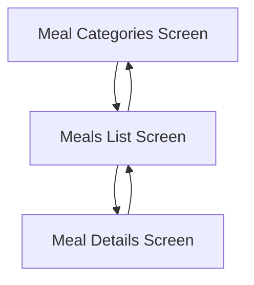
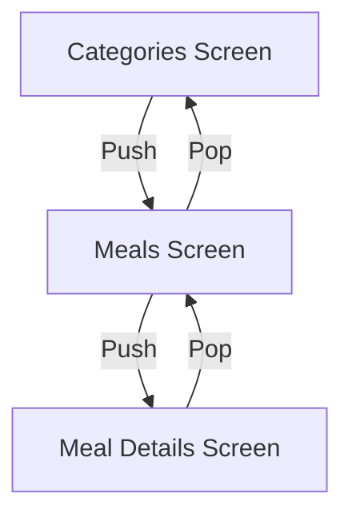
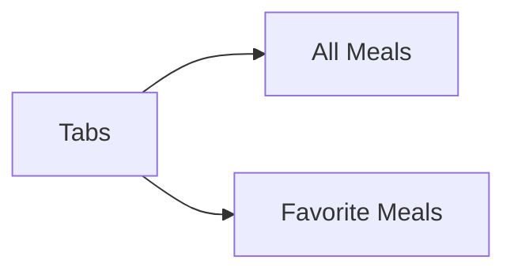
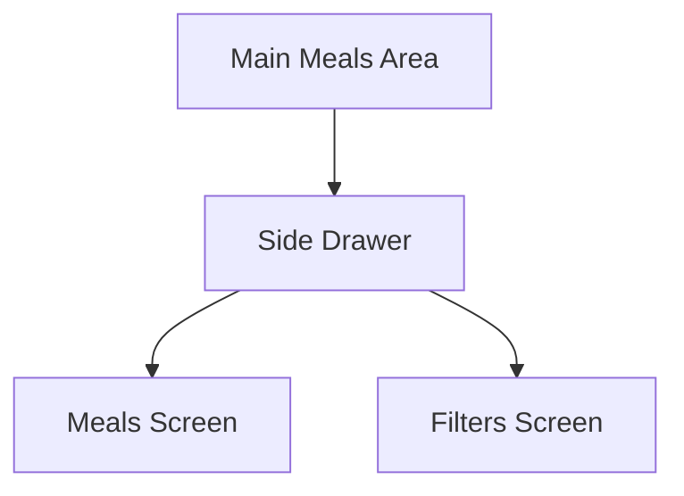
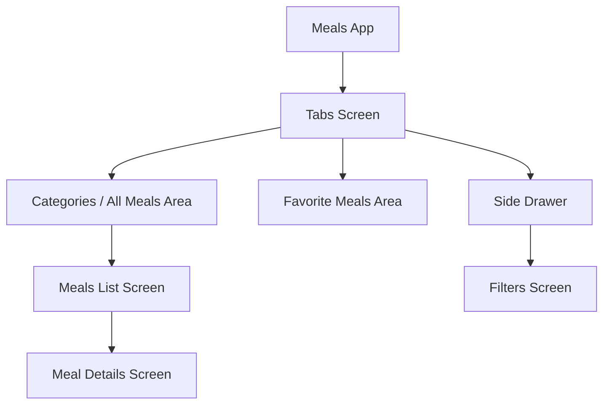

# Module Introduction: Building a Multi-Screen Meals App

## Overview

In this module, we will build a new Flutter project: a **Meals App**.

This app allows users to browse different meal categories, select meals, view ingredients and cooking instructions, mark meals as favorites, switch between all meals and favorite meals, and configure filters that affect which meals are shown.

The main focus of this module is **navigation in Flutter**.
Unlike the previous apps in the course, this app contains multiple screens. Users can move forward and backward between screens, switch between different app areas using tabs, and open a side drawer to navigate to another screen.

By the end of this module, you will understand how to build a Flutter app with multiple connected screens and real-world navigation patterns.

## App Features

The Meals App will allow users to:

* Browse meal categories
* Select a category and view related meals
* Open a meal details screen
* Read meal ingredients
* Read meal preparation instructions
* Mark meals as favorites
* Switch between all meals and favorite meals
* Open a filters screen
* Apply filters to control which meals are displayed

## Main Learning Goal

The main goal of this module is to learn how to build **multi-screen Flutter apps**.

Many real-world apps are not limited to one page. They often contain lists, detail pages, settings pages, tabs, drawers, and different navigation flows.

This module teaches how users can move between those different screens in a structured way.

## Key Concepts

### 1. Navigation Between Screens

The app will contain multiple screens that users can navigate between.

For example, users can start from the meal categories screen, choose a category, then open a specific meal and view its details.

## 2. Screen Stack

Flutter navigation is based on the idea of a **screen stack**.

When users go deeper into the app, a new screen is added to the stack.
When users go back, the current screen is removed from the stack.

This concept makes it possible to move forward into more detailed screens and return to previous screens.

## 3. Tab Navigation

The app will also include a tab bar.

Tabs allow users to switch between different major areas of the app, such as all meals and favorite meals.

Tab navigation is useful when users need quick access to multiple important sections.

## 4. Side Drawer Navigation

The app will also use a side drawer.

The drawer allows users to switch to a different app area, such as the filters screen.

A side drawer is useful for secondary navigation options that do not need to be visible all the time.

## App Navigation Structure

A simplified navigation structure of the app looks like this:

## What You Will Learn

In this module, you will learn how to:

* Build an app with multiple screens
* Navigate forward to a new screen
* Go back to a previous screen
* Understand the screen stack concept
* Add tab-based navigation
* Switch between app areas with tabs
* Add a side drawer
* Navigate to another screen from the drawer
* Build a more realistic Flutter app structure
* Practice working with more widgets and new Flutter concepts

## Why This Matters

Navigation is a core feature of almost every real-world app.

Users often need to move between different pages, such as overview screens, detail screens, settings screens, favorites pages, and filter pages.

Understanding navigation helps you build apps that feel complete, organized, and easy to use.

## Notes

This module introduces navigation step by step through a practical app project.

The Meals App is useful because it combines several common navigation patterns:

* Stack-based navigation
* Tab navigation
* Drawer navigation
* Detail screen navigation
* Filter screen navigation

These patterns are commonly used in real Flutter applications.

## Tips

* Think of navigation as moving through a stack of screens.
* Use the screen stack concept to understand forward and backward navigation.
* Use tabs for main app areas that users access often.
* Use a drawer for secondary app areas like filters or settings.
* Keep each screen in a separate widget/file when the app grows.
* Pay attention to how data moves between screens as the app becomes more complex.

## Summary

This module introduces a new Flutter project: the Meals App.

The app allows users to browse meals, view meal details, mark favorites, switch between all meals and favorite meals, and configure filters.

The main focus of this module is navigation. You will learn how to build multi-screen Flutter apps using screen stacks, tab navigation, and side drawer navigation.
