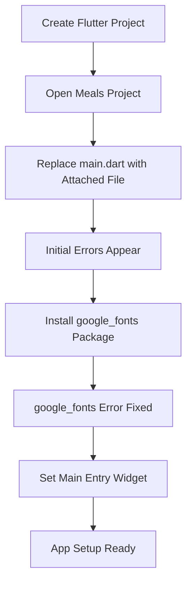
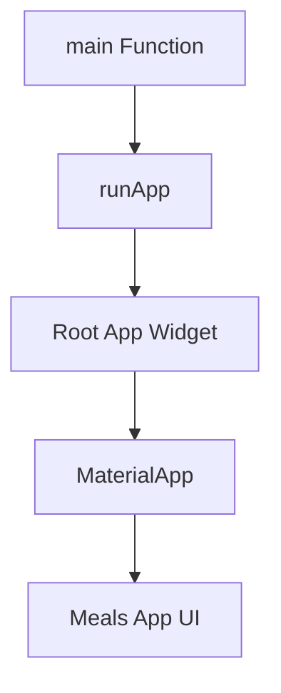

# Project Setup

## Overview

This lecture sets up the starting project for the **Meals App** section.

The instructor provides a new Flutter project created with `flutter create`. The project is named **Meals**, and it includes a custom `main.dart` file attached to the lecture.

Students should replace their existing `main.dart` file with the provided one. At first, this file contains a few errors, but these errors will be fixed step by step during the setup process.

The lecture also introduces the `google_fonts` package, which is used to replace Flutter's default text theme with a custom Google Fonts text theme. In this project, the selected font family is **Lato**.

## Key Points

* A new Flutter starting project named **Meals** is used.
* The instructor provides a custom `main.dart` file.
* Students should replace their generated `main.dart` file with the attached one.
* The provided file initially contains some errors.
* The first error is related to the missing `google_fonts` package.
* The `google_fonts` package is used to customize the app's text theme.
* The app uses the **Lato** font family.
* After installing `google_fonts`, the import/package error is fixed.
* The remaining error is that the app still needs a main entry widget.

## Setup Steps



## Installing `google_fonts`

The project uses the `google_fonts` package to apply a custom font theme.

To install it, run:

```bash
flutter pub add google_fonts
```

After installing the package, it can be imported in `main.dart`:

```dart
import 'package:google_fonts/google_fonts.dart';
```

## Why Use `google_fonts`?

Flutter has a default text theme, but `google_fonts` makes it easy to replace that default theme with a theme based on a specific Google Font.

In this app, the instructor uses the **Lato** font family.

Example:

```dart
theme: ThemeData(
  textTheme: GoogleFonts.latoTextTheme(),
)
```

This gives the app a more customized visual style without manually defining every text style.

## Main Entry Widget

After the `google_fonts` package is installed, one error is fixed.

However, another issue remains: Flutter still needs to know which widget should be used as the root widget of the app.

Every Flutter app needs a `main()` function that calls `runApp()`.

Example:

```dart
void main() {
  runApp(const App());
}
```

The widget passed to `runApp()` becomes the main entry widget of the application.

## App Startup Flow



## Notes

The provided `main.dart` file is used as the starting point for the Meals App section. It is normal for it to show errors at first because some setup steps are still missing.

The first required step is installing the `google_fonts` package.
After that, the app must be connected to a root widget through `runApp()`.

## Tips

* Replace your default `main.dart` with the file attached to the lecture.
* Install `google_fonts` before trying to fix the remaining errors.
* Check that the package is added to `pubspec.yaml`.
* Use `runApp()` to define the root widget of the app.
* Remember that `main.dart` is the starting point of a Flutter application.
* Use `GoogleFonts.latoTextTheme()` to apply the Lato font theme globally.

## Summary

This lecture prepares the starting project for the Meals App.

You replace the default `main.dart` file with the provided version, install the `google_fonts` package, and prepare the app's main entry widget.

The lecture also shows how `google_fonts` can be used to easily customize the default text theme with the Lato font family.
