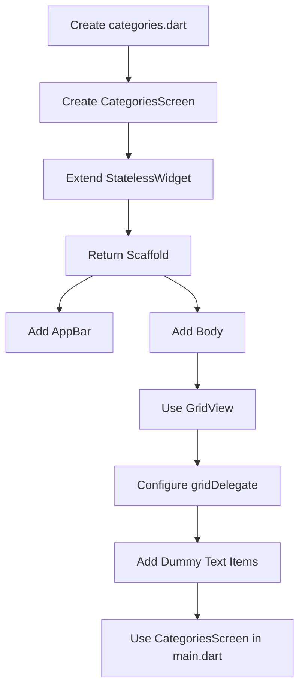
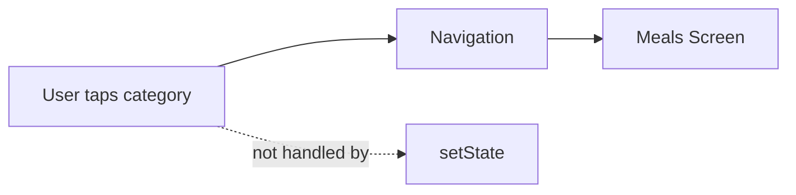
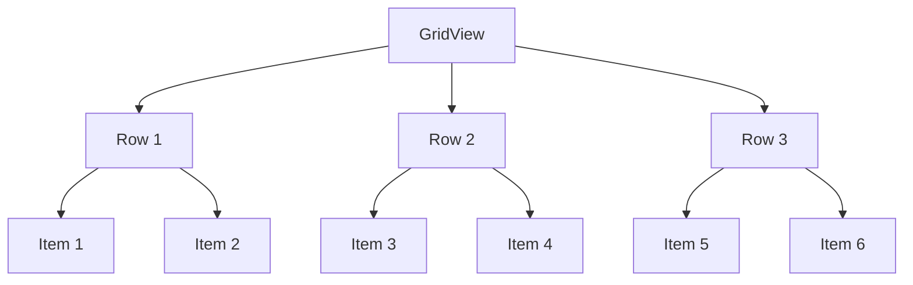
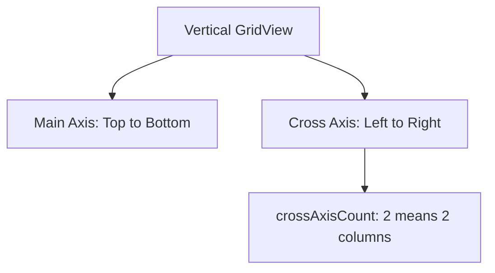
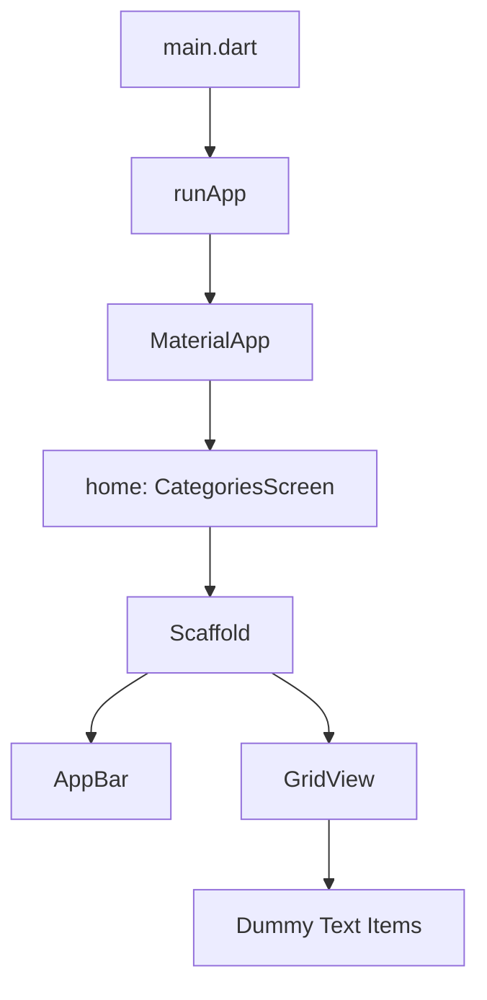

# Using a GridView

## Overview

This lecture introduces the `GridView` widget and uses it to build the first screen of the Meals App: the **Categories Screen**.

The app needs a main entry screen, and the instructor starts with a screen where users will later be able to select a meal category. Selecting a category will eventually navigate to another screen that displays all meals belonging to that category.

In this lecture, the categories are not real data yet. Instead, temporary dummy `Text` widgets are used to test whether the grid layout works correctly.

## Key Points

* A new `categories.dart` file is created inside the `lib` folder.
* A new screen widget named `CategoriesScreen` is created.
* `CategoriesScreen` extends `StatelessWidget`.
* The screen does not need internal state because category selection will later be handled through navigation.
* The screen returns a `Scaffold`.
* The `Scaffold` provides the basic structure for the screen.
* An `AppBar` is added with the title `"Pick your category"`.
* The main page content is placed inside the `body`.
* A `GridView` is used to display category items in a grid.
* `GridView` is similar to `ListView`, but it arranges items in rows and columns.
* `GridView.builder` can be used for long or dynamic lists.
* In this lecture, a regular `GridView` with `children` is used because there are not many categories.
* `gridDelegate` controls the layout of the grid items.
* `SliverGridDelegateWithFixedCrossAxisCount` is used to define a fixed number of columns.
* `crossAxisCount: 2` creates two columns.
* `childAspectRatio: 3 / 2` gives each grid item a 3:2 width-to-height ratio.
* `crossAxisSpacing: 20` adds horizontal spacing between grid items.
* `mainAxisSpacing: 20` adds vertical spacing between grid items.
* Temporary dummy `Text` widgets are added to test the grid.
* `CategoriesScreen` is used as the `home` screen in `main.dart`.

## Screen Creation Flow



## Creating the Categories Screen

The first screen of the app is the `CategoriesScreen`.

This screen will later allow users to select a meal category.

```dart id="gx3e1x"
class CategoriesScreen extends StatelessWidget {
  const CategoriesScreen({super.key});

  @override
  Widget build(BuildContext context) {
    return Scaffold();
  }
}
```

The widget is named `CategoriesScreen` because it acts as a full screen in the app. This naming convention helps separate screen widgets from smaller reusable widgets.

## Why `StatelessWidget` Is Used

`CategoriesScreen` does not need to manage internal state.

Even though users will later select a category, that selection will not be handled by changing local widget state. Instead, selecting a category will navigate to another screen.



Because of that, `StatelessWidget` is the correct choice here.

## Using `Scaffold`

The screen returns a `Scaffold`.

`Scaffold` provides the basic structure for a typical Flutter screen. It allows you to add an app bar, body content, drawers, floating buttons, and other screen-level UI elements.

```dart id="e5nk7j"
return Scaffold(
  appBar: AppBar(
    title: const Text('Pick your category'),
  ),
  body: ...
);
```

In multi-screen apps, it is common for each screen to have its own `Scaffold`, because every screen may need its own title, actions, buttons, or layout settings.

## Adding the AppBar

The `AppBar` is added at the top of the screen.

```dart id="jghuyk"
appBar: AppBar(
  title: const Text('Pick your category'),
),
```

This gives the screen a clear title and makes it feel like a complete page.

## What Is `GridView`?

`GridView` is a Flutter widget used to display items in a two-dimensional scrollable layout.

It works similarly to `ListView`, but instead of arranging items in a single vertical column, it arranges them in rows and columns.



This makes `GridView` a good choice for displaying meal categories.

## `GridView` vs `GridView.builder`

There are different ways to create a grid.

| Approach                   | Best For               |
| -------------------------- | ---------------------- |
| `GridView` with `children` | Small fixed lists      |
| `GridView.builder`         | Large or dynamic lists |

`GridView.builder` only builds the items that are currently visible on the screen, which can improve performance for very long lists.

In this lecture, the app will only have a limited number of meal categories, so the regular `GridView` with `children` is enough.

## Adding the GridView

The `GridView` is placed inside the `body` of the `Scaffold`.

```dart id="7inr1h"
body: GridView(
  gridDelegate: const SliverGridDelegateWithFixedCrossAxisCount(
    crossAxisCount: 2,
  ),
  children: const [],
),
```

The `body` is the main content area of the screen.

## Understanding `gridDelegate`

`GridView` needs a `gridDelegate`.

The `gridDelegate` controls how the grid items are laid out.

In this lecture, the instructor uses:

```dart id="e2uu4o"
SliverGridDelegateWithFixedCrossAxisCount
```

This delegate allows you to define a fixed number of columns.

## Grid Configuration

```dart id="nj6d1g"
gridDelegate: const SliverGridDelegateWithFixedCrossAxisCount(
  crossAxisCount: 2,
  childAspectRatio: 3 / 2,
  crossAxisSpacing: 20,
  mainAxisSpacing: 20,
),
```

Explanation:

| Property                  | Meaning                                 |
| ------------------------- | --------------------------------------- |
| `crossAxisCount: 2`       | Creates two columns                     |
| `childAspectRatio: 3 / 2` | Sets each item's width-to-height ratio  |
| `crossAxisSpacing: 20`    | Adds horizontal spacing between columns |
| `mainAxisSpacing: 20`     | Adds vertical spacing between rows      |

## Main Axis and Cross Axis

By default, a `GridView` scrolls vertically.

That means:

* The **main axis** runs from top to bottom.
* The **cross axis** runs from left to right.

So when `crossAxisCount` is set to `2`, the grid displays two items next to each other horizontally.



## Testing with Dummy Text Widgets

Before adding real category data, temporary `Text` widgets are added to test the grid layout.

```dart id="htznu4"
children: const [
  Text('1'),
  Text('2'),
  Text('3'),
  Text('4'),
  Text('5'),
  Text('6'),
],
```

This makes it easy to confirm that the grid displays items in a two-column layout.

## Improving Temporary Text Visibility

The dummy text may not be easy to read at first, so a temporary text color is added.

```dart id="qxd3ib"
Text(
  '1',
  style: TextStyle(color: Colors.white),
),
```

This is only temporary. These placeholder widgets will be removed later when real category data is added.

## Connecting `CategoriesScreen` in `main.dart`

After creating `CategoriesScreen`, it must be used as the home screen of the app.

```dart id="hmoik6"
home: const CategoriesScreen(),
```

The screen file also needs to be imported into `main.dart`.

```dart id="p9hi6e"
import 'package:meals/categories.dart';
```

The exact import path depends on the project name and folder structure.

## App Startup Structure



## Complete Example

```dart id="kjp1b7"
import 'package:flutter/material.dart';

class CategoriesScreen extends StatelessWidget {
  const CategoriesScreen({super.key});

  @override
  Widget build(BuildContext context) {
    return Scaffold(
      appBar: AppBar(
        title: const Text('Pick your category'),
      ),
      body: GridView(
        gridDelegate: const SliverGridDelegateWithFixedCrossAxisCount(
          crossAxisCount: 2,
          childAspectRatio: 3 / 2,
          crossAxisSpacing: 20,
          mainAxisSpacing: 20,
        ),
        children: const [
          Text(
            '1',
            style: TextStyle(color: Colors.white),
          ),
          Text(
            '2',
            style: TextStyle(color: Colors.white),
          ),
          Text(
            '3',
            style: TextStyle(color: Colors.white),
          ),
          Text(
            '4',
            style: TextStyle(color: Colors.white),
          ),
          Text(
            '5',
            style: TextStyle(color: Colors.white),
          ),
          Text(
            '6',
            style: TextStyle(color: Colors.white),
          ),
        ],
      ),
    );
  }
}
```

## What the App Shows Now

At this stage, the app displays:

* A screen with an `AppBar`
* The title `"Pick your category"`
* A grid layout
* Two columns
* Six temporary text items
* Spacing between grid items

The final styling is not finished yet, but the grid structure works correctly.

## Notes

This lecture focuses on setting up the first screen and testing the grid layout.

The real category data has not been added yet. The dummy text widgets are only placeholders used to confirm that the grid behaves as expected.

The next step is to replace these placeholders with actual category data.

## Tips

* Use `GridView` when you want items arranged in rows and columns.
* Use `GridView.builder` for very large or dynamic lists.
* Use `SliverGridDelegateWithFixedCrossAxisCount` when you want a fixed number of columns.
* Use `crossAxisCount` to control the number of columns.
* Use `childAspectRatio` to control the shape of grid items.
* Use `crossAxisSpacing` and `mainAxisSpacing` to add gaps between items.
* Start with dummy items to test the layout before adding real data.
* Use a separate screen widget for each major app screen.
* Connect the screen through the `home` property in `MaterialApp`.

## Summary

This lecture introduces `GridView` by creating the first screen of the Meals App.

The `CategoriesScreen` uses a `Scaffold`, an `AppBar`, and a `GridView` body. The grid is configured with two columns, a 3:2 item ratio, and spacing between items.

Temporary text widgets are used to test the layout before replacing them with real category data in the next step.
