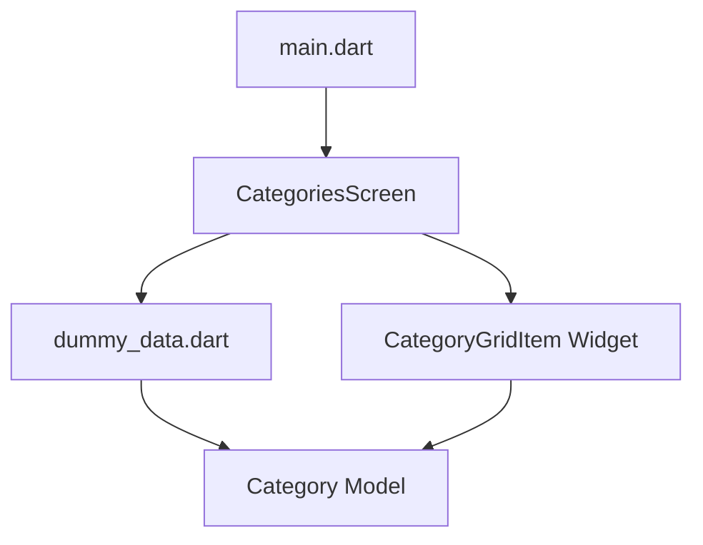
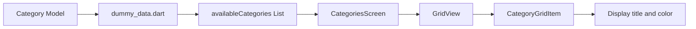

# Widgets vs Screens: Building a Category Grid in Flutter

## Overview

This lecture explains how to move from simple dummy `Text` widgets to a real category-based UI in Flutter.

The main idea is to separate your app into clear responsibilities:

* **Models** define the structure of your data.
* **Data files** store temporary or dummy data.
* **Screens** represent full pages in your app.
* **Widgets** represent reusable UI components inside those screens.

In Flutter, screens are still widgets, but they are usually full-page widgets that occupy the entire display and are often pushed onto the navigation stack.

---

## Key Concepts

### Widgets vs Screens

In Flutter, everything is a widget. However, in real projects, developers commonly separate widgets into two conceptual groups:

| Concept | Meaning                 | Typical Folder |
| ------- | ----------------------- | -------------- |
| Screen  | A full page in the app  | `screens/`     |
| Widget  | A reusable UI component | `widgets/`     |

A screen usually uses a `Scaffold` as its root widget, while smaller widgets are used inside that screen to build the UI.

---

## Project Structure

A clean folder structure makes the app easier to maintain as it grows.

```text
lib/
├── data/
│   └── dummy_data.dart
│
├── models/
│   └── category.dart
│
├── screens/
│   └── categories.dart
│
├── widgets/
│   └── category_grid_item.dart
│
└── main.dart
```

---

## Markdown Diagram: App Structure



---

## 1. Creating the Category Model

First, create a new folder inside `lib` called `models`.

Inside that folder, create a new file:

```text
lib/models/category.dart
```

This file contains the blueprint for a category object.

A category is not a widget. It is a regular Dart class that describes how category data should be structured.

```dart
import 'package:flutter/material.dart';

class Category {
  const Category({
    required this.id,
    required this.title,
    this.color = Colors.orange,
  });

  final String id;
  final String title;
  final Color color;
}
```

---

## Explanation

The `Category` class contains three properties:

| Property | Type     | Purpose                            |
| -------- | -------- | ---------------------------------- |
| `id`     | `String` | Unique identifier for the category |
| `title`  | `String` | Display name of the category       |
| `color`  | `Color`  | Visual color used in the UI        |

The `color` property has a default value:

```dart
this.color = Colors.orange
```

This means that if no color is provided, Flutter will use orange as the fallback color.

---

## 2. Adding Dummy Data

Next, create a new folder inside `lib` called `data`.

Inside that folder, create:

```text
lib/data/dummy_data.dart
```

This file stores temporary category data for the demo app.

```dart
import 'package:flutter/material.dart';

import '../models/category.dart';

const availableCategories = [
  Category(
    id: 'c1',
    title: 'Italian',
    color: Colors.purple,
  ),
  Category(
    id: 'c2',
    title: 'Quick & Easy',
    color: Colors.red,
  ),
  Category(
    id: 'c3',
    title: 'Hamburgers',
    color: Colors.orange,
  ),
  Category(
    id: 'c4',
    title: 'German',
    color: Colors.amber,
  ),
];
```

---

## Important Note About Imports

If you are using an attached `dummy_data.dart` file from a course project, make sure the import path matches your project name.

For example:

```dart
import 'package:your_project_name/models/category.dart';
```

Or, if using relative imports:

```dart
import '../models/category.dart';
```

---

## 3. Moving Screens into a Screens Folder

The `categories.dart` file represents a full screen, so it should be moved into a `screens` folder.

```text
lib/screens/categories.dart
```

This keeps screen-level widgets separate from smaller reusable widgets.

---

## 4. Creating a Reusable Category Grid Item Widget

Now create another folder inside `lib` called `widgets`.

Inside that folder, create:

```text
lib/widgets/category_grid_item.dart
```

This widget is responsible for displaying one single category item inside the grid.

```dart
import 'package:flutter/material.dart';

import '../models/category.dart';

class CategoryGridItem extends StatelessWidget {
  const CategoryGridItem({
    super.key,
    required this.category,
  });

  final Category category;

  @override
  Widget build(BuildContext context) {
    return Container(
      color: category.color,
      child: Text(category.title),
    );
  }
}
```

---

## Explanation

`CategoryGridItem` is a reusable widget.

It receives a `Category` object from outside:

```dart
final Category category;
```

Then it uses that category data to display:

* the category title
* the category color

Because this widget does not manage any internal state, it should extend `StatelessWidget`.

---

## 5. Using CategoryGridItem in the Categories Screen

Now the `CategoriesScreen` can use the dummy data and display every category in a grid.

```dart
import 'package:flutter/material.dart';

import '../data/dummy_data.dart';
import '../widgets/category_grid_item.dart';

class CategoriesScreen extends StatelessWidget {
  const CategoriesScreen({super.key});

  @override
  Widget build(BuildContext context) {
    return Scaffold(
      appBar: AppBar(
        title: const Text('Pick your category'),
      ),
      body: GridView(
        padding: const EdgeInsets.all(24),
        gridDelegate: const SliverGridDelegateWithFixedCrossAxisCount(
          crossAxisCount: 2,
          childAspectRatio: 3 / 2,
          crossAxisSpacing: 20,
          mainAxisSpacing: 20,
        ),
        children: [
          for (final category in availableCategories)
            CategoryGridItem(category: category),
        ],
      ),
    );
  }
}
```

---

## Markdown Diagram: Data Flow



---

## 6. Making the Category Item Tappable

Later, the category item should be tappable so the app can navigate to another screen.

A common way to make the item tappable is to wrap it with `InkWell`.

```dart
import 'package:flutter/material.dart';

import '../models/category.dart';

class CategoryGridItem extends StatelessWidget {
  const CategoryGridItem({
    super.key,
    required this.category,
  });

  final Category category;

  void selectCategory() {
    // Navigation will be added later.
  }

  @override
  Widget build(BuildContext context) {
    return InkWell(
      onTap: selectCategory,
      child: Container(
        padding: const EdgeInsets.all(16),
        color: category.color,
        child: Text(
          category.title,
          style: Theme.of(context).textTheme.titleLarge,
        ),
      ),
    );
  }
}
```

---

## Why Create a Separate CategoryGridItem Widget?

Instead of putting all the UI logic directly inside `CategoriesScreen`, we extract the category item into its own widget.

This has several benefits:

* The screen stays clean and readable.
* The category item can be reused elsewhere.
* The code becomes easier to maintain.
* The UI logic for one grid item is isolated in one file.

---

## Concept Summary

```text
Model      → Defines the shape of the data
Data       → Stores dummy or real data
Screen     → Displays a full page
Widget     → Displays a reusable UI component
```

---

## Final Summary

In this part of the app, we replace dummy text widgets with real category data.

We first create a `Category` model to define the structure of a category object. Then we create a `dummy_data.dart` file to store sample categories. After that, we organize the project by separating full-page screens into a `screens/` folder and reusable UI components into a `widgets/` folder.

The `CategoriesScreen` displays all categories inside a `GridView`, while the `CategoryGridItem` widget is responsible for rendering each individual category item.

This structure keeps the Flutter project clean, scalable, and easier to understand.
