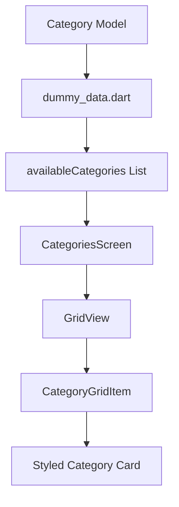
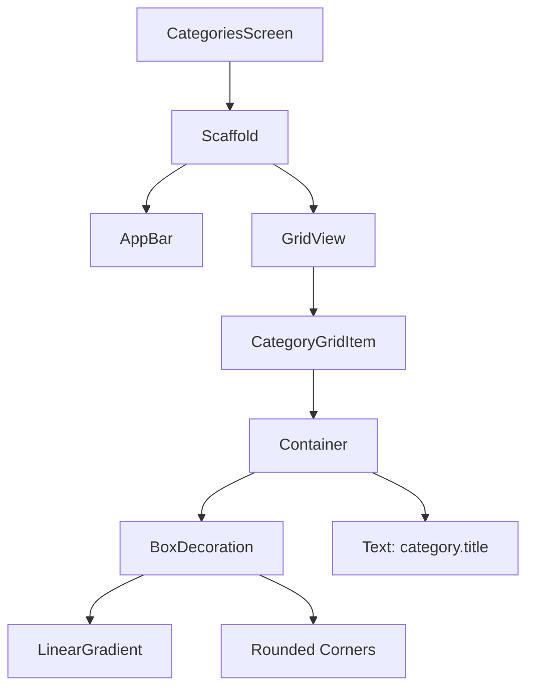

# Displaying Category Items on a Screen

## Overview

This lecture focuses on displaying real category data on the `CategoriesScreen` instead of using dummy `Text` widgets.

The goal is to create a reusable `CategoryGridItem` widget and use it to render each meal category as a styled card inside a `GridView`.

Each category item will use:

* a gradient background
* rounded corners
* padding
* theme-based text styling
* data from the `Category` model

---

## Main Idea

Instead of hardcoding placeholder widgets, the screen should dynamically render category items from the dummy category list.

```text
Before:
GridView(
  children: [
    Text('Category 1'),
    Text('Category 2'),
  ],
)

After:
GridView(
  children: [
    for (final category in availableCategories)
      CategoryGridItem(category: category),
  ],
)
```

---

## Project Structure

```text
lib/
├── data/
│   └── dummy_data.dart
│
├── models/
│   └── category.dart
│
├── screens/
│   └── categories.dart
│
├── widgets/
│   └── category_grid_item.dart
│
└── main.dart
```

---

## Markdown Diagram: Data Rendering Flow



---

# 1. Creating the `CategoryGridItem` Widget

The `CategoryGridItem` widget is responsible for displaying one single category inside the grid.

Create this file:

```text
lib/widgets/category_grid_item.dart
```

This widget receives a `Category` object from outside and uses its data to build the UI.

```dart
import 'package:flutter/material.dart';

import '../models/category.dart';

class CategoryGridItem extends StatelessWidget {
  const CategoryGridItem({
    super.key,
    required this.category,
  });

  final Category category;

  @override
  Widget build(BuildContext context) {
    return Container(
      padding: const EdgeInsets.all(16),
      decoration: BoxDecoration(
        borderRadius: BorderRadius.circular(16),
        gradient: LinearGradient(
          colors: [
            category.color.withOpacity(0.55),
            category.color.withOpacity(0.9),
          ],
          begin: Alignment.topLeft,
          end: Alignment.bottomRight,
        ),
      ),
      child: Text(
        category.title,
        style: Theme.of(context).textTheme.titleLarge!.copyWith(
              color: Theme.of(context).colorScheme.onBackground,
            ),
      ),
    );
  }
}
```

---

## Explanation

The `CategoryGridItem` widget is a `StatelessWidget` because it does not manage any internal state.

It only receives data and displays it.

```dart
final Category category;
```

This property stores the category object that will be passed into the widget.

The constructor requires this category:

```dart
const CategoryGridItem({
  super.key,
  required this.category,
});
```

This means every `CategoryGridItem` must receive a `Category`.

---

# 2. Why Use `Container`?

A `Container` is used because it provides many styling options.

In this case, the `Container` is used to configure:

* padding
* background decoration
* gradient
* rounded corners
* child widget

```dart
return Container(
  padding: const EdgeInsets.all(16),
  decoration: BoxDecoration(
    // styling here
  ),
  child: Text(category.title),
);
```

---

# 3. Adding Padding

The category item should not place its text directly against the edges.

Therefore, padding is added:

```dart
padding: const EdgeInsets.all(16),
```

This adds `16` pixels of space on all sides inside the container.

---

# 4. Styling with `BoxDecoration`

To style the background, the `decoration` parameter is used.

```dart
decoration: BoxDecoration(
  borderRadius: BorderRadius.circular(16),
  gradient: LinearGradient(
    colors: [
      category.color.withOpacity(0.55),
      category.color.withOpacity(0.9),
    ],
    begin: Alignment.topLeft,
    end: Alignment.bottomRight,
  ),
),
```

`BoxDecoration` allows us to add visual styling such as:

| Feature          | Purpose                           |
| ---------------- | --------------------------------- |
| `borderRadius`   | Gives the item rounded corners    |
| `LinearGradient` | Creates a smooth color transition |
| `colors`         | Defines the gradient colors       |
| `begin`          | Defines where the gradient starts |
| `end`            | Defines where the gradient ends   |

---

# 5. Creating a Linear Gradient

The gradient uses the category color with different opacity values.

```dart
gradient: LinearGradient(
  colors: [
    category.color.withOpacity(0.55),
    category.color.withOpacity(0.9),
  ],
  begin: Alignment.topLeft,
  end: Alignment.bottomRight,
),
```

The first color is more transparent:

```dart
category.color.withOpacity(0.55)
```

The second color is stronger:

```dart
category.color.withOpacity(0.9)
```

This creates a subtle diagonal gradient from the top-left corner to the bottom-right corner.

---

## Markdown Diagram: Gradient Direction

```text
Top Left
   ↓
   ┌──────────────────┐
   │ lighter opacity  │
   │                  │
   │                  │
   │ stronger opacity │
   └──────────────────┘
                    ↓
              Bottom Right
```

---

# 6. Displaying the Category Title

The category title is displayed with a `Text` widget.

```dart
child: Text(
  category.title,
  style: Theme.of(context).textTheme.titleLarge!.copyWith(
        color: Theme.of(context).colorScheme.onBackground,
      ),
),
```

Instead of hardcoding a text style manually, the widget uses the app theme.

```dart
Theme.of(context).textTheme.titleLarge
```

Then it copies that style and changes only the text color:

```dart
.copyWith(
  color: Theme.of(context).colorScheme.onBackground,
)
```

This keeps the UI consistent with the rest of the app.

---

# 7. Why Use `Theme.of(context)`?

Using `Theme.of(context)` allows the widget to access the global app theme.

This is useful because the UI can automatically stay consistent with:

* app colors
* light mode
* dark mode
* text styles
* custom fonts

Example:

```dart
Theme.of(context).textTheme.titleLarge
```

This accesses the large title text style defined in the app theme.

---

# 8. Rendering Category Items in `CategoriesScreen`

Now go back to the `categories.dart` file.

The dummy `Text` widgets should be removed.

Instead, import the dummy data and the `CategoryGridItem` widget.

```dart
import 'package:flutter/material.dart';

import '../data/dummy_data.dart';
import '../widgets/category_grid_item.dart';
```

Then use the `availableCategories` list to generate one `CategoryGridItem` per category.

```dart
class CategoriesScreen extends StatelessWidget {
  const CategoriesScreen({super.key});

  @override
  Widget build(BuildContext context) {
    return Scaffold(
      appBar: AppBar(
        title: const Text('Pick your category'),
      ),
      body: GridView(
        padding: const EdgeInsets.all(24),
        gridDelegate: const SliverGridDelegateWithFixedCrossAxisCount(
          crossAxisCount: 2,
          childAspectRatio: 3 / 2,
          crossAxisSpacing: 20,
          mainAxisSpacing: 20,
        ),
        children: [
          for (final category in availableCategories)
            CategoryGridItem(category: category),
        ],
      ),
    );
  }
}
```

---

# 9. Important: Remove `const` from `children`

Before using dynamic data, the `children` list might have been marked as `const`.

However, once the widgets are generated dynamically, `const` must be removed.

Wrong:

```dart
children: const [
  for (final category in availableCategories)
    CategoryGridItem(category: category),
],
```

Correct:

```dart
children: [
  for (final category in availableCategories)
    CategoryGridItem(category: category),
],
```

The list is now built dynamically from `availableCategories`.

---

# 10. Using a `for` Loop Inside the Widget List

Flutter allows using collection `for` inside lists.

```dart
children: [
  for (final category in availableCategories)
    CategoryGridItem(category: category),
],
```

This means:

```text
For every category in availableCategories,
create one CategoryGridItem.
```

---

## Alternative: Using `.map()`

The same result can also be achieved with `.map()`.

```dart
children: availableCategories.map((category) {
  return CategoryGridItem(category: category);
}).toList(),
```

Both approaches are valid.

### `for` loop version

```dart
children: [
  for (final category in availableCategories)
    CategoryGridItem(category: category),
],
```

### `.map()` version

```dart
children: availableCategories
    .map(
      (category) => CategoryGridItem(category: category),
    )
    .toList(),
```

The `for` loop syntax is often easier to read in Flutter UI code.

---

# 11. Adding Padding to the `GridView`

The category cards should not touch the screen edges.

Therefore, padding is added to the `GridView`.

```dart
padding: const EdgeInsets.all(24),
```

This creates space around the entire grid.

```dart
body: GridView(
  padding: const EdgeInsets.all(24),
  gridDelegate: const SliverGridDelegateWithFixedCrossAxisCount(
    crossAxisCount: 2,
    childAspectRatio: 3 / 2,
    crossAxisSpacing: 20,
    mainAxisSpacing: 20,
  ),
  children: [
    for (final category in availableCategories)
      CategoryGridItem(category: category),
  ],
),
```

---

# 12. GridView Is Scrollable by Default

`GridView` is scrollable automatically.

This means that if there are more category items than can fit on the screen, the user can scroll through them.

You do not need to add extra scroll behavior manually.

---

## Markdown Diagram: Screen Composition



---

# 13. Current Result

At this point, the app displays all categories as styled grid items.

Each item has:

* category title
* category color
* gradient background
* internal padding
* grid spacing
* rounded corners

However, the items are not tappable yet.

That will be handled next by using a widget such as `InkWell` or `GestureDetector`.

---

# 14. Complete `CategoryGridItem` Code

```dart
import 'package:flutter/material.dart';

import '../models/category.dart';

class CategoryGridItem extends StatelessWidget {
  const CategoryGridItem({
    super.key,
    required this.category,
  });

  final Category category;

  @override
  Widget build(BuildContext context) {
    return Container(
      padding: const EdgeInsets.all(16),
      decoration: BoxDecoration(
        borderRadius: BorderRadius.circular(16),
        gradient: LinearGradient(
          colors: [
            category.color.withOpacity(0.55),
            category.color.withOpacity(0.9),
          ],
          begin: Alignment.topLeft,
          end: Alignment.bottomRight,
        ),
      ),
      child: Text(
        category.title,
        style: Theme.of(context).textTheme.titleLarge!.copyWith(
              color: Theme.of(context).colorScheme.onBackground,
            ),
      ),
    );
  }
}
```

---

# 15. Complete `CategoriesScreen` Code

```dart
import 'package:flutter/material.dart';

import '../data/dummy_data.dart';
import '../widgets/category_grid_item.dart';

class CategoriesScreen extends StatelessWidget {
  const CategoriesScreen({super.key});

  @override
  Widget build(BuildContext context) {
    return Scaffold(
      appBar: AppBar(
        title: const Text('Pick your category'),
      ),
      body: GridView(
        padding: const EdgeInsets.all(24),
        gridDelegate: const SliverGridDelegateWithFixedCrossAxisCount(
          crossAxisCount: 2,
          childAspectRatio: 3 / 2,
          crossAxisSpacing: 20,
          mainAxisSpacing: 20,
        ),
        children: [
          for (final category in availableCategories)
            CategoryGridItem(category: category),
        ],
      ),
    );
  }
}
```

---

## Key Takeaways

* `CategoryGridItem` is a reusable widget for displaying one category.
* The widget receives a `Category` object through its constructor.
* `Container` is useful when you need padding, decoration, and layout styling.
* `BoxDecoration` allows gradients and rounded corners.
* `LinearGradient` creates a smooth transition between color variations.
* `Theme.of(context)` keeps text styling consistent with the app theme.
* `GridView` can dynamically render widgets from a list.
* Collection `for` is a clean way to generate widgets inside a list.
* `GridView` is scrollable by default.

---

## Final Summary

In this lecture, we replaced dummy text widgets with real category data.

A new reusable `CategoryGridItem` widget was created to display each category as a styled card. The widget uses a `Container`, `BoxDecoration`, `LinearGradient`, rounded corners, padding, and theme-based text styling.

Then, inside `CategoriesScreen`, the `availableCategories` list is used to generate one `CategoryGridItem` for every category.

The result is a clean, dynamic, and visually appealing category grid that is ready to become interactive in the next step.
