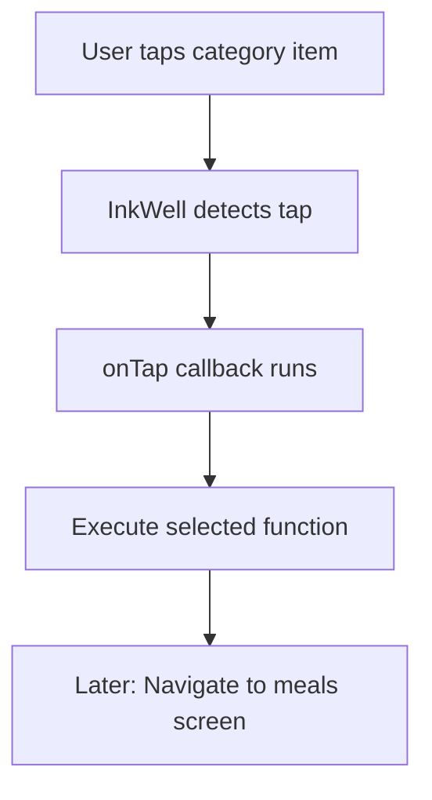
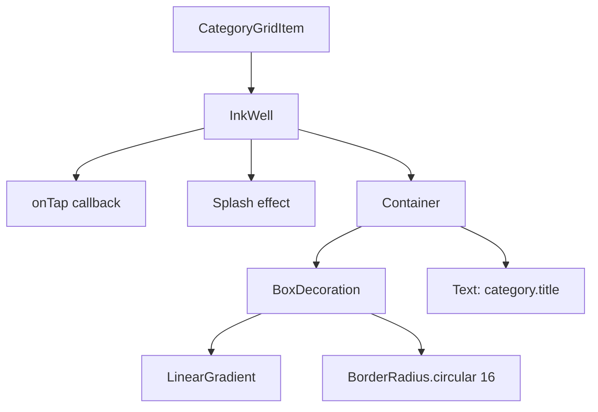

# Making Any Widget Tappable with `InkWell`

## Overview

This lecture explains how to make any Flutter widget respond to tap gestures by wrapping it with the `InkWell` widget.

In this example, we make each `CategoryGridItem` tappable. When the user taps a category item, Flutter can later use that tap event to navigate to another screen, such as a meals screen that shows all meals for the selected category.

`InkWell` is especially useful in Material apps because it not only detects taps, but also provides a visual ripple or splash effect.

---

## Main Goal

The current category items are displayed on the screen, but they are not interactive yet.

The goal is to turn this:

```dart
Container(
  child: Text(category.title),
)
```

Into this:

```dart
InkWell(
  onTap: onSelectCategory,
  child: Container(
    child: Text(category.title),
  ),
)
```

---

## Key Concepts

| Concept           | Explanation                                                 |
| ----------------- | ----------------------------------------------------------- |
| `InkWell`         | Makes a widget tappable and adds a Material ripple effect   |
| `onTap`           | A callback function that runs when the widget is tapped     |
| `splashColor`     | Controls the color of the tap feedback effect               |
| `borderRadius`    | Clips the ripple effect to match rounded corners            |
| `GestureDetector` | Alternative gesture widget without Material ripple feedback |

---

## `InkWell` vs `GestureDetector`

Both `InkWell` and `GestureDetector` can detect taps, but they are used for slightly different purposes.

| Widget            | Tap Detection | Visual Feedback            | Common Use Case                         |
| ----------------- | ------------- | -------------------------- | --------------------------------------- |
| `InkWell`         | Yes           | Yes, ripple/splash effect  | Material UI buttons, cards, tiles       |
| `GestureDetector` | Yes           | No default visual feedback | Custom gestures, invisible interactions |

Use `InkWell` when you want the user to see a tap effect.

Use `GestureDetector` when you only need gesture detection without a Material animation.

---

## Markdown Diagram: Tap Flow



---

# 1. Wrapping the Container with `InkWell`

To make the category card tappable, wrap the existing `Container` with `InkWell`.

```dart
return InkWell(
  onTap: onSelectCategory,
  child: Container(
    padding: const EdgeInsets.all(16),
    decoration: BoxDecoration(
      gradient: LinearGradient(
        colors: [
          category.color.withOpacity(0.55),
          category.color.withOpacity(0.9),
        ],
        begin: Alignment.topLeft,
        end: Alignment.bottomRight,
      ),
    ),
    child: Text(category.title),
  ),
);
```

The `InkWell` becomes the outer widget.

The `Container` remains responsible for the visual appearance of the category item.

---

# 2. Adding the `onTap` Callback

The `onTap` parameter receives a function that should run when the widget is tapped.

```dart
onTap: onSelectCategory,
```

This means:

```text
When the user taps this category item,
run the onSelectCategory function.
```

To make this work, the widget should receive the function from outside.

```dart
final VoidCallback onSelectCategory;
```

`VoidCallback` means a function that takes no parameters and returns nothing.

---

# 3. Updating the Constructor

The `CategoryGridItem` now needs two required inputs:

* the category data
* the tap handler function

```dart
const CategoryGridItem({
  super.key,
  required this.category,
  required this.onSelectCategory,
});
```

Full property setup:

```dart
final Category category;
final VoidCallback onSelectCategory;
```

This keeps the widget reusable because it does not decide what happens after a tap. It only triggers the function that was passed into it.

---

# 4. Adding a Splash Color

`InkWell` can show a visual splash effect when the user taps or holds the item.

```dart
splashColor: Theme.of(context).primaryColor,
```

This uses the app's primary theme color as the splash effect color.

Using theme-based colors keeps the UI consistent with the rest of the app.

---

# 5. Adding Rounded Corners to `InkWell`

The category item should have rounded corners.

To make the tap effect follow the same shape, add `borderRadius` to `InkWell`.

```dart
borderRadius: BorderRadius.circular(16),
```

This prevents the ripple effect from looking rectangular when the card itself has rounded corners.

---

# 6. Adding Rounded Corners to the Container

The `Container` also needs the same border radius inside its `BoxDecoration`.

```dart
decoration: BoxDecoration(
  borderRadius: BorderRadius.circular(16),
  gradient: LinearGradient(
    colors: [
      category.color.withOpacity(0.55),
      category.color.withOpacity(0.9),
    ],
    begin: Alignment.topLeft,
    end: Alignment.bottomRight,
  ),
),
```

The important part is that both `InkWell` and `Container` use the same radius:

```dart
BorderRadius.circular(16)
```

---

## Markdown Diagram: Widget Structure



---

# 7. Complete `CategoryGridItem` Code

```dart
import 'package:flutter/material.dart';

import '../models/category.dart';

class CategoryGridItem extends StatelessWidget {
  const CategoryGridItem({
    super.key,
    required this.category,
    required this.onSelectCategory,
  });

  final Category category;
  final VoidCallback onSelectCategory;

  @override
  Widget build(BuildContext context) {
    return InkWell(
      onTap: onSelectCategory,
      splashColor: Theme.of(context).primaryColor,
      borderRadius: BorderRadius.circular(16),
      child: Container(
        padding: const EdgeInsets.all(16),
        decoration: BoxDecoration(
          borderRadius: BorderRadius.circular(16),
          gradient: LinearGradient(
            colors: [
              category.color.withOpacity(0.55),
              category.color.withOpacity(0.9),
            ],
            begin: Alignment.topLeft,
            end: Alignment.bottomRight,
          ),
        ),
        child: Text(
          category.title,
          style: Theme.of(context).textTheme.titleLarge!.copyWith(
                color: Theme.of(context).colorScheme.onBackground,
              ),
        ),
      ),
    );
  }
}
```

---

# 8. Using `CategoryGridItem` in `CategoriesScreen`

Because `CategoryGridItem` now requires `onSelectCategory`, the screen must pass a function into it.

```dart
children: [
  for (final category in availableCategories)
    CategoryGridItem(
      category: category,
      onSelectCategory: () {
        // Navigation will be added later.
      },
    ),
],
```

At this point, the item is tappable, but it does not navigate anywhere yet.

The navigation logic will be added in the next step.

---

# 9. Complete Example in `CategoriesScreen`

```dart
import 'package:flutter/material.dart';

import '../data/dummy_data.dart';
import '../widgets/category_grid_item.dart';

class CategoriesScreen extends StatelessWidget {
  const CategoriesScreen({super.key});

  void _selectCategory() {
    // Navigation will be added later.
  }

  @override
  Widget build(BuildContext context) {
    return Scaffold(
      appBar: AppBar(
        title: const Text('Pick your category'),
      ),
      body: GridView(
        padding: const EdgeInsets.all(24),
        gridDelegate: const SliverGridDelegateWithFixedCrossAxisCount(
          crossAxisCount: 2,
          childAspectRatio: 3 / 2,
          crossAxisSpacing: 20,
          mainAxisSpacing: 20,
        ),
        children: [
          for (final category in availableCategories)
            CategoryGridItem(
              category: category,
              onSelectCategory: _selectCategory,
            ),
        ],
      ),
    );
  }
}
```

---

## Important Note About `Material`

`InkWell` is designed for Material apps.

For the ripple effect to render correctly, `InkWell` should usually be inside a `Material` widget.

In this app, the `CategoryGridItem` is displayed inside a `Scaffold`, which already provides a Material environment.

That is why the ripple effect works here.

---

## Why the Border Radius Must Match

There are two places where `BorderRadius.circular(16)` is used:

```dart
borderRadius: BorderRadius.circular(16),
```

On `InkWell`, it shapes the tap effect.

Inside `BoxDecoration`, it shapes the visible container.

```dart
decoration: BoxDecoration(
  borderRadius: BorderRadius.circular(16),
)
```

If these two values do not match, the card shape and the tap animation may look inconsistent.

---

## Current Result

After adding `InkWell`, each category item:

* can detect taps
* shows a subtle splash effect
* has rounded corners
* keeps the gradient background
* is ready for navigation logic

The user can now tap and hold a category card and see a visual feedback effect.

---

## Key Takeaways

* `InkWell` can wrap almost any widget to make it tappable.
* `onTap` defines what should happen when the widget is tapped.
* `InkWell` provides visual feedback, unlike `GestureDetector`.
* `splashColor` controls the tap effect color.
* `borderRadius` should match the child widget's rounded corners.
* The tap logic should usually be passed in from the parent screen.
* The widget itself should stay reusable and not hardcode navigation behavior.

---

## Final Summary

In this lecture, the `CategoryGridItem` widget was made interactive by wrapping its `Container` with `InkWell`.

`InkWell` allows the category card to respond to taps and show a Material splash effect. The `onTap` callback is used to trigger a function whenever the user selects a category.

The card also receives matching rounded corners on both the `InkWell` and the `Container`, ensuring that the visual shape and tap animation look consistent.

The category items are now tappable, and the next step is to connect those taps to navigation so that selecting a category opens a new screen.
