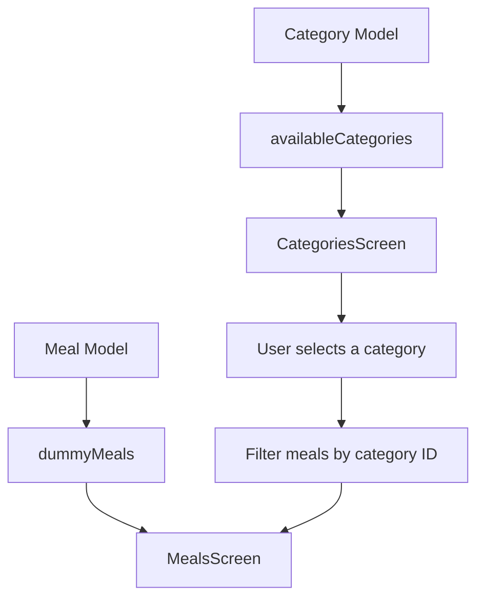
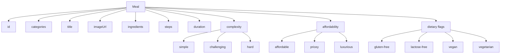
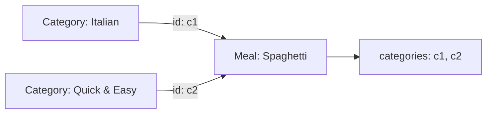
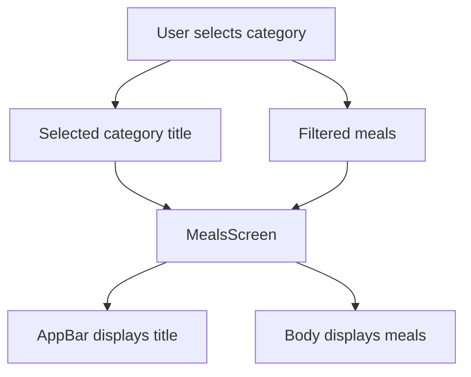

# Adding Meals Data

## Overview

This lecture introduces the `Meal` model and dummy meal data for the Meals App.

So far, the app can display meal categories on the `CategoriesScreen`. The next goal is to allow the user to tap a category and navigate to a new screen that shows all meals belonging to that selected category.

Before that can happen, the app needs structured meal data.

To achieve this, we will:

* create a new `Meal` model
* define enums for meal complexity and affordability
* add dummy meal data
* prepare a new `MealsScreen`
* pass a selected category title and list of meals into that screen

---

## Main Goal

When the user taps a category item, the app should eventually navigate to a new screen.

```text
User taps category
        ↓
Find meals for selected category
        ↓
Open MealsScreen
        ↓
Display matching meals
```

---

## Project Structure

After this lecture, the project structure will look like this:

```text
lib/
├── data/
│   └── dummy_data.dart
│
├── models/
│   ├── category.dart
│   └── meal.dart
│
├── screens/
│   ├── categories.dart
│   └── meals.dart
│
├── widgets/
│   └── category_grid_item.dart
│
└── main.dart
```

---

## Markdown Diagram: Data Relationship



---

# 1. Creating the `Meal` Model

Create a new file inside the `models` folder:

```text
lib/models/meal.dart
```

This file defines the structure of a single meal.

A meal is not a widget. It is a regular Dart object that stores information such as:

* title
* image URL
* ingredients
* cooking steps
* duration
* complexity
* affordability
* dietary flags

---

## `meal.dart`

```dart
enum Complexity {
  simple,
  challenging,
  hard,
}

enum Affordability {
  affordable,
  pricey,
  luxurious,
}

class Meal {
  const Meal({
    required this.id,
    required this.categories,
    required this.title,
    required this.imageUrl,
    required this.ingredients,
    required this.steps,
    required this.duration,
    required this.complexity,
    required this.affordability,
    required this.isGlutenFree,
    required this.isLactoseFree,
    required this.isVegan,
    required this.isVegetarian,
  });

  final String id;
  final List<String> categories;
  final String title;
  final String imageUrl;
  final List<String> ingredients;
  final List<String> steps;
  final int duration;
  final Complexity complexity;
  final Affordability affordability;
  final bool isGlutenFree;
  final bool isLactoseFree;
  final bool isVegan;
  final bool isVegetarian;
}
```

---

# 2. Understanding the `Meal` Properties

| Property        | Type            | Purpose                             |
| --------------- | --------------- | ----------------------------------- |
| `id`            | `String`        | Unique identifier for the meal      |
| `categories`    | `List<String>`  | Category IDs this meal belongs to   |
| `title`         | `String`        | Name of the meal                    |
| `imageUrl`      | `String`        | Image used when displaying the meal |
| `ingredients`   | `List<String>`  | Required ingredients                |
| `steps`         | `List<String>`  | Cooking instructions                |
| `duration`      | `int`           | Cooking time in minutes             |
| `complexity`    | `Complexity`    | Difficulty level                    |
| `affordability` | `Affordability` | Price level                         |
| `isGlutenFree`  | `bool`          | Whether the meal is gluten-free     |
| `isLactoseFree` | `bool`          | Whether the meal is lactose-free    |
| `isVegan`       | `bool`          | Whether the meal is vegan           |
| `isVegetarian`  | `bool`          | Whether the meal is vegetarian      |

---

# 3. Why Use `enum`?

The `Meal` model uses enums for `Complexity` and `Affordability`.

```dart
enum Complexity {
  simple,
  challenging,
  hard,
}

enum Affordability {
  affordable,
  pricey,
  luxurious,
}
```

Enums are useful because they limit a value to a fixed set of choices.

Instead of writing random strings like this:

```dart
complexity: 'very easy',
```

You use a controlled value:

```dart
complexity: Complexity.simple,
```

This makes the code:

* safer
* easier to read
* less error-prone
* easier to maintain

---

## Markdown Diagram: Meal Model Structure



---

# 4. Adding Dummy Meal Data

Now go to:

```text
lib/data/dummy_data.dart
```

This file already contains the dummy category data.

Now we also add dummy meals.

Because the file now uses the `Meal` model, make sure to import it:

```dart
import '../models/meal.dart';
```

A simplified example of dummy meal data looks like this:

```dart
import 'package:flutter/material.dart';

import '../models/category.dart';
import '../models/meal.dart';

const availableCategories = [
  Category(
    id: 'c1',
    title: 'Italian',
    color: Colors.purple,
  ),
  Category(
    id: 'c2',
    title: 'Quick & Easy',
    color: Colors.red,
  ),
];

const dummyMeals = [
  Meal(
    id: 'm1',
    categories: [
      'c1',
      'c2',
    ],
    title: 'Spaghetti with Tomato Sauce',
    imageUrl:
        'https://upload.wikimedia.org/wikipedia/commons/0/0b/RedDot_Burger.jpg',
    ingredients: [
      '4 Tomatoes',
      '1 Tablespoon of Olive Oil',
      '1 Onion',
      '250g Spaghetti',
      'Spices',
      'Cheese',
    ],
    steps: [
      'Cut the tomatoes and the onion into small pieces.',
      'Boil some water and cook the spaghetti.',
      'Heat olive oil and add the onion.',
      'Add the tomatoes and spices.',
      'Serve the spaghetti with the sauce.',
    ],
    duration: 20,
    complexity: Complexity.simple,
    affordability: Affordability.affordable,
    isGlutenFree: false,
    isLactoseFree: true,
    isVegan: true,
    isVegetarian: true,
  ),
];
```

---

## Important Note About Category IDs

Each meal stores a list of category IDs:

```dart
categories: [
  'c1',
  'c2',
],
```

This means the meal belongs to multiple categories.

For example, if:

```dart
'c1' = Italian
'c2' = Quick & Easy
```

Then this meal belongs to both:

```text
Italian
Quick & Easy
```

This is how the app can later filter meals by selected category.

---

## Markdown Diagram: Category and Meal Connection



---

# 5. Why Use `final` Fields and a `const` Constructor?

The `Meal` model uses `final` fields:

```dart
final String id;
final String title;
final List<String> categories;
```

This means these values cannot be reassigned after the object is created.

The constructor is also marked as `const`:

```dart
const Meal({
  required this.id,
  required this.categories,
  required this.title,
  required this.imageUrl,
  required this.ingredients,
  required this.steps,
  required this.duration,
  required this.complexity,
  required this.affordability,
  required this.isGlutenFree,
  required this.isLactoseFree,
  required this.isVegan,
  required this.isVegetarian,
});
```

This is useful because meal objects are static dummy data.

Using immutable data makes the app more predictable and efficient.

---

# 6. Creating the `MealsScreen`

Next, create a new screen file:

```text
lib/screens/meals.dart
```

This screen will show all meals for the selected category.

```dart
import 'package:flutter/material.dart';

import '../models/meal.dart';

class MealsScreen extends StatelessWidget {
  const MealsScreen({
    super.key,
    required this.title,
    required this.meals,
  });

  final String title;
  final List<Meal> meals;

  @override
  Widget build(BuildContext context) {
    return Scaffold(
      appBar: AppBar(
        title: Text(title),
      ),
      body: const Center(
        child: Text('Meals list will be displayed here.'),
      ),
    );
  }
}
```

---

# 7. Why Does `MealsScreen` Need Input?

The `MealsScreen` needs to know two things:

| Input   | Type         | Purpose                                |
| ------- | ------------ | -------------------------------------- |
| `title` | `String`     | The selected category title            |
| `meals` | `List<Meal>` | The meals that belong to that category |

That is why the constructor requires both values:

```dart
const MealsScreen({
  super.key,
  required this.title,
  required this.meals,
});
```

---

## Example

If the user selects the Italian category, the screen might receive:

```dart
MealsScreen(
  title: 'Italian',
  meals: italianMeals,
)
```

Then the AppBar can display:

```text
Italian
```

And the body can display all Italian meals.

---

# 8. Preparing the AppBar Title

Inside the `MealsScreen`, the selected category title can be used in the `AppBar`.

```dart
appBar: AppBar(
  title: Text(title),
),
```

This makes the screen dynamic.

The same `MealsScreen` can display different titles depending on which category was selected.

---

# 9. Preparing the Body

For now, the body can contain placeholder text.

```dart
body: const Center(
  child: Text('Meals list will be displayed here.'),
),
```

Later, this will be replaced with a real list of meals.

The final body should eventually:

* display a list of meals
* handle long lists efficiently
* show fallback text if no meals are available

---

## Markdown Diagram: MealsScreen Data Flow



---

# 10. What Comes Next?

At this stage, we have prepared the data and the screen.

The next step is to connect the category tap event to navigation.

That means when a user taps a `CategoryGridItem`, the app should:

```text
1. Get the selected category.
2. Filter dummyMeals by category ID.
3. Create a MealsScreen.
4. Pass the title and filtered meals to MealsScreen.
5. Navigate to MealsScreen.
```

---

## Future Filtering Logic

The filtering logic will look similar to this:

```dart
final filteredMeals = dummyMeals.where((meal) {
  return meal.categories.contains(category.id);
}).toList();
```

This checks whether a meal belongs to the selected category.

If the meal's `categories` list contains the selected category ID, that meal should be shown.

---

## Key Takeaways

* `Meal` is a data model, not a widget.
* The `Meal` model defines the structure of a meal object.
* `Complexity` and `Affordability` are enums with predefined values.
* `dummyMeals` stores static meal data for the app.
* Each meal can belong to multiple categories.
* Meals are linked to categories by category IDs.
* `MealsScreen` will display meals for a selected category.
* `MealsScreen` needs a title and a list of meals as input.
* The actual navigation and filtering logic will be implemented next.

---

## Final Summary

In this lecture, we added the meal data foundation for the Meals App.

First, we created a `Meal` model in `lib/models/meal.dart`. This model defines all the information a meal needs, including its title, image, ingredients, steps, duration, complexity, affordability, and dietary flags.

Then, we added a `dummyMeals` list to `dummy_data.dart`. Each meal references one or more category IDs, which allows the app to later filter meals based on the selected category.

Finally, we created a new `MealsScreen` that accepts a title and a list of meals. This screen will later be used to display all meals that belong to a selected category.

The app now has the data structure needed to move from category selection to meal display.
