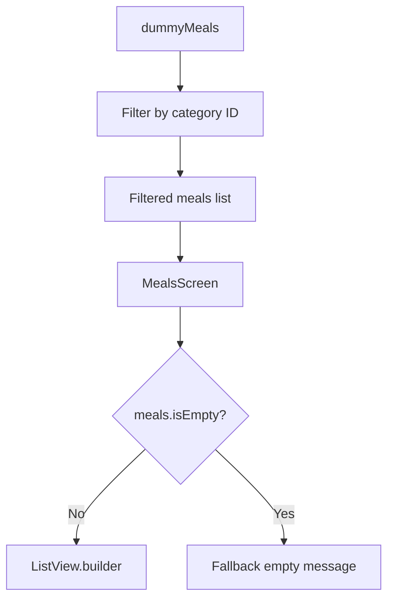
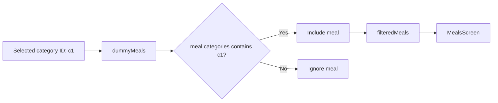

# Loading Meals Data Into a Screen

## Overview

This lecture explains how to load meal data into a new `MealsScreen`.

After creating the `Meal` model and adding `dummyMeals`, the next step is to display those meals on a screen. The `MealsScreen` receives a list of meals and renders them with a scrollable list.

The screen also handles the case where no meals are available by showing a fallback message.

---

## Main Goal

When a user selects a category, the app should eventually navigate to a screen that shows all meals for that selected category.

```text
User taps category
        ↓
Filter meals by selected category ID
        ↓
Pass filtered meals to MealsScreen
        ↓
Display meals in a scrollable list
```

---

## Project Structure

```text
lib/
├── data/
│   └── dummy_data.dart
│
├── models/
│   ├── category.dart
│   └── meal.dart
│
├── screens/
│   ├── categories.dart
│   └── meals.dart
│
├── widgets/
│   └── category_grid_item.dart
│
└── main.dart
```

---

## Markdown Diagram: Screen Data Flow



---

# 1. Creating the `MealsScreen`

Create a new file inside the `screens` folder:

```text
lib/screens/meals.dart
```

The `MealsScreen` is a screen widget, so it should return a `Scaffold`.

It receives:

* a `title`
* a list of `meals`

```dart
import 'package:flutter/material.dart';

import '../models/meal.dart';

class MealsScreen extends StatelessWidget {
  const MealsScreen({
    super.key,
    this.title,
    required this.meals,
  });

  final String? title;
  final List<Meal> meals;

  @override
  Widget build(BuildContext context) {
    return Scaffold(
      appBar: AppBar(
        title: Text(title ?? 'Meals'),
      ),
      body: const Center(
        child: Text('Meals will be shown here.'),
      ),
    );
  }
}
```

---

# 2. Why `MealsScreen` Receives a Meals List

The `MealsScreen` should not be responsible for deciding which category was selected.

Instead, it simply receives the meals that should be displayed.

```dart
final List<Meal> meals;
```

This makes the screen more reusable.

For example, the same screen could later be used for:

* meals from a selected category
* favorite meals
* filtered meals
* search results

---

# 3. Using `ListView.builder`

To display meals efficiently, use `ListView.builder`.

```dart
ListView.builder(
  itemCount: meals.length,
  itemBuilder: (ctx, index) {
    return Text(meals[index].title);
  },
)
```

`ListView.builder` is useful because it only builds the items that are currently visible on the screen.

This is better for long lists than creating all children at once.

---

## Important: Add `itemCount`

The `itemCount` tells Flutter how many items should be built.

```dart
itemCount: meals.length,
```

Without this, the list may not render correctly.

---

# 4. Creating a `content` Variable

A clean Flutter pattern is to store the body widget in a variable.

```dart
Widget content = ListView.builder(
  itemCount: meals.length,
  itemBuilder: (ctx, index) {
    return Text(meals[index].title);
  },
);
```

Then, if the meals list is empty, the value of `content` can be replaced.

```dart
if (meals.isEmpty) {
  content = const Center(
    child: Text('No meals found.'),
  );
}
```

This keeps the `Scaffold` clean.

---

# 5. Handling the Empty State

If there are no meals for the selected category, the app should show a friendly fallback message.

```dart
if (meals.isEmpty) {
  content = Center(
    child: Column(
      mainAxisSize: MainAxisSize.min,
      children: [
        Text(
          'Uh oh ... nothing here!',
          style: Theme.of(context).textTheme.headlineLarge!.copyWith(
                color: Theme.of(context).colorScheme.onBackground,
              ),
        ),
        const SizedBox(height: 16),
        Text(
          'Try selecting a different category!',
          style: Theme.of(context).textTheme.bodyLarge!.copyWith(
                color: Theme.of(context).colorScheme.onBackground,
              ),
        ),
      ],
    ),
  );
}
```

---

## Why Use `mainAxisSize: MainAxisSize.min`?

By default, a `Column` tries to take as much vertical space as possible.

```dart
mainAxisSize: MainAxisSize.min,
```

This tells the `Column` to only take the space it needs.

That allows the entire column to stay nicely centered inside the `Center` widget.

---

## Markdown Diagram: Empty State Layout

```text
Center
  └── Column
        ├── Text("Uh oh ... nothing here!")
        ├── SizedBox(height: 16)
        └── Text("Try selecting a different category!")
```

---

# 6. Complete `MealsScreen` Code

```dart
import 'package:flutter/material.dart';

import '../models/meal.dart';

class MealsScreen extends StatelessWidget {
  const MealsScreen({
    super.key,
    this.title,
    required this.meals,
  });

  final String? title;
  final List<Meal> meals;

  @override
  Widget build(BuildContext context) {
    Widget content = ListView.builder(
      itemCount: meals.length,
      itemBuilder: (ctx, index) {
        return Text(meals[index].title);
      },
    );

    if (meals.isEmpty) {
      content = Center(
        child: Column(
          mainAxisSize: MainAxisSize.min,
          children: [
            Text(
              'Uh oh ... nothing here!',
              style: Theme.of(context).textTheme.headlineLarge!.copyWith(
                    color: Theme.of(context).colorScheme.onBackground,
                  ),
            ),
            const SizedBox(height: 16),
            Text(
              'Try selecting a different category!',
              style: Theme.of(context).textTheme.bodyLarge!.copyWith(
                    color: Theme.of(context).colorScheme.onBackground,
                  ),
            ),
          ],
        ),
      );
    }

    return Scaffold(
      appBar: AppBar(
        title: Text(title ?? 'Meals'),
      ),
      body: content,
    );
  }
}
```

---

# 7. Temporarily Testing `MealsScreen` in `main.dart`

Before adding navigation, you can temporarily show the `MealsScreen` directly from `main.dart`.

First, import the screen:

```dart
import 'screens/meals.dart';
```

To test the empty state:

```dart
home: const MealsScreen(
  title: 'Some Category',
  meals: [],
),
```

This should display the fallback message.

---

# 8. Testing with Real Dummy Meals

To test the list rendering, import `dummy_data.dart`:

```dart
import 'data/dummy_data.dart';
```

Then pass `dummyMeals` into `MealsScreen`.

```dart
home: const MealsScreen(
  title: 'Some Category',
  meals: dummyMeals,
),
```

Now the screen should display meal titles from the dummy data list.

---

## Important Note About `const`

If `dummyMeals` is defined as a constant list, this works:

```dart
home: const MealsScreen(
  title: 'Some Category',
  meals: dummyMeals,
),
```

But if your meal list is not constant or is created dynamically, remove `const`.

```dart
home: MealsScreen(
  title: 'Some Category',
  meals: filteredMeals,
),
```

---

# 9. Filtering Meals by Category

Later, when a user taps a category, the app will filter meals by category ID.

```dart
final filteredMeals = dummyMeals.where((meal) {
  return meal.categories.contains(category.id);
}).toList();
```

This checks whether the selected category ID exists inside the meal's `categories` list.

---

## Example

```dart
Category(
  id: 'c1',
  title: 'Italian',
)
```

A meal can belong to that category like this:

```dart
Meal(
  id: 'm1',
  categories: ['c1', 'c2'],
  title: 'Spaghetti with Tomato Sauce',
)
```

Because the meal contains `'c1'`, it should appear when the Italian category is selected.

---

## Markdown Diagram: Filtering Logic



---

# 10. Replacing Text with a `MealItem` Later

For now, each meal can be displayed as a simple `Text` widget:

```dart
return Text(meals[index].title);
```

Later, this should be replaced with a dedicated `MealItem` widget.

```dart
return MealItem(
  meal: meals[index],
);
```

This keeps the `MealsScreen` focused on the list structure, while `MealItem` handles the visual design of each meal card.

---

## Current Result

At this point, the app can:

* receive a list of meals
* display meal titles in a scrollable list
* show a fallback message if the list is empty
* use `ListView.builder` for better performance
* prepare the screen for category-based navigation

The styling is still basic, but the data-loading logic works.

---

## Key Takeaways

* `MealsScreen` receives a list of meals from outside.
* `ListView.builder` efficiently renders dynamic lists.
* `itemCount` must be set to `meals.length`.
* A `content` variable can make conditional rendering cleaner.
* Empty states should be handled with a fallback UI.
* `mainAxisSize: MainAxisSize.min` helps center a `Column` properly.
* Meal filtering should happen before navigating to `MealsScreen`.
* A separate `MealItem` widget can later improve the list item design.

---

## Final Summary

In this lecture, we created the first working version of the `MealsScreen`.

The screen receives a list of meals and displays them using `ListView.builder`. If the list is empty, it shows a centered fallback message that tells the user to select a different category.

For testing, the `MealsScreen` can temporarily replace the `CategoriesScreen` in `main.dart`. Passing an empty list tests the fallback UI, while passing `dummyMeals` confirms that meal data is loaded correctly.

The general logic now works, and the next step is to improve the visual design of each meal item and connect the screen to category navigation.
