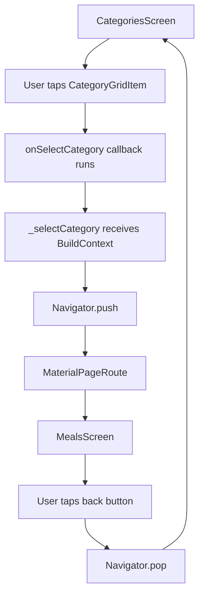
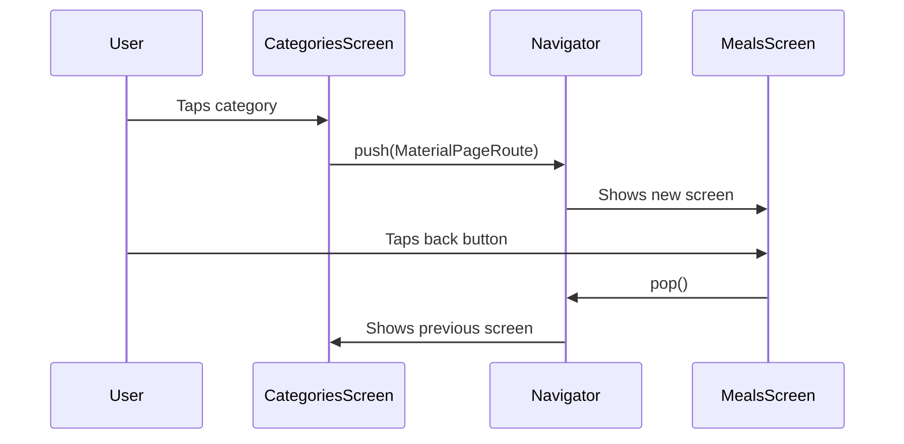

# Adding Cross-Screen Navigation

## Overview

This lecture introduces cross-screen navigation in Flutter using `Navigator.push` and `MaterialPageRoute`.

So far, the app can display:

* a `CategoriesScreen`
* a `MealsScreen`
* dummy meal data
* tappable category grid items

However, the navigation is not connected yet. The goal now is to navigate from the categories screen to the meals screen when a user taps a category.

When a category is selected, Flutter will push a new screen onto the navigation stack. The user will then see the `MealsScreen`. Flutter also automatically provides a back button so the user can return to the previous screen.

---

## Main Goal

Instead of hardcoding `MealsScreen` in `main.dart`, the app should start with `CategoriesScreen`.

Then, when a category is tapped:

```text
User taps category
        ↓
_selectCategory() runs
        ↓
Navigator.push() opens MealsScreen
        ↓
MealsScreen appears on top of CategoriesScreen
        ↓
Back button pops MealsScreen
```

---

## Key Concepts

| Concept             | Meaning                                                    |
| ------------------- | ---------------------------------------------------------- |
| `Navigator`         | Flutter class used to manage screen navigation             |
| `push`              | Adds a new screen on top of the current screen             |
| `pop`               | Removes the current screen and returns to the previous one |
| `MaterialPageRoute` | Creates a route with Material-style transition animation   |
| Navigation stack    | A stack of screens where the user sees the topmost screen  |
| `BuildContext`      | Required by Flutter to know where navigation should happen |

---

## Markdown Diagram: Navigation Stack

```text
Initial state:

┌──────────────────────┐
│   CategoriesScreen   │  ← visible screen
└──────────────────────┘


After Navigator.push():

┌──────────────────────┐
│     MealsScreen      │  ← visible screen
├──────────────────────┤
│   CategoriesScreen   │
└──────────────────────┘


After Navigator.pop():

┌──────────────────────┐
│   CategoriesScreen   │  ← visible again
└──────────────────────┘
```

---

## Mermaid Diagram: Navigation Flow



---

# 1. Restore `CategoriesScreen` in `main.dart`

Previously, `MealsScreen` was temporarily used in `main.dart` for testing.

Now, the app should start with `CategoriesScreen` again.

```dart
import 'package:flutter/material.dart';

import 'screens/categories.dart';

void main() {
  runApp(const App());
}

class App extends StatelessWidget {
  const App({super.key});

  @override
  Widget build(BuildContext context) {
    return MaterialApp(
      home: const CategoriesScreen(),
    );
  }
}
```

You can now remove the temporary imports for:

```dart
import 'screens/meals.dart';
import 'data/dummy_data.dart';
```

Those were only needed when testing `MealsScreen` directly.

---

# 2. Add a Selection Method in `CategoriesScreen`

Open:

```text
lib/screens/categories.dart
```

Inside `CategoriesScreen`, add a new method called `_selectCategory`.

```dart
void _selectCategory(BuildContext context) {
  Navigator.push(
    context,
    MaterialPageRoute(
      builder: (ctx) => const MealsScreen(
        title: 'Some title',
        meals: [],
      ),
    ),
  );
}
```

This method does not update widget state, so it can exist inside a `StatelessWidget`.

A `StatelessWidget` cannot manage changing UI state, but it can still contain helper methods that perform actions such as navigation.

---

# 3. Why Does `_selectCategory` Need `BuildContext`?

Inside a `StatelessWidget`, `context` is only available inside the `build` method.

Therefore, if another method needs access to `context`, it must receive it as a parameter.

```dart
void _selectCategory(BuildContext context) {
  // use context here
}
```

This allows the method to call:

```dart
Navigator.push(context, route);
```

---

# 4. Understanding `Navigator.push`

`Navigator.push` adds a new route on top of the current screen.

```dart
Navigator.push(
  context,
  MaterialPageRoute(
    builder: (ctx) => const MealsScreen(
      title: 'Some title',
      meals: [],
    ),
  ),
);
```

The first argument is the current `BuildContext`.

```dart
context
```

The second argument is the route that should be pushed.

```dart
MaterialPageRoute(...)
```

---

# 5. Alternative Syntax: `Navigator.of(context).push`

You may also see this syntax in many Flutter projects:

```dart
Navigator.of(context).push(
  MaterialPageRoute(
    builder: (ctx) => const MealsScreen(
      title: 'Some title',
      meals: [],
    ),
  ),
);
```

Both versions are valid.

### Version 1

```dart
Navigator.push(context, route);
```

### Version 2

```dart
Navigator.of(context).push(route);
```

They achieve the same result.

---

# 6. Creating a Route with `MaterialPageRoute`

`MaterialPageRoute` creates a route that can be pushed onto the navigation stack.

```dart
MaterialPageRoute(
  builder: (ctx) => const MealsScreen(
    title: 'Some title',
    meals: [],
  ),
)
```

The `builder` function returns the widget that should be displayed as the new screen.

In this case, that widget is:

```dart
MealsScreen(...)
```

`MaterialPageRoute` also gives the screen a platform-appropriate transition animation.

---

# 7. Import `MealsScreen`

Because `CategoriesScreen` now creates a `MealsScreen`, you must import it.

```dart
import 'meals.dart';
```

Or, depending on your file path:

```dart
import '../screens/meals.dart';
```

Since both `categories.dart` and `meals.dart` are inside the `screens` folder, this is usually enough:

```dart
import 'meals.dart';
```

---

# 8. Connect `_selectCategory` to `CategoryGridItem`

Inside the `GridView`, every `CategoryGridItem` should receive an `onSelectCategory` callback.

```dart
children: [
  for (final category in availableCategories)
    CategoryGridItem(
      category: category,
      onSelectCategory: () {
        _selectCategory(context);
      },
    ),
],
```

This means:

```text
When this category item is tapped,
run _selectCategory(context).
```

At this stage, the navigation works, but the meals list is still hardcoded as an empty list.

---

# 9. Update `CategoryGridItem`

Open:

```text
lib/widgets/category_grid_item.dart
```

The `CategoryGridItem` should accept a function from outside.

```dart
final VoidCallback onSelectCategory;
```

Update the constructor:

```dart
const CategoryGridItem({
  super.key,
  required this.category,
  required this.onSelectCategory,
});
```

Then connect it to `InkWell`:

```dart
InkWell(
  onTap: onSelectCategory,
  splashColor: Theme.of(context).primaryColor,
  borderRadius: BorderRadius.circular(16),
  child: Container(
    // category UI here
  ),
)
```

Now, when the user taps a category item, the function passed from `CategoriesScreen` will run.

---

# 10. Complete `CategoryGridItem` Code

```dart
import 'package:flutter/material.dart';

import '../models/category.dart';

class CategoryGridItem extends StatelessWidget {
  const CategoryGridItem({
    super.key,
    required this.category,
    required this.onSelectCategory,
  });

  final Category category;
  final VoidCallback onSelectCategory;

  @override
  Widget build(BuildContext context) {
    return InkWell(
      onTap: onSelectCategory,
      splashColor: Theme.of(context).primaryColor,
      borderRadius: BorderRadius.circular(16),
      child: Container(
        padding: const EdgeInsets.all(16),
        decoration: BoxDecoration(
          borderRadius: BorderRadius.circular(16),
          gradient: LinearGradient(
            colors: [
              category.color.withOpacity(0.55),
              category.color.withOpacity(0.9),
            ],
            begin: Alignment.topLeft,
            end: Alignment.bottomRight,
          ),
        ),
        child: Text(
          category.title,
          style: Theme.of(context).textTheme.titleLarge!.copyWith(
                color: Theme.of(context).colorScheme.onBackground,
              ),
        ),
      ),
    );
  }
}
```

---

# 11. Complete `CategoriesScreen` Code

```dart
import 'package:flutter/material.dart';

import '../data/dummy_data.dart';
import '../widgets/category_grid_item.dart';
import 'meals.dart';

class CategoriesScreen extends StatelessWidget {
  const CategoriesScreen({super.key});

  void _selectCategory(BuildContext context) {
    Navigator.push(
      context,
      MaterialPageRoute(
        builder: (ctx) => const MealsScreen(
          title: 'Some title',
          meals: [],
        ),
      ),
    );
  }

  @override
  Widget build(BuildContext context) {
    return Scaffold(
      appBar: AppBar(
        title: const Text('Pick your category'),
      ),
      body: GridView(
        padding: const EdgeInsets.all(24),
        gridDelegate: const SliverGridDelegateWithFixedCrossAxisCount(
          crossAxisCount: 2,
          childAspectRatio: 3 / 2,
          crossAxisSpacing: 20,
          mainAxisSpacing: 20,
        ),
        children: [
          for (final category in availableCategories)
            CategoryGridItem(
              category: category,
              onSelectCategory: () {
                _selectCategory(context);
              },
            ),
        ],
      ),
    );
  }
}
```

---

# 12. What Happens When a Category Is Tapped?

When the user taps a category item:

```dart
onTap: onSelectCategory
```

The callback from `CategoriesScreen` runs:

```dart
onSelectCategory: () {
  _selectCategory(context);
}
```

Then `_selectCategory` pushes a new route:

```dart
Navigator.push(
  context,
  MaterialPageRoute(
    builder: (ctx) => const MealsScreen(
      title: 'Some title',
      meals: [],
    ),
  ),
);
```

Flutter displays the `MealsScreen` as the new top screen.

---

# 13. Automatic Back Button

When a screen is pushed with `Navigator.push`, Flutter automatically adds a back button to the `AppBar` of the new screen.

You do not need to manually create this back button.

When the user taps the back button, Flutter automatically performs:

```dart
Navigator.pop(context);
```

This removes the current screen from the navigation stack and returns to the previous screen.

---

## Markdown Diagram: Push and Pop



---

# 14. Current Limitation

At this point, the navigation works, but the screen still uses hardcoded data.

```dart
MealsScreen(
  title: 'Some title',
  meals: [],
)
```

This means every category opens the same empty meals screen.

The next step is to make the data dynamic by:

```text
1. Receiving the selected category.
2. Filtering dummyMeals by category ID.
3. Passing the selected category title.
4. Passing only matching meals to MealsScreen.
```

---

# 15. Future Dynamic Version

The final version will look similar to this:

```dart
void _selectCategory(BuildContext context, Category category) {
  final filteredMeals = dummyMeals.where((meal) {
    return meal.categories.contains(category.id);
  }).toList();

  Navigator.push(
    context,
    MaterialPageRoute(
      builder: (ctx) => MealsScreen(
        title: category.title,
        meals: filteredMeals,
      ),
    ),
  );
}
```

Then the callback becomes:

```dart
CategoryGridItem(
  category: category,
  onSelectCategory: () {
    _selectCategory(context, category);
  },
)
```

This will allow each category to open a meals screen with the correct filtered meals.

---

## Key Takeaways

* `Navigator.push` opens a new screen.
* `Navigator.pop` returns to the previous screen.
* Flutter navigation works like a stack of screens.
* The user always sees the topmost screen.
* `MaterialPageRoute` creates a route for a widget screen.
* The `builder` function returns the screen that should be displayed.
* `BuildContext` is required when using `Navigator`.
* `StatelessWidget` can contain methods as long as they do not manage state.
* Flutter automatically adds a back button for pushed screens.
* The current navigation works, but the data is still hardcoded.

---

## Final Summary

In this lecture, we connected the category grid to the meals screen using Flutter's imperative navigation system.

The `CategoryGridItem` triggers an `onSelectCategory` callback when tapped. That callback runs `_selectCategory` inside `CategoriesScreen`, which uses `Navigator.push` and `MaterialPageRoute` to open `MealsScreen`.

Flutter manages the navigation stack automatically. When the `MealsScreen` is pushed, it appears on top of the `CategoriesScreen`. When the user taps the back button, Flutter pops the `MealsScreen` and returns to the categories grid.

The app now supports real cross-screen navigation. The next improvement is to pass dynamic category-specific meal data into the `MealsScreen`.
