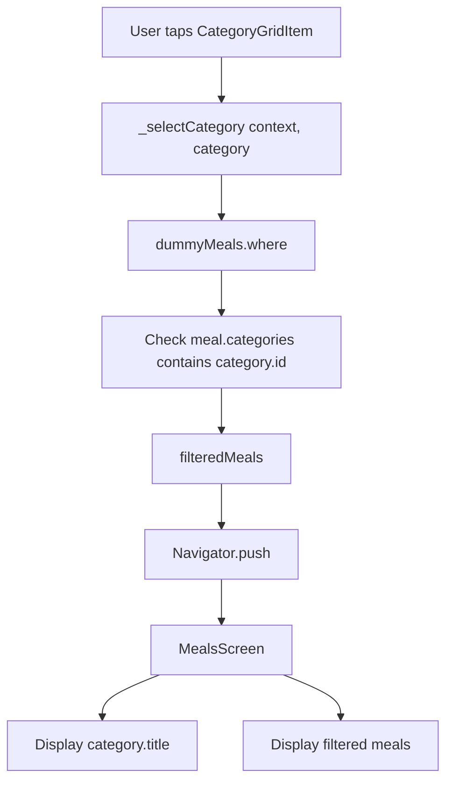
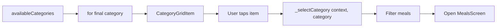

# Passing Data to the Target Screen

## Overview

This lecture explains how to pass data from one screen to another during navigation in Flutter.

In the previous step, tapping a category already opened the `MealsScreen`, but the screen still used hardcoded data. Now, the goal is to pass the selected category data to the target screen and display only the meals that belong to that category.

This is done by:

* receiving the selected `Category`
* filtering `dummyMeals`
* passing the filtered meals list to `MealsScreen`
* passing the selected category title to `MealsScreen`

---

## Main Goal

When the user taps a category, the app should open a meals screen that shows only meals for that category.

```text
User taps category
        ↓
Selected category is passed to _selectCategory()
        ↓
dummyMeals is filtered by category.id
        ↓
Filtered meals are passed to MealsScreen
        ↓
MealsScreen displays category-specific meals
```

---

## Key Concepts

| Concept               | Explanation                                      |
| --------------------- | ------------------------------------------------ |
| Constructor injection | Passing data to a widget through its constructor |
| `where()`             | Filters a list based on a condition              |
| `contains()`          | Checks whether a list contains a certain value   |
| `toList()`            | Converts an `Iterable` into a real `List`        |
| `Navigator.push()`    | Opens a new screen                               |
| `MaterialPageRoute`   | Creates the route for the target screen          |

---

## Markdown Diagram: Data Passing Flow



---

# 1. Update `_selectCategory` to Receive a Category

Previously, `_selectCategory` only received `BuildContext`.

```dart
void _selectCategory(BuildContext context) {
  // navigation logic
}
```

Now it also needs the selected category.

```dart
void _selectCategory(BuildContext context, Category category) {
  // navigation and filtering logic
}
```

Because the method uses the `Category` type, import the category model:

```dart
import '../models/category.dart';
```

---

# 2. Filter Meals by Selected Category

Each `Meal` has a `categories` property.

```dart
final List<String> categories;
```

This list stores category IDs.

For example:

```dart
Meal(
  id: 'm1',
  categories: ['c1', 'c2'],
  title: 'Spaghetti with Tomato Sauce',
)
```

If the selected category has this ID:

```dart
category.id == 'c1'
```

Then this meal should be included because its `categories` list contains `'c1'`.

---

## Filtering Logic

```dart
final filteredMeals = dummyMeals.where((meal) {
  return meal.categories.contains(category.id);
}).toList();
```

This means:

```text
Go through every meal in dummyMeals.

For each meal:
- Check if meal.categories contains the selected category ID.
- If yes, keep the meal.
- If no, remove it from the result.

Finally, convert the result into a List.
```

---

## Why Use `where()`?

The `where()` method creates a filtered version of a list.

```dart
dummyMeals.where((meal) {
  return condition;
})
```

The condition must return either:

| Return Value | Meaning           |
| ------------ | ----------------- |
| `true`       | Keep this meal    |
| `false`      | Exclude this meal |

---

## Why Use `contains()`?

The `contains()` method checks whether a list contains a specific value.

```dart
meal.categories.contains(category.id)
```

This checks whether the selected category ID exists inside the meal's category ID list.

---

## Why Use `toList()`?

The `where()` method returns an `Iterable`, not a normal `List`.

Because `MealsScreen` expects a `List<Meal>`, we convert it:

```dart
.toList()
```

---

# 3. Pass Data to `MealsScreen`

Once the meals are filtered, pass them to `MealsScreen`.

```dart
Navigator.push(
  context,
  MaterialPageRoute(
    builder: (ctx) => MealsScreen(
      title: category.title,
      meals: filteredMeals,
    ),
  ),
);
```

Here, two values are passed:

| Value   | Source           | Purpose                      |
| ------- | ---------------- | ---------------------------- |
| `title` | `category.title` | Sets the AppBar title        |
| `meals` | `filteredMeals`  | Displays only matching meals |

---

# 4. Complete `_selectCategory` Method

```dart
void _selectCategory(BuildContext context, Category category) {
  final filteredMeals = dummyMeals.where((meal) {
    return meal.categories.contains(category.id);
  }).toList();

  Navigator.push(
    context,
    MaterialPageRoute(
      builder: (ctx) => MealsScreen(
        title: category.title,
        meals: filteredMeals,
      ),
    ),
  );
}
```

---

# 5. Pass the Selected Category from the Grid

Inside the `GridView`, each `CategoryGridItem` is created inside a loop.

```dart
for (final category in availableCategories)
```

Because the current `category` is available inside the loop, you can pass it into `_selectCategory`.

```dart
CategoryGridItem(
  category: category,
  onSelectCategory: () {
    _selectCategory(context, category);
  },
)
```

This means each grid item now knows which category it represents.

When the user taps that item, the correct category is sent to the navigation method.

---

## Markdown Diagram: Category Selection



---

# 6. Complete `CategoriesScreen` Code

```dart
import 'package:flutter/material.dart';

import '../data/dummy_data.dart';
import '../models/category.dart';
import '../widgets/category_grid_item.dart';
import 'meals.dart';

class CategoriesScreen extends StatelessWidget {
  const CategoriesScreen({super.key});

  void _selectCategory(BuildContext context, Category category) {
    final filteredMeals = dummyMeals.where((meal) {
      return meal.categories.contains(category.id);
    }).toList();

    Navigator.push(
      context,
      MaterialPageRoute(
        builder: (ctx) => MealsScreen(
          title: category.title,
          meals: filteredMeals,
        ),
      ),
    );
  }

  @override
  Widget build(BuildContext context) {
    return Scaffold(
      appBar: AppBar(
        title: const Text('Pick your category'),
      ),
      body: GridView(
        padding: const EdgeInsets.all(24),
        gridDelegate: const SliverGridDelegateWithFixedCrossAxisCount(
          crossAxisCount: 2,
          childAspectRatio: 3 / 2,
          crossAxisSpacing: 20,
          mainAxisSpacing: 20,
        ),
        children: [
          for (final category in availableCategories)
            CategoryGridItem(
              category: category,
              onSelectCategory: () {
                _selectCategory(context, category);
              },
            ),
        ],
      ),
    );
  }
}
```

---

# 7. Receiving Data in `MealsScreen`

The `MealsScreen` should receive the data through its constructor.

```dart
class MealsScreen extends StatelessWidget {
  const MealsScreen({
    super.key,
    required this.title,
    required this.meals,
  });

  final String title;
  final List<Meal> meals;

  @override
  Widget build(BuildContext context) {
    // build UI
  }
}
```

The screen does not need to access `dummyMeals` directly.

It only receives the meals it should display.

---

# 8. Complete `MealsScreen` Code

```dart
import 'package:flutter/material.dart';

import '../models/meal.dart';

class MealsScreen extends StatelessWidget {
  const MealsScreen({
    super.key,
    required this.title,
    required this.meals,
  });

  final String title;
  final List<Meal> meals;

  @override
  Widget build(BuildContext context) {
    Widget content = ListView.builder(
      itemCount: meals.length,
      itemBuilder: (ctx, index) {
        return Text(meals[index].title);
      },
    );

    if (meals.isEmpty) {
      content = Center(
        child: Column(
          mainAxisSize: MainAxisSize.min,
          children: [
            Text(
              'Uh oh ... nothing here!',
              style: Theme.of(context).textTheme.headlineLarge!.copyWith(
                    color: Theme.of(context).colorScheme.onBackground,
                  ),
            ),
            const SizedBox(height: 16),
            Text(
              'Try selecting a different category!',
              style: Theme.of(context).textTheme.bodyLarge!.copyWith(
                    color: Theme.of(context).colorScheme.onBackground,
                  ),
            ),
          ],
        ),
      );
    }

    return Scaffold(
      appBar: AppBar(
        title: Text(title),
      ),
      body: content,
    );
  }
}
```

---

# 9. Why This Approach Is Good

Passing data through constructor parameters is simple and explicit.

```dart
MealsScreen(
  title: category.title,
  meals: filteredMeals,
)
```

This approach keeps the data flow clear.

The `MealsScreen` does not need to know:

* which category was tapped
* where the data came from
* how the meals were filtered
* how `dummyMeals` is stored

It only receives the final data it needs.

---

## Benefits of Constructor Injection

| Benefit                | Explanation                                                          |
| ---------------------- | -------------------------------------------------------------------- |
| Clear data flow        | You can see exactly what data is passed                              |
| Less global dependency | The target screen does not directly depend on global data            |
| Easier testing         | You can pass any list of meals into the screen                       |
| Reusable screen        | The same screen can display categories, favorites, or search results |
| Better separation      | Filtering logic stays in the source screen                           |

---

# 10. Current Result

After this change:

* tapping `Italian` opens a screen titled `Italian`
* tapping `Quick & Easy` opens a screen titled `Quick & Easy`
* each category shows only matching meals
* different categories display different meal lists
* the back button still works automatically

The meal list is still visually simple, but the data flow is now correct.

---

## Key Takeaways

* Pass data to another screen through constructor parameters.
* Use `where()` to filter a list.
* Use `contains()` to check whether a meal belongs to a category.
* Use `toList()` to convert the filtered result into a list.
* Pass `category.title` to show the selected category name.
* Pass `filteredMeals` to show only the correct meals.
* The target screen should receive only the data it needs.
* Constructor injection avoids unnecessary global dependencies.

---

## Final Summary

In this lecture, we made the navigation dynamic.

Instead of opening `MealsScreen` with hardcoded data, the selected category is now passed into `_selectCategory`. Inside that method, `dummyMeals` is filtered by checking whether each meal's `categories` list contains the selected category ID.

The filtered meals list and category title are then passed to `MealsScreen` through its constructor.

This keeps the data flow explicit, avoids unnecessary global state, and makes the app behave correctly: every category now opens a meals screen with the right title and the right meals.
