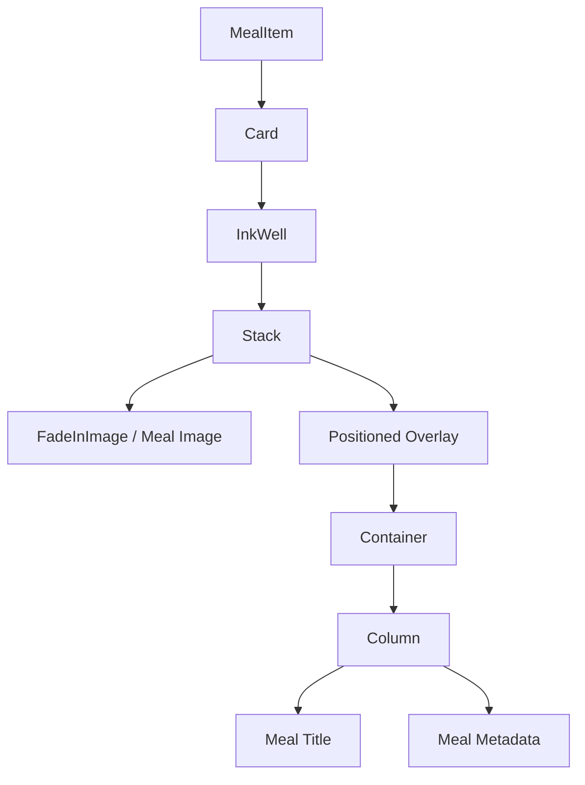
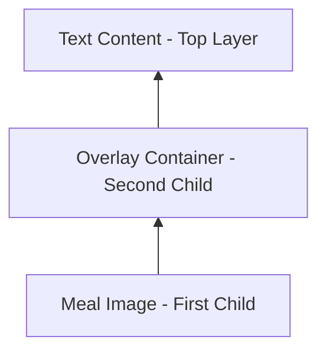
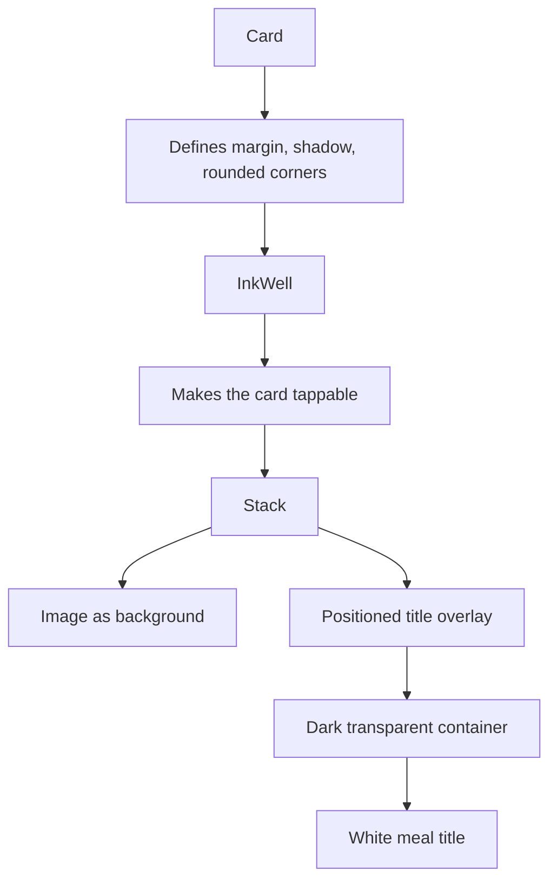

# Introducing the `Stack` Widget

## Overview

This lecture introduces the Flutter `Stack` widget and shows how it can be used to build visually rich meal cards in the Meals App.

In this example, a new reusable widget called `MealItem` is created. Instead of being a full screen, `MealItem` is a regular widget that will be displayed inside the meals list. It uses a `Card`, an `InkWell`, and a `Stack` to show a meal image with a title overlay at the bottom.

The main goal is to create a card-like UI where the meal image appears in the background and the meal title appears on top of it.

---

## Key Concepts

### 1. `MealItem` is a Reusable Widget

`MealItem` is not a screen. It is a normal reusable widget placed inside another screen.

```dart
class MealItem extends StatelessWidget {
  const MealItem({
    super.key,
    required this.meal,
  });

  final Meal meal;

  @override
  Widget build(BuildContext context) {
    return Card(
      child: InkWell(
        onTap: () {},
        child: Stack(
          children: [
            // image and overlay go here
          ],
        ),
      ),
    );
  }
}
```

The widget receives a `meal` object through its constructor.

This keeps the widget flexible because it does not depend on global data. It only renders the meal that is passed into it.

---

## Widget Structure



---

## What is `Stack`?

`Stack` is a Flutter layout widget that places its children on top of each other.

Unlike `Column` and `Row`, which arrange widgets vertically or horizontally, `Stack` overlaps widgets.

### Comparison

| Widget   | Layout Behavior                     |
| -------- | ----------------------------------- |
| `Column` | Places widgets from top to bottom   |
| `Row`    | Places widgets from left to right   |
| `Stack`  | Places widgets on top of each other |

The first child in a `Stack` is placed at the bottom. Later children are placed above earlier children.

```dart
Stack(
  children: [
    BackgroundWidget(), // bottom layer
    ForegroundWidget(), // top layer
  ],
)
```

---

## Stack Layering Order



The order inside `children` matters:

```dart
Stack(
  children: [
    FadeInImage(...),     // bottom layer
    Positioned(...),      // top layer
  ],
)
```

The image is rendered first, so it becomes the background.
The `Positioned` widget is rendered after the image, so it appears on top.

---

## Using `FadeInImage`

Instead of using `Image.network`, the lecture uses `FadeInImage`.

`FadeInImage` smoothly fades in the final image after it loads. This avoids the image suddenly popping into the UI.

To use a transparent placeholder, install the package:

```bash
flutter pub add transparent_image
```

Then import it:

```dart
import 'package:transparent_image/transparent_image.dart';
```

Example:

```dart
FadeInImage(
  placeholder: MemoryImage(kTransparentImage),
  image: NetworkImage(meal.imageUrl),
  fit: BoxFit.cover,
  height: 200,
  width: double.infinity,
)
```

### Important Properties

| Property                 | Meaning                                                        |
| ------------------------ | -------------------------------------------------------------- |
| `placeholder`            | Image shown while the real image is loading                    |
| `image`                  | Final image to display                                         |
| `fit: BoxFit.cover`      | Ensures the image fills the available space without distortion |
| `height: 200`            | Gives the image a fixed height                                 |
| `width: double.infinity` | Makes the image take the full available width                  |

---

## Why Use `BoxFit.cover`?

`BoxFit.cover` makes the image fill the available box while preserving its aspect ratio.

This means the image will not be stretched or distorted. If necessary, Flutter will crop part of the image instead.

```dart
fit: BoxFit.cover
```

This is useful for cards because all meal images should have a consistent size.

---

## Using `Positioned`

`Positioned` is used inside a `Stack` to control exactly where a child widget appears.

In this example, the title overlay is placed at the bottom of the image.

```dart
Positioned(
  bottom: 0,
  left: 0,
  right: 0,
  child: Container(
    color: Colors.black54,
    child: Text(meal.title),
  ),
)
```

### Meaning of the Position Values

| Property    | Meaning                          |
| ----------- | -------------------------------- |
| `bottom: 0` | Attach the overlay to the bottom |
| `left: 0`   | Start at the left edge           |
| `right: 0`  | End at the right edge            |

Because both `left` and `right` are set to `0`, the overlay stretches across the full width of the image.

---

## Overlay Container

The overlay is a `Container` placed on top of the meal image.

It uses a semi-transparent black background:

```dart
color: Colors.black54
```

This improves readability because meal images may have different colors and brightness levels.

Without the dark overlay, white text might be difficult to read on bright images.

---

## Text Styling

The meal title is displayed inside the overlay.

```dart
Text(
  meal.title,
  maxLines: 2,
  textAlign: TextAlign.center,
  softWrap: true,
  overflow: TextOverflow.ellipsis,
  style: const TextStyle(
    fontSize: 20,
    fontWeight: FontWeight.bold,
    color: Colors.white,
  ),
)
```

### Text Properties

| Property                          | Purpose                                      |
| --------------------------------- | -------------------------------------------- |
| `maxLines: 2`                     | Limits the title to two lines                |
| `textAlign: TextAlign.center`     | Centers the title                            |
| `softWrap: true`                  | Allows the text to wrap naturally            |
| `overflow: TextOverflow.ellipsis` | Adds `...` if the text is too long           |
| `fontSize: 20`                    | Makes the title larger                       |
| `fontWeight: FontWeight.bold`     | Makes the title bold                         |
| `color: Colors.white`             | Makes the title readable on the dark overlay |

---

## Final `MealItem` Example

```dart
import 'package:flutter/material.dart';
import 'package:transparent_image/transparent_image.dart';

import '../models/meal.dart';

class MealItem extends StatelessWidget {
  const MealItem({
    super.key,
    required this.meal,
  });

  final Meal meal;

  @override
  Widget build(BuildContext context) {
    return Card(
      margin: const EdgeInsets.all(8),
      shape: RoundedRectangleBorder(
        borderRadius: BorderRadius.circular(8),
      ),
      clipBehavior: Clip.hardEdge,
      elevation: 2,
      child: InkWell(
        onTap: () {},
        child: Stack(
          children: [
            FadeInImage(
              placeholder: MemoryImage(kTransparentImage),
              image: NetworkImage(meal.imageUrl),
              fit: BoxFit.cover,
              height: 200,
              width: double.infinity,
            ),
            Positioned(
              bottom: 0,
              left: 0,
              right: 0,
              child: Container(
                color: Colors.black54,
                padding: const EdgeInsets.symmetric(
                  vertical: 6,
                  horizontal: 44,
                ),
                child: Column(
                  children: [
                    Text(
                      meal.title,
                      maxLines: 2,
                      textAlign: TextAlign.center,
                      softWrap: true,
                      overflow: TextOverflow.ellipsis,
                      style: const TextStyle(
                        fontSize: 20,
                        fontWeight: FontWeight.bold,
                        color: Colors.white,
                      ),
                    ),
                    const SizedBox(height: 12),
                    // Meal metadata will be added here later
                  ],
                ),
              ),
            ),
          ],
        ),
      ),
    );
  }
}
```

---

## Using `MealItem` in `MealsScreen`

Inside the meals screen, replace the temporary text output with the new `MealItem` widget.

```dart
ListView.builder(
  itemCount: meals.length,
  itemBuilder: (ctx, index) {
    return MealItem(
      meal: meals[index],
    );
  },
)
```

This renders one `MealItem` for each meal in the list.

---

## Card Styling

The lecture also improves the visual appearance of the card.

```dart
Card(
  margin: const EdgeInsets.all(8),
  shape: RoundedRectangleBorder(
    borderRadius: BorderRadius.circular(8),
  ),
  clipBehavior: Clip.hardEdge,
  elevation: 2,
  child: ...
)
```

### Important Card Properties

| Property                      | Purpose                                        |
| ----------------------------- | ---------------------------------------------- |
| `margin`                      | Adds space around each meal card               |
| `shape`                       | Gives the card rounded corners                 |
| `borderRadius`                | Controls how round the corners are             |
| `clipBehavior: Clip.hardEdge` | Clips child content to match the rounded shape |
| `elevation`                   | Adds a shadow / 3D effect                      |

---

## Why `clipBehavior` is Needed

Setting a rounded shape on the `Card` is not enough.

The image inside the card may still ignore the rounded border and extend beyond it.

To fix this, use:

```dart
clipBehavior: Clip.hardEdge
```

This cuts off any child content that goes outside the card’s rounded boundary.

---

## Mental Model



---

## Common Pattern

A very common Flutter UI pattern is:

```dart
Card(
  child: Stack(
    children: [
      Image(...),
      Positioned(
        bottom: 0,
        child: Container(
          color: Colors.black54,
          child: Text(...),
        ),
      ),
    ],
  ),
)
```

This pattern is useful for:

* Meal cards
* Product cards
* Travel destination cards
* Profile headers
* Image galleries
* News article previews

---

## Summary

The `Stack` widget allows multiple widgets to be layered on top of each other.

In the Meals App, it is used to place a meal title overlay on top of a meal image. The image is displayed with `FadeInImage`, while the title is placed using `Positioned`.

The final result is a polished card UI with:

* A smooth loading image
* A tappable card using `InkWell`
* A dark overlay for readability
* A title positioned at the bottom
* Rounded corners and shadow using `Card`

This is a common and powerful Flutter pattern for building image-based cards.
