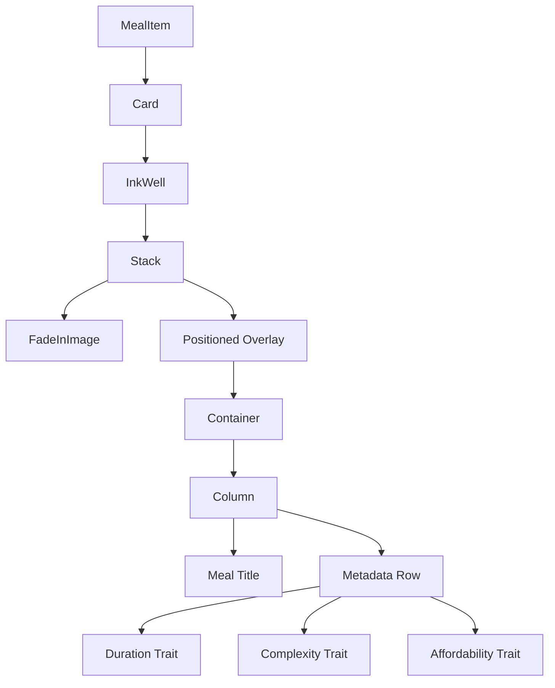
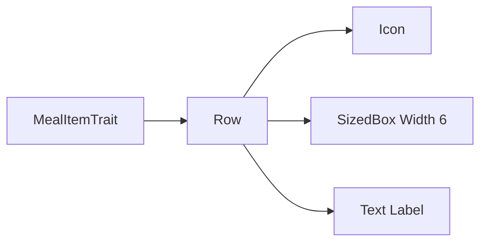
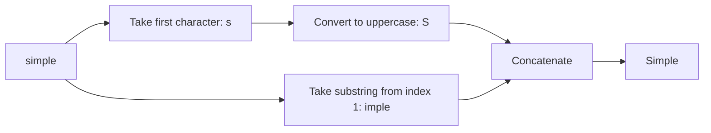
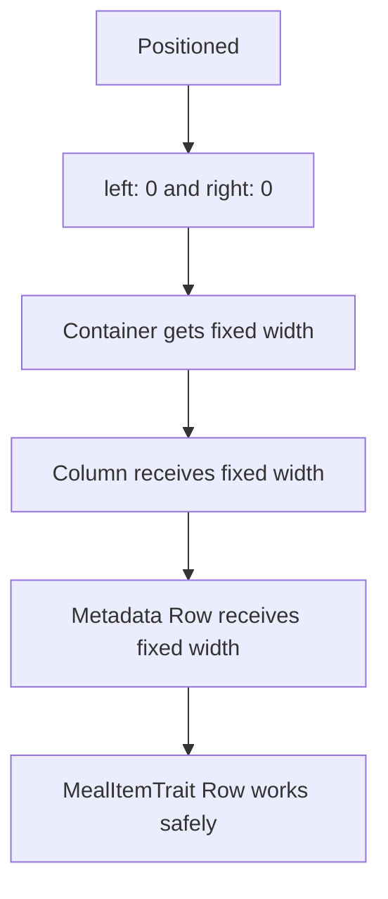
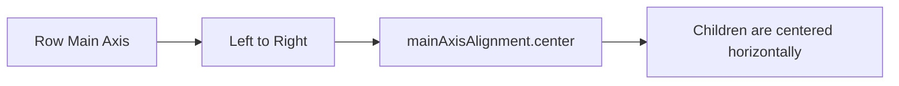
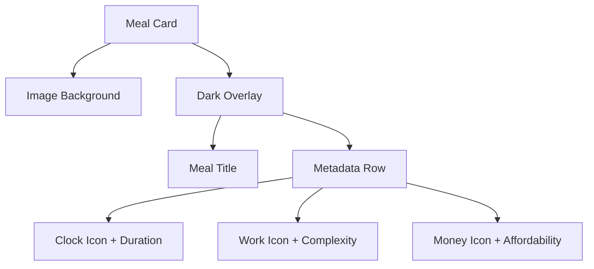

# Improving the `MealItem` Widget

## Overview

This lecture improves the `MealItem` widget by adding meal metadata below the meal title.

Previously, the meal card displayed only the meal image and the title overlay. Now, the widget will also show three pieces of information:

* Duration
* Complexity
* Affordability

Each metadata item will be displayed as an icon with a text label beside it.

---

## Goal

The goal is to turn the meal card from this:

```text
Meal Image
Meal Title
```

Into this:

```text
Meal Image
Meal Title
Duration | Complexity | Affordability
```

This makes each meal easier to understand at a glance.

---

## Final UI Structure



---

## Why Create a Separate `MealItemTrait` Widget?

Each metadata item follows the same pattern:

```text
Icon + Text
```

For example:

```text
clock icon + "20 min"
work icon + "Simple"
money icon + "Affordable"
```

Instead of repeating the same `Row`, `Icon`, `SizedBox`, and `Text` code three times, we create a reusable widget called `MealItemTrait`.

This keeps the `MealItem` widget cleaner and easier to maintain.

---

# Creating `MealItemTrait`

Create a new file:

```text
widgets/meal_item_trait.dart
```

Then add the following widget:

```dart
import 'package:flutter/material.dart';

class MealItemTrait extends StatelessWidget {
  const MealItemTrait({
    super.key,
    required this.icon,
    required this.label,
  });

  final IconData icon;
  final String label;

  @override
  Widget build(BuildContext context) {
    return Row(
      children: [
        Icon(
          icon,
          size: 17,
          color: Colors.white,
        ),
        const SizedBox(width: 6),
        Text(
          label,
          style: const TextStyle(
            color: Colors.white,
          ),
        ),
      ],
    );
  }
}
```

---

## `MealItemTrait` Explanation

```dart
final IconData icon;
final String label;
```

The widget receives two values:

| Property | Type       | Purpose                  |
| -------- | ---------- | ------------------------ |
| `icon`   | `IconData` | The icon to display      |
| `label`  | `String`   | The text beside the icon |

Example usage:

```dart
MealItemTrait(
  icon: Icons.schedule,
  label: '20 min',
)
```

---

## Trait Widget Structure



The `Row` places the icon and text horizontally.

```dart
Row(
  children: [
    Icon(...),
    SizedBox(width: 6),
    Text(...),
  ],
)
```

The `SizedBox` creates spacing between the icon and the label.

---

# Adding Metadata to `MealItem`

Inside `MealItem`, import the new widget:

```dart
import '../widgets/meal_item_trait.dart';
```

Then add the metadata row below the meal title.

```dart
Row(
  mainAxisAlignment: MainAxisAlignment.center,
  children: [
    MealItemTrait(
      icon: Icons.schedule,
      label: '${meal.duration} min',
    ),
    const SizedBox(width: 12),
    MealItemTrait(
      icon: Icons.work,
      label: complexityText,
    ),
    const SizedBox(width: 12),
    MealItemTrait(
      icon: Icons.attach_money,
      label: affordabilityText,
    ),
  ],
)
```

---

## Metadata Items

| Data          | Icon                 | Label Example |
| ------------- | -------------------- | ------------- |
| Duration      | `Icons.schedule`     | `20 min`      |
| Complexity    | `Icons.work`         | `Simple`      |
| Affordability | `Icons.attach_money` | `Affordable`  |

---

## Formatting Duration

The meal duration is an integer.

For example:

```dart
meal.duration
```

This might return:

```dart
20
```

But the UI should display:

```text
20 min
```

So we use string interpolation:

```dart
'${meal.duration} min'
```

This converts the integer into a readable label.

---

# Formatting Enum Values

The meal model stores `complexity` and `affordability` as enum values.

For example:

```dart
Complexity.simple
Affordability.affordable
```

Using `.name` gives the enum value as a string:

```dart
meal.complexity.name
```

This returns:

```text
simple
```

But for the UI, we want:

```text
Simple
```

So we create getters inside `MealItem`.

---

## Complexity Getter

```dart
String get complexityText {
  return meal.complexity.name[0].toUpperCase() +
      meal.complexity.name.substring(1);
}
```

This converts:

```text
simple
```

Into:

```text
Simple
```

---

## Affordability Getter

```dart
String get affordabilityText {
  return meal.affordability.name[0].toUpperCase() +
      meal.affordability.name.substring(1);
}
```

This converts:

```text
affordable
```

Into:

```text
Affordable
```

---

## How the Getter Works

```dart
meal.complexity.name[0].toUpperCase()
```

This gets the first character and converts it to uppercase.

Example:

```text
s → S
```

Then:

```dart
meal.complexity.name.substring(1)
```

This gets the rest of the string after the first character.

Example:

```text
imple
```

Then both parts are joined together:

```text
S + imple = Simple
```

---

## String Formatting Diagram



---

# Final Improved `MealItem`

```dart
import 'package:flutter/material.dart';
import 'package:transparent_image/transparent_image.dart';

import '../models/meal.dart';
import '../widgets/meal_item_trait.dart';

class MealItem extends StatelessWidget {
  const MealItem({
    super.key,
    required this.meal,
  });

  final Meal meal;

  String get complexityText {
    return meal.complexity.name[0].toUpperCase() +
        meal.complexity.name.substring(1);
  }

  String get affordabilityText {
    return meal.affordability.name[0].toUpperCase() +
        meal.affordability.name.substring(1);
  }

  @override
  Widget build(BuildContext context) {
    return Card(
      margin: const EdgeInsets.all(8),
      shape: RoundedRectangleBorder(
        borderRadius: BorderRadius.circular(8),
      ),
      clipBehavior: Clip.hardEdge,
      elevation: 2,
      child: InkWell(
        onTap: () {},
        child: Stack(
          children: [
            FadeInImage(
              placeholder: MemoryImage(kTransparentImage),
              image: NetworkImage(meal.imageUrl),
              fit: BoxFit.cover,
              height: 200,
              width: double.infinity,
            ),
            Positioned(
              bottom: 0,
              left: 0,
              right: 0,
              child: Container(
                color: Colors.black54,
                padding: const EdgeInsets.symmetric(
                  vertical: 6,
                  horizontal: 44,
                ),
                child: Column(
                  children: [
                    Text(
                      meal.title,
                      maxLines: 2,
                      textAlign: TextAlign.center,
                      softWrap: true,
                      overflow: TextOverflow.ellipsis,
                      style: const TextStyle(
                        fontSize: 20,
                        fontWeight: FontWeight.bold,
                        color: Colors.white,
                      ),
                    ),
                    const SizedBox(height: 12),
                    Row(
                      mainAxisAlignment: MainAxisAlignment.center,
                      children: [
                        MealItemTrait(
                          icon: Icons.schedule,
                          label: '${meal.duration} min',
                        ),
                        const SizedBox(width: 12),
                        MealItemTrait(
                          icon: Icons.work,
                          label: complexityText,
                        ),
                        const SizedBox(width: 12),
                        MealItemTrait(
                          icon: Icons.attach_money,
                          label: affordabilityText,
                        ),
                      ],
                    ),
                  ],
                ),
              ),
            ),
          ],
        ),
      ),
    );
  }
}
```

---

# Why the Nested `Row` Works Here

`MealItemTrait` itself returns a `Row`.

Then we use multiple `MealItemTrait` widgets inside another `Row`.

Normally, putting a `Row` inside another `Row` can sometimes cause layout issues if the width is unconstrained.

However, in this case it works because the parent layout has a fixed horizontal constraint.

The `Positioned` widget uses:

```dart
left: 0,
right: 0,
```

This forces the overlay container to stretch from the left edge to the right edge of the `Stack`.

So the layout has a known maximum width.



---

# Centering the Metadata Row

At first, the metadata row may not look centered.

To fix this, add:

```dart
mainAxisAlignment: MainAxisAlignment.center
```

Inside the metadata `Row`.

```dart
Row(
  mainAxisAlignment: MainAxisAlignment.center,
  children: [
    // metadata items
  ],
)
```

Because the main axis of a `Row` is horizontal, this centers the metadata items from left to right.

---

## `mainAxisAlignment` in a Row



---

# Important Flutter Widgets Used

| Widget       | Purpose                                                    |
| ------------ | ---------------------------------------------------------- |
| `Card`       | Gives the meal item elevation, margin, and rounded corners |
| `InkWell`    | Makes the meal item tappable                               |
| `Stack`      | Places the image and overlay on top of each other          |
| `Positioned` | Places the overlay at the bottom of the image              |
| `Container`  | Creates the dark transparent overlay                       |
| `Column`     | Places the title above the metadata row                    |
| `Row`        | Places metadata items horizontally                         |
| `Icon`       | Displays metadata icons                                    |
| `Text`       | Displays metadata labels                                   |
| `SizedBox`   | Adds spacing between elements                              |

---

# Full UI Mental Model



---

# Summary

The `MealItem` widget is improved by adding a metadata row below the meal title.

The metadata row displays:

* Meal duration
* Meal complexity
* Meal affordability

A new reusable `MealItemTrait` widget is created to avoid repeating the same icon-and-text layout multiple times.

The enum values for `complexity` and `affordability` are formatted with getters so that values like `simple` and `affordable` become `Simple` and `Affordable`.

The final result is a cleaner, more informative meal card that gives users useful meal details at a glance.
