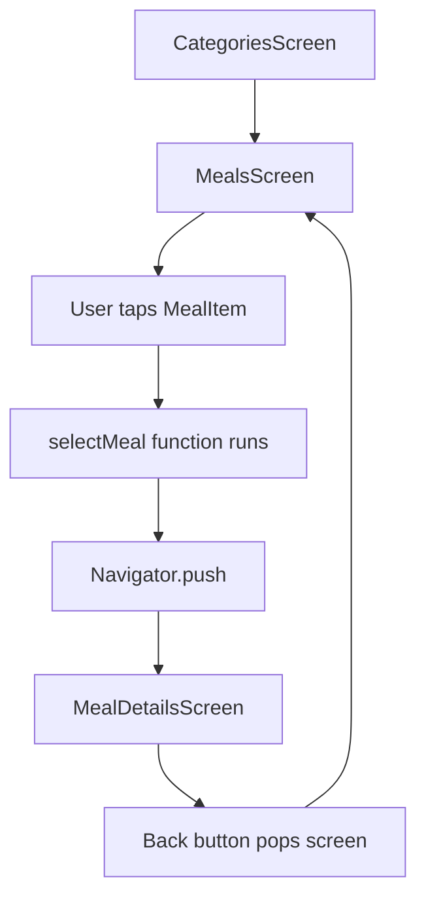
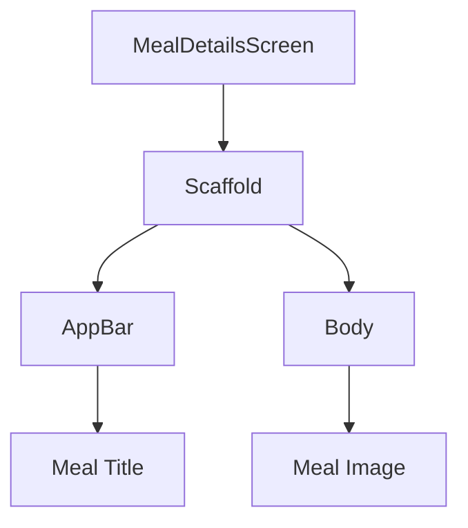
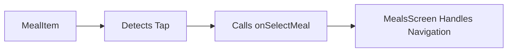
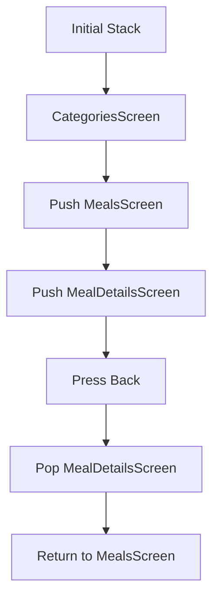
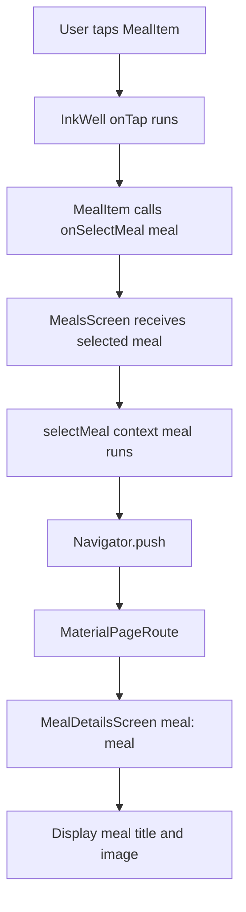
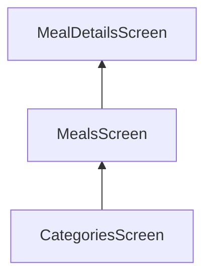
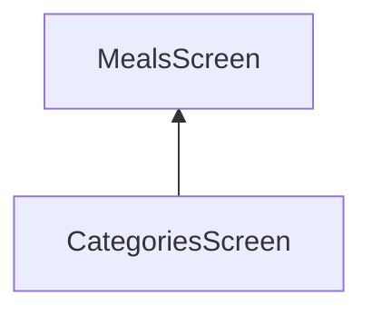

# Adding Navigation to the `MealDetailsScreen`

## Overview

This lecture adds navigation from a meal card to a new `MealDetailsScreen`.

Previously, the app could display a list of meals inside `MealsScreen`. Each meal was rendered with the custom `MealItem` widget. Now, users should be able to tap a meal card and navigate to a detail screen for that specific meal.

The selected `Meal` object will be passed to the detail screen through the screen constructor.

---

## Goal

When the user taps a meal item:

```text
MealsScreen → Tap MealItem → MealDetailsScreen
```

The app should open a new screen that shows:

* The selected meal title in the app bar
* The selected meal image in the body

---

## Navigation Flow



---

# Step 1: Create the `MealDetailsScreen`

Create a new file:

```text
lib/screens/meal_details.dart
```

This screen receives a `Meal` object and displays information about that meal.

```dart
import 'package:flutter/material.dart';

import '../models/meal.dart';

class MealDetailsScreen extends StatelessWidget {
  const MealDetailsScreen({
    super.key,
    required this.meal,
  });

  final Meal meal;

  @override
  Widget build(BuildContext context) {
    return Scaffold(
      appBar: AppBar(
        title: Text(meal.title),
      ),
      body: Image.network(
        meal.imageUrl,
        width: double.infinity,
        height: 300,
        fit: BoxFit.cover,
      ),
    );
  }
}
```

---

## `MealDetailsScreen` Explanation

```dart
final Meal meal;
```

The screen stores the selected meal.

```dart
required this.meal
```

This makes the `meal` parameter required when creating the screen.

That means every time we navigate to `MealDetailsScreen`, we must pass a meal object.

---

## Detail Screen Structure



---

# Step 2: Display the Meal Title in the App Bar

Inside the `AppBar`, use the selected meal title:

```dart
appBar: AppBar(
  title: Text(meal.title),
),
```

So if the selected meal is:

```text
Spaghetti with Tomato Sauce
```

The app bar will show:

```text
Spaghetti with Tomato Sauce
```

---

# Step 3: Display the Meal Image

The meal image is loaded from the internet, so we use:

```dart
Image.network(meal.imageUrl)
```

Full image code:

```dart
Image.network(
  meal.imageUrl,
  width: double.infinity,
  height: 300,
  fit: BoxFit.cover,
)
```

## Image Properties

| Property                 | Purpose                                 |
| ------------------------ | --------------------------------------- |
| `meal.imageUrl`          | Loads the selected meal image           |
| `width: double.infinity` | Uses the full available width           |
| `height: 300`            | Gives the image a fixed height          |
| `fit: BoxFit.cover`      | Prevents distortion and crops if needed |

---

# Step 4: Add a Selection Callback to `MealItem`

The `MealItem` already uses `InkWell`, which can detect taps.

However, instead of handling navigation directly inside `MealItem`, we pass a callback function from `MealsScreen`.

This keeps navigation logic at the screen level.

---

## Update `MealItem`

Add a new property:

```dart
final void Function(Meal meal) onSelectMeal;
```

Then require it in the constructor:

```dart
const MealItem({
  super.key,
  required this.meal,
  required this.onSelectMeal,
});
```

Now connect it to `InkWell`:

```dart
InkWell(
  onTap: () {
    onSelectMeal(meal);
  },
  child: Stack(
    children: [
      // image and overlay
    ],
  ),
)
```

---

## Updated `MealItem` Constructor

```dart
class MealItem extends StatelessWidget {
  const MealItem({
    super.key,
    required this.meal,
    required this.onSelectMeal,
  });

  final Meal meal;
  final void Function(Meal meal) onSelectMeal;

  @override
  Widget build(BuildContext context) {
    return Card(
      child: InkWell(
        onTap: () {
          onSelectMeal(meal);
        },
        child: Stack(
          children: [
            // Meal image and overlay
          ],
        ),
      ),
    );
  }
}
```

---

## Why Use a Callback?

`MealItem` should focus on displaying one meal item.

`MealsScreen` should control what happens when a meal is selected.

This separation keeps the code cleaner.



---

# Step 5: Add the Navigation Function in `MealsScreen`

In `MealsScreen`, create a function that receives the selected meal.

```dart
void selectMeal(BuildContext context, Meal meal) {
  Navigator.of(context).push(
    MaterialPageRoute(
      builder: (ctx) => MealDetailsScreen(
        meal: meal,
      ),
    ),
  );
}
```

This function pushes a new screen onto the navigation stack.

---

## `Navigator.push` Explanation

```dart
Navigator.of(context).push(...)
```

This tells Flutter to open a new screen.

```dart
MaterialPageRoute(
  builder: (ctx) => MealDetailsScreen(meal: meal),
)
```

This creates the new page route and returns the screen that should be displayed.

---

## Navigation Stack Diagram



---

# Step 6: Pass the Callback to `MealItem`

Inside the `ListView.builder`, pass the `onSelectMeal` function to every `MealItem`.

```dart
ListView.builder(
  itemCount: meals.length,
  itemBuilder: (ctx, index) {
    return MealItem(
      meal: meals[index],
      onSelectMeal: (meal) {
        selectMeal(context, meal);
      },
    );
  },
)
```

The `MealItem` receives the meal.
When tapped, it calls `onSelectMeal(meal)`.
Then `MealsScreen` navigates to the detail screen.

---

## Why Use an Anonymous Function Here?

The `selectMeal` function needs two values:

```dart
BuildContext context
Meal meal
```

But `MealItem` only provides the selected meal.

So we wrap the call inside an anonymous function:

```dart
onSelectMeal: (meal) {
  selectMeal(context, meal);
},
```

This allows us to pass both:

* The `context` from `MealsScreen`
* The `meal` from `MealItem`

---

# Final `MealsScreen` Example

```dart
import 'package:flutter/material.dart';

import '../models/meal.dart';
import '../widgets/meal_item.dart';
import './meal_details.dart';

class MealsScreen extends StatelessWidget {
  const MealsScreen({
    super.key,
    required this.title,
    required this.meals,
  });

  final String title;
  final List<Meal> meals;

  void selectMeal(BuildContext context, Meal meal) {
    Navigator.of(context).push(
      MaterialPageRoute(
        builder: (ctx) => MealDetailsScreen(
          meal: meal,
        ),
      ),
    );
  }

  @override
  Widget build(BuildContext context) {
    Widget content = ListView.builder(
      itemCount: meals.length,
      itemBuilder: (ctx, index) {
        return MealItem(
          meal: meals[index],
          onSelectMeal: (meal) {
            selectMeal(context, meal);
          },
        );
      },
    );

    if (meals.isEmpty) {
      content = Center(
        child: Column(
          mainAxisSize: MainAxisSize.min,
          children: [
            Text(
              'Uh oh ... nothing here!',
              style: Theme.of(context).textTheme.headlineLarge!.copyWith(
                    color: Theme.of(context).colorScheme.onBackground,
                  ),
            ),
            const SizedBox(height: 16),
            Text(
              'Try selecting a different category!',
              style: Theme.of(context).textTheme.bodyLarge!.copyWith(
                    color: Theme.of(context).colorScheme.onBackground,
                  ),
            ),
          ],
        ),
      );
    }

    return Scaffold(
      appBar: AppBar(
        title: Text(title),
      ),
      body: content,
    );
  }
}
```

---

# Final `MealDetailsScreen` Example

```dart
import 'package:flutter/material.dart';

import '../models/meal.dart';

class MealDetailsScreen extends StatelessWidget {
  const MealDetailsScreen({
    super.key,
    required this.meal,
  });

  final Meal meal;

  @override
  Widget build(BuildContext context) {
    return Scaffold(
      appBar: AppBar(
        title: Text(meal.title),
      ),
      body: Image.network(
        meal.imageUrl,
        width: double.infinity,
        height: 300,
        fit: BoxFit.cover,
      ),
    );
  }
}
```

---

# Final `MealItem` Tap Logic

```dart
class MealItem extends StatelessWidget {
  const MealItem({
    super.key,
    required this.meal,
    required this.onSelectMeal,
  });

  final Meal meal;
  final void Function(Meal meal) onSelectMeal;

  @override
  Widget build(BuildContext context) {
    return Card(
      margin: const EdgeInsets.all(8),
      clipBehavior: Clip.hardEdge,
      elevation: 2,
      child: InkWell(
        onTap: () {
          onSelectMeal(meal);
        },
        child: Stack(
          children: [
            // image, title, and metadata
          ],
        ),
      ),
    );
  }
}
```

---

# Full Data Flow



---

# Push and Pop Navigation

Flutter navigation works like a stack.

When we use:

```dart
Navigator.of(context).push(...)
```

Flutter adds a new screen on top of the current screen.

When the user presses the back button, Flutter removes the top screen and returns to the previous one.



The top screen is the currently visible screen.

After pressing back:



`MealDetailsScreen` is popped from the stack.

---

# Manual Back Navigation

Usually, Flutter automatically adds a back button when using `Navigator.push`.

But you can also go back manually with:

```dart
Navigator.of(context).pop();
```

Or:

```dart
Navigator.pop(context);
```

This removes the current screen from the navigation stack.

---

# Important Flutter Concepts

| Concept              | Meaning                                        |
| -------------------- | ---------------------------------------------- |
| `InkWell`            | Detects taps and gives ripple feedback         |
| `onTap`              | Function that runs when the widget is tapped   |
| Callback             | A function passed into another widget          |
| `Navigator.push`     | Opens a new screen                             |
| `MaterialPageRoute`  | Creates a route with Material-style transition |
| Constructor argument | Passes data into a widget                      |
| `Navigator.pop`      | Goes back to the previous screen               |

---

# Why Navigation Should Stay in `MealsScreen`

It is better to keep navigation in `MealsScreen` instead of directly inside `MealItem`.

## Good Separation

```text
MealItem = UI + tap detection
MealsScreen = navigation logic
MealDetailsScreen = detail display
```

This makes the app easier to maintain.

If navigation changes later, you only need to update the screen logic, not the reusable item widget.

---

# Summary

This lecture adds navigation from `MealItem` to `MealDetailsScreen`.

The process includes:

* Creating a new `MealDetailsScreen`
* Passing the selected `Meal` object to it
* Adding an `onSelectMeal` callback to `MealItem`
* Handling navigation inside `MealsScreen`
* Using `Navigator.push` with `MaterialPageRoute`

Now, when users tap a meal card, they are taken to a detail screen that displays the selected meal title and image.

This follows the same navigation pattern used earlier when moving from categories to the list of meals.
