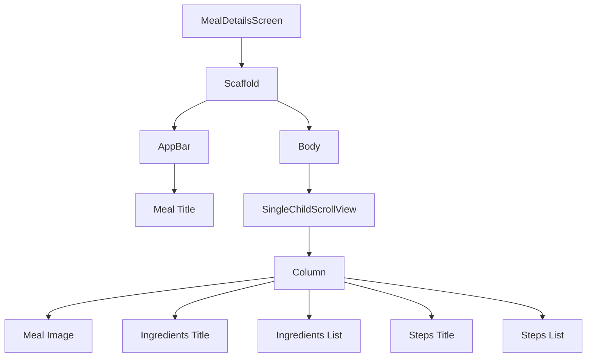
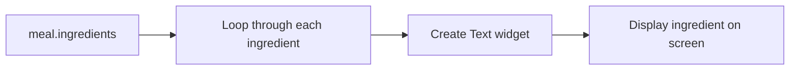
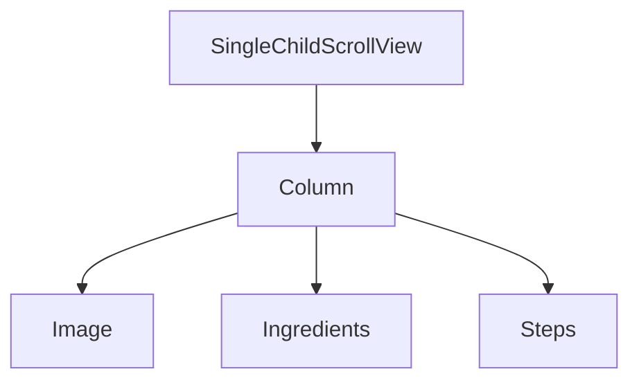
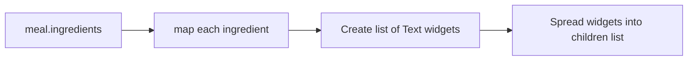
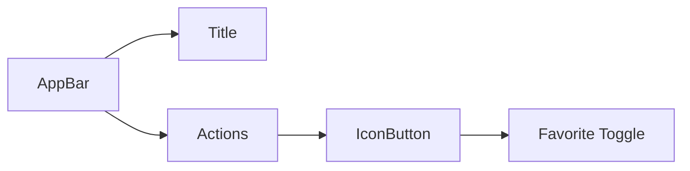
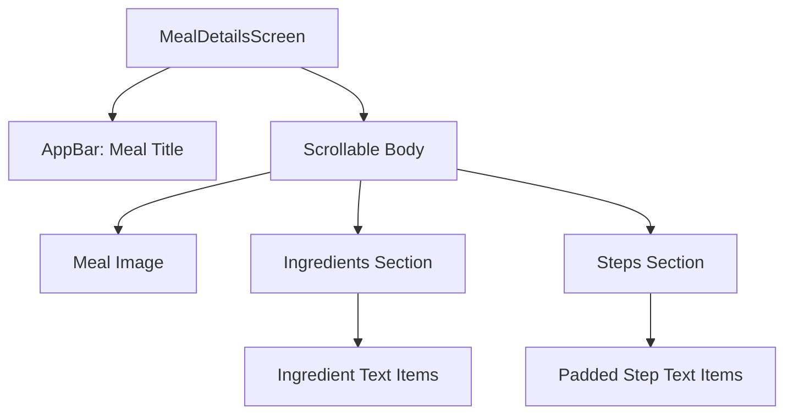

# Improving the `MealDetailsScreen`

## Overview

This lecture improves the `MealDetailsScreen` by building a complete detail page for each selected meal.

Previously, the detail screen only displayed:

* The meal title in the app bar
* The meal image in the body

Now, the screen will display:

* The meal image
* A list of ingredients
* A list of cooking steps

The screen will also become scrollable so that long ingredient lists and step-by-step instructions can fit properly on smaller screens.

---

## Goal

The goal is to turn the basic detail screen from this:

```text
AppBar: Meal Title

Meal Image
```

Into this:

```text
AppBar: Meal Title

Meal Image

Ingredients
- Ingredient 1
- Ingredient 2
- Ingredient 3

Steps
1. Step one
2. Step two
3. Step three
```

---

## Final Screen Structure



---

# Step 1: Use a `Column` for Multiple Widgets

The detail screen now needs more than one widget in the body.

Instead of showing only the image, wrap the content in a `Column`.

```dart
body: Column(
  children: [
    Image.network(
      meal.imageUrl,
      width: double.infinity,
      height: 300,
      fit: BoxFit.cover,
    ),
    // More content will be added here
  ],
),
```

A `Column` allows us to place widgets vertically from top to bottom.

---

# Step 2: Display the Meal Image

The image remains at the top of the screen.

```dart
Image.network(
  meal.imageUrl,
  width: double.infinity,
  height: 300,
  fit: BoxFit.cover,
)
```

## Image Properties

| Property                 | Purpose                                         |
| ------------------------ | ----------------------------------------------- |
| `meal.imageUrl`          | Loads the selected meal image from the internet |
| `width: double.infinity` | Makes the image take the full screen width      |
| `height: 300`            | Gives the image a fixed height                  |
| `fit: BoxFit.cover`      | Prevents distortion and crops if necessary      |

---

# Step 3: Add Spacing Below the Image

After the image, add vertical space before the next section.

```dart
const SizedBox(height: 14),
```

This makes the layout feel less crowded.

---

# Step 4: Add the Ingredients Section Title

Next, add a section title for the ingredients.

```dart
Text(
  'Ingredients',
  style: Theme.of(context).textTheme.titleLarge!.copyWith(
        color: Theme.of(context).colorScheme.primary,
        fontWeight: FontWeight.bold,
      ),
),
```

## Why Use `Theme.of(context)`?

Using the app theme keeps the design consistent.

Instead of hardcoding every font size and color, we reuse the existing theme and only override what we need.

```dart
Theme.of(context).textTheme.titleLarge
```

This gets the large title text style from the current theme.

Then:

```dart
.copyWith(...)
```

creates a modified copy of that style.

---

## Section Title Styling

| Style Setting         | Purpose                            |
| --------------------- | ---------------------------------- |
| `titleLarge`          | Uses the theme's large title style |
| `colorScheme.primary` | Highlights the section title       |
| `FontWeight.bold`     | Makes the title stand out          |

---

# Step 5: Render the Ingredients List

The meal ingredients are stored as a list of strings.

Example:

```dart
meal.ingredients
```

This means we can loop through the list and create one `Text` widget for each ingredient.

```dart
for (final ingredient in meal.ingredients)
  Text(
    ingredient,
    style: Theme.of(context).textTheme.bodyMedium!.copyWith(
          color: Theme.of(context).colorScheme.onBackground,
        ),
  ),
```

---

## List Rendering Flow



---

# Step 6: Add the Steps Section

After the ingredients, add spacing and then create another section title.

```dart
const SizedBox(height: 24),
Text(
  'Steps',
  style: Theme.of(context).textTheme.titleLarge!.copyWith(
        color: Theme.of(context).colorScheme.primary,
        fontWeight: FontWeight.bold,
      ),
),
```

The steps section follows the same structure as the ingredients section.

---

# Step 7: Render the Cooking Steps

The meal steps are also stored as a list of strings.

```dart
meal.steps
```

Each step is displayed as a `Text` widget.

However, cooking steps are usually longer than ingredients, so they need better spacing and alignment.

```dart
for (final step in meal.steps)
  Padding(
    padding: const EdgeInsets.symmetric(
      horizontal: 12,
      vertical: 8,
    ),
    child: Text(
      step,
      textAlign: TextAlign.center,
      style: Theme.of(context).textTheme.bodyMedium!.copyWith(
            color: Theme.of(context).colorScheme.onBackground,
          ),
    ),
  ),
```

---

## Why Add Padding to Each Step?

Cooking steps can be long, so padding improves readability.

```dart
padding: const EdgeInsets.symmetric(
  horizontal: 12,
  vertical: 8,
),
```

| Padding          | Purpose                           |
| ---------------- | --------------------------------- |
| `horizontal: 12` | Keeps text away from screen edges |
| `vertical: 8`    | Adds spacing between steps        |

---

## Why Use `textAlign: TextAlign.center`?

```dart
textAlign: TextAlign.center
```

This centers the step text horizontally.

For this screen, centered text makes the instructions look cleaner and more balanced.

---

# Step 8: Make the Screen Scrollable

Once ingredients and steps are added, the content may become taller than the screen.

This can cause an overflow warning.

To fix this, wrap the `Column` with `SingleChildScrollView`.

```dart
body: SingleChildScrollView(
  child: Column(
    children: [
      // image
      // ingredients
      // steps
    ],
  ),
),
```

---

## Why Use `SingleChildScrollView`?

`SingleChildScrollView` makes one child scrollable.

In this case, the child is a `Column`.



This allows the user to scroll through the full meal details.

---

## Why Not Use `ListView`?

A `ListView` could also make the content scrollable.

However, in this case, `SingleChildScrollView` with `Column` is a good fit because:

* The content is a structured detail page
* The content is not a very long dynamic list
* The layout remains centered like a normal `Column`

---

# Final `MealDetailsScreen`

```dart
import 'package:flutter/material.dart';

import '../models/meal.dart';

class MealDetailsScreen extends StatelessWidget {
  const MealDetailsScreen({
    super.key,
    required this.meal,
  });

  final Meal meal;

  @override
  Widget build(BuildContext context) {
    return Scaffold(
      appBar: AppBar(
        title: Text(meal.title),
      ),
      body: SingleChildScrollView(
        child: Column(
          children: [
            Image.network(
              meal.imageUrl,
              width: double.infinity,
              height: 300,
              fit: BoxFit.cover,
            ),
            const SizedBox(height: 14),
            Text(
              'Ingredients',
              style: Theme.of(context).textTheme.titleLarge!.copyWith(
                    color: Theme.of(context).colorScheme.primary,
                    fontWeight: FontWeight.bold,
                  ),
            ),
            const SizedBox(height: 14),
            for (final ingredient in meal.ingredients)
              Text(
                ingredient,
                style: Theme.of(context).textTheme.bodyMedium!.copyWith(
                      color: Theme.of(context).colorScheme.onBackground,
                    ),
              ),
            const SizedBox(height: 24),
            Text(
              'Steps',
              style: Theme.of(context).textTheme.titleLarge!.copyWith(
                    color: Theme.of(context).colorScheme.primary,
                    fontWeight: FontWeight.bold,
                  ),
            ),
            const SizedBox(height: 14),
            for (final step in meal.steps)
              Padding(
                padding: const EdgeInsets.symmetric(
                  horizontal: 12,
                  vertical: 8,
                ),
                child: Text(
                  step,
                  textAlign: TextAlign.center,
                  style: Theme.of(context).textTheme.bodyMedium!.copyWith(
                        color: Theme.of(context).colorScheme.onBackground,
                      ),
                ),
              ),
          ],
        ),
      ),
    );
  }
}
```

---

# Alternative: Using `.map()` and the Spread Operator

Instead of using a `for` loop inside the `children` list, you can also use `.map()` with the spread operator.

```dart
...meal.ingredients.map(
  (ingredient) => Text(
    ingredient,
    style: Theme.of(context).textTheme.bodyMedium!.copyWith(
          color: Theme.of(context).colorScheme.onBackground,
        ),
  ),
),
```

The spread operator:

```dart
...
```

inserts all widgets from the generated list directly into the `children` list.

---

## Spread Operator Flow



Both approaches are valid:

```dart
for (final ingredient in meal.ingredients)
```

and:

```dart
...meal.ingredients.map(...)
```

The `for` loop syntax is often easier to read for beginners.

---

# Adding a Favorite Button Later

The lecture also mentions that the detail screen will later support marking meals as favorites.

That button will typically be placed in the `AppBar` actions list.

```dart
appBar: AppBar(
  title: Text(meal.title),
  actions: [
    IconButton(
      icon: const Icon(Icons.star),
      onPressed: () {
        // Toggle favorite later
      },
    ),
  ],
),
```

---

## AppBar Actions



The `actions` property is used for buttons that belong to the current screen.

Examples:

* Favorite button
* Share button
* Edit button
* Delete button

---

# Important Flutter Widgets Used

| Widget                  | Purpose                                         |
| ----------------------- | ----------------------------------------------- |
| `Scaffold`              | Provides the screen structure                   |
| `AppBar`                | Displays the meal title                         |
| `SingleChildScrollView` | Makes the screen scrollable                     |
| `Column`                | Arranges content vertically                     |
| `Image.network`         | Loads and displays the meal image               |
| `SizedBox`              | Adds vertical spacing                           |
| `Text`                  | Displays section titles, ingredients, and steps |
| `Padding`               | Adds spacing around each cooking step           |
| `IconButton`            | Can be used later for the favorite action       |

---

# Full Layout Mental Model



---

# Summary

The `MealDetailsScreen` is improved by turning it into a complete scrollable detail page.

The screen now displays:

* The selected meal image
* An ingredients section
* A cooking steps section

The layout uses `SingleChildScrollView` with a `Column`, which allows the page to scroll while keeping the content centered.

The ingredients and steps are rendered by looping through the selected meal's data and creating `Text` widgets for each item.

This creates a much more useful and polished meal detail screen.
