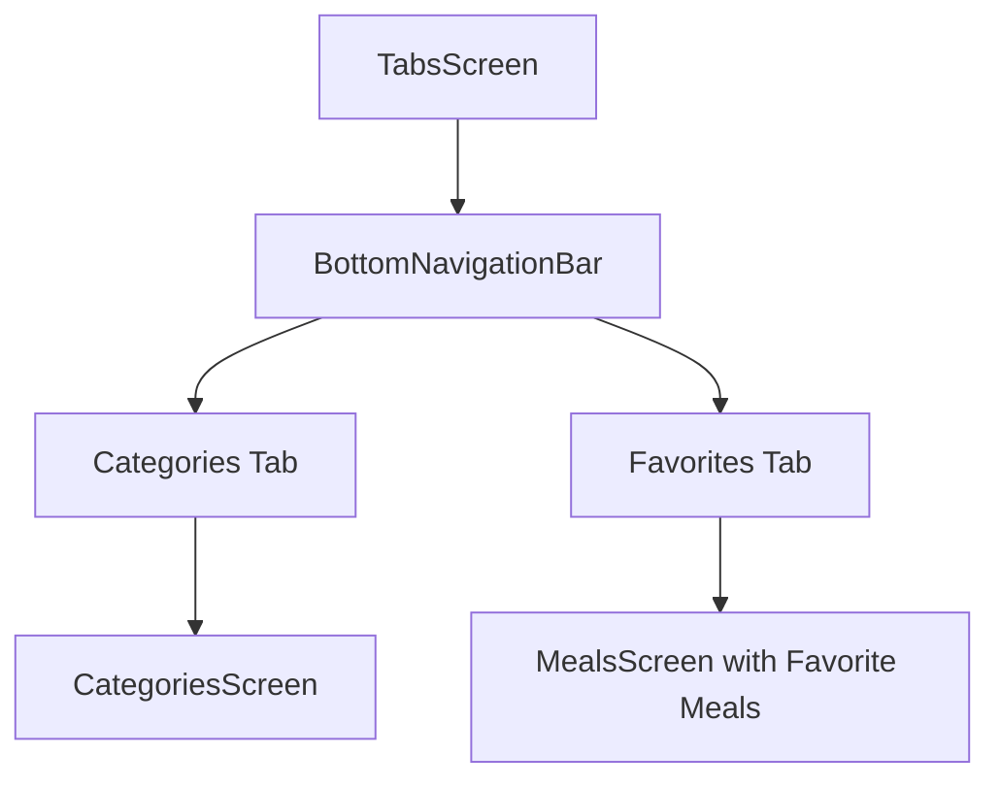
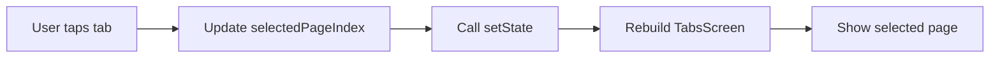
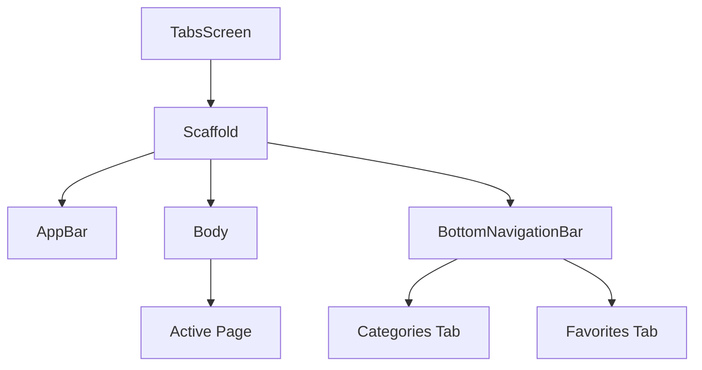
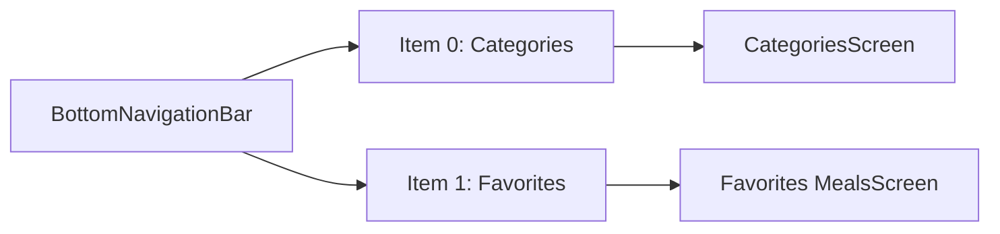
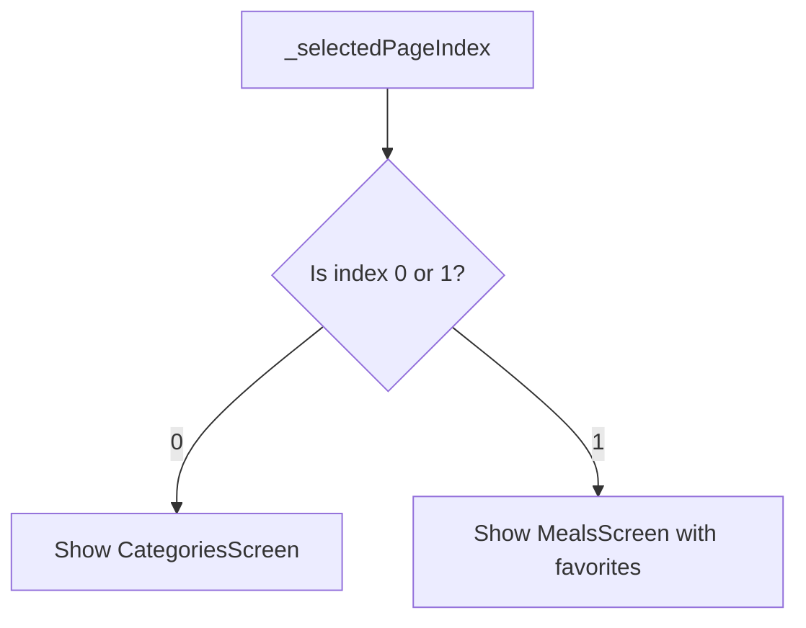
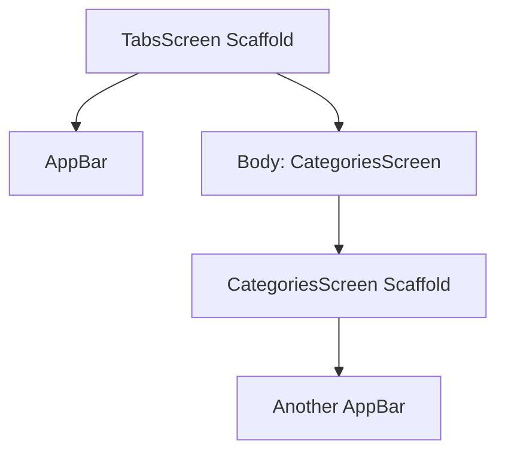
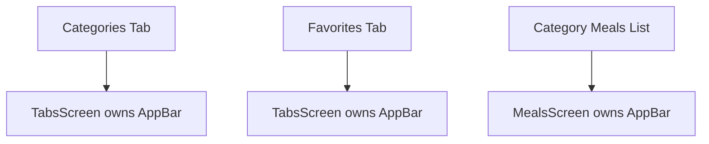
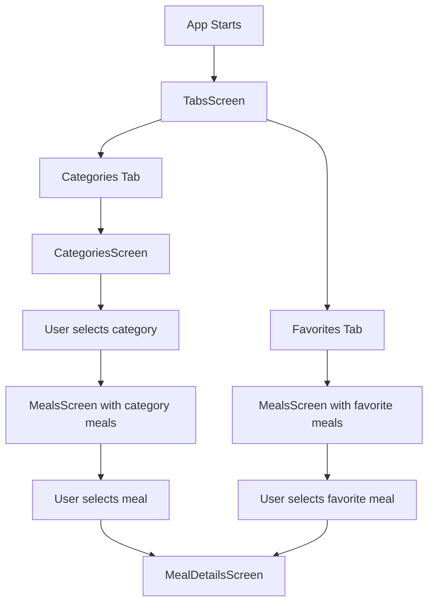

# Adding Tab-Based Navigation

## Overview

This lecture introduces **tab-based navigation** in Flutter.

So far, the app uses forward and backward navigation:

```text
CategoriesScreen → MealsScreen → MealDetailsScreen
```

Now, the app will also support switching between two main sections using a bottom tab bar:

1. **Categories**
2. **Favorites**

To manage this, we create a new `TabsScreen`. This screen becomes the main screen of the app and decides which page should currently be displayed.

---

## Goal

The app should have a bottom navigation bar like this:

```text
[ Categories ]    [ Favorites ]
```

When the user taps a tab, the visible page changes.



---

## Why Use a `TabsScreen`?

Tab navigation needs a parent screen that manages:

* Which tab is currently selected
* Which page should be shown
* Which app bar title should be displayed
* The bottom navigation bar itself

That parent screen is called `TabsScreen`.

---

# Step 1: Create `tabs.dart`

Create a new file:

```text
lib/screens/tabs.dart
```

This file will contain the `TabsScreen`.

---

# Step 2: Use a `StatefulWidget`

`TabsScreen` must be a `StatefulWidget` because it needs to remember which tab is currently selected.

```dart
class TabsScreen extends StatefulWidget {
  const TabsScreen({super.key});

  @override
  State<TabsScreen> createState() {
    return _TabsScreenState();
  }
}
```

The selected tab index is state, because it changes when the user taps a tab.

---

## Why Stateful?

A `StatelessWidget` cannot update its internal data.

But tab navigation needs this:

```text
selected tab changes → UI updates
```

So we need `setState()`.



---

# Step 3: Add the Selected Page State

Inside `_TabsScreenState`, create a state variable:

```dart
class _TabsScreenState extends State<TabsScreen> {
  int _selectedPageIndex = 0;

  @override
  Widget build(BuildContext context) {
    // UI will be built here
  }
}
```

The index represents the selected tab.

| Index | Page       |
| ----- | ---------- |
| `0`   | Categories |
| `1`   | Favorites  |

By default, the selected page index is `0`, so the app starts on the Categories tab.

---

# Step 4: Add the Tab Selection Method

Create a method that receives the tapped tab index.

```dart
void _selectPage(int index) {
  setState(() {
    _selectedPageIndex = index;
  });
}
```

Flutter automatically passes the index of the tapped tab into this function.

For example:

```text
Tap Categories → index = 0
Tap Favorites → index = 1
```

---

# Step 5: Add the `Scaffold`

`TabsScreen` returns a `Scaffold`.

```dart
return Scaffold(
  appBar: AppBar(
    title: Text(activePageTitle),
  ),
  body: activePage,
  bottomNavigationBar: BottomNavigationBar(
    // tabs go here
  ),
);
```

The `Scaffold` contains:

* An `AppBar`
* A dynamic `body`
* A `BottomNavigationBar`

---

## TabsScreen Structure



---

# Step 6: Add the `BottomNavigationBar`

Flutter provides a built-in widget called `BottomNavigationBar`.

```dart
bottomNavigationBar: BottomNavigationBar(
  onTap: _selectPage,
  currentIndex: _selectedPageIndex,
  items: const [
    BottomNavigationBarItem(
      icon: Icon(Icons.set_meal),
      label: 'Categories',
    ),
    BottomNavigationBarItem(
      icon: Icon(Icons.star),
      label: 'Favorites',
    ),
  ],
),
```

---

## Bottom Navigation Items

Each tab is a `BottomNavigationBarItem`.

```dart
BottomNavigationBarItem(
  icon: Icon(Icons.set_meal),
  label: 'Categories',
)
```

A tab item usually has:

| Property | Purpose               |
| -------- | --------------------- |
| `icon`   | Displays the tab icon |
| `label`  | Displays the tab text |

---

## Bottom Navigation Bar Flow



---

# Step 7: Use `onTap`

The `onTap` property runs whenever a tab is tapped.

```dart
onTap: _selectPage,
```

Because `_selectPage` receives an integer index, it matches what `BottomNavigationBar` provides.

```dart
void _selectPage(int index) {
  setState(() {
    _selectedPageIndex = index;
  });
}
```

---

# Step 8: Use `currentIndex`

At first, the page may change, but the selected tab highlight might not update.

To fix that, set:

```dart
currentIndex: _selectedPageIndex,
```

This tells Flutter which tab should look active.

Without `currentIndex`, the bottom navigation bar does not know which item should be highlighted.

---

# Step 9: Switch Between Pages

Inside the `build` method, create two variables:

```dart
Widget activePage = const CategoriesScreen();
String activePageTitle = 'Categories';
```

By default, the active page is the categories screen.

Then check if the selected index is `1`.

```dart
if (_selectedPageIndex == 1) {
  activePage = const MealsScreen(
    meals: [],
  );
  activePageTitle = 'Your Favorites';
}
```

For now, the favorites list is empty because favorite management will be added later.

---

## Active Page Logic



---

# Final `TabsScreen`

```dart
import 'package:flutter/material.dart';

import './categories.dart';
import './meals.dart';

class TabsScreen extends StatefulWidget {
  const TabsScreen({super.key});

  @override
  State<TabsScreen> createState() {
    return _TabsScreenState();
  }
}

class _TabsScreenState extends State<TabsScreen> {
  int _selectedPageIndex = 0;

  void _selectPage(int index) {
    setState(() {
      _selectedPageIndex = index;
    });
  }

  @override
  Widget build(BuildContext context) {
    Widget activePage = const CategoriesScreen();
    String activePageTitle = 'Categories';

    if (_selectedPageIndex == 1) {
      activePage = const MealsScreen(
        meals: [],
      );
      activePageTitle = 'Your Favorites';
    }

    return Scaffold(
      appBar: AppBar(
        title: Text(activePageTitle),
      ),
      body: activePage,
      bottomNavigationBar: BottomNavigationBar(
        onTap: _selectPage,
        currentIndex: _selectedPageIndex,
        items: const [
          BottomNavigationBarItem(
            icon: Icon(Icons.set_meal),
            label: 'Categories',
          ),
          BottomNavigationBarItem(
            icon: Icon(Icons.star),
            label: 'Favorites',
          ),
        ],
      ),
    );
  }
}
```

---

# Step 10: Use `TabsScreen` in `main.dart`

Previously, the app probably started with `CategoriesScreen`.

Now, replace it with `TabsScreen`.

```dart
home: const TabsScreen(),
```

Example:

```dart
import 'package:flutter/material.dart';

import './screens/tabs.dart';

void main() {
  runApp(const App());
}

class App extends StatelessWidget {
  const App({super.key});

  @override
  Widget build(BuildContext context) {
    return MaterialApp(
      home: const TabsScreen(),
    );
  }
}
```

Now the app starts with the tab-based layout.

---

# Problem: Duplicate App Bars

After adding `TabsScreen`, you may see duplicate app bars.

This happens because:

```text
TabsScreen has a Scaffold + AppBar
CategoriesScreen also has a Scaffold + AppBar
MealsScreen also has a Scaffold + AppBar
```

So Flutter may render one app bar from `TabsScreen` and another app bar from the nested screen.

---

## Duplicate AppBar Problem



This creates two app bars, which is not what we want.

---

# Step 11: Fix `CategoriesScreen`

Because `CategoriesScreen` is now displayed inside `TabsScreen`, it no longer needs its own `Scaffold`.

So instead of returning this:

```dart
return Scaffold(
  appBar: AppBar(
    title: const Text('Pick your category'),
  ),
  body: GridView(
    // categories grid
  ),
);
```

Return the grid directly:

```dart
return GridView(
  // categories grid
);
```

Now `TabsScreen` provides the app bar, and `CategoriesScreen` only provides the page content.

---

# Step 12: Fix `MealsScreen`

`MealsScreen` is used in two different situations:

## Situation 1: From a Category

```text
CategoriesScreen → MealsScreen
```

In this case, `MealsScreen` is a standalone screen and still needs its own `Scaffold` and `AppBar`.

## Situation 2: From the Favorites Tab

```text
TabsScreen → Favorites tab → MealsScreen
```

In this case, `TabsScreen` already provides the `Scaffold` and `AppBar`.

So `MealsScreen` should only use its own `Scaffold` when a title is provided.

---

## Make the Title Optional

Change the title from required to optional.

```dart
final String? title;
```

Constructor:

```dart
const MealsScreen({
  super.key,
  this.title,
  required this.meals,
});
```

Now `title` can be `null`.

---

## Conditionally Return a `Scaffold`

Inside `MealsScreen`, build the main content first.

```dart
Widget content = ListView.builder(
  itemCount: meals.length,
  itemBuilder: (ctx, index) {
    return MealItem(
      meal: meals[index],
      onSelectMeal: (meal) {
        selectMeal(context, meal);
      },
    );
  },
);
```

Then return only the content if no title is provided:

```dart
if (title == null) {
  return content;
}
```

Otherwise, return a full screen with a `Scaffold`.

```dart
return Scaffold(
  appBar: AppBar(
    title: Text(title!),
  ),
  body: content,
);
```

The `!` tells Dart that `title` is definitely not null at this point.

---

# Updated `MealsScreen` Pattern

```dart
class MealsScreen extends StatelessWidget {
  const MealsScreen({
    super.key,
    this.title,
    required this.meals,
  });

  final String? title;
  final List<Meal> meals;

  @override
  Widget build(BuildContext context) {
    Widget content = ListView.builder(
      itemCount: meals.length,
      itemBuilder: (ctx, index) {
        return MealItem(
          meal: meals[index],
          onSelectMeal: (meal) {
            selectMeal(context, meal);
          },
        );
      },
    );

    if (title == null) {
      return content;
    }

    return Scaffold(
      appBar: AppBar(
        title: Text(title!),
      ),
      body: content,
    );
  }
}
```

---

# Step 13: Use `MealsScreen` Without a Title in `TabsScreen`

In the favorites tab, do not pass a title.

```dart
activePage = const MealsScreen(
  meals: [],
);
```

Because `title` is not provided, `MealsScreen` returns only its content.

This prevents duplicate app bars.

---

# AppBar Ownership



The rule is:

| Screen Context             | Who owns the AppBar? |
| -------------------------- | -------------------- |
| Categories tab             | `TabsScreen`         |
| Favorites tab              | `TabsScreen`         |
| Meals pushed from category | `MealsScreen`        |
| Meal details page          | `MealDetailsScreen`  |

---

# Complete Navigation Structure



---

# Bottom Navigation vs Forward Navigation

This app now uses two navigation patterns.

## 1. Forward / Backward Navigation

Used when moving deeper into content.

```text
Categories → Meals → Meal Details
```

This uses:

```dart
Navigator.push(...)
```

## 2. Tab-Based Navigation

Used for switching between main app sections.

```text
Categories Tab ↔ Favorites Tab
```

This uses:

```dart
BottomNavigationBar
```

---

## Navigation Pattern Comparison

| Pattern                     | Used For                                            | Flutter Widget / API              |
| --------------------------- | --------------------------------------------------- | --------------------------------- |
| Forward/backward navigation | Moving deeper into a flow                           | `Navigator.push`, `Navigator.pop` |
| Bottom tab navigation       | Switching between main sections                     | `BottomNavigationBar`             |
| Top tab navigation          | Switching between related sections near the app bar | `TabBar`, `DefaultTabController`  |

---

# Alternative: Top Tabs with `TabBar`

Flutter also supports top tab navigation using:

```dart
DefaultTabController
TabBar
TabBarView
```

This is usually placed near the `AppBar`.

Example structure:

```dart
DefaultTabController(
  length: 2,
  child: Scaffold(
    appBar: AppBar(
      title: const Text('Meals'),
      bottom: const TabBar(
        tabs: [
          Tab(icon: Icon(Icons.set_meal), text: 'Categories'),
          Tab(icon: Icon(Icons.star), text: 'Favorites'),
        ],
      ),
    ),
    body: const TabBarView(
      children: [
        CategoriesScreen(),
        MealsScreen(meals: []),
      ],
    ),
  ),
)
```

For this app, the lecture uses `BottomNavigationBar`, because bottom tabs are common for main app navigation.

---

# Important Flutter Concepts

| Concept                   | Meaning                                     |
| ------------------------- | ------------------------------------------- |
| `TabsScreen`              | Parent screen that manages tab navigation   |
| `StatefulWidget`          | Needed because selected tab index changes   |
| `_selectedPageIndex`      | Stores the currently selected tab           |
| `setState()`              | Rebuilds the UI after tab selection changes |
| `BottomNavigationBar`     | Displays bottom tabs                        |
| `BottomNavigationBarItem` | Defines each tab                            |
| `currentIndex`            | Highlights the currently selected tab       |
| `onTap`                   | Runs when a tab is tapped                   |
| `activePage`              | The widget displayed in the body            |
| `activePageTitle`         | The title displayed in the app bar          |

---

# Summary

This lecture adds tab-based navigation to the Meals App.

A new `TabsScreen` is created to manage two main app sections:

* Categories
* Favorites

`TabsScreen` uses a `BottomNavigationBar` and a state variable called `_selectedPageIndex` to decide which page should be displayed.

The app also fixes duplicate app bars by letting `TabsScreen` own the app bar for tab pages, while `MealsScreen` only creates its own `Scaffold` when it is used as a standalone pushed screen.

With this setup, the app now supports both:

* Forward/backward navigation with `Navigator.push`
* Main-section switching with bottom tabs
