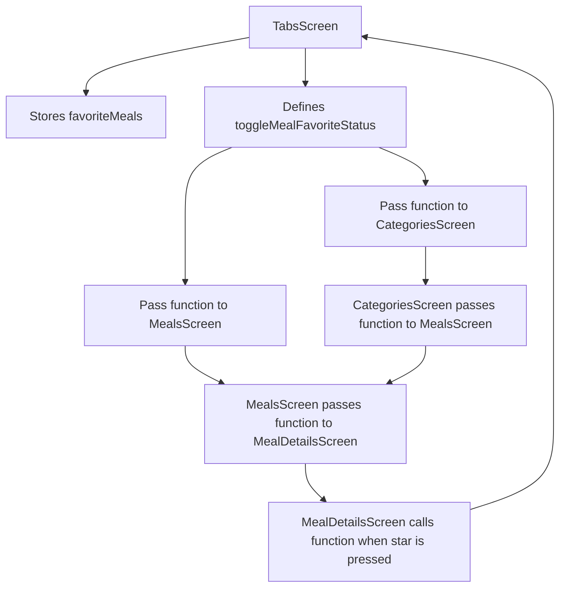
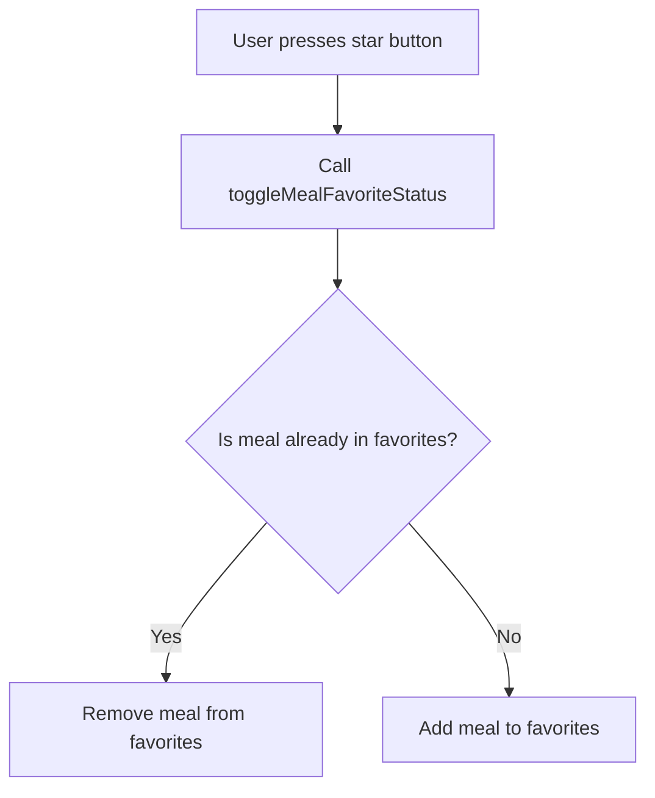
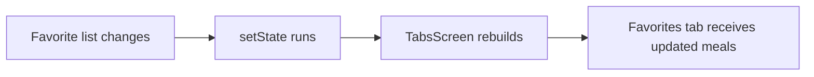
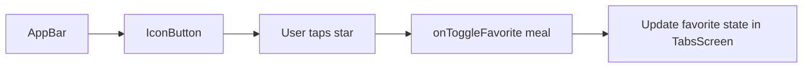
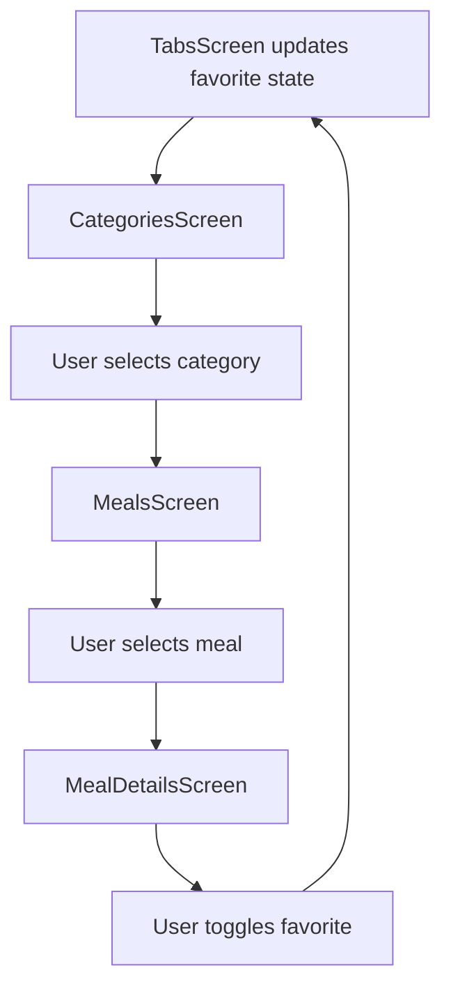
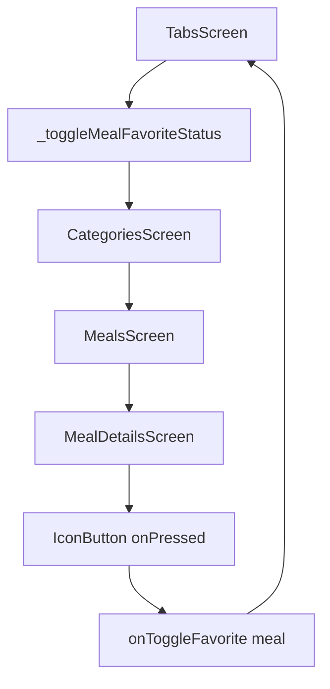
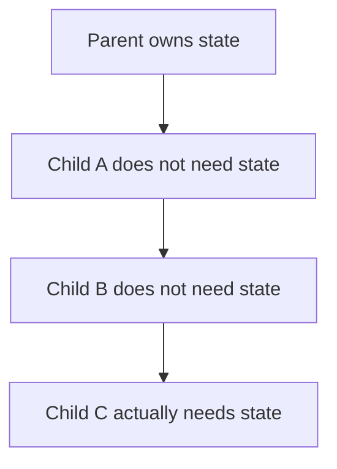

# Passing Functions Through Multiple Layers of Widgets for State Management

## Overview

This lecture introduces an important state management pattern in Flutter: **passing callback functions through multiple widget layers**.

The goal is to allow users to mark meals as favorites from the `MealDetailsScreen`.

However, the actual favorite meals list should not be stored inside `MealDetailsScreen`. Instead, the favorite state should live in a higher-level widget: `TabsScreen`.

This means the function that changes the favorite list must be created in `TabsScreen`, then passed down through other widgets until it reaches `MealDetailsScreen`.

---

## Goal

When the user taps the star button on the meal detail page:

```text
MealDetailsScreen → Toggle Favorite → Update State in TabsScreen
```

The favorite meal should be added to or removed from the favorite meals list.

---

## Why Store Favorites in `TabsScreen`?

The favorites list is needed in the `TabsScreen`, because the Favorites tab must display all favorite meals.

```dart
activePage = MealsScreen(
  meals: _favoriteMeals,
);
```

So the favorite state should live in the common parent that needs access to it.

That parent is `TabsScreen`.

---

## State Management Flow



---

# Key Idea: Lifting State Up

Instead of storing favorite state inside the child screen, we move it up to a parent widget.

This pattern is called **lifting state up**.

```text
Child needs to change data
↓
Parent owns the data
↓
Parent passes a callback to the child
↓
Child calls the callback
↓
Parent updates the state
```

---

## Why Not Store Favorite State in `MealDetailsScreen`?

It might seem natural to store favorite state in `MealDetailsScreen`, because that is where the favorite button exists.

But this would create a problem:

```text
MealDetailsScreen knows the favorite state
TabsScreen does not know the favorite state
Favorites tab cannot display the correct meals
```

The Favorites tab needs the favorite meals list, so the state must be stored in `TabsScreen`.

---

# Step 1: Add Favorite State in `TabsScreen`

Inside `_TabsScreenState`, create a list for favorite meals.

```dart
final List<Meal> _favoriteMeals = [];
```

This list starts empty.

It is marked as `final` because the variable itself will not be reassigned.

The list contents can still change:

```dart
_favoriteMeals.add(meal);
_favoriteMeals.remove(meal);
```

---

## Important Note About `final`

```dart
final List<Meal> _favoriteMeals = [];
```

`final` means:

```text
The variable cannot point to a different list.
```

But the list itself can still be modified.

So this is allowed:

```dart
_favoriteMeals.add(meal);
```

But this is not allowed:

```dart
_favoriteMeals = [];
```

---

# Step 2: Create the Toggle Function

In `TabsScreen`, create a function that adds or removes a meal from the favorites list.

```dart
void _toggleMealFavoriteStatus(Meal meal) {
  final isExisting = _favoriteMeals.contains(meal);

  if (isExisting) {
    _favoriteMeals.remove(meal);
  } else {
    _favoriteMeals.add(meal);
  }
}
```

This function checks whether the selected meal is already a favorite.

If it is already in the list, it removes it.
If it is not in the list, it adds it.

---

## Toggle Logic Diagram



---

# Step 3: Wrap the Change in `setState`

Because changing favorites should update the UI, the list update must happen inside `setState`.

```dart
void _toggleMealFavoriteStatus(Meal meal) {
  final isExisting = _favoriteMeals.contains(meal);

  setState(() {
    if (isExisting) {
      _favoriteMeals.remove(meal);
    } else {
      _favoriteMeals.add(meal);
    }
  });
}
```

`setState()` tells Flutter:

```text
The state changed. Rebuild this widget.
```

This allows the Favorites tab to update when a meal is added or removed.

---

## `setState` Flow



---

# Step 4: Pass the Function to `MealDetailsScreen`

The favorite button is inside `MealDetailsScreen`.

So `MealDetailsScreen` needs to receive a function from outside.

Add this property:

```dart
final void Function(Meal meal) onToggleFavorite;
```

Then require it in the constructor:

```dart
const MealDetailsScreen({
  super.key,
  required this.meal,
  required this.onToggleFavorite,
});
```

---

## Updated `MealDetailsScreen` Constructor

```dart
class MealDetailsScreen extends StatelessWidget {
  const MealDetailsScreen({
    super.key,
    required this.meal,
    required this.onToggleFavorite,
  });

  final Meal meal;
  final void Function(Meal meal) onToggleFavorite;

  @override
  Widget build(BuildContext context) {
    // screen UI
  }
}
```

---

# Step 5: Add the Favorite Button

Inside the `AppBar`, add an `IconButton`.

```dart
appBar: AppBar(
  title: Text(meal.title),
  actions: [
    IconButton(
      onPressed: () {
        onToggleFavorite(meal);
      },
      icon: const Icon(Icons.star),
    ),
  ],
),
```

When the button is pressed, it calls:

```dart
onToggleFavorite(meal);
```

This sends the selected meal back to the parent toggle function.

---

## AppBar Action Flow



---

# Step 6: Update `MealsScreen`

`MealDetailsScreen` is created inside `MealsScreen`.

So `MealsScreen` must also receive `onToggleFavorite` and forward it to `MealDetailsScreen`.

Add this property:

```dart
final void Function(Meal meal) onToggleFavorite;
```

Update the constructor:

```dart
const MealsScreen({
  super.key,
  this.title,
  required this.meals,
  required this.onToggleFavorite,
});
```

Then pass it to `MealDetailsScreen`:

```dart
void selectMeal(BuildContext context, Meal meal) {
  Navigator.of(context).push(
    MaterialPageRoute(
      builder: (ctx) => MealDetailsScreen(
        meal: meal,
        onToggleFavorite: onToggleFavorite,
      ),
    ),
  );
}
```

---

## `MealsScreen` as a Middle Layer

`MealsScreen` does not manage favorites itself.

It only forwards the function.

```text
TabsScreen owns the function
MealsScreen receives the function
MealsScreen passes it to MealDetailsScreen
MealDetailsScreen calls it
```

---

# Step 7: Pass the Function from `TabsScreen` to `MealsScreen`

In `TabsScreen`, pass the function to the Favorites tab.

```dart
activePage = MealsScreen(
  meals: _favoriteMeals,
  onToggleFavorite: _toggleMealFavoriteStatus,
);
```

Now the Favorites tab can display the actual favorite meals instead of an empty list.

---

# Step 8: Update `CategoriesScreen`

There is another path to `MealsScreen`:

```text
TabsScreen → CategoriesScreen → MealsScreen → MealDetailsScreen
```

So `CategoriesScreen` also needs to receive and forward the function.

Add this property to `CategoriesScreen`:

```dart
final void Function(Meal meal) onToggleFavorite;
```

Constructor:

```dart
const CategoriesScreen({
  super.key,
  required this.onToggleFavorite,
});
```

Then when `CategoriesScreen` pushes `MealsScreen`, pass the function forward:

```dart
Navigator.of(context).push(
  MaterialPageRoute(
    builder: (ctx) => MealsScreen(
      title: category.title,
      meals: filteredMeals,
      onToggleFavorite: onToggleFavorite,
    ),
  ),
);
```

---

## Category Navigation Flow



---

# Step 9: Pass the Function to `CategoriesScreen`

Back in `TabsScreen`, pass the toggle function to `CategoriesScreen`.

```dart
Widget activePage = CategoriesScreen(
  onToggleFavorite: _toggleMealFavoriteStatus,
);
```

Because we are passing a runtime function, this can no longer be `const`.

---

# Final `TabsScreen` Example

```dart
import 'package:flutter/material.dart';

import '../models/meal.dart';
import './categories.dart';
import './meals.dart';

class TabsScreen extends StatefulWidget {
  const TabsScreen({super.key});

  @override
  State<TabsScreen> createState() {
    return _TabsScreenState();
  }
}

class _TabsScreenState extends State<TabsScreen> {
  int _selectedPageIndex = 0;
  final List<Meal> _favoriteMeals = [];

  void _toggleMealFavoriteStatus(Meal meal) {
    final isExisting = _favoriteMeals.contains(meal);

    setState(() {
      if (isExisting) {
        _favoriteMeals.remove(meal);
      } else {
        _favoriteMeals.add(meal);
      }
    });
  }

  void _selectPage(int index) {
    setState(() {
      _selectedPageIndex = index;
    });
  }

  @override
  Widget build(BuildContext context) {
    Widget activePage = CategoriesScreen(
      onToggleFavorite: _toggleMealFavoriteStatus,
    );
    String activePageTitle = 'Categories';

    if (_selectedPageIndex == 1) {
      activePage = MealsScreen(
        meals: _favoriteMeals,
        onToggleFavorite: _toggleMealFavoriteStatus,
      );
      activePageTitle = 'Your Favorites';
    }

    return Scaffold(
      appBar: AppBar(
        title: Text(activePageTitle),
      ),
      body: activePage,
      bottomNavigationBar: BottomNavigationBar(
        currentIndex: _selectedPageIndex,
        onTap: _selectPage,
        items: const [
          BottomNavigationBarItem(
            icon: Icon(Icons.set_meal),
            label: 'Categories',
          ),
          BottomNavigationBarItem(
            icon: Icon(Icons.star),
            label: 'Favorites',
          ),
        ],
      ),
    );
  }
}
```

---

# Final `MealDetailsScreen` Example

```dart
import 'package:flutter/material.dart';

import '../models/meal.dart';

class MealDetailsScreen extends StatelessWidget {
  const MealDetailsScreen({
    super.key,
    required this.meal,
    required this.onToggleFavorite,
  });

  final Meal meal;
  final void Function(Meal meal) onToggleFavorite;

  @override
  Widget build(BuildContext context) {
    return Scaffold(
      appBar: AppBar(
        title: Text(meal.title),
        actions: [
          IconButton(
            onPressed: () {
              onToggleFavorite(meal);
            },
            icon: const Icon(Icons.star),
          ),
        ],
      ),
      body: SingleChildScrollView(
        child: Column(
          children: [
            Image.network(
              meal.imageUrl,
              width: double.infinity,
              height: 300,
              fit: BoxFit.cover,
            ),
            const SizedBox(height: 14),
            Text(
              'Ingredients',
              style: Theme.of(context).textTheme.titleLarge!.copyWith(
                    color: Theme.of(context).colorScheme.primary,
                    fontWeight: FontWeight.bold,
                  ),
            ),
            const SizedBox(height: 14),
            for (final ingredient in meal.ingredients)
              Text(
                ingredient,
                style: Theme.of(context).textTheme.bodyMedium!.copyWith(
                      color: Theme.of(context).colorScheme.onBackground,
                    ),
              ),
            const SizedBox(height: 24),
            Text(
              'Steps',
              style: Theme.of(context).textTheme.titleLarge!.copyWith(
                    color: Theme.of(context).colorScheme.primary,
                    fontWeight: FontWeight.bold,
                  ),
            ),
            const SizedBox(height: 14),
            for (final step in meal.steps)
              Padding(
                padding: const EdgeInsets.symmetric(
                  horizontal: 12,
                  vertical: 8,
                ),
                child: Text(
                  step,
                  textAlign: TextAlign.center,
                  style: Theme.of(context).textTheme.bodyMedium!.copyWith(
                        color: Theme.of(context).colorScheme.onBackground,
                      ),
                ),
              ),
          ],
        ),
      ),
    );
  }
}
```

---

# Full Function Passing Chain



There are two paths:

## Path 1: From Categories

```text
TabsScreen
→ CategoriesScreen
→ MealsScreen
→ MealDetailsScreen
```

## Path 2: From Favorites

```text
TabsScreen
→ MealsScreen
→ MealDetailsScreen
```

Both paths need access to the same `onToggleFavorite` function.

---

# What is Prop Drilling?

Passing data or functions through many widget layers is often called **prop drilling**.

In this example, we pass `onToggleFavorite` through several widgets.

```text
TabsScreen → CategoriesScreen → MealsScreen → MealDetailsScreen
```

This works, but it can become annoying in larger apps.

---

## Prop Drilling Problem



Sometimes intermediate widgets only receive a function so they can pass it further down.

That is what makes prop drilling inconvenient.

---

# Why Learn This Pattern?

Even though prop drilling can become cumbersome, it is important to understand.

It teaches two core Flutter ideas:

1. State should live in the widget that needs to control it.
2. Child widgets can trigger parent logic through callbacks.

This pattern also helps you understand why tools like Provider, Riverpod, Bloc, or Redux exist.

---

# Callback Type Syntax

The callback is typed like this:

```dart
final void Function(Meal meal) onToggleFavorite;
```

This means:

```text
onToggleFavorite is a function.
It returns nothing.
It receives one Meal argument.
```

You can read it like this:

```dart
void Function(Meal meal)
```

Meaning:

```text
A function that takes a Meal and returns void.
```

---

## Optional: Using `typedef`

For cleaner code, you could define a custom function type.

```dart
typedef MealCallback = void Function(Meal meal);
```

Then use it like this:

```dart
final MealCallback onToggleFavorite;
```

This can make your widget constructors easier to read when many callbacks are involved.

---

# Important Concepts

| Concept                    | Meaning                                                  |
| -------------------------- | -------------------------------------------------------- |
| Lifting state up           | Moving state to the nearest common parent                |
| Callback function          | A function passed into another widget                    |
| Prop drilling              | Passing data or functions through many widget layers     |
| `setState()`               | Rebuilds the UI after state changes                      |
| `contains()`               | Checks whether a list contains a value                   |
| `add()`                    | Adds an item to a list                                   |
| `remove()`                 | Removes an item from a list                              |
| `void Function(Meal meal)` | Callback type that receives a `Meal` and returns nothing |

---

# Summary

This lecture adds the foundation for the favorite meals feature.

The favorite meals list is stored in `TabsScreen`, because the Favorites tab needs access to it.

The function `_toggleMealFavoriteStatus` is also defined in `TabsScreen`. It adds or removes meals from the favorite list.

Because the favorite button is inside `MealDetailsScreen`, the function must be passed down through multiple widget layers:

```text
TabsScreen → CategoriesScreen → MealsScreen → MealDetailsScreen
```

This pattern works well for smaller apps, but it can become harder to manage as the widget tree grows. Later, state management tools like Riverpod or Provider can solve this problem more elegantly.
