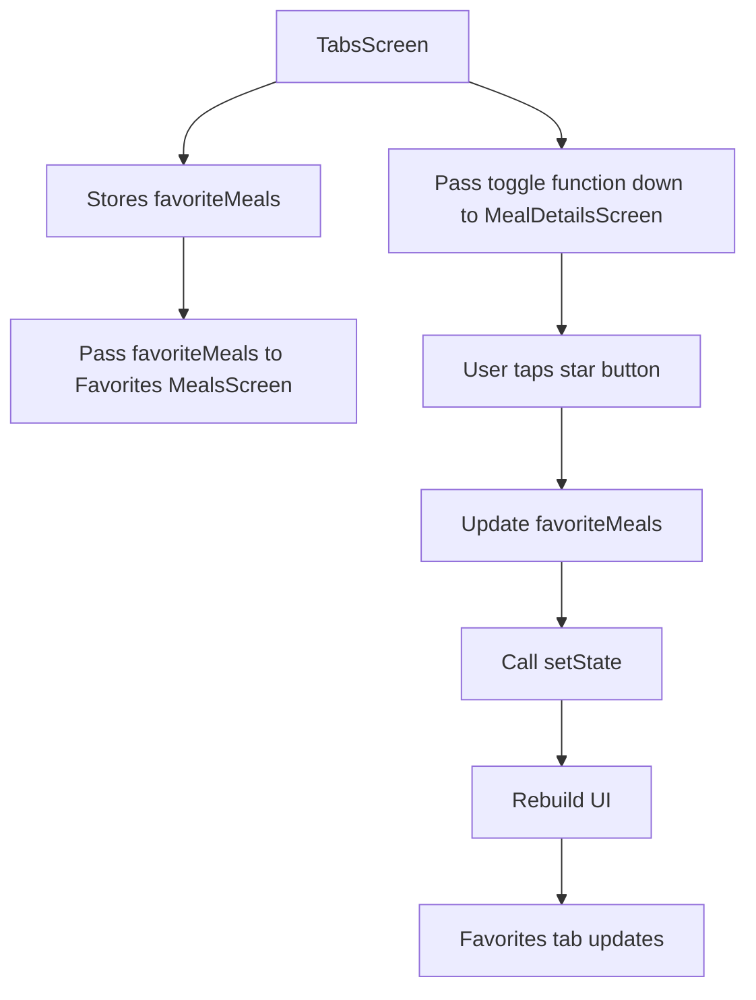
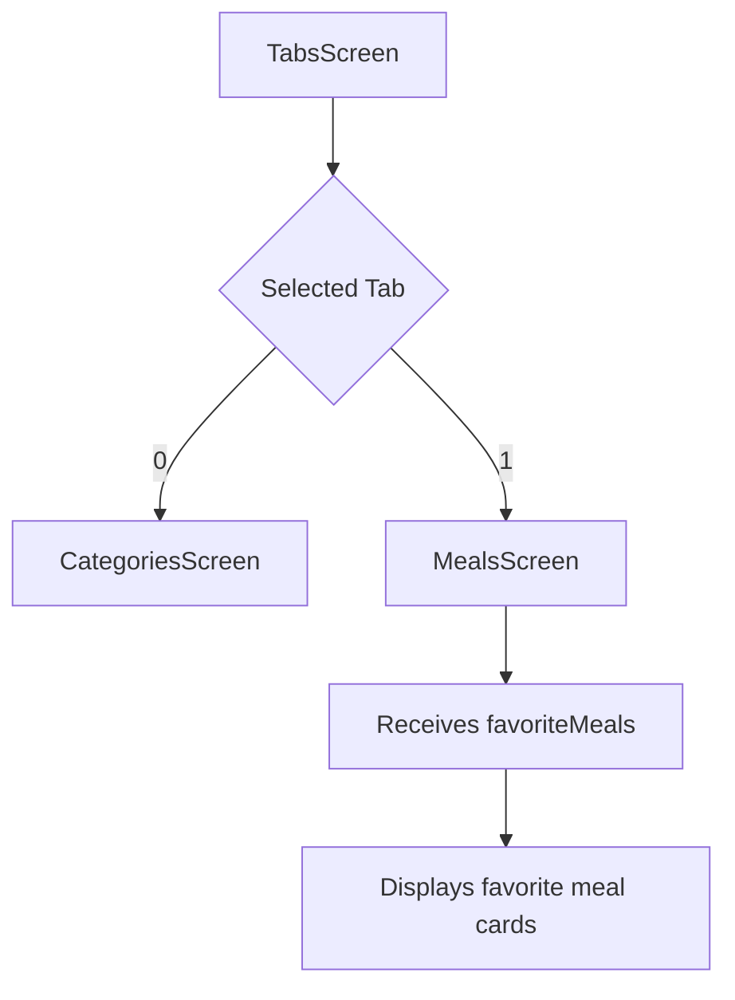
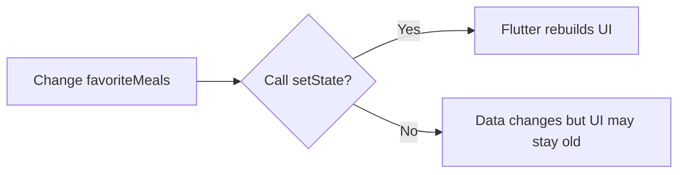
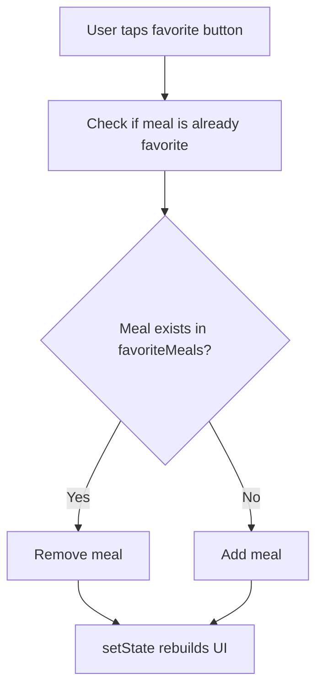
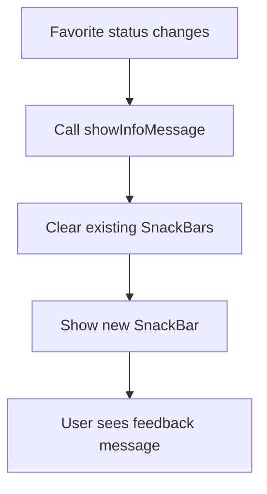
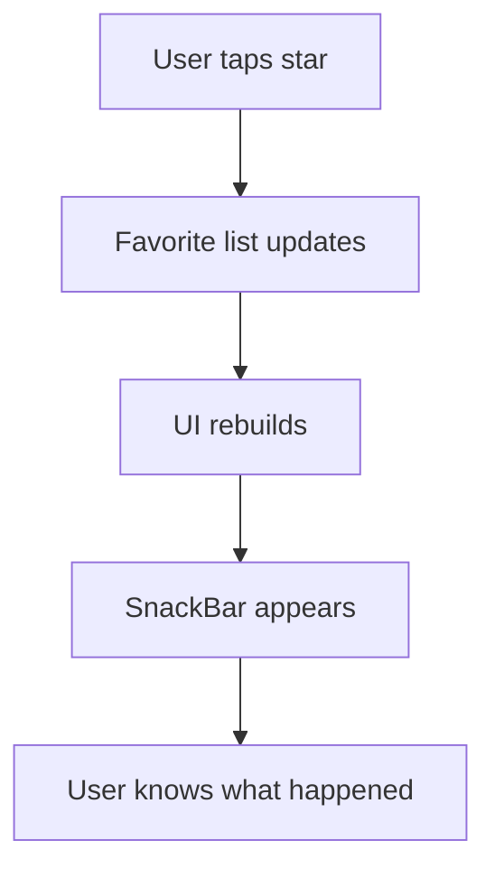
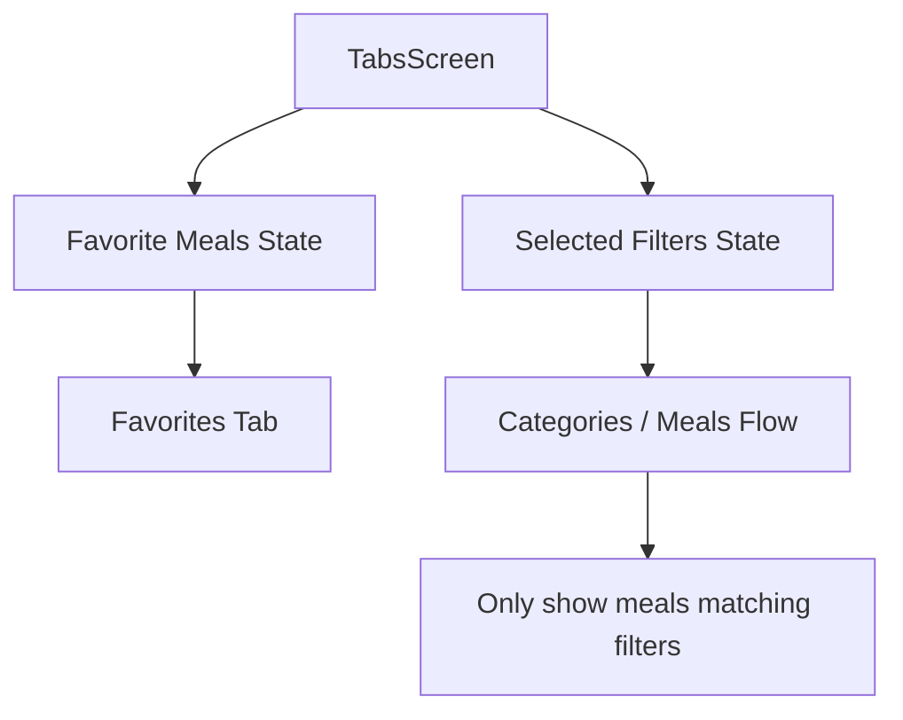
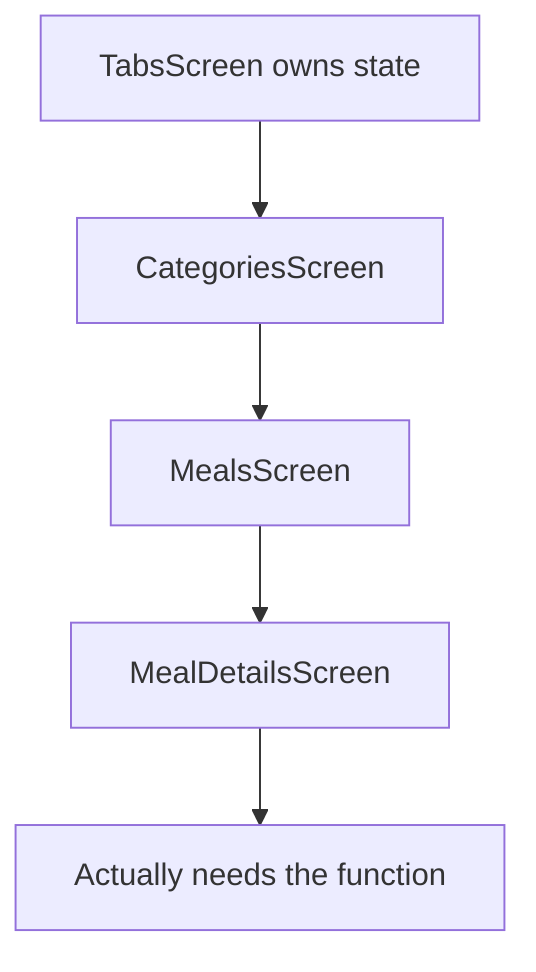

# Managing App-Wide State and Data

## Overview

This lecture continues building the favorites feature and introduces the idea of **app-wide state**.

App-wide state is data that is needed by multiple screens in the application. In the Meals App, the list of favorite meals is one example of app-wide state.

The favorite meals list is stored in `TabsScreen`, because `TabsScreen` controls the Favorites tab. When a meal is marked as a favorite from the `MealDetailsScreen`, the list in `TabsScreen` must update. Then the Favorites tab should immediately show the updated list.

This lecture also shows why `setState()` is necessary and how to give users feedback with a `SnackBar`.

---

## Goal

The app should allow users to:

```text
Open MealDetailsScreen
→ Tap the star button
→ Add or remove the meal from favorites
→ See the updated Favorites tab
→ Receive a small feedback message
```

---

## App-Wide State Flow



---

# What is App-Wide State?

App-wide state is state that affects more than one widget or screen.

In this app, favorite meals are app-wide state because:

* `MealDetailsScreen` needs to change favorite status
* `TabsScreen` needs to store the favorite meals
* `MealsScreen` needs to display the favorite meals
* The Favorites tab must update when the list changes

So the state cannot live only inside `MealDetailsScreen`.

It must live higher in the widget tree.

---

## Example of App-Wide State

```dart
final List<Meal> _favoriteMeals = [];
```

This list stores all meals that the user marked as favorites.

It is placed in `_TabsScreenState` because `TabsScreen` is the common parent that controls the Favorites tab.

---

# Why Store Favorites in `TabsScreen`?

`TabsScreen` decides what page is shown when the user selects the Favorites tab.

```dart
if (_selectedPageIndex == 1) {
  activePage = MealsScreen(
    meals: _favoriteMeals,
    onToggleFavorite: _toggleMealFavoriteStatus,
  );
  activePageTitle = 'Your Favorites';
}
```

So when the Favorites tab is selected, `TabsScreen` passes `_favoriteMeals` into `MealsScreen`.

That means the Favorites tab can reuse the existing `MealsScreen` widget.

---

## Favorites Tab Structure



---

# Passing Favorite Meals to `MealsScreen`

Previously, the Favorites tab used an empty list:

```dart
activePage = MealsScreen(
  meals: [],
  onToggleFavorite: _toggleMealFavoriteStatus,
);
```

Now it should use the real favorites list:

```dart
activePage = MealsScreen(
  meals: _favoriteMeals,
  onToggleFavorite: _toggleMealFavoriteStatus,
);
```

This makes the Favorites tab display the meals that were actually marked as favorites.

---

# The Problem: UI Does Not Update Immediately

After adding or removing a favorite, the data may change correctly, but the UI might not update immediately.

This happens if the list is changed without calling `setState()`.

Example of the problem:

```dart
void _toggleMealFavoriteStatus(Meal meal) {
  final isExisting = _favoriteMeals.contains(meal);

  if (isExisting) {
    _favoriteMeals.remove(meal);
  } else {
    _favoriteMeals.add(meal);
  }
}
```

The list changes, but Flutter is not told to rebuild the UI.

---

# The Fix: Use `setState()`

Whenever state changes and the UI should update, wrap the change in `setState()`.

```dart
void _toggleMealFavoriteStatus(Meal meal) {
  final isExisting = _favoriteMeals.contains(meal);

  setState(() {
    if (isExisting) {
      _favoriteMeals.remove(meal);
    } else {
      _favoriteMeals.add(meal);
    }
  });
}
```

`setState()` tells Flutter:

```text
This widget's state changed.
Please rebuild the UI.
```

---

## Why `setState()` Matters



Without `setState()`, the internal data can change, but the visible screen may not reflect that change.

---

# Updated Toggle Function

```dart
void _toggleMealFavoriteStatus(Meal meal) {
  final isExisting = _favoriteMeals.contains(meal);

  setState(() {
    if (isExisting) {
      _favoriteMeals.remove(meal);
    } else {
      _favoriteMeals.add(meal);
    }
  });
}
```

This function now does two things:

1. Adds or removes the selected meal
2. Triggers a UI rebuild

---

## Toggle Logic



---

# Giving the User Feedback

At this point, the favorite button works, but the star icon does not visually change yet.

That means the user may not immediately know whether the meal was added or removed.

A temporary solution is to show a `SnackBar`.

A `SnackBar` is a small message shown at the bottom of the screen.

---

## Create a Helper Method

Inside `_TabsScreenState`, add a method for showing info messages.

```dart
void _showInfoMessage(String message) {
  ScaffoldMessenger.of(context).clearSnackBars();

  ScaffoldMessenger.of(context).showSnackBar(
    SnackBar(
      content: Text(message),
    ),
  );
}
```

---

## Explanation

```dart
ScaffoldMessenger.of(context)
```

This gives access to the nearest `ScaffoldMessenger`, which can show snack bars.

```dart
clearSnackBars()
```

This removes any currently visible snack bars before showing a new one.

```dart
showSnackBar(...)
```

This displays the new message.

---

## SnackBar Flow



---

# Add SnackBar Messages to the Toggle Function

Now update the favorite toggle function.

```dart
void _toggleMealFavoriteStatus(Meal meal) {
  final isExisting = _favoriteMeals.contains(meal);

  setState(() {
    if (isExisting) {
      _favoriteMeals.remove(meal);
      _showInfoMessage('Meal is no longer a favorite.');
    } else {
      _favoriteMeals.add(meal);
      _showInfoMessage('Marked as a favorite.');
    }
  });
}
```

Now the user gets feedback whenever they add or remove a meal from favorites.

---

# Improved Version

A cleaner version is to update the list inside `setState()` and show the message after deciding what happened.

```dart
void _toggleMealFavoriteStatus(Meal meal) {
  final isExisting = _favoriteMeals.contains(meal);

  setState(() {
    if (isExisting) {
      _favoriteMeals.remove(meal);
    } else {
      _favoriteMeals.add(meal);
    }
  });

  if (isExisting) {
    _showInfoMessage('Meal is no longer a favorite.');
  } else {
    _showInfoMessage('Marked as a favorite.');
  }
}
```

This keeps the UI state update and the message logic a little more separated.

---

# Final `TabsScreen` State Example

```dart
class _TabsScreenState extends State<TabsScreen> {
  int _selectedPageIndex = 0;
  final List<Meal> _favoriteMeals = [];

  void _showInfoMessage(String message) {
    ScaffoldMessenger.of(context).clearSnackBars();

    ScaffoldMessenger.of(context).showSnackBar(
      SnackBar(
        content: Text(message),
      ),
    );
  }

  void _toggleMealFavoriteStatus(Meal meal) {
    final isExisting = _favoriteMeals.contains(meal);

    setState(() {
      if (isExisting) {
        _favoriteMeals.remove(meal);
      } else {
        _favoriteMeals.add(meal);
      }
    });

    if (isExisting) {
      _showInfoMessage('Meal is no longer a favorite.');
    } else {
      _showInfoMessage('Marked as a favorite.');
    }
  }

  void _selectPage(int index) {
    setState(() {
      _selectedPageIndex = index;
    });
  }

  @override
  Widget build(BuildContext context) {
    Widget activePage = CategoriesScreen(
      onToggleFavorite: _toggleMealFavoriteStatus,
    );

    String activePageTitle = 'Categories';

    if (_selectedPageIndex == 1) {
      activePage = MealsScreen(
        meals: _favoriteMeals,
        onToggleFavorite: _toggleMealFavoriteStatus,
      );
      activePageTitle = 'Your Favorites';
    }

    return Scaffold(
      appBar: AppBar(
        title: Text(activePageTitle),
      ),
      body: activePage,
      bottomNavigationBar: BottomNavigationBar(
        currentIndex: _selectedPageIndex,
        onTap: _selectPage,
        items: const [
          BottomNavigationBarItem(
            icon: Icon(Icons.set_meal),
            label: 'Categories',
          ),
          BottomNavigationBarItem(
            icon: Icon(Icons.star),
            label: 'Favorites',
          ),
        ],
      ),
    );
  }
}
```

---

# Why the Favorite Icon Does Not Change Yet

The star button currently always shows the same icon:

```dart
icon: const Icon(Icons.star),
```

So even when the meal is added or removed, the icon does not visually change.

In a more complete version, the icon could change depending on whether the meal is currently a favorite.

Example idea:

```dart
icon: Icon(isFavorite ? Icons.star : Icons.star_border)
```

However, this requires passing more state into the detail screen, which becomes more complicated with the current prop-drilling approach.

That is why this lecture uses a `SnackBar` for feedback for now.

---

# Current Feedback Strategy



Instead of changing the icon immediately, the app shows a message:

```text
Marked as a favorite.
```

or:

```text
Meal is no longer a favorite.
```

---

# App-Wide State and Future Filters

Favorites are one example of app-wide state.

Soon, the app will also need filters, such as:

* Gluten-free
* Lactose-free
* Vegetarian
* Vegan

These filters will also affect multiple screens.

For example:

```text
FiltersScreen changes selected filters
→ CategoriesScreen should show filtered meals
→ MealsScreen should only receive available meals
```

This means filters should also be managed in a high-level widget, just like favorites.

---

## Example Filter State

```dart
Map<Filter, bool> _selectedFilters = {
  Filter.glutenFree: false,
  Filter.lactoseFree: false,
  Filter.vegetarian: false,
  Filter.vegan: false,
};
```

Each filter stores a boolean value:

| Filter  | Meaning            |
| ------- | ------------------ |
| `true`  | Filter is active   |
| `false` | Filter is inactive |

---

## Example Available Meals Getter

```dart
List<Meal> get _availableMeals {
  return dummyMeals.where((meal) {
    if (_selectedFilters[Filter.glutenFree]! && !meal.isGlutenFree) {
      return false;
    }
    if (_selectedFilters[Filter.lactoseFree]! && !meal.isLactoseFree) {
      return false;
    }
    if (_selectedFilters[Filter.vegetarian]! && !meal.isVegetarian) {
      return false;
    }
    if (_selectedFilters[Filter.vegan]! && !meal.isVegan) {
      return false;
    }
    return true;
  }).toList();
}
```

This getter returns only the meals that match the active filters.

---

## Future App-Wide State Structure



---

# Why This Approach Has Limits

Managing app-wide state in `TabsScreen` works for this app, but it can become hard to maintain as the app grows.

The problem is that data and functions must be passed through many widgets.

```text
TabsScreen
→ CategoriesScreen
→ MealsScreen
→ MealDetailsScreen
```

This is called **prop drilling**.

---

## Prop Drilling Problem



Sometimes intermediate widgets do not really need the data or function. They only receive it so they can forward it to another widget.

That can make the code harder to read and maintain.

---

# Why State Management Tools Help

State management tools like Provider, Riverpod, or BLoC help solve this problem.

Instead of manually passing data and callbacks through many constructors, widgets can access shared state more directly.

```text
Without state management library:
TabsScreen → CategoriesScreen → MealsScreen → MealDetailsScreen

With state management library:
MealDetailsScreen can access shared favorites state directly
```

---

## Current Approach vs State Management Library

| Approach                   | Benefit                         | Limitation                       |
| -------------------------- | ------------------------------- | -------------------------------- |
| `setState` in `TabsScreen` | Simple and good for learning    | Requires prop drilling           |
| Provider / Riverpod        | Better for app-wide state       | Requires learning extra concepts |
| BLoC                       | Good for complex business logic | More boilerplate                 |

---

# Important Concepts

| Concept             | Meaning                                             |
| ------------------- | --------------------------------------------------- |
| App-wide state      | State needed by multiple screens                    |
| Favorite meals list | Data shared between detail screen and favorites tab |
| `setState()`        | Tells Flutter to rebuild the UI after state changes |
| `SnackBar`          | Temporary message shown at the bottom of the screen |
| `ScaffoldMessenger` | Used to show snack bars                             |
| Prop drilling       | Passing data/functions through many widget layers   |
| Lifting state up    | Moving state to a common parent widget              |
| Filters             | State that controls which meals are visible         |

---

# Summary

This lecture completes the basic favorite meals behavior.

The `_favoriteMeals` list is stored in `TabsScreen` because the Favorites tab needs access to it. When the user taps the favorite button in `MealDetailsScreen`, the toggle function updates the list in `TabsScreen`.

The key fix is wrapping the favorite list update in `setState()`, so Flutter rebuilds the UI and the Favorites tab updates immediately.

A `SnackBar` is also added to give users feedback when a meal is added or removed from favorites.

This approach works, but it also shows the limits of manually passing state and functions through multiple widget layers. That limitation prepares the way for more scalable state management solutions such as Riverpod or Provider.
