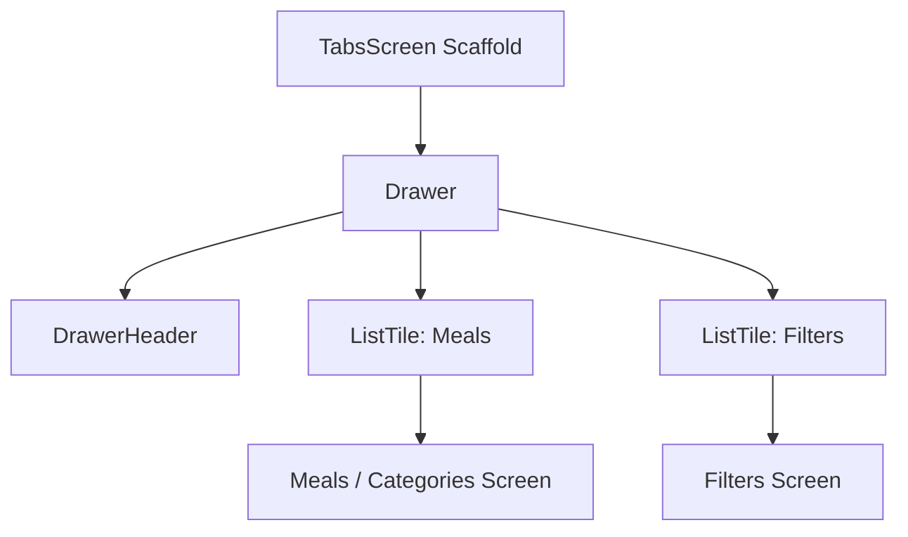
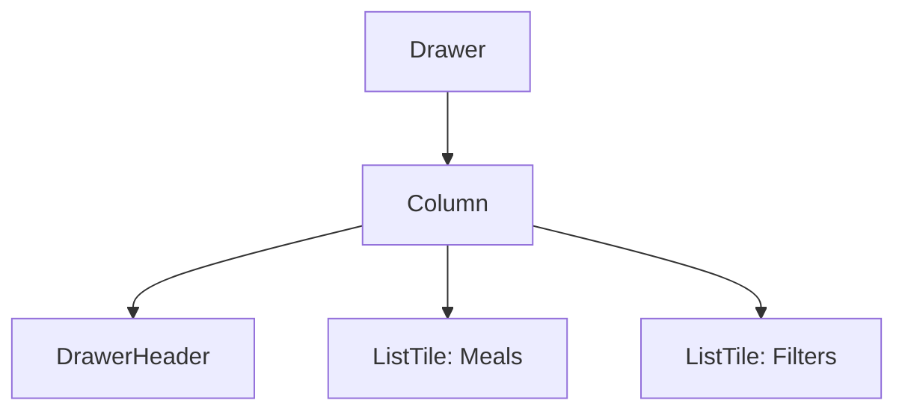
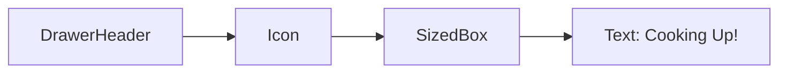
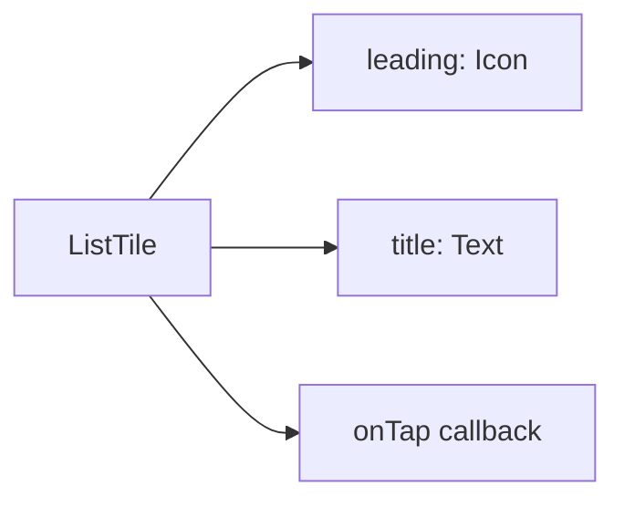
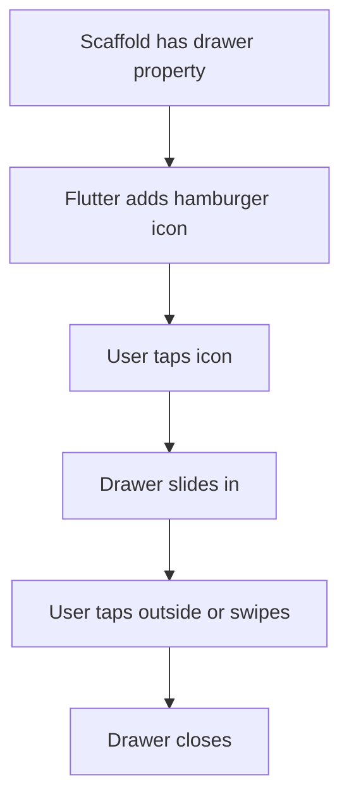
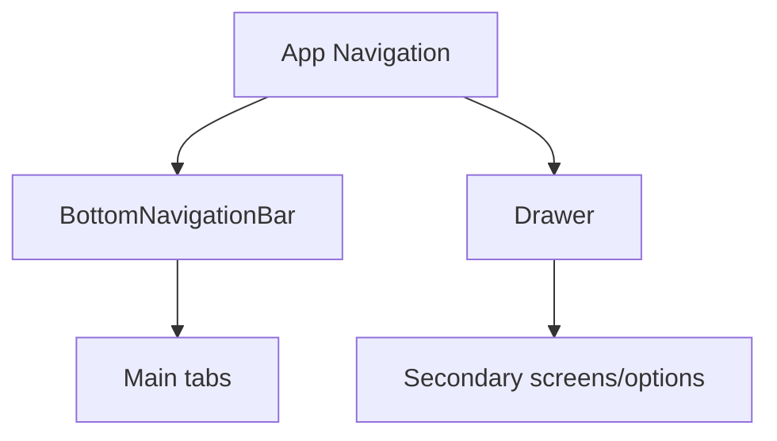

# Adding a Side Drawer

## Overview

This lecture introduces how to add a **side drawer** to a Flutter app.

A side drawer is a navigation panel that slides in from the side of the screen. It is commonly used to provide access to secondary screens, such as settings, filters, account pages, or other app sections.

In the Meals App, the drawer will be used to navigate between:

* Meals / Categories
* Filters

Flutter makes this easy because the `Scaffold` widget has a built-in `drawer` property.

---

## Goal

The app should show a hamburger menu icon in the `AppBar`.

When the user taps it, a drawer should slide in from the side.

```text
AppBar menu icon
→ Open drawer
→ Show navigation options
→ Tap an item
→ Navigate to another screen
```

---

## Drawer Navigation Structure



---

# Why Add the Drawer to `TabsScreen`?

Drawers are added to a `Scaffold`.

In this app, the main screen that owns the tab navigation is `TabsScreen`.

So if we want the drawer to be available on both main tabs, we add it to the `Scaffold` inside `TabsScreen`.

```dart
return Scaffold(
  appBar: AppBar(
    title: Text(activePageTitle),
  ),
  drawer: const MainDrawer(),
  body: activePage,
  bottomNavigationBar: BottomNavigationBar(
    // tab items
  ),
);
```

Once a `drawer` is added, Flutter automatically shows the hamburger menu icon in the `AppBar`.

---

# Step 1: Create a New Drawer Widget

Create a new file:

```text
lib/widgets/main_drawer.dart
```

This drawer is not a screen. It is a reusable widget that will be placed inside the `Scaffold`.

```dart
import 'package:flutter/material.dart';

class MainDrawer extends StatelessWidget {
  const MainDrawer({super.key});

  @override
  Widget build(BuildContext context) {
    return Drawer(
      child: Column(
        children: [
          // drawer content
        ],
      ),
    );
  }
}
```

---

## Why Use a Separate Widget?

The drawer can contain a lot of UI code.

Keeping it in a separate `MainDrawer` widget makes `TabsScreen` cleaner.

```text
TabsScreen = main layout and tab logic
MainDrawer = drawer UI and drawer links
```

---

# Step 2: Use Flutter's `Drawer` Widget

Flutter provides a built-in `Drawer` widget.

```dart
return Drawer(
  child: Column(
    children: [
      // drawer header
      // drawer items
    ],
  ),
);
```

The `Drawer` widget is already optimized for side navigation.

It automatically handles:

* Drawer width
* Full screen height
* Slide-in behavior
* Drawer shadow
* Closing when the user taps outside

---

## Drawer Layout



---

# Step 3: Add a `DrawerHeader`

The top part of the drawer should contain branding.

Flutter provides a `DrawerHeader` widget for this.

```dart
DrawerHeader(
  padding: const EdgeInsets.all(20),
  decoration: BoxDecoration(
    gradient: LinearGradient(
      colors: [
        Theme.of(context).colorScheme.primaryContainer,
        Theme.of(context).colorScheme.primaryContainer.withOpacity(0.8),
      ],
      begin: Alignment.topLeft,
      end: Alignment.bottomRight,
    ),
  ),
  child: Row(
    children: [
      Icon(
        Icons.fastfood,
        size: 48,
        color: Theme.of(context).colorScheme.primary,
      ),
      const SizedBox(width: 18),
      Text(
        'Cooking Up!',
        style: Theme.of(context).textTheme.titleLarge!.copyWith(
              color: Theme.of(context).colorScheme.primary,
            ),
      ),
    ],
  ),
),
```

---

## Drawer Header Structure



---

## Header Styling

The drawer header uses a gradient background.

```dart
decoration: BoxDecoration(
  gradient: LinearGradient(
    colors: [
      Theme.of(context).colorScheme.primaryContainer,
      Theme.of(context).colorScheme.primaryContainer.withOpacity(0.8),
    ],
    begin: Alignment.topLeft,
    end: Alignment.bottomRight,
  ),
),
```

This creates a subtle diagonal gradient from the top-left corner to the bottom-right corner.

---

# Step 4: Add Drawer Items with `ListTile`

Drawer navigation options are usually created with `ListTile`.

A `ListTile` is useful because it already supports a common row layout:

```text
leading icon + title text
```

Example:

```dart
ListTile(
  leading: Icon(
    Icons.restaurant,
    size: 26,
    color: Theme.of(context).colorScheme.onBackground,
  ),
  title: Text(
    'Meals',
    style: Theme.of(context).textTheme.titleSmall!.copyWith(
          color: Theme.of(context).colorScheme.onBackground,
          fontSize: 24,
        ),
  ),
  onTap: () {},
),
```

---

## `ListTile` Structure



---

# Step 5: Add the Meals Drawer Item

The first drawer item should take the user back to the meals or categories area.

```dart
ListTile(
  leading: Icon(
    Icons.restaurant,
    size: 26,
    color: Theme.of(context).colorScheme.onBackground,
  ),
  title: Text(
    'Meals',
    style: Theme.of(context).textTheme.titleSmall!.copyWith(
          color: Theme.of(context).colorScheme.onBackground,
          fontSize: 24,
        ),
  ),
  onTap: () {
    // Navigate to meals/categories later
  },
),
```

---

# Step 6: Add the Filters Drawer Item

The second drawer item should take the user to the filters screen.

```dart
ListTile(
  leading: Icon(
    Icons.settings,
    size: 26,
    color: Theme.of(context).colorScheme.onBackground,
  ),
  title: Text(
    'Filters',
    style: Theme.of(context).textTheme.titleSmall!.copyWith(
          color: Theme.of(context).colorScheme.onBackground,
          fontSize: 24,
        ),
  ),
  onTap: () {
    // Navigate to filters later
  },
),
```

---

# Final `MainDrawer` Example

```dart
import 'package:flutter/material.dart';

class MainDrawer extends StatelessWidget {
  const MainDrawer({super.key});

  @override
  Widget build(BuildContext context) {
    return Drawer(
      child: Column(
        children: [
          DrawerHeader(
            padding: const EdgeInsets.all(20),
            decoration: BoxDecoration(
              gradient: LinearGradient(
                colors: [
                  Theme.of(context).colorScheme.primaryContainer,
                  Theme.of(context)
                      .colorScheme
                      .primaryContainer
                      .withOpacity(0.8),
                ],
                begin: Alignment.topLeft,
                end: Alignment.bottomRight,
              ),
            ),
            child: Row(
              children: [
                Icon(
                  Icons.fastfood,
                  size: 48,
                  color: Theme.of(context).colorScheme.primary,
                ),
                const SizedBox(width: 18),
                Text(
                  'Cooking Up!',
                  style: Theme.of(context).textTheme.titleLarge!.copyWith(
                        color: Theme.of(context).colorScheme.primary,
                      ),
                ),
              ],
            ),
          ),
          ListTile(
            leading: Icon(
              Icons.restaurant,
              size: 26,
              color: Theme.of(context).colorScheme.onBackground,
            ),
            title: Text(
              'Meals',
              style: Theme.of(context).textTheme.titleSmall!.copyWith(
                    color: Theme.of(context).colorScheme.onBackground,
                    fontSize: 24,
                  ),
            ),
            onTap: () {},
          ),
          ListTile(
            leading: Icon(
              Icons.settings,
              size: 26,
              color: Theme.of(context).colorScheme.onBackground,
            ),
            title: Text(
              'Filters',
              style: Theme.of(context).textTheme.titleSmall!.copyWith(
                    color: Theme.of(context).colorScheme.onBackground,
                    fontSize: 24,
                  ),
            ),
            onTap: () {},
          ),
        ],
      ),
    );
  }
}
```

---

# Step 7: Add `MainDrawer` to `TabsScreen`

Import the drawer widget:

```dart
import '../widgets/main_drawer.dart';
```

Then add it to the `Scaffold` in `TabsScreen`.

```dart
return Scaffold(
  appBar: AppBar(
    title: Text(activePageTitle),
  ),
  drawer: const MainDrawer(),
  body: activePage,
  bottomNavigationBar: BottomNavigationBar(
    currentIndex: _selectedPageIndex,
    onTap: _selectPage,
    items: const [
      BottomNavigationBarItem(
        icon: Icon(Icons.set_meal),
        label: 'Categories',
      ),
      BottomNavigationBarItem(
        icon: Icon(Icons.star),
        label: 'Favorites',
      ),
    ],
  ),
);
```

---

## What Happens Automatically?

Once the drawer is connected to the `Scaffold`, Flutter automatically adds the hamburger menu button to the `AppBar`.

```text
Scaffold has drawer
→ AppBar shows menu icon automatically
→ User taps menu icon
→ Drawer opens
```

---

## Drawer Behavior



---

# Drawer Availability

Since the drawer is added to `TabsScreen`, it is available on the main tab pages:

| Screen                              | Drawer Available? | Reason                                    |
| ----------------------------------- | ----------------: | ----------------------------------------- |
| Categories tab                      |               Yes | It is inside `TabsScreen`                 |
| Favorites tab                       |               Yes | It is inside `TabsScreen`                 |
| Meals screen pushed from a category |                No | It has its own `Scaffold` and back button |
| Meal details screen                 |                No | It has its own `Scaffold` and back button |

This is the desired behavior.

The drawer is for main app navigation, while pushed screens use back navigation.

---

# Optional: Passing Navigation Logic with a Callback

A cleaner approach is to let `MainDrawer` only report which item was selected.

The parent screen can then decide what to do.

```dart
class MainDrawer extends StatelessWidget {
  const MainDrawer({
    super.key,
    required this.onSelectScreen,
  });

  final void Function(String identifier) onSelectScreen;

  @override
  Widget build(BuildContext context) {
    return Drawer(
      child: Column(
        children: [
          // header
          ListTile(
            leading: const Icon(Icons.restaurant),
            title: const Text('Meals'),
            onTap: () {
              onSelectScreen('meals');
            },
          ),
          ListTile(
            leading: const Icon(Icons.settings),
            title: const Text('Filters'),
            onTap: () {
              onSelectScreen('filters');
            },
          ),
        ],
      ),
    );
  }
}
```

Then `TabsScreen` can handle the selected drawer item.

```dart
void _setScreen(String identifier) {
  Navigator.of(context).pop();

  if (identifier == 'filters') {
    Navigator.of(context).push(
      MaterialPageRoute(
        builder: (ctx) => const FiltersScreen(),
      ),
    );
  }
}
```

This keeps navigation logic in the parent instead of hardcoding it inside the drawer widget.

---

# Important Widgets Used

| Widget            | Purpose                                                     |
| ----------------- | ----------------------------------------------------------- |
| `Drawer`          | Creates a side navigation panel                             |
| `DrawerHeader`    | Creates a header area inside the drawer                     |
| `Column`          | Places drawer content vertically                            |
| `ListTile`        | Creates tappable row items                                  |
| `Icon`            | Displays drawer item icons                                  |
| `Text`            | Displays drawer item labels                                 |
| `Scaffold.drawer` | Attaches the drawer to a screen                             |
| `AppBar`          | Automatically shows the hamburger icon when a drawer exists |

---

# Drawer vs Bottom Navigation

The app now uses two navigation patterns.

## Bottom Navigation

Used for primary app sections:

```text
Categories ↔ Favorites
```

## Drawer Navigation

Used for secondary navigation:

```text
Meals / Categories
Filters
```

---

## Navigation Pattern Comparison



---

# Summary

This lecture adds a side drawer to the Meals App.

The drawer is created with Flutter's built-in `Drawer` widget and attached to the `Scaffold` through the `drawer` property.

A custom `MainDrawer` widget is created to keep the drawer UI separate from the main screen logic. The drawer contains a branded `DrawerHeader` and two `ListTile` navigation items: Meals and Filters.

Once the drawer is added to the `Scaffold`, Flutter automatically shows the hamburger menu icon in the `AppBar`.

At this stage, the drawer items are visible and tappable. The next step is to connect those taps to actual navigation logic.
