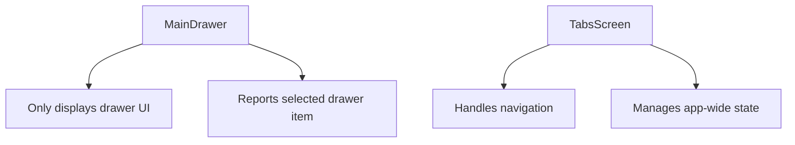
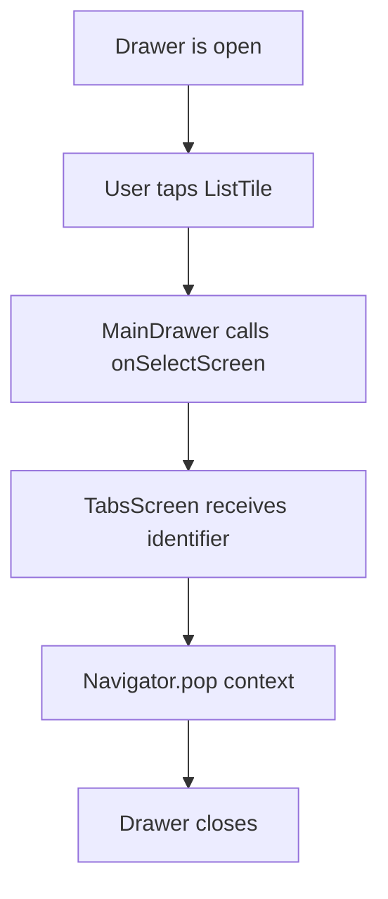
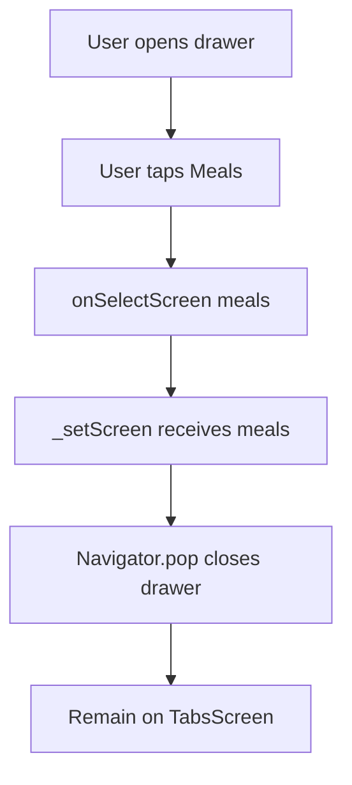
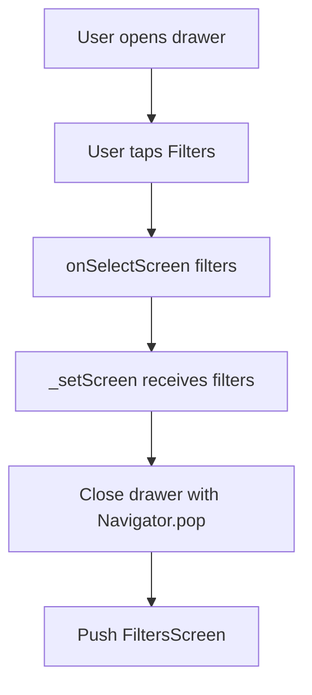
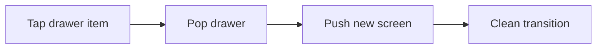
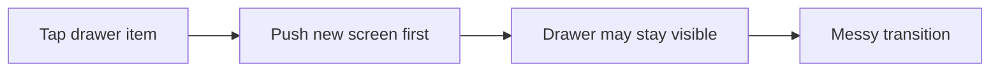
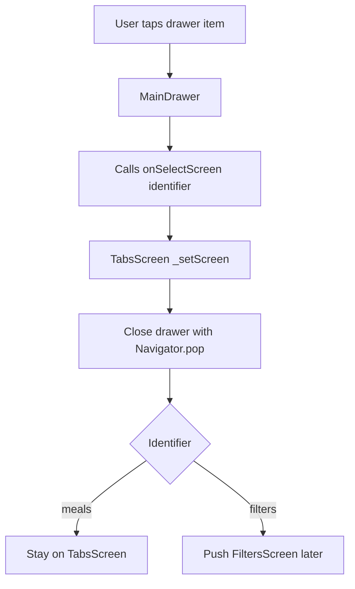

# Closing the Drawer Manually

## Overview

This lecture explains how to close the side drawer manually when the user taps a drawer item.

In the previous lecture, the drawer UI was created with two items:

* Meals
* Filters

Now, those items need to trigger navigation behavior.

However, instead of handling navigation directly inside `MainDrawer`, the drawer will send a selected screen identifier back to `TabsScreen`. Then `TabsScreen` decides what should happen.

This keeps navigation and state management logic centralized in the parent screen.

---

## Goal

When the user taps a drawer item:

```text id="twc3ip"
Open drawer
→ Tap drawer item
→ Close drawer
→ Optionally navigate to another screen
```

For example:

```text id="os2o8p"
Tap Meals → close drawer
Tap Filters → close drawer and open FiltersScreen
```

---

## Why Not Navigate Directly Inside `MainDrawer`?

It is possible to call `Navigator.push()` directly inside the drawer widget.

However, in this app, that is not ideal.

The app will soon need to manage filters. These filters affect which meals are shown when a user selects a category.

That filter state should live in `TabsScreen`, because `TabsScreen` is the central parent screen that manages app-wide state.

So instead of making `MainDrawer` decide navigation, we let it report what the user selected.

---

## Better Responsibility Separation



`MainDrawer` should only know:

```text id="6o8rt2"
The user selected Meals.
The user selected Filters.
```

`TabsScreen` should decide:

```text id="31upol"
Should we close the drawer?
Should we push another screen?
Should we update state?
```

---

# Step 1: Add a Callback to `MainDrawer`

In `main_drawer.dart`, add a new callback property.

```dart id="o8l2is"
final void Function(String identifier) onSelectScreen;
```

This function receives a `String` identifier.

The identifier tells the parent screen which drawer item was selected.

---

## Updated `MainDrawer` Constructor

```dart id="mw3dxm"
class MainDrawer extends StatelessWidget {
  const MainDrawer({
    super.key,
    required this.onSelectScreen,
  });

  final void Function(String identifier) onSelectScreen;

  @override
  Widget build(BuildContext context) {
    return Drawer(
      child: Column(
        children: [
          // drawer content
        ],
      ),
    );
  }
}
```

---

## Callback Meaning

```dart id="4v8af4"
void Function(String identifier)
```

This means:

```text id="ku4tf9"
A function that receives a String and returns nothing.
```

Example identifiers:

| Identifier  | Meaning                               |
| ----------- | ------------------------------------- |
| `'meals'`   | User selected the Meals drawer item   |
| `'filters'` | User selected the Filters drawer item |

---

# Step 2: Call the Callback from Drawer Items

Inside the Meals `ListTile`, call:

```dart id="k67cf4"
onSelectScreen('meals');
```

Inside the Filters `ListTile`, call:

```dart id="kqd44y"
onSelectScreen('filters');
```

---

## Updated Drawer Items

```dart id="x21g31"
ListTile(
  leading: Icon(
    Icons.restaurant,
    size: 26,
    color: Theme.of(context).colorScheme.onBackground,
  ),
  title: Text(
    'Meals',
    style: Theme.of(context).textTheme.titleSmall!.copyWith(
          color: Theme.of(context).colorScheme.onBackground,
          fontSize: 24,
        ),
  ),
  onTap: () {
    onSelectScreen('meals');
  },
),
ListTile(
  leading: Icon(
    Icons.settings,
    size: 26,
    color: Theme.of(context).colorScheme.onBackground,
  ),
  title: Text(
    'Filters',
    style: Theme.of(context).textTheme.titleSmall!.copyWith(
          color: Theme.of(context).colorScheme.onBackground,
          fontSize: 24,
        ),
  ),
  onTap: () {
    onSelectScreen('filters');
  },
),
```

---

# Step 3: Handle Drawer Selection in `TabsScreen`

In `tabs.dart`, create a method called `_setScreen`.

```dart id="3ror3p"
void _setScreen(String identifier) {
  Navigator.of(context).pop();

  if (identifier == 'filters') {
    // Navigate to FiltersScreen later
  }
}
```

This function receives the selected identifier from `MainDrawer`.

---

## Why Call `Navigator.pop(context)`?

The drawer is treated like a route overlay.

That means it can be closed by popping it from the navigation stack.

```dart id="wtd465"
Navigator.of(context).pop();
```

or:

```dart id="qc9281"
Navigator.pop(context);
```

This closes the drawer.

---

## Drawer Closing Flow



---

# Step 4: Pass `_setScreen` to `MainDrawer`

In `TabsScreen`, pass `_setScreen` to the drawer.

```dart id="uxke8g"
drawer: MainDrawer(
  onSelectScreen: _setScreen,
),
```

Because `_setScreen` is a runtime function, this drawer can no longer be `const`.

---

## Updated `Scaffold` in `TabsScreen`

```dart id="03a1z3"
return Scaffold(
  appBar: AppBar(
    title: Text(activePageTitle),
  ),
  drawer: MainDrawer(
    onSelectScreen: _setScreen,
  ),
  body: activePage,
  bottomNavigationBar: BottomNavigationBar(
    currentIndex: _selectedPageIndex,
    onTap: _selectPage,
    items: const [
      BottomNavigationBarItem(
        icon: Icon(Icons.set_meal),
        label: 'Categories',
      ),
      BottomNavigationBarItem(
        icon: Icon(Icons.star),
        label: 'Favorites',
      ),
    ],
  ),
);
```

---

# Step 5: Closing the Drawer for the Meals Item

When the user taps **Meals**, they are already in the main meals area of the app.

So for now, the only thing we need to do is close the drawer.

```dart id="kgvx5c"
void _setScreen(String identifier) {
  Navigator.of(context).pop();

  if (identifier == 'filters') {
    // Navigate to filters screen later
  }
}
```

If the identifier is not `'filters'`, nothing else happens.

The drawer simply closes.

---

## Meals Drawer Behavior



---

# Step 6: Prepare for the Filters Screen

If the user taps **Filters**, the app should close the drawer and then navigate to a new `FiltersScreen`.

The screen has not been added yet, so the navigation will be completed after creating it.

The future logic will look like this:

```dart id="um70h6"
void _setScreen(String identifier) {
  Navigator.of(context).pop();

  if (identifier == 'filters') {
    Navigator.of(context).push(
      MaterialPageRoute(
        builder: (ctx) => const FiltersScreen(),
      ),
    );
  }
}
```

---

## Filters Drawer Behavior



---

# Why Close the Drawer Before Navigating?

If the drawer is still open while the app navigates to another screen, the transition can look messy.

The drawer may remain visually stacked over the next page.

So the correct order is:

```text id="wzlfmn"
1. Close drawer
2. Push new screen
```

In code:

```dart id="6ykk64"
Navigator.of(context).pop();

Navigator.of(context).push(
  MaterialPageRoute(
    builder: (ctx) => const FiltersScreen(),
  ),
);
```

---

## Correct Order



---

## Incorrect Order



---

# Alternative: `Scaffold.of(context).closeDrawer()`

Another way to close the drawer is:

```dart id="q384u0"
Scaffold.of(context).closeDrawer();
```

This is more explicit because it directly says:

```text id="nyrkch"
Close the drawer.
```

However, using `Navigator.pop(context)` is very common because the drawer behaves like something placed on top of the current route.

---

# `Navigator.pop` vs `closeDrawer`

| Method                               | Meaning                                       |
| ------------------------------------ | --------------------------------------------- |
| `Navigator.pop(context)`             | Pops the drawer route/overlay                 |
| `Scaffold.of(context).closeDrawer()` | Explicitly closes the drawer                  |
| `Navigator.push(...)`                | Opens a new screen                            |
| `Navigator.pushReplacement(...)`     | Replaces the current screen with a new screen |

For this lecture, `Navigator.pop(context)` is used.

---

# Final `MainDrawer`

```dart id="fszcr3"
import 'package:flutter/material.dart';

class MainDrawer extends StatelessWidget {
  const MainDrawer({
    super.key,
    required this.onSelectScreen,
  });

  final void Function(String identifier) onSelectScreen;

  @override
  Widget build(BuildContext context) {
    return Drawer(
      child: Column(
        children: [
          DrawerHeader(
            padding: const EdgeInsets.all(20),
            decoration: BoxDecoration(
              gradient: LinearGradient(
                colors: [
                  Theme.of(context).colorScheme.primaryContainer,
                  Theme.of(context)
                      .colorScheme
                      .primaryContainer
                      .withOpacity(0.8),
                ],
                begin: Alignment.topLeft,
                end: Alignment.bottomRight,
              ),
            ),
            child: Row(
              children: [
                Icon(
                  Icons.fastfood,
                  size: 48,
                  color: Theme.of(context).colorScheme.primary,
                ),
                const SizedBox(width: 18),
                Text(
                  'Cooking Up!',
                  style: Theme.of(context).textTheme.titleLarge!.copyWith(
                        color: Theme.of(context).colorScheme.primary,
                      ),
                ),
              ],
            ),
          ),
          ListTile(
            leading: Icon(
              Icons.restaurant,
              size: 26,
              color: Theme.of(context).colorScheme.onBackground,
            ),
            title: Text(
              'Meals',
              style: Theme.of(context).textTheme.titleSmall!.copyWith(
                    color: Theme.of(context).colorScheme.onBackground,
                    fontSize: 24,
                  ),
            ),
            onTap: () {
              onSelectScreen('meals');
            },
          ),
          ListTile(
            leading: Icon(
              Icons.settings,
              size: 26,
              color: Theme.of(context).colorScheme.onBackground,
            ),
            title: Text(
              'Filters',
              style: Theme.of(context).textTheme.titleSmall!.copyWith(
                    color: Theme.of(context).colorScheme.onBackground,
                    fontSize: 24,
                  ),
            ),
            onTap: () {
              onSelectScreen('filters');
            },
          ),
        ],
      ),
    );
  }
}
```

---

# Final `_setScreen` Method in `TabsScreen`

```dart id="6mkmhw"
void _setScreen(String identifier) {
  Navigator.of(context).pop();

  if (identifier == 'filters') {
    // Navigate to FiltersScreen later
  }
}
```

Later, after creating `FiltersScreen`, this method will be extended:

```dart id="7xpe8w"
void _setScreen(String identifier) {
  Navigator.of(context).pop();

  if (identifier == 'filters') {
    Navigator.of(context).push(
      MaterialPageRoute(
        builder: (ctx) => const FiltersScreen(),
      ),
    );
  }
}
```

---

# Full Communication Flow



---

# Important Concepts

| Concept                      | Meaning                                                |
| ---------------------------- | ------------------------------------------------------ |
| Drawer item callback         | Function called when a drawer item is tapped           |
| Identifier                   | String used to tell the parent which item was selected |
| `Navigator.pop(context)`     | Closes the drawer                                      |
| `Navigator.push(...)`        | Opens a new screen                                     |
| Parent-controlled navigation | Parent widget decides where to navigate                |
| Centralized state            | App-wide data stays in a common parent widget          |

---

# Summary

This lecture connects the drawer items to parent-controlled navigation logic.

Instead of navigating directly inside `MainDrawer`, the drawer calls an `onSelectScreen` callback and passes a string identifier such as `'meals'` or `'filters'`.

`TabsScreen` receives that identifier in `_setScreen`.

The drawer is closed manually with:

```dart id="pdur4j"
Navigator.of(context).pop();
```

For the Meals item, closing the drawer is enough because the user is already in the main meals area.

For the Filters item, the app will later close the drawer and push a new `FiltersScreen`.

This pattern keeps drawer UI separate from navigation and app-wide state management.
