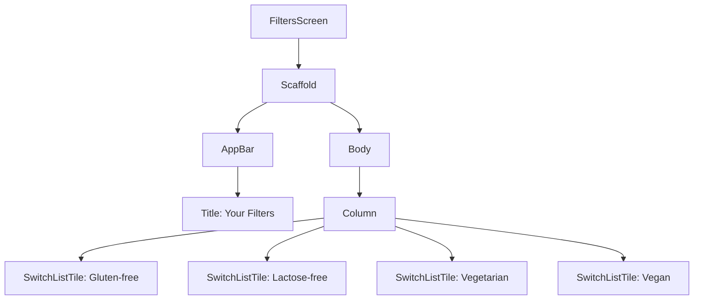
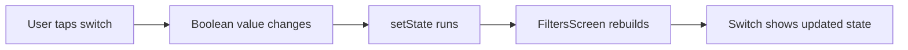
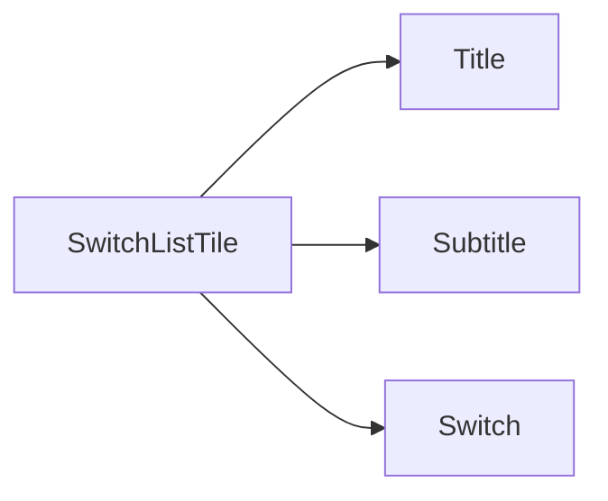
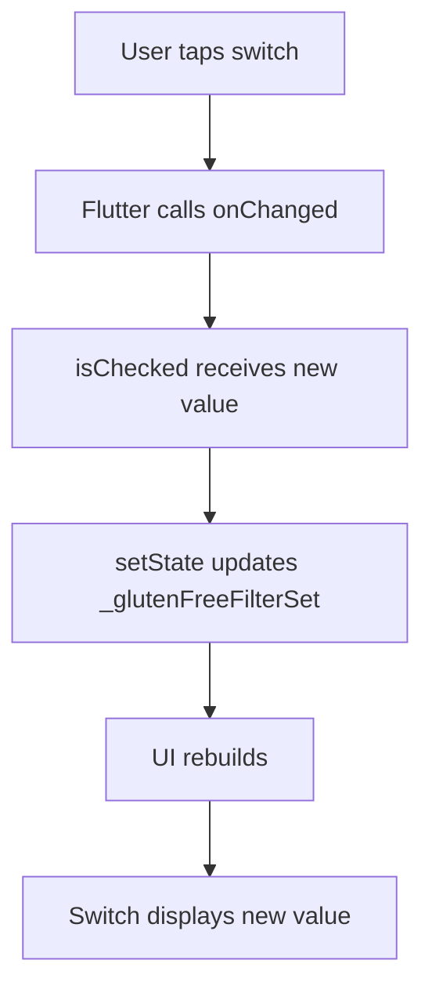
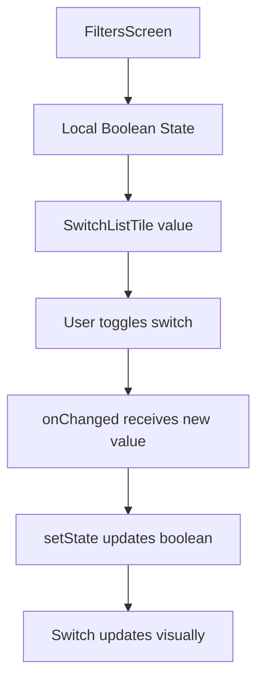

# Adding a Filter Item

## Overview

This lecture introduces the `FiltersScreen`, a new screen where users can enable or disable meal filters.

The filters will later control which meals are shown in the app. For example, users will be able to show only meals that are:

* Gluten-free
* Lactose-free
* Vegetarian
* Vegan

To build this UI, the lecture uses Flutter's `SwitchListTile` widget. A `SwitchListTile` combines a text label, an optional subtitle, and a switch into one convenient row.

---

## Goal

The goal is to create a filters screen like this:

```text
Your Filters

Gluten-free
Only include gluten-free meals.        [switch]

Lactose-free
Only include lactose-free meals.       [switch]

Vegetarian
Only include vegetarian meals.         [switch]

Vegan
Only include vegan meals.              [switch]
```

Each switch stores a boolean value:

```text
true  = filter is active
false = filter is inactive
```

---

## Filter Screen Structure



---

# Step 1: Create `filters.dart`

Create a new file:

```text
lib/screens/filters.dart
```

This file will contain the new `FiltersScreen`.

---

# Step 2: Create a `StatefulWidget`

The `FiltersScreen` must be a `StatefulWidget` because the switches can change.

When the user turns a switch on or off, the UI needs to update.

```dart
import 'package:flutter/material.dart';

class FiltersScreen extends StatefulWidget {
  const FiltersScreen({super.key});

  @override
  State<FiltersScreen> createState() {
    return _FiltersScreenState();
  }
}

class _FiltersScreenState extends State<FiltersScreen> {
  @override
  Widget build(BuildContext context) {
    return Scaffold(
      appBar: AppBar(
        title: const Text('Your Filters'),
      ),
      body: const Column(
        children: [],
      ),
    );
  }
}
```

---

## Why `StatefulWidget`?

A filter switch needs to remember whether it is currently on or off.

That value can change while the app is running.



A `StatelessWidget` cannot manage this changing value, so we use a `StatefulWidget`.

---

# Step 3: Add Local Filter State

Inside `_FiltersScreenState`, create a boolean variable for the gluten-free filter.

```dart
class _FiltersScreenState extends State<FiltersScreen> {
  var _glutenFreeFilterSet = false;

  @override
  Widget build(BuildContext context) {
    // UI code
  }
}
```

At first, the filter is set to `false`.

```text
_glutenFreeFilterSet = false
```

This means the gluten-free filter is not active by default.

---

# Step 4: Add a `Scaffold`

Because `FiltersScreen` is a full screen, it should return a `Scaffold`.

```dart
return Scaffold(
  appBar: AppBar(
    title: const Text('Your Filters'),
  ),
  body: Column(
    children: [
      // filter items
    ],
  ),
);
```

The `Scaffold` gives the screen:

* An app bar
* A body area
* Later, access to the drawer if needed

---

# Step 5: Add a `SwitchListTile`

Flutter provides a convenient widget called `SwitchListTile`.

It combines:

* A title
* A subtitle
* A switch
* An `onChanged` callback

```dart
SwitchListTile(
  value: _glutenFreeFilterSet,
  onChanged: (isChecked) {
    setState(() {
      _glutenFreeFilterSet = isChecked;
    });
  },
  title: const Text('Gluten-free'),
  subtitle: const Text('Only include gluten-free meals.'),
)
```

---

## What is `SwitchListTile`?

`SwitchListTile` is useful for settings screens.

Instead of manually creating a `Row`, a `Text`, and a `Switch`, Flutter gives us one widget that already combines them.



---

# Step 6: Understand `value`

The `value` controls whether the switch is currently on or off.

```dart
value: _glutenFreeFilterSet,
```

If `_glutenFreeFilterSet` is `true`, the switch is on.

If `_glutenFreeFilterSet` is `false`, the switch is off.

```text
true  → switch on
false → switch off
```

---

# Step 7: Understand `onChanged`

The `onChanged` function runs whenever the user taps the switch.

```dart
onChanged: (isChecked) {
  setState(() {
    _glutenFreeFilterSet = isChecked;
  });
},
```

Flutter automatically passes the new switch value into this function.

The parameter name is up to you:

```dart
(isChecked) {}
```

This value will always be a boolean.

---

## Switch Update Flow



---

# Step 8: Style the Filter Title

The `title` is the main label of the switch.

```dart
title: Text(
  'Gluten-free',
  style: Theme.of(context).textTheme.titleLarge!.copyWith(
        color: Theme.of(context).colorScheme.onBackground,
      ),
),
```

Using `Theme.of(context)` keeps the style consistent with the rest of the app.

---

# Step 9: Add a Subtitle

The `subtitle` gives extra explanation.

```dart
subtitle: Text(
  'Only include gluten-free meals.',
  style: Theme.of(context).textTheme.labelMedium!.copyWith(
        color: Theme.of(context).colorScheme.onBackground,
      ),
),
```

The subtitle is usually smaller than the title.

---

# Step 10: Set the Active Switch Color

The `activeColor` controls the color of the switch when it is turned on.

```dart
activeColor: Theme.of(context).colorScheme.tertiary,
```

This makes the switch follow the app's theme colors.

---

# Step 11: Add Padding

The `contentPadding` controls the spacing inside the list tile.

```dart
contentPadding: const EdgeInsets.only(
  left: 34,
  right: 22,
),
```

This gives the switch row better spacing from the screen edges.

---

# First Filter Item Example

```dart
SwitchListTile(
  value: _glutenFreeFilterSet,
  onChanged: (isChecked) {
    setState(() {
      _glutenFreeFilterSet = isChecked;
    });
  },
  title: Text(
    'Gluten-free',
    style: Theme.of(context).textTheme.titleLarge!.copyWith(
          color: Theme.of(context).colorScheme.onBackground,
        ),
  ),
  subtitle: Text(
    'Only include gluten-free meals.',
    style: Theme.of(context).textTheme.labelMedium!.copyWith(
          color: Theme.of(context).colorScheme.onBackground,
        ),
  ),
  activeColor: Theme.of(context).colorScheme.tertiary,
  contentPadding: const EdgeInsets.only(
    left: 34,
    right: 22,
  ),
)
```

---

# Full Basic `FiltersScreen`

```dart
import 'package:flutter/material.dart';

class FiltersScreen extends StatefulWidget {
  const FiltersScreen({super.key});

  @override
  State<FiltersScreen> createState() {
    return _FiltersScreenState();
  }
}

class _FiltersScreenState extends State<FiltersScreen> {
  var _glutenFreeFilterSet = false;

  @override
  Widget build(BuildContext context) {
    return Scaffold(
      appBar: AppBar(
        title: const Text('Your Filters'),
      ),
      body: Column(
        children: [
          SwitchListTile(
            value: _glutenFreeFilterSet,
            onChanged: (isChecked) {
              setState(() {
                _glutenFreeFilterSet = isChecked;
              });
            },
            title: Text(
              'Gluten-free',
              style: Theme.of(context).textTheme.titleLarge!.copyWith(
                    color: Theme.of(context).colorScheme.onBackground,
                  ),
            ),
            subtitle: Text(
              'Only include gluten-free meals.',
              style: Theme.of(context).textTheme.labelMedium!.copyWith(
                    color: Theme.of(context).colorScheme.onBackground,
                  ),
            ),
            activeColor: Theme.of(context).colorScheme.tertiary,
            contentPadding: const EdgeInsets.only(
              left: 34,
              right: 22,
            ),
          ),
        ],
      ),
    );
  }
}
```

---

# Adding More Filters

The same pattern can be repeated for the other filters.

```dart
var _glutenFreeFilterSet = false;
var _lactoseFreeFilterSet = false;
var _vegetarianFilterSet = false;
var _veganFilterSet = false;
```

Each switch will have its own boolean state.

---

## Filter State Table

| State Variable          | Filter       |
| ----------------------- | ------------ |
| `_glutenFreeFilterSet`  | Gluten-free  |
| `_lactoseFreeFilterSet` | Lactose-free |
| `_vegetarianFilterSet`  | Vegetarian   |
| `_veganFilterSet`       | Vegan        |

---

# Full Version with Four Filters

```dart
import 'package:flutter/material.dart';

class FiltersScreen extends StatefulWidget {
  const FiltersScreen({super.key});

  @override
  State<FiltersScreen> createState() {
    return _FiltersScreenState();
  }
}

class _FiltersScreenState extends State<FiltersScreen> {
  var _glutenFreeFilterSet = false;
  var _lactoseFreeFilterSet = false;
  var _vegetarianFilterSet = false;
  var _veganFilterSet = false;

  @override
  Widget build(BuildContext context) {
    return Scaffold(
      appBar: AppBar(
        title: const Text('Your Filters'),
      ),
      body: Column(
        children: [
          SwitchListTile(
            value: _glutenFreeFilterSet,
            onChanged: (isChecked) {
              setState(() {
                _glutenFreeFilterSet = isChecked;
              });
            },
            title: Text(
              'Gluten-free',
              style: Theme.of(context).textTheme.titleLarge!.copyWith(
                    color: Theme.of(context).colorScheme.onBackground,
                  ),
            ),
            subtitle: Text(
              'Only include gluten-free meals.',
              style: Theme.of(context).textTheme.labelMedium!.copyWith(
                    color: Theme.of(context).colorScheme.onBackground,
                  ),
            ),
            activeColor: Theme.of(context).colorScheme.tertiary,
            contentPadding: const EdgeInsets.only(left: 34, right: 22),
          ),
          SwitchListTile(
            value: _lactoseFreeFilterSet,
            onChanged: (isChecked) {
              setState(() {
                _lactoseFreeFilterSet = isChecked;
              });
            },
            title: Text(
              'Lactose-free',
              style: Theme.of(context).textTheme.titleLarge!.copyWith(
                    color: Theme.of(context).colorScheme.onBackground,
                  ),
            ),
            subtitle: Text(
              'Only include lactose-free meals.',
              style: Theme.of(context).textTheme.labelMedium!.copyWith(
                    color: Theme.of(context).colorScheme.onBackground,
                  ),
            ),
            activeColor: Theme.of(context).colorScheme.tertiary,
            contentPadding: const EdgeInsets.only(left: 34, right: 22),
          ),
          SwitchListTile(
            value: _vegetarianFilterSet,
            onChanged: (isChecked) {
              setState(() {
                _vegetarianFilterSet = isChecked;
              });
            },
            title: Text(
              'Vegetarian',
              style: Theme.of(context).textTheme.titleLarge!.copyWith(
                    color: Theme.of(context).colorScheme.onBackground,
                  ),
            ),
            subtitle: Text(
              'Only include vegetarian meals.',
              style: Theme.of(context).textTheme.labelMedium!.copyWith(
                    color: Theme.of(context).colorScheme.onBackground,
                  ),
            ),
            activeColor: Theme.of(context).colorScheme.tertiary,
            contentPadding: const EdgeInsets.only(left: 34, right: 22),
          ),
          SwitchListTile(
            value: _veganFilterSet,
            onChanged: (isChecked) {
              setState(() {
                _veganFilterSet = isChecked;
              });
            },
            title: Text(
              'Vegan',
              style: Theme.of(context).textTheme.titleLarge!.copyWith(
                    color: Theme.of(context).colorScheme.onBackground,
                  ),
            ),
            subtitle: Text(
              'Only include vegan meals.',
              style: Theme.of(context).textTheme.labelMedium!.copyWith(
                    color: Theme.of(context).colorScheme.onBackground,
                  ),
            ),
            activeColor: Theme.of(context).colorScheme.tertiary,
            contentPadding: const EdgeInsets.only(left: 34, right: 22),
          ),
        ],
      ),
    );
  }
}
```

---

# Reducing Repetition with a Reusable Filter Item

Because each filter row uses almost the same code, we can later extract it into a reusable widget.

For example:

```dart
class FilterItem extends StatelessWidget {
  const FilterItem({
    super.key,
    required this.title,
    required this.subtitle,
    required this.value,
    required this.onChanged,
  });

  final String title;
  final String subtitle;
  final bool value;
  final void Function(bool isChecked) onChanged;

  @override
  Widget build(BuildContext context) {
    return SwitchListTile(
      value: value,
      onChanged: onChanged,
      title: Text(
        title,
        style: Theme.of(context).textTheme.titleLarge!.copyWith(
              color: Theme.of(context).colorScheme.onBackground,
            ),
      ),
      subtitle: Text(
        subtitle,
        style: Theme.of(context).textTheme.labelMedium!.copyWith(
              color: Theme.of(context).colorScheme.onBackground,
            ),
      ),
      activeColor: Theme.of(context).colorScheme.tertiary,
      contentPadding: const EdgeInsets.only(
        left: 34,
        right: 22,
      ),
    );
  }
}
```

Then the screen becomes cleaner:

```dart
FilterItem(
  title: 'Gluten-free',
  subtitle: 'Only include gluten-free meals.',
  value: _glutenFreeFilterSet,
  onChanged: (isChecked) {
    setState(() {
      _glutenFreeFilterSet = isChecked;
    });
  },
)
```

---

# Using an Enum for Filters

Instead of relying on string keys, a cleaner approach is to define a `Filter` enum.

```dart
enum Filter {
  glutenFree,
  lactoseFree,
  vegetarian,
  vegan,
}
```

This makes the filter keys type-safe.

Later, we can store all filters in a map:

```dart
Map<Filter, bool> selectedFilters = {
  Filter.glutenFree: false,
  Filter.lactoseFree: false,
  Filter.vegetarian: false,
  Filter.vegan: false,
};
```

---

## Why Use an Enum?

Without an enum, we might use strings:

```dart
'glutenFree'
'vegetarian'
```

But strings can easily lead to typos.

```dart
'gluttenFree' // typo
```

With an enum, Dart can help catch mistakes.

```dart
Filter.glutenFree
```

---

# Filter State Mental Model



---

# Important Widgets and Concepts

| Widget / Concept    | Purpose                                   |
| ------------------- | ----------------------------------------- |
| `FiltersScreen`     | Screen for setting meal filters           |
| `StatefulWidget`    | Needed because switches change over time  |
| `SwitchListTile`    | Displays a switch with title and subtitle |
| `value`             | Controls whether the switch is on or off  |
| `onChanged`         | Runs when the user toggles the switch     |
| `setState()`        | Updates state and rebuilds the UI         |
| `Theme.of(context)` | Uses app-wide theme styling               |
| `Filter enum`       | Represents filter options safely          |

---

# Summary

This lecture creates the first version of the `FiltersScreen`.

The screen uses a `Scaffold`, an `AppBar`, and a `Column` of `SwitchListTile` widgets. Each filter is controlled by a boolean state variable.

When the user toggles a switch, the `onChanged` function receives the new value and updates the state with `setState()`.

This gives the app a working UI for filter settings and prepares the next step: connecting those filters to the actual meal list.
