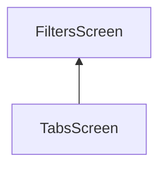
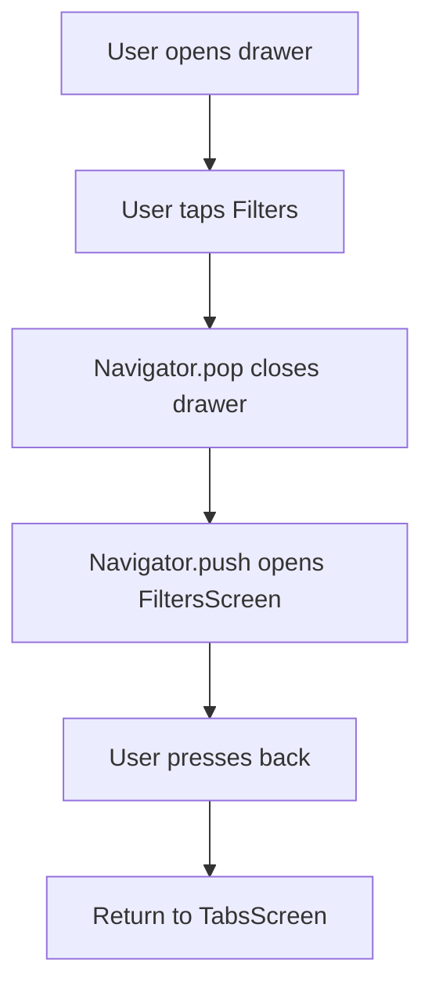
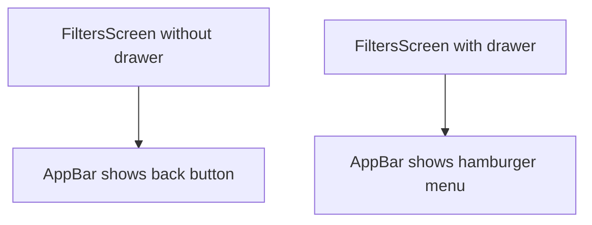
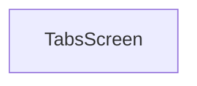
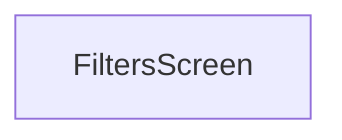
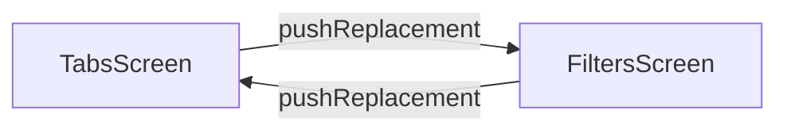
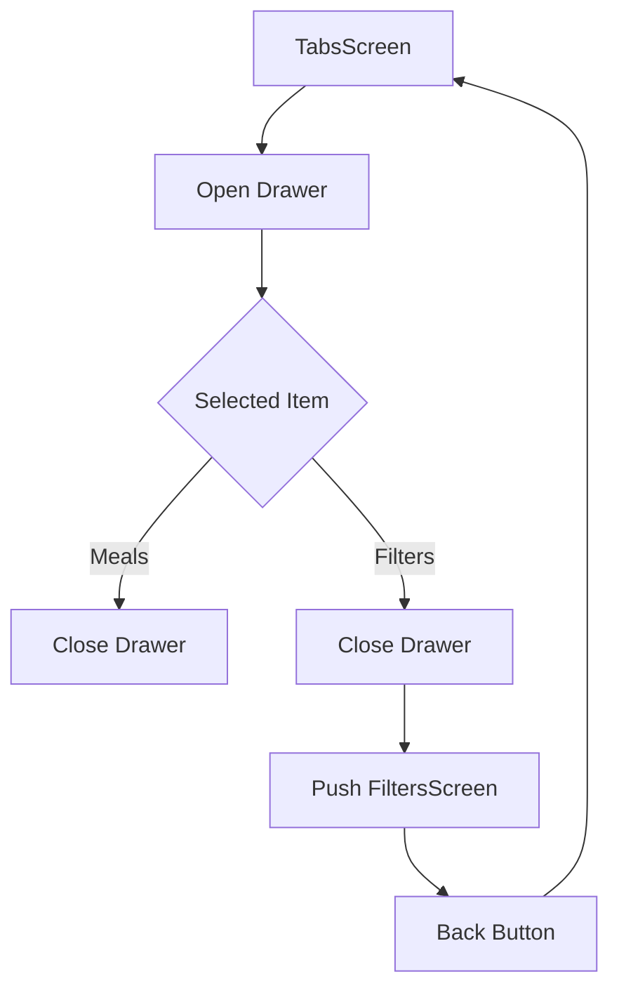

# Replacing Screens Instead of Pushing

## Overview

This lecture explains the difference between `Navigator.push()` and `Navigator.pushReplacement()` in Flutter.

In the Meals App, the drawer can be used to navigate from the main tabs screen to the filters screen. At first, this navigation is done with `Navigator.push()`, which places the `FiltersScreen` on top of the existing screen stack.

However, Flutter also provides `Navigator.pushReplacement()`, which replaces the current screen instead of stacking a new one on top.

Understanding the difference is important because it changes how the back button behaves.

---

## Goal

The goal is to understand two navigation behaviors:

```text
Navigator.push()
→ Add a new screen on top of the current screen
→ Back button returns to the previous screen
```

```text
Navigator.pushReplacement()
→ Replace the current screen with a new screen
→ Back button cannot return to the replaced screen
```

---

## Navigation Stack Mental Model

Flutter navigation works like a stack.

When a screen is pushed, it is placed on top of the current screen.



The top screen is the currently visible screen.

If the user presses back, `FiltersScreen` is popped, and the app returns to `TabsScreen`.

---

# Step 1: Navigate to `FiltersScreen` from the Drawer

In `tabs.dart`, when the drawer item has the identifier `'filters'`, navigate to the `FiltersScreen`.

```dart
void _setScreen(String identifier) {
  if (identifier == 'filters') {
    Navigator.of(context).push(
      MaterialPageRoute(
        builder: (ctx) => const FiltersScreen(),
      ),
    );
  }
}
```

This loads the filters screen when the user taps the Filters drawer item.

---

## Required Import

To use `FiltersScreen`, import the file:

```dart
import './filters.dart';
```

Now `TabsScreen` can navigate to the filters screen.

---

# Problem: The Drawer Stays Open

If you navigate without closing the drawer first, the app can behave strangely.

For example:

```text
Open drawer
→ Tap Filters
→ FiltersScreen opens
→ Press back
→ Drawer may still be open
```

This happens because the drawer was never closed before navigating.

---

# Step 2: Close the Drawer Before Navigating

The drawer should be closed before pushing the filters screen.

```dart
void _setScreen(String identifier) {
  Navigator.of(context).pop();

  if (identifier == 'filters') {
    Navigator.of(context).push(
      MaterialPageRoute(
        builder: (ctx) => const FiltersScreen(),
      ),
    );
  }
}
```

The first line closes the drawer:

```dart
Navigator.of(context).pop();
```

Then, if the selected item is Filters, the app pushes the `FiltersScreen`.

---

## Correct Drawer Navigation Flow



---

# Why `Navigator.pop()` Closes the Drawer

In Flutter, a drawer behaves like an overlay route.

So when the drawer is open, calling:

```dart
Navigator.of(context).pop();
```

removes the drawer from the stack.

This is similar to closing a dialog or modal.

---

# Cleaner `_setScreen` Logic

Since the drawer should always close no matter which drawer item was selected, call `Navigator.pop()` at the beginning of `_setScreen`.

```dart
void _setScreen(String identifier) {
  Navigator.of(context).pop();

  if (identifier == 'filters') {
    Navigator.of(context).push(
      MaterialPageRoute(
        builder: (ctx) => const FiltersScreen(),
      ),
    );
  }
}
```

If the user selects Meals, the drawer simply closes.

If the user selects Filters, the drawer closes and the filters screen opens.

---

## Drawer Item Behavior

| Drawer Item | Behavior                                    |
| ----------- | ------------------------------------------- |
| Meals       | Close the drawer only                       |
| Filters     | Close the drawer, then open `FiltersScreen` |

---

# Step 3: Optional Drawer on `FiltersScreen`

It is possible to also add the drawer to the `FiltersScreen`.

```dart
Scaffold(
  appBar: AppBar(
    title: const Text('Your Filters'),
  ),
  drawer: MainDrawer(
    onSelectScreen: (identifier) {
      Navigator.of(context).pop();

      if (identifier == 'meals') {
        Navigator.of(context).push(
          MaterialPageRoute(
            builder: (ctx) => const TabsScreen(),
          ),
        );
      }
    },
  ),
  body: ...
)
```

If a drawer is added to the `FiltersScreen`, Flutter replaces the back button with the drawer menu icon.

---

## Drawer vs Back Button



If a screen has a drawer, the `AppBar` usually shows the drawer icon.

If a screen was pushed and has no drawer, the `AppBar` shows the back button.

---

# Push Navigation Behavior

If you use `Navigator.push()`, the new screen is added on top of the current screen.

```dart
Navigator.of(context).push(
  MaterialPageRoute(
    builder: (ctx) => const FiltersScreen(),
  ),
);
```

## Stack with `push()`


The user can go back from `FiltersScreen` to `TabsScreen`.

This is useful when the filters screen feels like a sub-page of the main app.

---

# Push Replacement Navigation Behavior

Flutter also provides `pushReplacement()`.

```dart
Navigator.of(context).pushReplacement(
  MaterialPageRoute(
    builder: (ctx) => const FiltersScreen(),
  ),
);
```

This does not place the new screen on top of the old one.

Instead, it replaces the current screen.

---

## Stack with `pushReplacement()`

Before replacement:



After replacement:



`TabsScreen` is removed from the stack.

So pressing the Android back button will not return to `TabsScreen`.

Instead, the app may close because there is no previous screen to return to.

---

# `push()` vs `pushReplacement()`

| Method                        | What It Does                | Back Button Behavior              |
| ----------------------------- | --------------------------- | --------------------------------- |
| `Navigator.push()`            | Adds a new screen on top    | Goes back to previous screen      |
| `Navigator.pushReplacement()` | Replaces the current screen | Cannot go back to replaced screen |

---

# When to Use `Navigator.push()`

Use `push()` when the user is moving deeper into a flow.

Examples:

```text
Categories → Meals
Meals → Meal Details
TabsScreen → FiltersScreen
```

In these cases, the user should usually be able to go back.

```dart
Navigator.of(context).push(
  MaterialPageRoute(
    builder: (ctx) => const FiltersScreen(),
  ),
);
```

---

# When to Use `Navigator.pushReplacement()`

Use `pushReplacement()` when the previous screen should no longer be available.

Common examples:

```text
LoginScreen → HomeScreen
OnboardingScreen → MainAppScreen
SplashScreen → TabsScreen
```

In those flows, the user usually should not go back to the login, onboarding, or splash screen.

```dart
Navigator.of(context).pushReplacement(
  MaterialPageRoute(
    builder: (ctx) => const TabsScreen(),
  ),
);
```

---

# Optional: Replacing Between Drawer Destinations

If the app uses the drawer as the main navigation mechanism, you might want drawer items to replace screens.

For example:

```dart
Navigator.of(context).pushReplacement(
  MaterialPageRoute(
    builder: (ctx) => const FiltersScreen(),
  ),
);
```

Then from `FiltersScreen` back to `TabsScreen`:

```dart
Navigator.of(context).pushReplacement(
  MaterialPageRoute(
    builder: (ctx) => const TabsScreen(),
  ),
);
```

This creates a drawer-style navigation flow where screens replace each other instead of stacking.

---

## Replacement Navigation Flow



The back button does not move between these screens because each screen replaces the previous one.

---

# Final Choice for This App

In this lecture, the preferred behavior is:

```text
TabsScreen
→ open drawer
→ tap Filters
→ push FiltersScreen
→ use back button to return to TabsScreen
```

So the app uses:

```dart
Navigator.of(context).push(...)
```

not:

```dart
Navigator.of(context).pushReplacement(...)
```

This keeps the back button available on the filters screen.

---

# Final `_setScreen` Method

```dart
void _setScreen(String identifier) {
  Navigator.of(context).pop();

  if (identifier == 'filters') {
    Navigator.of(context).push(
      MaterialPageRoute(
        builder: (ctx) => const FiltersScreen(),
      ),
    );
  }
}
```

This does two things:

1. Closes the drawer
2. Opens the filters screen if the user selected Filters

---

# Final Navigation Behavior



---

# Important Concepts

| Concept                       | Meaning                                                          |
| ----------------------------- | ---------------------------------------------------------------- |
| `Navigator.push()`            | Adds a new screen on top of the stack                            |
| `Navigator.pushReplacement()` | Replaces the current screen                                      |
| `Navigator.pop()`             | Removes the top route, modal, dialog, or drawer                  |
| Drawer route                  | The drawer behaves like something placed on the navigation stack |
| Back button                   | Pops the current screen if there is a previous screen            |
| Screen replacement            | Removes the old screen so the user cannot return to it           |

---

# Common Mistake

A common mistake is navigating before closing the drawer.

```dart
// Not ideal
Navigator.of(context).push(
  MaterialPageRoute(
    builder: (ctx) => const FiltersScreen(),
  ),
);
```

This can leave the drawer visually open or create awkward navigation behavior.

The better approach is:

```dart
Navigator.of(context).pop();

Navigator.of(context).push(
  MaterialPageRoute(
    builder: (ctx) => const FiltersScreen(),
  ),
);
```

Close first, then navigate.

---

# Summary

This lecture explains how `Navigator.push()` and `Navigator.pushReplacement()` affect the navigation stack.

`Navigator.push()` adds a new screen on top of the current one, allowing the user to go back.

`Navigator.pushReplacement()` replaces the current screen, so the user cannot return to it with the back button.

For this app, the filters screen is opened with `Navigator.push()` so that the user can use the back button to return to the main tabs screen.

The drawer is closed first with:

```dart
Navigator.of(context).pop();
```

Then the filters screen is pushed onto the stack.
