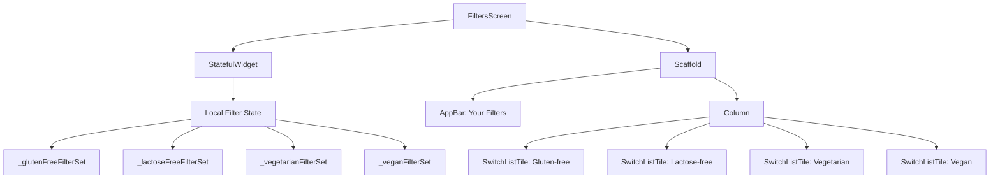
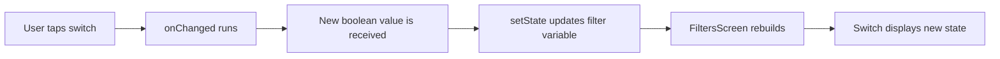
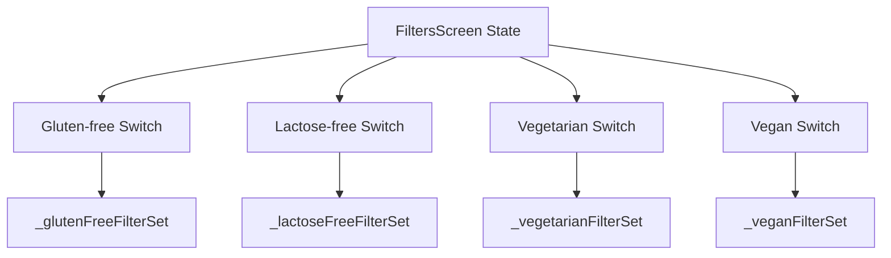
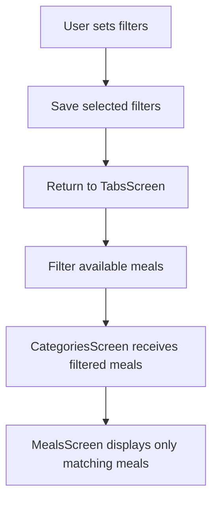

# Adding More Filter Options

## Overview

This lecture expands the `FiltersScreen` by adding the remaining dietary filter options.

Previously, the screen only had one filter:

* Gluten-free

Now, the app will support four filters:

* Gluten-free
* Lactose-free
* Vegetarian
* Vegan

Each filter is controlled by its own `SwitchListTile` and its own boolean state variable.

---

## Goal

The filters screen should allow users to turn each dietary filter on or off independently.

```text
Your Filters

Gluten-free      [switch]
Lactose-free     [switch]
Vegetarian       [switch]
Vegan            [switch]
```

Each switch controls one filter.

```text
true  = filter is active
false = filter is inactive
```

---

## Final Filter Screen Structure



---

# Step 1: Add More State Variables

Each filter needs its own boolean variable.

```dart
var _glutenFreeFilterSet = false;
var _lactoseFreeFilterSet = false;
var _vegetarianFilterSet = false;
var _veganFilterSet = false;
```

Each variable controls one switch.

| State Variable          | Filter       |
| ----------------------- | ------------ |
| `_glutenFreeFilterSet`  | Gluten-free  |
| `_lactoseFreeFilterSet` | Lactose-free |
| `_vegetarianFilterSet`  | Vegetarian   |
| `_veganFilterSet`       | Vegan        |

---

# Step 2: Add the Gluten-Free Filter

The first filter is the gluten-free filter.

```dart
SwitchListTile(
  value: _glutenFreeFilterSet,
  onChanged: (isChecked) {
    setState(() {
      _glutenFreeFilterSet = isChecked;
    });
  },
  title: Text(
    'Gluten-free',
    style: Theme.of(context).textTheme.titleLarge!.copyWith(
          color: Theme.of(context).colorScheme.onBackground,
        ),
  ),
  subtitle: Text(
    'Only include gluten-free meals.',
    style: Theme.of(context).textTheme.labelMedium!.copyWith(
          color: Theme.of(context).colorScheme.onBackground,
        ),
  ),
  activeColor: Theme.of(context).colorScheme.tertiary,
  contentPadding: const EdgeInsets.only(
    left: 34,
    right: 22,
  ),
)
```

---

# Step 3: Add the Lactose-Free Filter

The second filter is the lactose-free filter.

```dart
SwitchListTile(
  value: _lactoseFreeFilterSet,
  onChanged: (isChecked) {
    setState(() {
      _lactoseFreeFilterSet = isChecked;
    });
  },
  title: Text(
    'Lactose-free',
    style: Theme.of(context).textTheme.titleLarge!.copyWith(
          color: Theme.of(context).colorScheme.onBackground,
        ),
  ),
  subtitle: Text(
    'Only include lactose-free meals.',
    style: Theme.of(context).textTheme.labelMedium!.copyWith(
          color: Theme.of(context).colorScheme.onBackground,
        ),
  ),
  activeColor: Theme.of(context).colorScheme.tertiary,
  contentPadding: const EdgeInsets.only(
    left: 34,
    right: 22,
  ),
)
```

This switch updates `_lactoseFreeFilterSet`.

---

# Step 4: Add the Vegetarian Filter

The third filter is the vegetarian filter.

```dart
SwitchListTile(
  value: _vegetarianFilterSet,
  onChanged: (isChecked) {
    setState(() {
      _vegetarianFilterSet = isChecked;
    });
  },
  title: Text(
    'Vegetarian',
    style: Theme.of(context).textTheme.titleLarge!.copyWith(
          color: Theme.of(context).colorScheme.onBackground,
        ),
  ),
  subtitle: Text(
    'Only include vegetarian meals.',
    style: Theme.of(context).textTheme.labelMedium!.copyWith(
          color: Theme.of(context).colorScheme.onBackground,
        ),
  ),
  activeColor: Theme.of(context).colorScheme.tertiary,
  contentPadding: const EdgeInsets.only(
    left: 34,
    right: 22,
  ),
)
```

This switch updates `_vegetarianFilterSet`.

For example, if this is turned on, meals like hamburgers should eventually be hidden from the meal list.

---

# Step 5: Add the Vegan Filter

The fourth filter is the vegan filter.

```dart
SwitchListTile(
  value: _veganFilterSet,
  onChanged: (isChecked) {
    setState(() {
      _veganFilterSet = isChecked;
    });
  },
  title: Text(
    'Vegan',
    style: Theme.of(context).textTheme.titleLarge!.copyWith(
          color: Theme.of(context).colorScheme.onBackground,
        ),
  ),
  subtitle: Text(
    'Only include vegan meals.',
    style: Theme.of(context).textTheme.labelMedium!.copyWith(
          color: Theme.of(context).colorScheme.onBackground,
        ),
  ),
  activeColor: Theme.of(context).colorScheme.tertiary,
  contentPadding: const EdgeInsets.only(
    left: 34,
    right: 22,
  ),
)
```

This switch updates `_veganFilterSet`.

---

# Filter Toggle Flow



---

# Full `FiltersScreen` with Four Filters

```dart
import 'package:flutter/material.dart';

class FiltersScreen extends StatefulWidget {
  const FiltersScreen({super.key});

  @override
  State<FiltersScreen> createState() {
    return _FiltersScreenState();
  }
}

class _FiltersScreenState extends State<FiltersScreen> {
  var _glutenFreeFilterSet = false;
  var _lactoseFreeFilterSet = false;
  var _vegetarianFilterSet = false;
  var _veganFilterSet = false;

  @override
  Widget build(BuildContext context) {
    return Scaffold(
      appBar: AppBar(
        title: const Text('Your Filters'),
      ),
      body: Column(
        children: [
          SwitchListTile(
            value: _glutenFreeFilterSet,
            onChanged: (isChecked) {
              setState(() {
                _glutenFreeFilterSet = isChecked;
              });
            },
            title: Text(
              'Gluten-free',
              style: Theme.of(context).textTheme.titleLarge!.copyWith(
                    color: Theme.of(context).colorScheme.onBackground,
                  ),
            ),
            subtitle: Text(
              'Only include gluten-free meals.',
              style: Theme.of(context).textTheme.labelMedium!.copyWith(
                    color: Theme.of(context).colorScheme.onBackground,
                  ),
            ),
            activeColor: Theme.of(context).colorScheme.tertiary,
            contentPadding: const EdgeInsets.only(
              left: 34,
              right: 22,
            ),
          ),
          SwitchListTile(
            value: _lactoseFreeFilterSet,
            onChanged: (isChecked) {
              setState(() {
                _lactoseFreeFilterSet = isChecked;
              });
            },
            title: Text(
              'Lactose-free',
              style: Theme.of(context).textTheme.titleLarge!.copyWith(
                    color: Theme.of(context).colorScheme.onBackground,
                  ),
            ),
            subtitle: Text(
              'Only include lactose-free meals.',
              style: Theme.of(context).textTheme.labelMedium!.copyWith(
                    color: Theme.of(context).colorScheme.onBackground,
                  ),
            ),
            activeColor: Theme.of(context).colorScheme.tertiary,
            contentPadding: const EdgeInsets.only(
              left: 34,
              right: 22,
            ),
          ),
          SwitchListTile(
            value: _vegetarianFilterSet,
            onChanged: (isChecked) {
              setState(() {
                _vegetarianFilterSet = isChecked;
              });
            },
            title: Text(
              'Vegetarian',
              style: Theme.of(context).textTheme.titleLarge!.copyWith(
                    color: Theme.of(context).colorScheme.onBackground,
                  ),
            ),
            subtitle: Text(
              'Only include vegetarian meals.',
              style: Theme.of(context).textTheme.labelMedium!.copyWith(
                    color: Theme.of(context).colorScheme.onBackground,
                  ),
            ),
            activeColor: Theme.of(context).colorScheme.tertiary,
            contentPadding: const EdgeInsets.only(
              left: 34,
              right: 22,
            ),
          ),
          SwitchListTile(
            value: _veganFilterSet,
            onChanged: (isChecked) {
              setState(() {
                _veganFilterSet = isChecked;
              });
            },
            title: Text(
              'Vegan',
              style: Theme.of(context).textTheme.titleLarge!.copyWith(
                    color: Theme.of(context).colorScheme.onBackground,
                  ),
            ),
            subtitle: Text(
              'Only include vegan meals.',
              style: Theme.of(context).textTheme.labelMedium!.copyWith(
                    color: Theme.of(context).colorScheme.onBackground,
                  ),
            ),
            activeColor: Theme.of(context).colorScheme.tertiary,
            contentPadding: const EdgeInsets.only(
              left: 34,
              right: 22,
            ),
          ),
        ],
      ),
    );
  }
}
```

---

# Why Each Filter Needs Separate State

Each switch must work independently.

Turning on the vegetarian filter should not automatically turn on the vegan filter.



Each switch reads and updates its own variable.

---

# Reducing Repetition with a Helper Method

The current code works, but it contains a lot of repeated `SwitchListTile` code.

A cleaner version can extract the repeated widget into a helper method.

```dart
Widget _buildSwitchListTile({
  required String title,
  required String subtitle,
  required bool value,
  required void Function(bool isChecked) onChanged,
}) {
  return SwitchListTile(
    value: value,
    onChanged: onChanged,
    title: Text(
      title,
      style: Theme.of(context).textTheme.titleLarge!.copyWith(
            color: Theme.of(context).colorScheme.onBackground,
          ),
    ),
    subtitle: Text(
      subtitle,
      style: Theme.of(context).textTheme.labelMedium!.copyWith(
            color: Theme.of(context).colorScheme.onBackground,
          ),
    ),
    activeColor: Theme.of(context).colorScheme.tertiary,
    contentPadding: const EdgeInsets.only(
      left: 34,
      right: 22,
    ),
  );
}
```

Then the `Column` becomes much shorter:

```dart
body: Column(
  children: [
    _buildSwitchListTile(
      title: 'Gluten-free',
      subtitle: 'Only include gluten-free meals.',
      value: _glutenFreeFilterSet,
      onChanged: (isChecked) {
        setState(() {
          _glutenFreeFilterSet = isChecked;
        });
      },
    ),
    _buildSwitchListTile(
      title: 'Lactose-free',
      subtitle: 'Only include lactose-free meals.',
      value: _lactoseFreeFilterSet,
      onChanged: (isChecked) {
        setState(() {
          _lactoseFreeFilterSet = isChecked;
        });
      },
    ),
    _buildSwitchListTile(
      title: 'Vegetarian',
      subtitle: 'Only include vegetarian meals.',
      value: _vegetarianFilterSet,
      onChanged: (isChecked) {
        setState(() {
          _vegetarianFilterSet = isChecked;
        });
      },
    ),
    _buildSwitchListTile(
      title: 'Vegan',
      subtitle: 'Only include vegan meals.',
      value: _veganFilterSet,
      onChanged: (isChecked) {
        setState(() {
          _veganFilterSet = isChecked;
        });
      },
    ),
  ],
),
```

---

# Alternative: Extracting a `FilterItem` Widget

Another option is to create a reusable widget called `FilterItem`.

```dart
class FilterItem extends StatelessWidget {
  const FilterItem({
    super.key,
    required this.title,
    required this.subtitle,
    required this.value,
    required this.onChanged,
  });

  final String title;
  final String subtitle;
  final bool value;
  final void Function(bool isChecked) onChanged;

  @override
  Widget build(BuildContext context) {
    return SwitchListTile(
      value: value,
      onChanged: onChanged,
      title: Text(
        title,
        style: Theme.of(context).textTheme.titleLarge!.copyWith(
              color: Theme.of(context).colorScheme.onBackground,
            ),
      ),
      subtitle: Text(
        subtitle,
        style: Theme.of(context).textTheme.labelMedium!.copyWith(
              color: Theme.of(context).colorScheme.onBackground,
            ),
      ),
      activeColor: Theme.of(context).colorScheme.tertiary,
      contentPadding: const EdgeInsets.only(
        left: 34,
        right: 22,
      ),
    );
  }
}
```

Then the screen can reuse it like this:

```dart
FilterItem(
  title: 'Gluten-free',
  subtitle: 'Only include gluten-free meals.',
  value: _glutenFreeFilterSet,
  onChanged: (isChecked) {
    setState(() {
      _glutenFreeFilterSet = isChecked;
    });
  },
)
```

This keeps the `FiltersScreen` easier to read.

---

# Current Limitation

At this point, the switches work visually.

Users can turn them on and off, and each switch updates independently.

However, the selected filter values are not saved yet when the user navigates back.

That means the next step is to send the selected filters back to the parent widget so they can affect which meals are displayed.

---

# Future Filter Effect

Eventually, the filters should affect the meal list.

For example:

```text
Vegetarian filter is active
→ User opens a category
→ Non-vegetarian meals should be hidden
```



---

# Important Concepts

| Concept           | Meaning                                     |
| ----------------- | ------------------------------------------- |
| `SwitchListTile`  | Displays a switch with a title and subtitle |
| Boolean state     | Stores whether each filter is active        |
| `setState()`      | Updates the UI after a filter changes       |
| Independent state | Each switch has its own state variable      |
| Helper method     | Reduces repeated widget code                |
| Reusable widget   | Extracts repeated UI into a separate class  |

---

# Summary

This lecture expands the `FiltersScreen` from one filter to four filters.

The screen now supports:

* Gluten-free
* Lactose-free
* Vegetarian
* Vegan

Each filter has its own boolean state variable and its own `SwitchListTile`.

The user can now toggle each filter independently. The UI updates correctly with `setState()`.

The next step is to save these selected filters and use them to control which meals are shown in the app.
