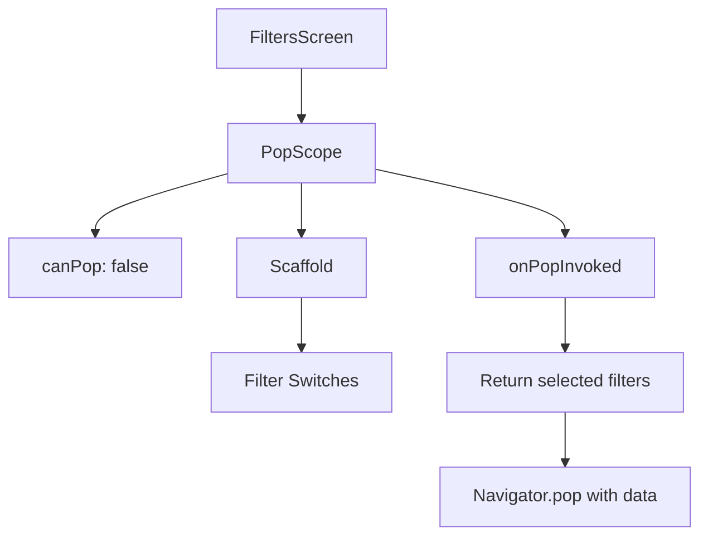
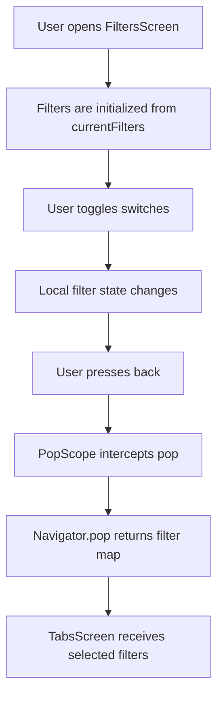

# Replacing `WillPopScope` with `PopScope`

## Overview

This lecture explains how to intercept back navigation in Flutter using the modern `PopScope` widget.

Older Flutter code often used `WillPopScope` to detect when a user pressed the back button. However, `WillPopScope` has been deprecated in newer Flutter versions. The recommended replacement is `PopScope`.

In the Meals App, this is useful for the `FiltersScreen`. When the user changes filter settings and then presses the back button, the selected filters should be returned to the previous screen.

---

## Goal

When the user leaves the `FiltersScreen`, the app should send the selected filter values back to `TabsScreen`.

```text
FiltersScreen
→ User changes switches
→ User presses back
→ Return selected filters to TabsScreen
→ TabsScreen updates available meals
```

---

## Why `PopScope` Is Needed

By default, pressing the back button simply closes the current screen.

But in this app, we want to do something before the screen closes:

```text
Collect current filter values
↓
Return them to the previous screen
↓
Then close FiltersScreen
```

`PopScope` allows us to intercept that pop action.

---

## Old Approach: `WillPopScope`

Previously, this could be done with `WillPopScope`.

```dart
WillPopScope(
  onWillPop: () async {
    Navigator.of(context).pop({
      Filter.glutenFree: _glutenFreeFilterSet,
      Filter.lactoseFree: _lactoseFreeFilterSet,
      Filter.vegetarian: _vegetarianFilterSet,
      Filter.vegan: _veganFilterSet,
    });

    return false;
  },
  child: Scaffold(
    appBar: AppBar(
      title: const Text('Your Filters'),
    ),
    body: Column(
      children: [
        // filter switches
      ],
    ),
  ),
)
```

However, `WillPopScope` is now deprecated, so new Flutter apps should use `PopScope`.

---

# New Approach: `PopScope`

`PopScope` wraps the screen and lets you control what happens when the user tries to go back.

```dart
PopScope(
  canPop: false,
  onPopInvoked: (didPop) {
    if (didPop) {
      return;
    }

    Navigator.of(context).pop({
      Filter.glutenFree: _glutenFreeFilterSet,
      Filter.lactoseFree: _lactoseFreeFilterSet,
      Filter.vegetarian: _vegetarianFilterSet,
      Filter.vegan: _veganFilterSet,
    });
  },
  child: Scaffold(
    appBar: AppBar(
      title: const Text('Your Filters'),
    ),
    body: Column(
      children: [
        // filter switches
      ],
    ),
  ),
)
```

---

## `PopScope` Structure



---

# Understanding `canPop`

```dart
canPop: false,
```

This tells Flutter:

```text
Do not automatically close this screen.
I will handle the pop manually.
```

This is important because we want to return data when the screen closes.

If `canPop` were `true`, Flutter could pop the screen automatically before we send the selected filters back.

---

# Understanding `onPopInvoked`

```dart
onPopInvoked: (didPop) {
  // logic here
}
```

`onPopInvoked` runs when the user attempts to leave the screen.

It receives a boolean value:

```dart
didPop
```

This tells us whether the screen has already been popped.

---

## Why Check `didPop`?

```dart
if (didPop) {
  return;
}
```

If `didPop` is already `true`, the screen was already closed.

In that case, we do not need to do anything else.

If `didPop` is `false`, we manually pop the screen and return data.

---

# Returning Filter Data

When the user leaves the filters screen, we return a map of selected filters.

```dart
Navigator.of(context).pop({
  Filter.glutenFree: _glutenFreeFilterSet,
  Filter.lactoseFree: _lactoseFreeFilterSet,
  Filter.vegetarian: _vegetarianFilterSet,
  Filter.vegan: _veganFilterSet,
});
```

This sends the selected filter values back to the previous screen.

---

## Returned Data Shape

```dart
{
  Filter.glutenFree: true,
  Filter.lactoseFree: false,
  Filter.vegetarian: true,
  Filter.vegan: false,
}
```

Each filter key maps to a boolean value.

| Value   | Meaning            |
| ------- | ------------------ |
| `true`  | Filter is active   |
| `false` | Filter is inactive |

---

# Full `FiltersScreen` with `PopScope`

```dart
import 'package:flutter/material.dart';

enum Filter {
  glutenFree,
  lactoseFree,
  vegetarian,
  vegan,
}

class FiltersScreen extends StatefulWidget {
  const FiltersScreen({
    super.key,
    required this.currentFilters,
  });

  final Map<Filter, bool> currentFilters;

  @override
  State<FiltersScreen> createState() {
    return _FiltersScreenState();
  }
}

class _FiltersScreenState extends State<FiltersScreen> {
  var _glutenFreeFilterSet = false;
  var _lactoseFreeFilterSet = false;
  var _vegetarianFilterSet = false;
  var _veganFilterSet = false;

  @override
  void initState() {
    super.initState();

    _glutenFreeFilterSet = widget.currentFilters[Filter.glutenFree]!;
    _lactoseFreeFilterSet = widget.currentFilters[Filter.lactoseFree]!;
    _vegetarianFilterSet = widget.currentFilters[Filter.vegetarian]!;
    _veganFilterSet = widget.currentFilters[Filter.vegan]!;
  }

  @override
  Widget build(BuildContext context) {
    return PopScope(
      canPop: false,
      onPopInvoked: (didPop) {
        if (didPop) {
          return;
        }

        Navigator.of(context).pop({
          Filter.glutenFree: _glutenFreeFilterSet,
          Filter.lactoseFree: _lactoseFreeFilterSet,
          Filter.vegetarian: _vegetarianFilterSet,
          Filter.vegan: _veganFilterSet,
        });
      },
      child: Scaffold(
        appBar: AppBar(
          title: const Text('Your Filters'),
        ),
        body: Column(
          children: [
            SwitchListTile(
              value: _glutenFreeFilterSet,
              onChanged: (isChecked) {
                setState(() {
                  _glutenFreeFilterSet = isChecked;
                });
              },
              title: Text(
                'Gluten-free',
                style: Theme.of(context).textTheme.titleLarge!.copyWith(
                      color: Theme.of(context).colorScheme.onBackground,
                    ),
              ),
              subtitle: Text(
                'Only include gluten-free meals.',
                style: Theme.of(context).textTheme.labelMedium!.copyWith(
                      color: Theme.of(context).colorScheme.onBackground,
                    ),
              ),
              activeColor: Theme.of(context).colorScheme.tertiary,
              contentPadding: const EdgeInsets.only(
                left: 34,
                right: 22,
              ),
            ),
            SwitchListTile(
              value: _lactoseFreeFilterSet,
              onChanged: (isChecked) {
                setState(() {
                  _lactoseFreeFilterSet = isChecked;
                });
              },
              title: Text(
                'Lactose-free',
                style: Theme.of(context).textTheme.titleLarge!.copyWith(
                      color: Theme.of(context).colorScheme.onBackground,
                    ),
              ),
              subtitle: Text(
                'Only include lactose-free meals.',
                style: Theme.of(context).textTheme.labelMedium!.copyWith(
                      color: Theme.of(context).colorScheme.onBackground,
                    ),
              ),
              activeColor: Theme.of(context).colorScheme.tertiary,
              contentPadding: const EdgeInsets.only(
                left: 34,
                right: 22,
              ),
            ),
            SwitchListTile(
              value: _vegetarianFilterSet,
              onChanged: (isChecked) {
                setState(() {
                  _vegetarianFilterSet = isChecked;
                });
              },
              title: Text(
                'Vegetarian',
                style: Theme.of(context).textTheme.titleLarge!.copyWith(
                      color: Theme.of(context).colorScheme.onBackground,
                    ),
              ),
              subtitle: Text(
                'Only include vegetarian meals.',
                style: Theme.of(context).textTheme.labelMedium!.copyWith(
                      color: Theme.of(context).colorScheme.onBackground,
                    ),
              ),
              activeColor: Theme.of(context).colorScheme.tertiary,
              contentPadding: const EdgeInsets.only(
                left: 34,
                right: 22,
              ),
            ),
            SwitchListTile(
              value: _veganFilterSet,
              onChanged: (isChecked) {
                setState(() {
                  _veganFilterSet = isChecked;
                });
              },
              title: Text(
                'Vegan',
                style: Theme.of(context).textTheme.titleLarge!.copyWith(
                      color: Theme.of(context).colorScheme.onBackground,
                    ),
              ),
              subtitle: Text(
                'Only include vegan meals.',
                style: Theme.of(context).textTheme.labelMedium!.copyWith(
                      color: Theme.of(context).colorScheme.onBackground,
                    ),
              ),
              activeColor: Theme.of(context).colorScheme.tertiary,
              contentPadding: const EdgeInsets.only(
                left: 34,
                right: 22,
              ),
            ),
          ],
        ),
      ),
    );
  }
}
```

---

# Data Flow with `PopScope`



---

# Why Return a Map?

There are four filters, so returning a single boolean is not enough.

A map allows the screen to return all selected filter values at once.

```dart
Map<Filter, bool>
```

This means:

```text
Each Filter enum value is connected to a true or false value.
```

---

# Important Detail: `PopScope` Wraps the Whole Screen

The `PopScope` should wrap the `Scaffold`.

```dart
return PopScope(
  canPop: false,
  onPopInvoked: ...,
  child: Scaffold(
    appBar: AppBar(...),
    body: ...,
  ),
);
```

This allows `PopScope` to intercept back navigation for the entire screen.

---

# `WillPopScope` vs `PopScope`

| Feature                  | `WillPopScope`               | `PopScope`                               |
| ------------------------ | ---------------------------- | ---------------------------------------- |
| Status                   | Deprecated                   | Recommended replacement                  |
| Used for                 | Intercepting back navigation | Intercepting pop navigation              |
| Callback                 | `onWillPop`                  | `onPopInvoked`                           |
| Can manually prevent pop | Yes                          | Yes, with `canPop: false`                |
| Can return data manually | Yes                          | Yes, with `Navigator.pop(context, data)` |

---

# Important Concepts

| Concept                        | Meaning                                            |
| ------------------------------ | -------------------------------------------------- |
| `PopScope`                     | Modern widget for intercepting pop/back navigation |
| `canPop`                       | Controls whether the route can pop automatically   |
| `onPopInvoked`                 | Runs when a pop action is attempted                |
| `didPop`                       | Tells whether the route was already popped         |
| `Navigator.pop(context, data)` | Closes the screen and returns data                 |
| `Map<Filter, bool>`            | Stores all filter states                           |
| `initState()`                  | Initializes local state from constructor values    |

---

# Summary

`PopScope` replaces the older `WillPopScope` widget for intercepting back navigation.

In the Meals App, `PopScope` is used on the `FiltersScreen` so that when the user presses the back button, the screen can return all selected filter values to the previous screen.

The key pattern is:

```dart
PopScope(
  canPop: false,
  onPopInvoked: (didPop) {
    if (didPop) return;

    Navigator.of(context).pop({
      Filter.glutenFree: _glutenFreeFilterSet,
      Filter.lactoseFree: _lactoseFreeFilterSet,
      Filter.vegetarian: _vegetarianFilterSet,
      Filter.vegan: _veganFilterSet,
    });
  },
  child: Scaffold(...),
)
```

This gives the app full control over what happens when the user leaves the filters screen.
