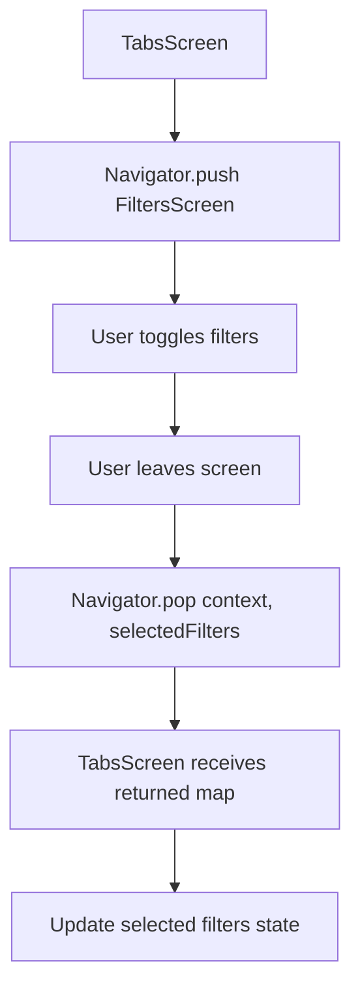
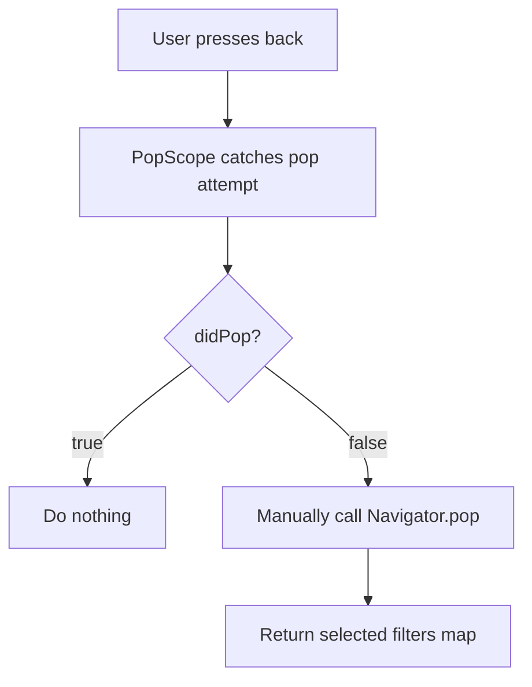
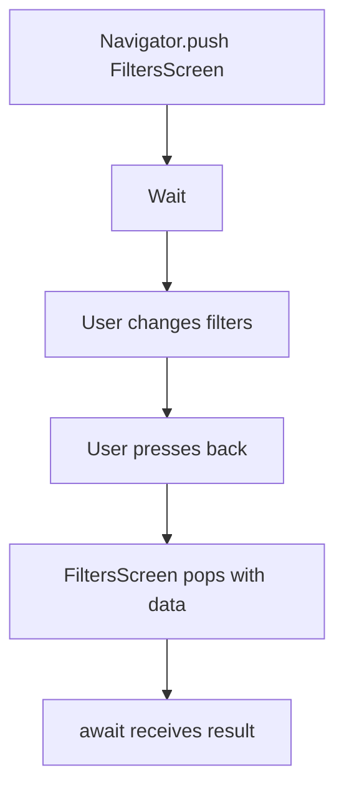
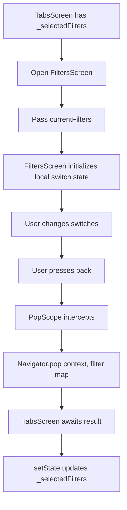

# Returning Data When Leaving a Screen

## Overview

This lecture explains how to return data from one screen back to the previous screen in Flutter.

In the Meals App, this is needed for the `FiltersScreen`.

Users can change filter settings on the filters screen. When they leave that screen, the selected filter values should be sent back to `TabsScreen`, so the app can update which meals are available.

This is done with:

```dart id="up7bjs"
Navigator.pop(context, result);
```

The `result` can be any Dart value, such as a `String`, `bool`, `List`, `Map`, or custom object.

---

## Goal

When the user leaves `FiltersScreen`, return the selected filters to `TabsScreen`.

```text id="9xf1ev"
TabsScreen
→ Opens FiltersScreen
→ User changes filters
→ User presses back
→ FiltersScreen returns selected filters
→ TabsScreen receives the result
```

---

## Navigation Result Flow



---

# Why Return Data?

The filter switches live on `FiltersScreen`.

But the actual filter state must be stored in `TabsScreen`, because `TabsScreen` manages the main app data.

So the flow is:

```text id="n06y8s"
FiltersScreen controls temporary switch UI
TabsScreen stores the final selected filters
```

When the user leaves `FiltersScreen`, the selected filter values must be sent back.

---

# Step 1: Define a `Filter` Enum

A clean way to represent the available filters is with an enum.

```dart id="hmczvo"
enum Filter {
  glutenFree,
  lactoseFree,
  vegetarian,
  vegan,
}
```

This avoids using raw strings like:

```dart id="f6z81o"
'glutenFree'
'vegan'
```

Enums are safer because Dart can catch mistakes at compile time.

---

# Step 2: Store Filter Values in a Map

Each filter has a boolean value.

```dart id="zbsf3x"
Map<Filter, bool>
```

This means:

```text id="91hyqu"
Filter.glutenFree → true or false
Filter.lactoseFree → true or false
Filter.vegetarian → true or false
Filter.vegan → true or false
```

Example:

```dart id="ihhxxd"
{
  Filter.glutenFree: false,
  Filter.lactoseFree: false,
  Filter.vegetarian: true,
  Filter.vegan: false,
}
```

---

## Filter Map Meaning

| Filter               |   Value | Meaning                      |
| -------------------- | ------: | ---------------------------- |
| `Filter.glutenFree`  |  `true` | Only show gluten-free meals  |
| `Filter.lactoseFree` |  `true` | Only show lactose-free meals |
| `Filter.vegetarian`  |  `true` | Only show vegetarian meals   |
| `Filter.vegan`       |  `true` | Only show vegan meals        |
| Any filter           | `false` | Do not apply that filter     |

---

# Step 3: Return Data with `Navigator.pop`

Normally, `Navigator.pop(context)` simply closes the current screen.

```dart id="xqxhly"
Navigator.of(context).pop();
```

But you can also pass a second argument.

```dart id="mpvvmw"
Navigator.of(context).pop(result);
```

For the filters screen, the result is a map.

```dart id="v2ftx2"
Navigator.of(context).pop({
  Filter.glutenFree: _glutenFreeFilterSet,
  Filter.lactoseFree: _lactoseFreeFilterSet,
  Filter.vegetarian: _vegetarianFilterSet,
  Filter.vegan: _veganFilterSet,
});
```

This closes the screen and sends the selected filters back to the screen that opened it.

---

# Step 4: Use `PopScope` to Intercept Back Navigation

If the user presses the system back button or app bar back button, we still want to return the filter data.

To handle that, wrap the `Scaffold` with `PopScope`.

```dart id="o8oyfi"
PopScope(
  canPop: false,
  onPopInvoked: (didPop) {
    if (didPop) {
      return;
    }

    Navigator.of(context).pop({
      Filter.glutenFree: _glutenFreeFilterSet,
      Filter.lactoseFree: _lactoseFreeFilterSet,
      Filter.vegetarian: _vegetarianFilterSet,
      Filter.vegan: _veganFilterSet,
    });
  },
  child: Scaffold(
    appBar: AppBar(
      title: const Text('Your Filters'),
    ),
    body: Column(
      children: [
        // filter switches
      ],
    ),
  ),
)
```

---

## Why `canPop: false`?

```dart id="pz6nxj"
canPop: false
```

This prevents Flutter from automatically popping the screen.

Instead, we manually pop the screen and return data.

Without this, the screen might close before we can send the selected filters back.

---

## `PopScope` Flow



---

# Step 5: Await the Result in `TabsScreen`

When opening `FiltersScreen`, use `await`.

```dart id="go2lj2"
final result = await Navigator.of(context).push<Map<Filter, bool>>(
  MaterialPageRoute(
    builder: (ctx) => FiltersScreen(
      currentFilters: _selectedFilters,
    ),
  ),
);
```

`Navigator.push()` returns a `Future`.

That future completes when the pushed screen is popped.

So this line waits until `FiltersScreen` closes.

---

## Why Use `await`?

Without `await`, `TabsScreen` opens the filters screen but does not wait for the result.

With `await`, execution pauses until the user leaves `FiltersScreen`.



---

# Step 6: Handle the Returned Result

After receiving the result, check if it is `null`.

```dart id="pel4r4"
if (result == null) {
  return;
}
```

This is important because not every navigation action guarantees a result.

Then update the selected filters.

```dart id="tn520a"
setState(() {
  _selectedFilters = result;
});
```

Full example:

```dart id="taz1ko"
void _setScreen(String identifier) async {
  Navigator.of(context).pop();

  if (identifier == 'filters') {
    final result = await Navigator.of(context).push<Map<Filter, bool>>(
      MaterialPageRoute(
        builder: (ctx) => FiltersScreen(
          currentFilters: _selectedFilters,
        ),
      ),
    );

    if (result == null) {
      return;
    }

    setState(() {
      _selectedFilters = result;
    });
  }
}
```

---

# Why the Result Can Be `null`

The result can be `null` if the screen is closed without passing data.

For example:

```dart id="s2i0ig"
Navigator.of(context).pop();
```

This pops the screen but does not return a result.

That is why it is safer to check:

```dart id="ha2dpy"
if (result == null) {
  return;
}
```

---

# Step 7: Initialize Filters from Current State

When opening the `FiltersScreen`, pass the current filters into it.

```dart id="pgqt3l"
FiltersScreen(
  currentFilters: _selectedFilters,
)
```

Then inside `FiltersScreen`, use `initState()` to initialize the local switch values.

```dart id="3d53l0"
@override
void initState() {
  super.initState();

  _glutenFreeFilterSet = widget.currentFilters[Filter.glutenFree]!;
  _lactoseFreeFilterSet = widget.currentFilters[Filter.lactoseFree]!;
  _vegetarianFilterSet = widget.currentFilters[Filter.vegetarian]!;
  _veganFilterSet = widget.currentFilters[Filter.vegan]!;
}
```

This ensures that when the user reopens the filters screen, the switches show the previously selected values.

---

# Full `FiltersScreen` Example

```dart id="ky6t98"
import 'package:flutter/material.dart';

enum Filter {
  glutenFree,
  lactoseFree,
  vegetarian,
  vegan,
}

class FiltersScreen extends StatefulWidget {
  const FiltersScreen({
    super.key,
    required this.currentFilters,
  });

  final Map<Filter, bool> currentFilters;

  @override
  State<FiltersScreen> createState() {
    return _FiltersScreenState();
  }
}

class _FiltersScreenState extends State<FiltersScreen> {
  var _glutenFreeFilterSet = false;
  var _lactoseFreeFilterSet = false;
  var _vegetarianFilterSet = false;
  var _veganFilterSet = false;

  @override
  void initState() {
    super.initState();

    _glutenFreeFilterSet = widget.currentFilters[Filter.glutenFree]!;
    _lactoseFreeFilterSet = widget.currentFilters[Filter.lactoseFree]!;
    _vegetarianFilterSet = widget.currentFilters[Filter.vegetarian]!;
    _veganFilterSet = widget.currentFilters[Filter.vegan]!;
  }

  @override
  Widget build(BuildContext context) {
    return PopScope(
      canPop: false,
      onPopInvoked: (didPop) {
        if (didPop) {
          return;
        }

        Navigator.of(context).pop({
          Filter.glutenFree: _glutenFreeFilterSet,
          Filter.lactoseFree: _lactoseFreeFilterSet,
          Filter.vegetarian: _vegetarianFilterSet,
          Filter.vegan: _veganFilterSet,
        });
      },
      child: Scaffold(
        appBar: AppBar(
          title: const Text('Your Filters'),
        ),
        body: Column(
          children: [
            SwitchListTile(
              value: _glutenFreeFilterSet,
              onChanged: (isChecked) {
                setState(() {
                  _glutenFreeFilterSet = isChecked;
                });
              },
              title: Text(
                'Gluten-free',
                style: Theme.of(context).textTheme.titleLarge!.copyWith(
                      color: Theme.of(context).colorScheme.onBackground,
                    ),
              ),
              subtitle: Text(
                'Only include gluten-free meals.',
                style: Theme.of(context).textTheme.labelMedium!.copyWith(
                      color: Theme.of(context).colorScheme.onBackground,
                    ),
              ),
              activeColor: Theme.of(context).colorScheme.tertiary,
              contentPadding: const EdgeInsets.only(left: 34, right: 22),
            ),
            SwitchListTile(
              value: _lactoseFreeFilterSet,
              onChanged: (isChecked) {
                setState(() {
                  _lactoseFreeFilterSet = isChecked;
                });
              },
              title: Text(
                'Lactose-free',
                style: Theme.of(context).textTheme.titleLarge!.copyWith(
                      color: Theme.of(context).colorScheme.onBackground,
                    ),
              ),
              subtitle: Text(
                'Only include lactose-free meals.',
                style: Theme.of(context).textTheme.labelMedium!.copyWith(
                      color: Theme.of(context).colorScheme.onBackground,
                    ),
              ),
              activeColor: Theme.of(context).colorScheme.tertiary,
              contentPadding: const EdgeInsets.only(left: 34, right: 22),
            ),
            SwitchListTile(
              value: _vegetarianFilterSet,
              onChanged: (isChecked) {
                setState(() {
                  _vegetarianFilterSet = isChecked;
                });
              },
              title: Text(
                'Vegetarian',
                style: Theme.of(context).textTheme.titleLarge!.copyWith(
                      color: Theme.of(context).colorScheme.onBackground,
                    ),
              ),
              subtitle: Text(
                'Only include vegetarian meals.',
                style: Theme.of(context).textTheme.labelMedium!.copyWith(
                      color: Theme.of(context).colorScheme.onBackground,
                    ),
              ),
              activeColor: Theme.of(context).colorScheme.tertiary,
              contentPadding: const EdgeInsets.only(left: 34, right: 22),
            ),
            SwitchListTile(
              value: _veganFilterSet,
              onChanged: (isChecked) {
                setState(() {
                  _veganFilterSet = isChecked;
                });
              },
              title: Text(
                'Vegan',
                style: Theme.of(context).textTheme.titleLarge!.copyWith(
                      color: Theme.of(context).colorScheme.onBackground,
                    ),
              ),
              subtitle: Text(
                'Only include vegan meals.',
                style: Theme.of(context).textTheme.labelMedium!.copyWith(
                      color: Theme.of(context).colorScheme.onBackground,
                    ),
              ),
              activeColor: Theme.of(context).colorScheme.tertiary,
              contentPadding: const EdgeInsets.only(left: 34, right: 22),
            ),
          ],
        ),
      ),
    );
  }
}
```

---

# Full `TabsScreen` Result Handling Example

```dart id="c7u8vr"
class _TabsScreenState extends State<TabsScreen> {
  Map<Filter, bool> _selectedFilters = {
    Filter.glutenFree: false,
    Filter.lactoseFree: false,
    Filter.vegetarian: false,
    Filter.vegan: false,
  };

  void _setScreen(String identifier) async {
    Navigator.of(context).pop();

    if (identifier == 'filters') {
      final result = await Navigator.of(context).push<Map<Filter, bool>>(
        MaterialPageRoute(
          builder: (ctx) => FiltersScreen(
            currentFilters: _selectedFilters,
          ),
        ),
      );

      if (result == null) {
        return;
      }

      setState(() {
        _selectedFilters = result;
      });
    }
  }

  @override
  Widget build(BuildContext context) {
    // build method
  }
}
```

---

# Complete Data Return Pattern



---

# Important Concepts

| Concept                          | Meaning                                           |
| -------------------------------- | ------------------------------------------------- |
| `Navigator.pop(context, result)` | Closes a screen and returns data                  |
| `Navigator.push<T>()`            | Opens a screen and expects a result of type `T`   |
| `await Navigator.push(...)`      | Waits until the pushed screen closes              |
| `PopScope`                       | Intercepts back navigation                        |
| `canPop: false`                  | Prevents automatic pop                            |
| `Map<Filter, bool>`              | Stores all selected filters                       |
| `initState()`                    | Initializes local state from parent-provided data |
| `setState()`                     | Updates parent state after receiving result       |

---

# Summary

This lecture explains how to return data when leaving a screen.

In the Meals App, `FiltersScreen` returns the selected filter values to `TabsScreen` using:

```dart id="c5gphp"
Navigator.of(context).pop({
  Filter.glutenFree: _glutenFreeFilterSet,
  Filter.lactoseFree: _lactoseFreeFilterSet,
  Filter.vegetarian: _vegetarianFilterSet,
  Filter.vegan: _veganFilterSet,
});
```

`TabsScreen` receives that data by awaiting the `Navigator.push()` call:

```dart id="keuvnd"
final result = await Navigator.of(context).push<Map<Filter, bool>>(...);
```

Then it stores the returned map with `setState()`.

This pattern is useful whenever a child screen collects data and needs to send it back to the screen that opened it.
