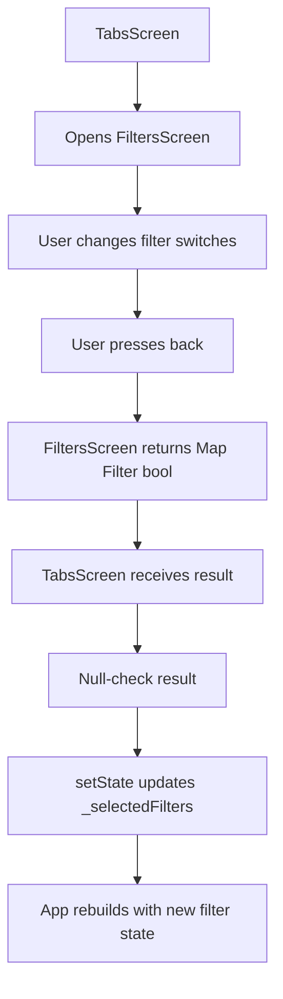
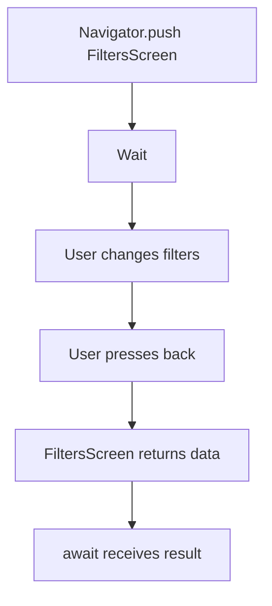
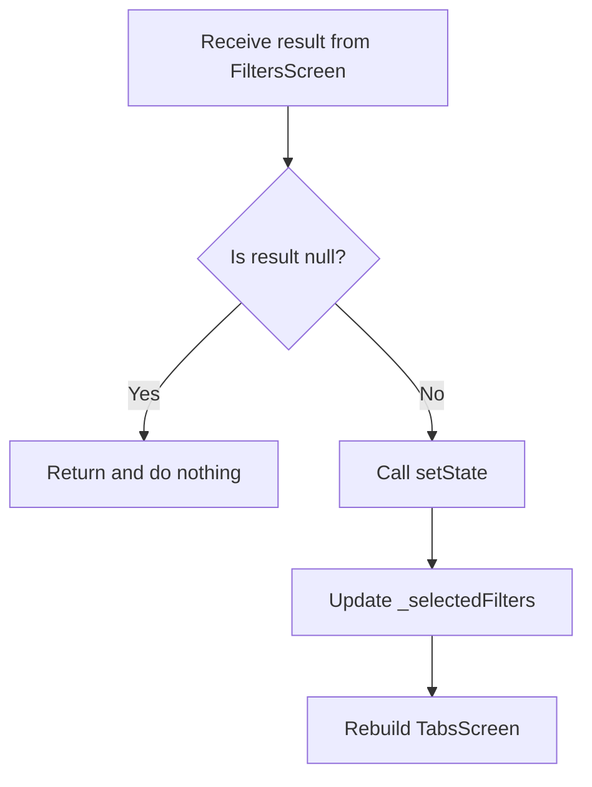
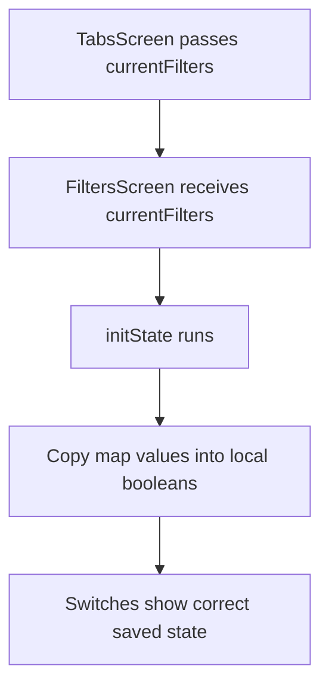
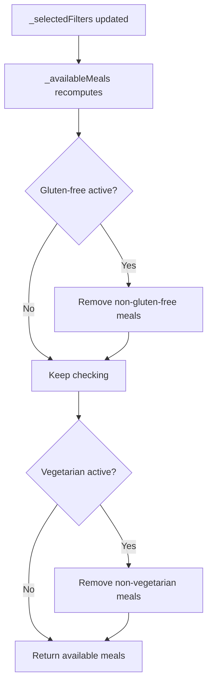

# Reading and Using Returned Data

## Overview

This lecture explains how to read data returned from another screen after that screen is closed.

In the Meals App, the `FiltersScreen` allows users to turn filters on or off. When the user leaves the screen, the selected filters are returned to `TabsScreen`.

`TabsScreen` then reads that returned data and stores it in `_selectedFilters` using `setState()`.

This makes the selected filter settings available to the rest of the app.

---

## Goal

The goal is to complete this data flow:

```text
TabsScreen
→ Opens FiltersScreen
→ User changes filters
→ FiltersScreen returns selected filter map
→ TabsScreen reads the returned map
→ TabsScreen updates _selectedFilters
```

---

## Full Data Flow



---

# Step 1: Return Filter Data from `FiltersScreen`

When the user leaves `FiltersScreen`, return a map containing the selected filter values.

```dart
Navigator.of(context).pop({
  Filter.glutenFree: _glutenFreeFilterSet,
  Filter.lactoseFree: _lactoseFreeFilterSet,
  Filter.vegetarian: _vegetarianFilterSet,
  Filter.vegan: _veganFilterSet,
});
```

This sends the selected filters back to the screen that opened `FiltersScreen`.

---

## Returned Data Shape

```dart
{
  Filter.glutenFree: true,
  Filter.lactoseFree: false,
  Filter.vegetarian: true,
  Filter.vegan: false,
}
```

Each key is a `Filter` enum value.
Each value is a boolean.

| Value   | Meaning                |
| ------- | ---------------------- |
| `true`  | The filter is active   |
| `false` | The filter is inactive |

---

# Step 2: Use `PopScope` to Return Data When Going Back

In modern Flutter versions, use `PopScope` instead of the deprecated `WillPopScope`.

```dart
return PopScope(
  canPop: false,
  onPopInvoked: (didPop) {
    if (didPop) {
      return;
    }

    Navigator.of(context).pop({
      Filter.glutenFree: _glutenFreeFilterSet,
      Filter.lactoseFree: _lactoseFreeFilterSet,
      Filter.vegetarian: _vegetarianFilterSet,
      Filter.vegan: _veganFilterSet,
    });
  },
  child: Scaffold(
    appBar: AppBar(
      title: const Text('Your Filters'),
    ),
    body: Column(
      children: [
        // SwitchListTile widgets
      ],
    ),
  ),
);
```

---

## Why `canPop: false`?

```dart
canPop: false
```

This prevents Flutter from automatically closing the screen.

Instead, we manually close it with:

```dart
Navigator.of(context).pop(result);
```

This gives us a chance to return the selected filters.

---

# Step 3: Open `FiltersScreen` with `await`

In `TabsScreen`, update `_setScreen`.

The important part is that `Navigator.push()` returns a `Future`. That future completes when the pushed screen is popped.

So we can use `await` to wait for the returned result.

```dart
void _setScreen(String identifier) async {
  Navigator.of(context).pop();

  if (identifier == 'filters') {
    final result = await Navigator.of(context).push<Map<Filter, bool>>(
      MaterialPageRoute(
        builder: (ctx) => FiltersScreen(
          currentFilters: _selectedFilters,
        ),
      ),
    );
  }
}
```

---

## Why Use `await`?

Without `await`, the code would open `FiltersScreen` and immediately continue.

With `await`, the function waits until `FiltersScreen` closes.



---

# Step 4: Type the Returned Result

Use this type annotation:

```dart
Navigator.of(context).push<Map<Filter, bool>>(...)
```

This tells Dart that the pushed screen is expected to return:

```dart
Map<Filter, bool>
```

So the `result` variable will have this type:

```dart
Map<Filter, bool>?
```

The question mark means the result can be `null`.

---

# Step 5: Handle the `null` Case

The returned result might be `null`.

For example, a screen can be popped without passing data:

```dart
Navigator.of(context).pop();
```

So always check for `null` before using the result.

```dart
if (result == null) {
  return;
}
```

This prevents errors and keeps the app safe.

---

# Step 6: Update `_selectedFilters`

Once a valid result is received, update `_selectedFilters`.

```dart
setState(() {
  _selectedFilters = result;
});
```

This does two things:

1. Stores the new filter values.
2. Triggers a rebuild so the app uses the updated filters.

---

## Result Handling Flow



---

# Final `_setScreen` Method

```dart
void _setScreen(String identifier) async {
  Navigator.of(context).pop();

  if (identifier == 'filters') {
    final result = await Navigator.of(context).push<Map<Filter, bool>>(
      MaterialPageRoute(
        builder: (ctx) => FiltersScreen(
          currentFilters: _selectedFilters,
        ),
      ),
    );

    if (result == null) {
      return;
    }

    setState(() {
      _selectedFilters = result;
    });
  }
}
```

---

# Step 7: Store Default Filters in `TabsScreen`

In `TabsScreen`, define the current selected filters.

```dart
Map<Filter, bool> _selectedFilters = {
  Filter.glutenFree: false,
  Filter.lactoseFree: false,
  Filter.vegetarian: false,
  Filter.vegan: false,
};
```

This map stores the app-wide filter state.

---

## Selected Filters State

| Filter               | Initial Value |
| -------------------- | ------------: |
| `Filter.glutenFree`  |       `false` |
| `Filter.lactoseFree` |       `false` |
| `Filter.vegetarian`  |       `false` |
| `Filter.vegan`       |       `false` |

At the beginning, no filters are active.

---

# Step 8: Pass Current Filters to `FiltersScreen`

When opening `FiltersScreen`, pass the current filters into it.

```dart
FiltersScreen(
  currentFilters: _selectedFilters,
)
```

This ensures that the switches show the current saved state when the user opens the filters screen again.

---

# Step 9: Initialize Local State in `FiltersScreen`

Inside `FiltersScreen`, use `initState()` to copy the values from `widget.currentFilters` into local state variables.

```dart
@override
void initState() {
  super.initState();

  _glutenFreeFilterSet = widget.currentFilters[Filter.glutenFree]!;
  _lactoseFreeFilterSet = widget.currentFilters[Filter.lactoseFree]!;
  _vegetarianFilterSet = widget.currentFilters[Filter.vegetarian]!;
  _veganFilterSet = widget.currentFilters[Filter.vegan]!;
}
```

---

## Why Use `initState()`?

`initState()` runs once when the state object is created.

It is the right place to initialize local state from widget constructor values.



---

# Full `TabsScreen` Example

```dart
class _TabsScreenState extends State<TabsScreen> {
  int _selectedPageIndex = 0;

  final List<Meal> _favoriteMeals = [];

  Map<Filter, bool> _selectedFilters = {
    Filter.glutenFree: false,
    Filter.lactoseFree: false,
    Filter.vegetarian: false,
    Filter.vegan: false,
  };

  void _setScreen(String identifier) async {
    Navigator.of(context).pop();

    if (identifier == 'filters') {
      final result = await Navigator.of(context).push<Map<Filter, bool>>(
        MaterialPageRoute(
          builder: (ctx) => FiltersScreen(
            currentFilters: _selectedFilters,
          ),
        ),
      );

      if (result == null) {
        return;
      }

      setState(() {
        _selectedFilters = result;
      });
    }
  }

  void _selectPage(int index) {
    setState(() {
      _selectedPageIndex = index;
    });
  }

  @override
  Widget build(BuildContext context) {
    Widget activePage = CategoriesScreen(
      onToggleFavorite: _toggleMealFavoriteStatus,
    );

    String activePageTitle = 'Categories';

    if (_selectedPageIndex == 1) {
      activePage = MealsScreen(
        meals: _favoriteMeals,
        onToggleFavorite: _toggleMealFavoriteStatus,
      );
      activePageTitle = 'Your Favorites';
    }

    return Scaffold(
      appBar: AppBar(
        title: Text(activePageTitle),
      ),
      drawer: MainDrawer(
        onSelectScreen: _setScreen,
      ),
      body: activePage,
      bottomNavigationBar: BottomNavigationBar(
        currentIndex: _selectedPageIndex,
        onTap: _selectPage,
        items: const [
          BottomNavigationBarItem(
            icon: Icon(Icons.set_meal),
            label: 'Categories',
          ),
          BottomNavigationBarItem(
            icon: Icon(Icons.star),
            label: 'Favorites',
          ),
        ],
      ),
    );
  }
}
```

---

# Optional: Use a Constant for Initial Filters

To avoid repeating the default filter map, create a constant.

```dart
const kInitialFilters = {
  Filter.glutenFree: false,
  Filter.lactoseFree: false,
  Filter.vegetarian: false,
  Filter.vegan: false,
};
```

Then use it in `TabsScreen`:

```dart
Map<Filter, bool> _selectedFilters = kInitialFilters;
```

You can also use it as a fallback:

```dart
setState(() {
  _selectedFilters = result ?? kInitialFilters;
});
```

---

## Null Coalescing Operator

The `??` operator means:

```text
Use the value on the left if it is not null.
Otherwise, use the value on the right.
```

Example:

```dart
_selectedFilters = result ?? kInitialFilters;
```

This means:

```text
If result exists, use result.
If result is null, use kInitialFilters.
```

---

# What Happens After Updating `_selectedFilters`?

After `setState()` updates `_selectedFilters`, Flutter rebuilds `TabsScreen`.

On the next build, any computed meal list can use the updated filters.

For example:

```dart
List<Meal> get _availableMeals {
  return dummyMeals.where((meal) {
    if (_selectedFilters[Filter.glutenFree]! && !meal.isGlutenFree) {
      return false;
    }
    if (_selectedFilters[Filter.lactoseFree]! && !meal.isLactoseFree) {
      return false;
    }
    if (_selectedFilters[Filter.vegetarian]! && !meal.isVegetarian) {
      return false;
    }
    if (_selectedFilters[Filter.vegan]! && !meal.isVegan) {
      return false;
    }
    return true;
  }).toList();
}
```

This getter returns only meals that match the active filters.

---

## Filtered Meals Logic



---

# Important Concepts

| Concept                          | Meaning                                          |
| -------------------------------- | ------------------------------------------------ |
| `Navigator.push()`               | Opens a new screen                               |
| `await Navigator.push()`         | Waits for the opened screen to close             |
| `Navigator.pop(context, result)` | Closes a screen and returns data                 |
| `Map<Filter, bool>`              | Stores all filter values                         |
| `null` result                    | Means no data was returned                       |
| `setState()`                     | Updates state and rebuilds the UI                |
| `initState()`                    | Initializes screen state from constructor data   |
| `??`                             | Uses a fallback value if the first value is null |

---

# Summary

This lecture shows how to read and use data returned from `FiltersScreen`.

`FiltersScreen` returns the selected filter map with:

```dart
Navigator.of(context).pop({
  Filter.glutenFree: _glutenFreeFilterSet,
  Filter.lactoseFree: _lactoseFreeFilterSet,
  Filter.vegetarian: _vegetarianFilterSet,
  Filter.vegan: _veganFilterSet,
});
```

`TabsScreen` receives that map by awaiting the navigation call:

```dart
final result = await Navigator.of(context).push<Map<Filter, bool>>(...);
```

After checking that the result is not `null`, `TabsScreen` stores it in `_selectedFilters` with `setState()`.

This completes the data return loop between the filters screen and the main app state.
