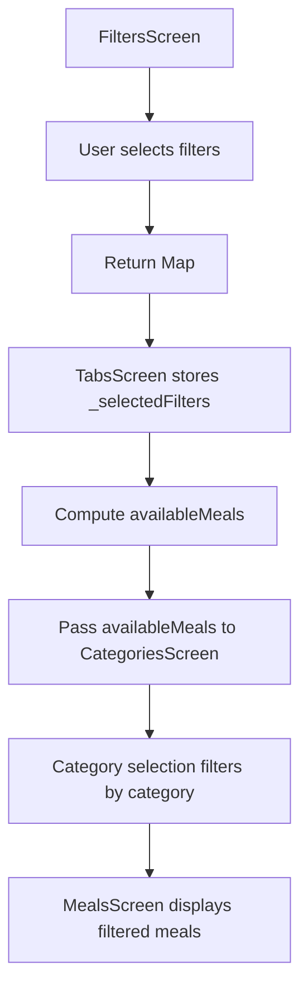
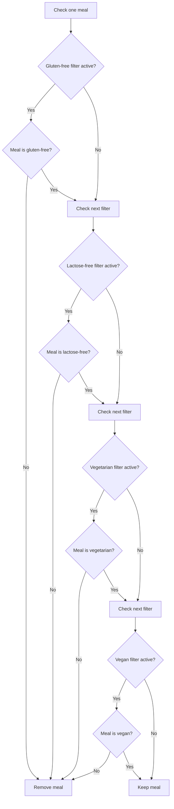
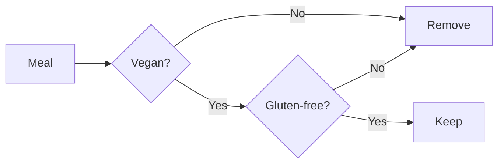
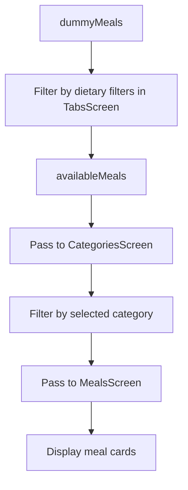
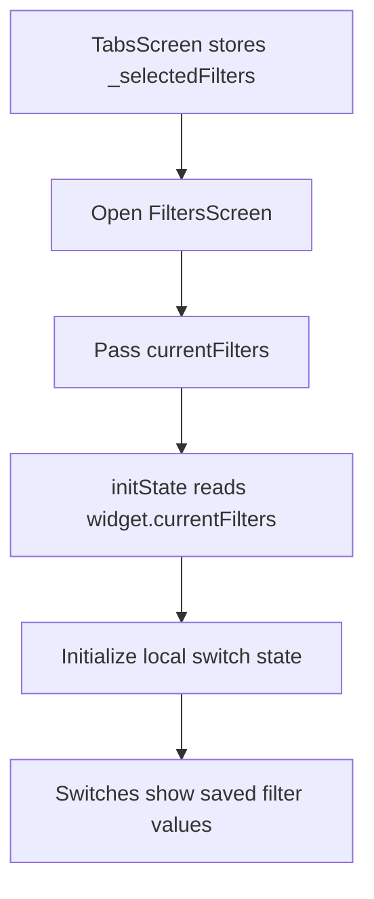

# Applying Filters

## Overview

This lecture connects the filter settings to the actual meal list.

Previously, the `FiltersScreen` allowed users to select filters such as:

* Gluten-free
* Lactose-free
* Vegetarian
* Vegan

The selected filters were returned to `TabsScreen` and stored in `_selectedFilters`.

Now, the app needs to use those selected filters to decide which meals should be displayed when the user selects a category.

---

## Goal

The goal is to filter the global `dummyMeals` list based on the active filters.

```text
User selects filters
→ TabsScreen stores selected filters
→ TabsScreen computes available meals
→ CategoriesScreen receives available meals
→ MealsScreen displays only meals matching category + filters
```

---

## Filter Flow



---

# Step 1: Store Selected Filters in `TabsScreen`

In `tabs.dart`, store the selected filters as app-wide state.

```dart
Map<Filter, bool> _selectedFilters = {
  Filter.glutenFree: false,
  Filter.lactoseFree: false,
  Filter.vegetarian: false,
  Filter.vegan: false,
};
```

Each filter starts as `false`, which means no filters are active by default.

---

## Filter State Meaning

| Filter               |   Value | Meaning                      |
| -------------------- | ------: | ---------------------------- |
| `Filter.glutenFree`  |  `true` | Only show gluten-free meals  |
| `Filter.lactoseFree` |  `true` | Only show lactose-free meals |
| `Filter.vegetarian`  |  `true` | Only show vegetarian meals   |
| `Filter.vegan`       |  `true` | Only show vegan meals        |
| Any filter           | `false` | Do not apply that filter     |

---

# Step 2: Create an Initial Filters Constant

To avoid repeating the same map multiple times, create a global constant.

```dart
const kInitialFilters = {
  Filter.glutenFree: false,
  Filter.lactoseFree: false,
  Filter.vegetarian: false,
  Filter.vegan: false,
};
```

The `k` prefix is a common Flutter convention for global constants.

Then initialize `_selectedFilters` with it:

```dart
Map<Filter, bool> _selectedFilters = kInitialFilters;
```

---

# Step 3: Update Filters When Returning from `FiltersScreen`

When the user returns from the `FiltersScreen`, update `_selectedFilters`.

```dart
void _setScreen(String identifier) async {
  Navigator.of(context).pop();

  if (identifier == 'filters') {
    final result = await Navigator.of(context).push<Map<Filter, bool>>(
      MaterialPageRoute(
        builder: (ctx) => FiltersScreen(
          currentFilters: _selectedFilters,
        ),
      ),
    );

    setState(() {
      _selectedFilters = result ?? kInitialFilters;
    });
  }
}
```

---

## Why Use `??`?

```dart
_selectedFilters = result ?? kInitialFilters;
```

The `??` operator means:

```text
Use result if it is not null.
Otherwise, use kInitialFilters.
```

This protects the app if the screen returns `null`.

---

# Step 4: Compute Available Meals

Now create a filtered list of meals based on `_selectedFilters`.

```dart
final availableMeals = dummyMeals.where((meal) {
  if (_selectedFilters[Filter.glutenFree]! && !meal.isGlutenFree) {
    return false;
  }
  if (_selectedFilters[Filter.lactoseFree]! && !meal.isLactoseFree) {
    return false;
  }
  if (_selectedFilters[Filter.vegetarian]! && !meal.isVegetarian) {
    return false;
  }
  if (_selectedFilters[Filter.vegan]! && !meal.isVegan) {
    return false;
  }
  return true;
}).toList();
```

This list contains only meals that satisfy all active filters.

---

## Filtering Logic Explained

Each filter check follows the same structure:

```dart
if (_selectedFilters[Filter.glutenFree]! && !meal.isGlutenFree) {
  return false;
}
```

This means:

```text
If the gluten-free filter is active
AND this meal is not gluten-free
THEN remove this meal from the list.
```

If the meal passes all checks, return `true`.

```dart
return true;
```

That keeps the meal in the list.

---

## Filter Logic Diagram



---

# Step 5: Why Use `!` After Map Access?

Example:

```dart
_selectedFilters[Filter.glutenFree]!
```

Accessing a map value can technically return `null`.

But in this app, we know this key always exists because `_selectedFilters` is initialized with all four filter keys.

So the `!` tells Dart:

```text
This value will not be null.
```

This is different from putting `!` before a value.

```dart
!meal.isGlutenFree
```

This means:

```text
not gluten-free
```

---

## Two Uses of `!`

| Syntax                                 | Meaning                           |
| -------------------------------------- | --------------------------------- |
| `_selectedFilters[Filter.glutenFree]!` | Assert that the value is not null |
| `!meal.isGlutenFree`                   | Check the opposite boolean value  |

---

# Step 6: Multiple Filters Work as AND Conditions

If multiple filters are active, a meal must satisfy all of them.

For example:

```text
Vegan = true
Gluten-free = true
```

Then the app only keeps meals that are both:

* Vegan
* Gluten-free

This is an AND relationship.



---

# Step 7: Pass Available Meals to `CategoriesScreen`

Now that `TabsScreen` has the filtered `availableMeals` list, pass it to `CategoriesScreen`.

```dart
Widget activePage = CategoriesScreen(
  availableMeals: availableMeals,
  onToggleFavorite: _toggleMealFavoriteStatus,
);
```

This means `CategoriesScreen` no longer starts from all `dummyMeals`.

It starts from the filtered list.

---

# Step 8: Update `CategoriesScreen`

In `categories.dart`, add a new property.

```dart
final List<Meal> availableMeals;
```

Update the constructor:

```dart
const CategoriesScreen({
  super.key,
  required this.availableMeals,
  required this.onToggleFavorite,
});
```

Then use `availableMeals` instead of `dummyMeals` when filtering by category.

```dart
final filteredMeals = availableMeals
    .where((meal) => meal.categories.contains(category.id))
    .toList();
```

---

## Category + Filter Flow



---

# Updated `CategoriesScreen` Example

```dart
class CategoriesScreen extends StatelessWidget {
  const CategoriesScreen({
    super.key,
    required this.availableMeals,
    required this.onToggleFavorite,
  });

  final List<Meal> availableMeals;
  final void Function(Meal meal) onToggleFavorite;

  void _selectCategory(BuildContext context, Category category) {
    final filteredMeals = availableMeals
        .where((meal) => meal.categories.contains(category.id))
        .toList();

    Navigator.of(context).push(
      MaterialPageRoute(
        builder: (ctx) => MealsScreen(
          title: category.title,
          meals: filteredMeals,
          onToggleFavorite: onToggleFavorite,
        ),
      ),
    );
  }

  @override
  Widget build(BuildContext context) {
    return GridView(
      children: [
        // category grid items
      ],
    );
  }
}
```

---

# Step 9: Preserve Filter Settings When Reopening `FiltersScreen`

After applying filters, one problem remains.

If the user opens the filters screen again, all switches may reset to `false`.

To fix this, pass the current selected filters into `FiltersScreen`.

```dart
FiltersScreen(
  currentFilters: _selectedFilters,
)
```

---

# Step 10: Add `currentFilters` to `FiltersScreen`

In `filters.dart`, add a property.

```dart
final Map<Filter, bool> currentFilters;
```

Update the constructor:

```dart
const FiltersScreen({
  super.key,
  required this.currentFilters,
});
```

---

# Step 11: Initialize Filter Switches with `initState`

Inside `_FiltersScreenState`, initialize local state from `widget.currentFilters`.

```dart
@override
void initState() {
  super.initState();

  _glutenFreeFilterSet = widget.currentFilters[Filter.glutenFree]!;
  _lactoseFreeFilterSet = widget.currentFilters[Filter.lactoseFree]!;
  _vegetarianFilterSet = widget.currentFilters[Filter.vegetarian]!;
  _veganFilterSet = widget.currentFilters[Filter.vegan]!;
}
```

---

## Why Use `initState()`?

The `widget` property is available inside methods of the state class.

It is not available when directly initializing class variables.

So we first set default values:

```dart
var _glutenFreeFilterSet = false;
var _lactoseFreeFilterSet = false;
var _vegetarianFilterSet = false;
var _veganFilterSet = false;
```

Then we overwrite them in `initState()` with the current saved filters.

---

## Filter Initialization Flow



---

# Full `TabsScreen` Filtering Example

```dart
const kInitialFilters = {
  Filter.glutenFree: false,
  Filter.lactoseFree: false,
  Filter.vegetarian: false,
  Filter.vegan: false,
};

class _TabsScreenState extends State<TabsScreen> {
  int _selectedPageIndex = 0;

  final List<Meal> _favoriteMeals = [];

  Map<Filter, bool> _selectedFilters = kInitialFilters;

  void _setScreen(String identifier) async {
    Navigator.of(context).pop();

    if (identifier == 'filters') {
      final result = await Navigator.of(context).push<Map<Filter, bool>>(
        MaterialPageRoute(
          builder: (ctx) => FiltersScreen(
            currentFilters: _selectedFilters,
          ),
        ),
      );

      setState(() {
        _selectedFilters = result ?? kInitialFilters;
      });
    }
  }

  void _selectPage(int index) {
    setState(() {
      _selectedPageIndex = index;
    });
  }

  @override
  Widget build(BuildContext context) {
    final availableMeals = dummyMeals.where((meal) {
      if (_selectedFilters[Filter.glutenFree]! && !meal.isGlutenFree) {
        return false;
      }
      if (_selectedFilters[Filter.lactoseFree]! && !meal.isLactoseFree) {
        return false;
      }
      if (_selectedFilters[Filter.vegetarian]! && !meal.isVegetarian) {
        return false;
      }
      if (_selectedFilters[Filter.vegan]! && !meal.isVegan) {
        return false;
      }
      return true;
    }).toList();

    Widget activePage = CategoriesScreen(
      availableMeals: availableMeals,
      onToggleFavorite: _toggleMealFavoriteStatus,
    );

    String activePageTitle = 'Categories';

    if (_selectedPageIndex == 1) {
      activePage = MealsScreen(
        meals: _favoriteMeals,
        onToggleFavorite: _toggleMealFavoriteStatus,
      );
      activePageTitle = 'Your Favorites';
    }

    return Scaffold(
      appBar: AppBar(
        title: Text(activePageTitle),
      ),
      drawer: MainDrawer(
        onSelectScreen: _setScreen,
      ),
      body: activePage,
      bottomNavigationBar: BottomNavigationBar(
        currentIndex: _selectedPageIndex,
        onTap: _selectPage,
        items: const [
          BottomNavigationBarItem(
            icon: Icon(Icons.set_meal),
            label: 'Categories',
          ),
          BottomNavigationBarItem(
            icon: Icon(Icons.star),
            label: 'Favorites',
          ),
        ],
      ),
    );
  }
}
```

---

# Optional: Use a Getter for `availableMeals`

Instead of defining `availableMeals` inside `build`, you can create a getter.

```dart
List<Meal> get _availableMeals {
  return dummyMeals.where((meal) {
    if (_selectedFilters[Filter.glutenFree]! && !meal.isGlutenFree) {
      return false;
    }
    if (_selectedFilters[Filter.lactoseFree]! && !meal.isLactoseFree) {
      return false;
    }
    if (_selectedFilters[Filter.vegetarian]! && !meal.isVegetarian) {
      return false;
    }
    if (_selectedFilters[Filter.vegan]! && !meal.isVegan) {
      return false;
    }
    return true;
  }).toList();
}
```

Then use it like this:

```dart
CategoriesScreen(
  availableMeals: _availableMeals,
  onToggleFavorite: _toggleMealFavoriteStatus,
)
```

This keeps the `build` method cleaner.

---

# Should Favorites Be Filtered Too?

In this lecture, favorites are not filtered.

That means favorite meals remain visible in the Favorites tab even if they do not match the current dietary filters.

```dart
activePage = MealsScreen(
  meals: _favoriteMeals,
  onToggleFavorite: _toggleMealFavoriteStatus,
);
```

This is a design choice.

If you want favorites to also respect the active filters, you can filter them like this:

```dart
activePage = MealsScreen(
  meals: _favoriteMeals
      .where((meal) => availableMeals.contains(meal))
      .toList(),
  onToggleFavorite: _toggleMealFavoriteStatus,
);
```

---

# Testing the Filters

After implementing the logic, test combinations of filters.

Examples:

| Active Filters      | Expected Result                                       |
| ------------------- | ----------------------------------------------------- |
| Vegetarian          | Non-vegetarian meals disappear                        |
| Vegan               | Non-vegan meals disappear                             |
| Gluten-free + Vegan | Only meals that are both gluten-free and vegan appear |
| All filters off     | All meals are available again                         |

For example, if the vegetarian filter is active, a hamburger should not appear in the hamburger category if it is not vegetarian.

---

# Important Concepts

| Concept            | Meaning                                         |
| ------------------ | ----------------------------------------------- |
| `_selectedFilters` | Stores active filters in `TabsScreen`           |
| `availableMeals`   | Meals that pass all active filters              |
| `where()`          | Filters a list based on a condition             |
| `return false`     | Removes an item from the filtered result        |
| `return true`      | Keeps an item in the filtered result            |
| `toList()`         | Converts the filtered iterable back into a list |
| `initState()`      | Initializes filter switches with saved values   |
| `??`               | Provides a fallback if a value is null          |

---

# Summary

This lecture applies the selected filters to the actual meal list.

`TabsScreen` stores `_selectedFilters` and uses those values to compute `availableMeals`.

Each meal is checked against all active filters. If a meal fails any active filter, it is removed from the list.

The filtered `availableMeals` list is passed to `CategoriesScreen`, which then filters it further by selected category before opening `MealsScreen`.

The filters are also preserved by passing `_selectedFilters` back into `FiltersScreen` and initializing the switch values in `initState()`.

With this, the Meals App now correctly shows only meals that match the user's selected dietary filters.
