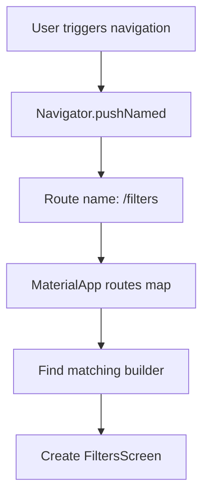
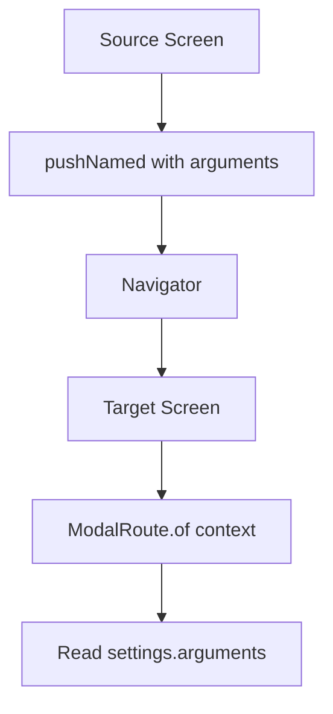
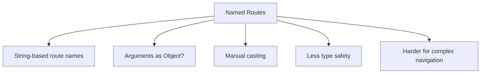

# An Alternative Navigation Pattern: Using Named Routes

## Overview

This lecture introduces an alternative navigation pattern in Flutter: **named routes**.

Throughout this module, the main navigation approach used was:

```dart
Navigator.of(context).push(
  MaterialPageRoute(
    builder: (ctx) => SomeScreen(),
  ),
);
```

This approach creates and pushes route objects manually.

Flutter also supports another pattern where routes are registered with names, and screens are opened by using those names.

This is called **named route navigation**.

---

## Main Idea

Instead of directly creating a `MaterialPageRoute` every time, you register route names in `MaterialApp`.

Then you navigate by calling:

```dart
Navigator.of(context).pushNamed('/filters');
```

---

## Navigation Pattern Comparison

| Pattern             | How It Works                                              |
| ------------------- | --------------------------------------------------------- |
| `MaterialPageRoute` | Create the screen directly when navigating                |
| Named Routes        | Register route names globally and navigate by string name |

---

## MaterialPageRoute Navigation

This is the approach used in the Meals App section.

```dart
Navigator.of(context).push(
  MaterialPageRoute(
    builder: (ctx) => const FiltersScreen(),
  ),
);
```

Here, the destination screen is created directly inside the `builder`.

---

## Named Route Navigation

With named routes, navigation looks like this:

```dart
Navigator.of(context).pushNamed('/filters');
```

Instead of directly creating the screen, Flutter looks up the route name in the route table.

---

## Named Route Flow



---

# Registering Named Routes

Named routes are registered in `MaterialApp`.

```dart
MaterialApp(
  initialRoute: '/',
  routes: {
    '/': (ctx) => const TabsScreen(),
    '/filters': (ctx) => const FiltersScreen(
          currentFilters: kInitialFilters,
        ),
  },
)
```

The `routes` map connects route names to screen builders.

---

## Route Map Structure

```dart
routes: {
  '/': (ctx) => const TabsScreen(),
  '/filters': (ctx) => const FiltersScreen(...),
}
```

Each entry has:

| Part                          | Meaning            |
| ----------------------------- | ------------------ |
| `'/filters'`                  | The route name     |
| `(ctx) => FiltersScreen(...)` | The screen builder |

---

## Common Route Names

| Route Name       | Screen             |
| ---------------- | ------------------ |
| `'/'`            | Home / main screen |
| `'/categories'`  | Categories screen  |
| `'/meals'`       | Meals screen       |
| `'/meal-detail'` | Meal detail screen |
| `'/filters'`     | Filters screen     |

---

# Navigating with Named Routes

After registering a route, navigate to it with:

```dart
Navigator.of(context).pushNamed('/filters');
```

This tells Flutter:

```text
Find the route named "/filters" and push it onto the navigation stack.
```

---

## Example

```dart
void _setScreen(String identifier) {
  Navigator.of(context).pop();

  if (identifier == 'filters') {
    Navigator.of(context).pushNamed('/filters');
  }
}
```

This can replace the longer `MaterialPageRoute` version.

---

# Named Routes vs Direct Routes

## Direct Route

```dart
Navigator.of(context).push(
  MaterialPageRoute(
    builder: (ctx) => const FiltersScreen(),
  ),
);
```

## Named Route

```dart
Navigator.of(context).pushNamed('/filters');
```

Named routes are shorter at the navigation call site, but they require global route registration.

---

# Passing Data with Named Routes

Named routes can also receive data through the `arguments` parameter.

```dart
Navigator.of(context).pushNamed(
  '/meals',
  arguments: filteredMeals,
);
```

This sends `filteredMeals` to the destination route.

---

## Reading Arguments in the Target Screen

Inside the target screen, use `ModalRoute.of(context)`.

```dart
final meals = ModalRoute.of(context)!.settings.arguments as List<Meal>;
```

This reads the data that was passed through `arguments`.

---

## Data Passing Flow



---

# Example: Passing Meals to a Named Route

## Source Screen

```dart
Navigator.of(context).pushNamed(
  '/meals',
  arguments: filteredMeals,
);
```

## Target Screen

```dart
final meals = ModalRoute.of(context)!.settings.arguments as List<Meal>;
```

Then the target screen can use `meals` to render the list.

---

# Limitation: Arguments Are Not Strongly Typed

Named route arguments are stored as `Object?`.

That means Dart does not automatically know what type they are.

So you must cast them manually:

```dart
as List<Meal>
```

This can be risky.

If the wrong type is passed, the app may crash at runtime.

---

## Type Safety Comparison

| Navigation Style      | Type Safety                          |
| --------------------- | ------------------------------------ |
| Constructor arguments | Stronger type safety                 |
| Named route arguments | Weaker type safety, requires casting |

With constructor-based navigation:

```dart
MealDetailsScreen(meal: meal)
```

Dart knows that `meal` must be a `Meal`.

With named routes:

```dart
ModalRoute.of(context)!.settings.arguments as Meal
```

You must manually cast the value.

---

# Why Named Routes Are Not Always Recommended

Named routes are convenient for simple navigation, but they have drawbacks.

## Main Drawbacks

* Route names are strings, so typos are easy.
* Arguments are not strongly typed.
* Passing complex data can become awkward.
* Route configuration is global.
* Large apps may become harder to maintain.

Example typo:

```dart
Navigator.of(context).pushNamed('/fitlers');
```

This typo would not be caught like a normal Dart type error.

---

# Named Route Limitation Diagram



---

# When Named Routes Can Be Useful

Named routes can still be useful in small apps or simple demos.

They work well when:

* The app has a small number of screens
* Navigation does not require much data passing
* Route paths are simple
* You want centralized route registration

---

# When Constructor-Based Routes Are Better

Using `MaterialPageRoute` with constructor arguments is often clearer when passing data.

Example:

```dart
Navigator.of(context).push(
  MaterialPageRoute(
    builder: (ctx) => MealDetailsScreen(
      meal: meal,
      onToggleFavorite: onToggleFavorite,
    ),
  ),
);
```

This is more verbose, but the data flow is explicit and type-safe.

---

# Modern Alternative: `go_router`

For larger or production apps, Flutter developers often use routing packages such as `go_router`.

`go_router` is more powerful than basic named routes because it supports:

* URL-based navigation
* Deep linking
* Redirects
* Nested routes
* More scalable route configuration

So named routes are useful to understand, but they are not always the best long-term solution.

---

# Navigation Options Summary

| Approach            | Best For                                 |
| ------------------- | ---------------------------------------- |
| `MaterialPageRoute` | Simple, explicit, type-safe navigation   |
| Named routes        | Small apps with simple route names       |
| `go_router`         | Larger apps, deep links, complex routing |

---

# Example Full Named Route Setup

```dart
MaterialApp(
  initialRoute: '/',
  routes: {
    '/': (ctx) => const TabsScreen(),
    '/filters': (ctx) => const FiltersScreen(
          currentFilters: kInitialFilters,
        ),
    '/meals': (ctx) => const MealsScreen(
          meals: [],
          onToggleFavorite: _dummyToggleFavorite,
        ),
  },
)
```

Then navigate like this:

```dart
Navigator.of(context).pushNamed('/filters');
```

---

# Important Concepts

| Concept                  | Meaning                                       |
| ------------------------ | --------------------------------------------- |
| Named route              | A route identified by a string name           |
| `routes` map             | Registers route names in `MaterialApp`        |
| `initialRoute`           | The first route loaded when the app starts    |
| `pushNamed`              | Navigates to a route by name                  |
| `arguments`              | Optional data passed to a named route         |
| `ModalRoute.of(context)` | Reads route information inside a screen       |
| `pushReplacementNamed`   | Replaces the current route with a named route |

---

# Summary

Named routes are an alternative navigation pattern in Flutter.

Instead of manually creating a `MaterialPageRoute`, you register route names in `MaterialApp` and navigate with:

```dart
Navigator.of(context).pushNamed('/filters');
```

Named routes can make simple navigation shorter and more centralized.

However, they are less flexible and less type-safe when passing data, because arguments must be retrieved manually and cast from `Object?`.

For the Meals App, the constructor-based `MaterialPageRoute` approach remains clearer and more practical. Named routes are still worth knowing because they appear in older Flutter projects and tutorials.
