# Module Summary

## Overview

This module built a complete multi-screen Flutter app: the **Meals App**.

The app allows users to:

* Browse meal categories
* Open meals inside a selected category
* View meal details
* Mark meals as favorites
* Switch between categories and favorites with tabs
* Open a side drawer
* Configure dietary filters
* Return data from one screen back to another

While building this app, the module introduced many important Flutter navigation and state management patterns.

---

## Final App Features

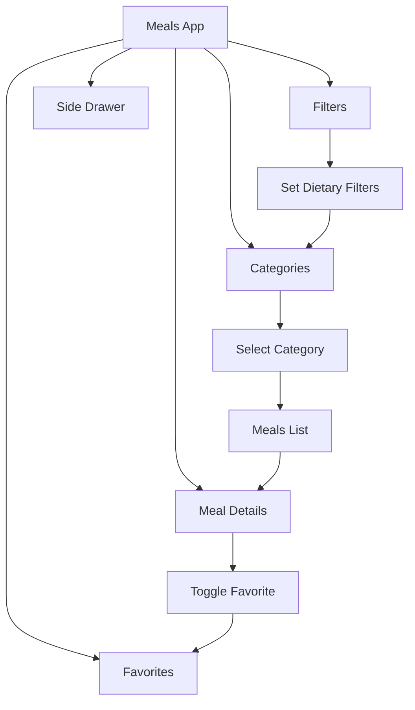

---

# Main Concepts Covered

## 1. Multi-Screen Navigation

Flutter navigation is based on a **stack of screens**.

You can push new screens onto the stack and pop screens off the stack.

```text id="n8mx77"
Push screen → Go forward
Pop screen  → Go back
```

---

## Navigator Stack Mental Model

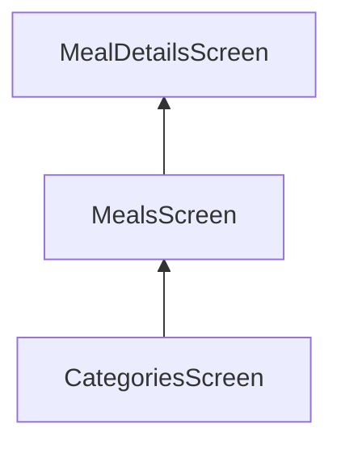

The top screen is the screen currently visible to the user.

If the user presses back, the top screen is removed.

---

## Important Navigator Methods

| Method                           | Purpose                                    |
| -------------------------------- | ------------------------------------------ |
| `Navigator.push()`               | Adds a new screen on top of the stack      |
| `Navigator.pop()`                | Removes the current screen                 |
| `Navigator.pushReplacement()`    | Replaces the current screen with a new one |
| `Navigator.pop(context, result)` | Pops a screen and returns data             |

---

# 2. Pushing Screens

To navigate to a new screen, you used `Navigator.push()` with `MaterialPageRoute`.

```dart id="psvfxo"
Navigator.of(context).push(
  MaterialPageRoute(
    builder: (ctx) => MealsScreen(
      title: category.title,
      meals: filteredMeals,
    ),
  ),
);
```

This adds a new screen on top of the current screen.

---

## Push Flow

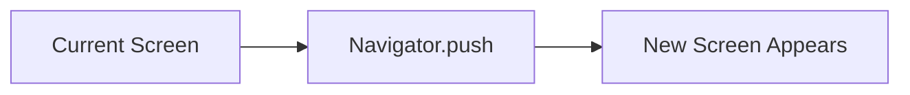

---

# 3. Popping Screens

To go back, Flutter removes the current screen from the navigation stack.

```dart id="l4pstl"
Navigator.of(context).pop();
```

This was also used to close the drawer.

```dart id="v9219k"
Navigator.of(context).pop(); // closes drawer
```

---

# 4. Replacing Screens

You also learned about `pushReplacement()`.

```dart id="j3lg14"
Navigator.of(context).pushReplacement(
  MaterialPageRoute(
    builder: (ctx) => const FiltersScreen(),
  ),
);
```

This replaces the current screen instead of stacking a new one on top.

---

## Push vs Push Replacement

| Method              | Behavior                | Back Button Result                |
| ------------------- | ----------------------- | --------------------------------- |
| `push()`            | Adds a new screen       | Goes back to previous screen      |
| `pushReplacement()` | Replaces current screen | Cannot go back to replaced screen |

---

# 5. Tab-Based Navigation

The app uses a `BottomNavigationBar` to switch between:

* Categories
* Favorites

The selected tab index is stored in state.

```dart id="4iv547"
int _selectedPageIndex = 0;

void _selectPage(int index) {
  setState(() {
    _selectedPageIndex = index;
  });
}
```

---

## Tab Navigation Flow

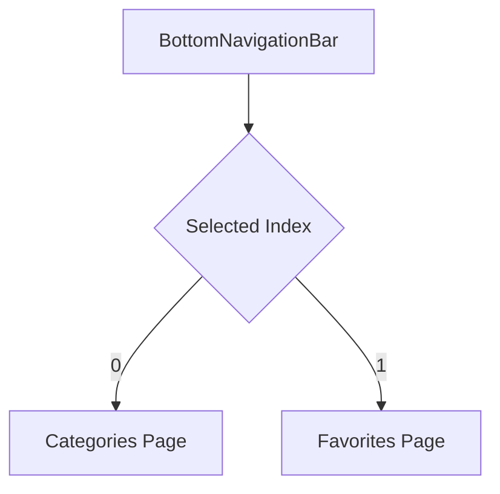

---

## Why Tabs Need State

The app must remember which tab is currently active.

```text id="h56d3b"
_selectedPageIndex = 0 → Categories tab
_selectedPageIndex = 1 → Favorites tab
```

When the user taps a tab, `setState()` updates the index and rebuilds the UI.

---

# 6. Favorites State

The app stores favorite meals in a list.

```dart id="7yh5c7"
final List<Meal> _favoriteMeals = [];
```

When a meal is marked or unmarked as favorite, the list is updated.

```dart id="t9txvd"
void _toggleMealFavoriteStatus(Meal meal) {
  final isExisting = _favoriteMeals.contains(meal);

  if (isExisting) {
    setState(() {
      _favoriteMeals.remove(meal);
    });
  } else {
    setState(() {
      _favoriteMeals.add(meal);
    });
  }
}
```

---

## Favorite Toggle Flow

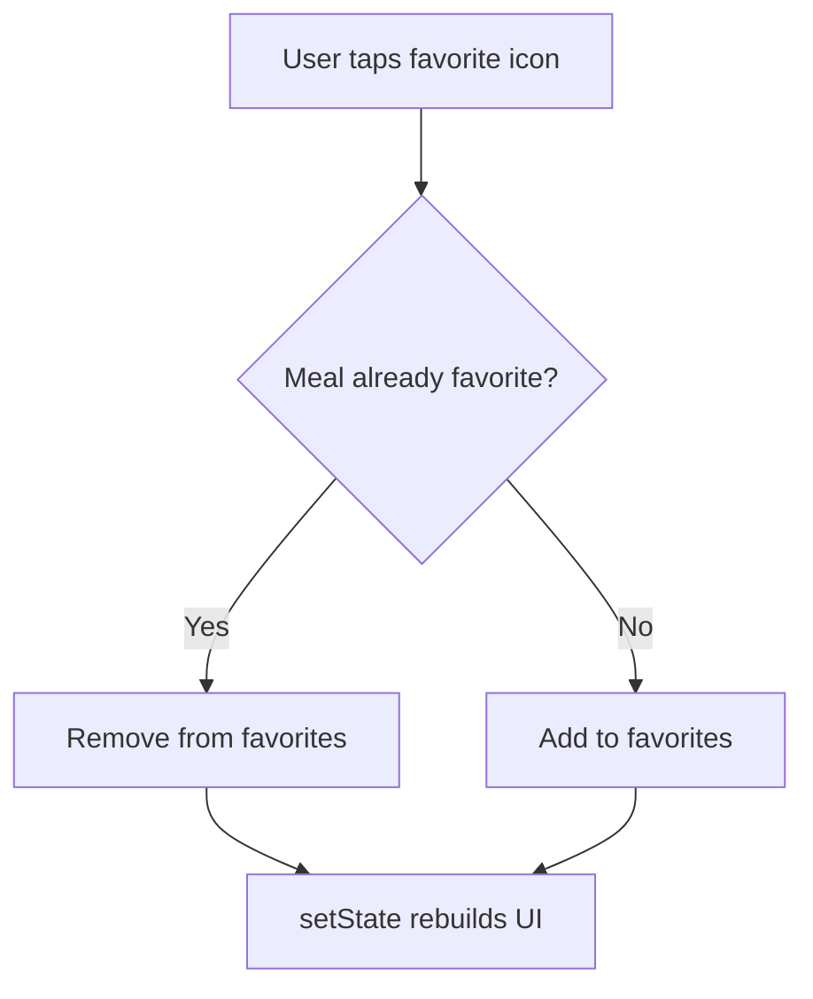

---

# 7. Side Drawer Navigation

The app also uses a side drawer for secondary navigation.

The drawer contains links such as:

* Meals
* Filters

```dart id="yygius"
drawer: MainDrawer(
  onSelectScreen: _setScreen,
),
```

---

## Drawer Structure

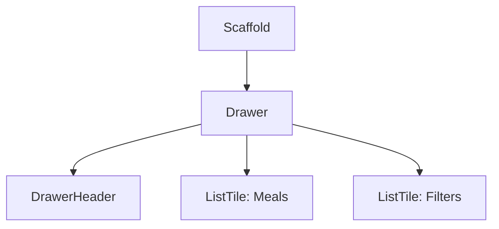

---

## Closing the Drawer

Before navigating from the drawer, the drawer should be closed.

```dart id="dh4uzo"
Navigator.of(context).pop();
```

Then the app can navigate to another screen.

```dart id="yqt9da"
void _setScreen(String identifier) async {
  Navigator.of(context).pop();

  if (identifier == 'filters') {
    await Navigator.of(context).push(
      MaterialPageRoute(
        builder: (ctx) => FiltersScreen(
          currentFilters: _selectedFilters,
        ),
      ),
    );
  }
}
```

---

# 8. Passing Data to Screens

The module used constructor arguments to pass data into screens.

Example:

```dart id="vkwbrz"
MealsScreen(
  title: category.title,
  meals: filteredMeals,
  onToggleFavorite: onToggleFavorite,
)
```

This keeps the destination screen self-contained and type-safe.

---

## Data Passing Flow

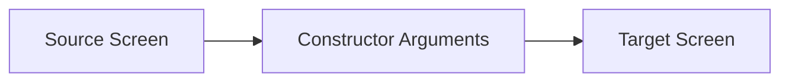

---

# 9. Returning Data from Screens

The app also returns data from `FiltersScreen` back to `TabsScreen`.

This is done with:

```dart id="l9xu6j"
Navigator.of(context).pop({
  Filter.glutenFree: _glutenFreeFilterSet,
  Filter.lactoseFree: _lactoseFreeFilterSet,
  Filter.vegetarian: _vegetarianFilterSet,
  Filter.vegan: _veganFilterSet,
});
```

The calling screen waits for the result with `await`.

```dart id="d9dpe8"
final result = await Navigator.of(context).push<Map<Filter, bool>>(
  MaterialPageRoute(
    builder: (ctx) => FiltersScreen(
      currentFilters: _selectedFilters,
    ),
  ),
);
```

---

## Returning Data Flow

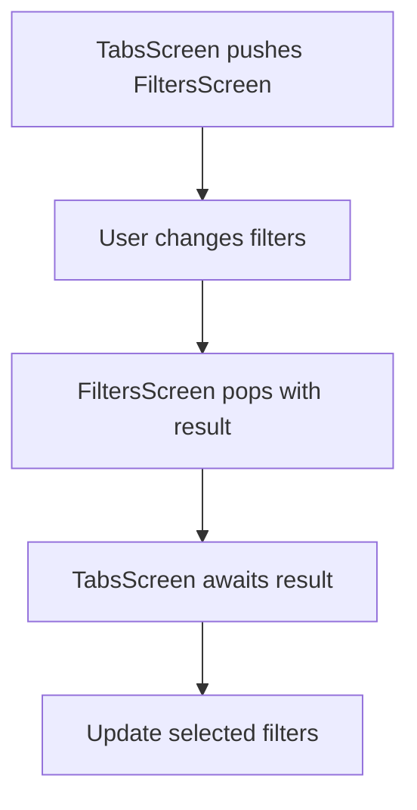

---

# 10. Intercepting Back Navigation with `PopScope`

Older Flutter code used `WillPopScope`.

Modern Flutter uses `PopScope`.

`PopScope` allows you to intercept the back button and return data before leaving the screen.

```dart id="ybc5j0"
PopScope(
  canPop: false,
  onPopInvoked: (didPop) {
    if (didPop) return;

    Navigator.of(context).pop({
      Filter.glutenFree: _glutenFreeFilterSet,
      Filter.lactoseFree: _lactoseFreeFilterSet,
      Filter.vegetarian: _vegetarianFilterSet,
      Filter.vegan: _veganFilterSet,
    });
  },
  child: Scaffold(
    appBar: AppBar(
      title: const Text('Your Filters'),
    ),
    body: ...
  ),
)
```

---

## Why `PopScope` Was Needed

The app needed to return the selected filters when the user pressed back.

```text id="jlxtzs"
Back button pressed
→ Intercept pop
→ Return selected filters
→ Close FiltersScreen
```

---

# 11. Applying Filters

The selected filters are stored in `TabsScreen`.

```dart id="x9ktuy"
Map<Filter, bool> _selectedFilters = kInitialFilters;
```

Then the app computes the available meals.

```dart id="mewad1"
final availableMeals = dummyMeals.where((meal) {
  if (_selectedFilters[Filter.glutenFree]! && !meal.isGlutenFree) {
    return false;
  }
  if (_selectedFilters[Filter.lactoseFree]! && !meal.isLactoseFree) {
    return false;
  }
  if (_selectedFilters[Filter.vegetarian]! && !meal.isVegetarian) {
    return false;
  }
  if (_selectedFilters[Filter.vegan]! && !meal.isVegan) {
    return false;
  }
  return true;
}).toList();
```

---

## Filter Logic

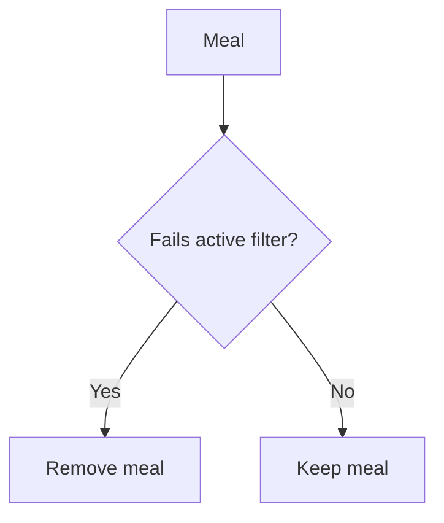

Multiple filters work together as an AND condition.

```text id="p2p8z3"
Gluten-free + Vegan
→ Meal must be gluten-free AND vegan
```

---

# 12. Preserving Filter State

When reopening `FiltersScreen`, the previously selected filters should still be active.

So `TabsScreen` passes the current filters to `FiltersScreen`.

```dart id="ovjfoj"
FiltersScreen(
  currentFilters: _selectedFilters,
)
```

Then `FiltersScreen` initializes its local switch state in `initState()`.

```dart id="h0fecu"
@override
void initState() {
  super.initState();

  _glutenFreeFilterSet = widget.currentFilters[Filter.glutenFree]!;
  _lactoseFreeFilterSet = widget.currentFilters[Filter.lactoseFree]!;
  _vegetarianFilterSet = widget.currentFilters[Filter.vegetarian]!;
  _veganFilterSet = widget.currentFilters[Filter.vegan]!;
}
```

---

## Filter State Preservation Flow

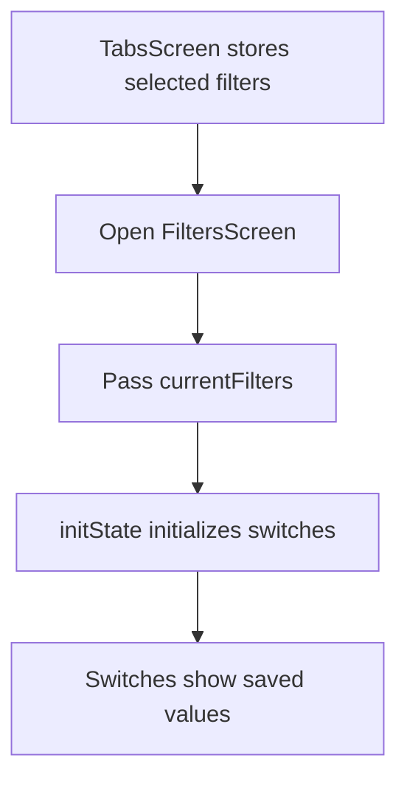

---

# 13. Named Routes as an Alternative

The module also mentioned named routes as an alternative navigation pattern.

```dart id="wth61s"
Navigator.of(context).pushNamed('/filters');
```

Named routes are registered in `MaterialApp`.

```dart id="z39gux"
MaterialApp(
  routes: {
    '/': (ctx) => const TabsScreen(),
    '/filters': (ctx) => FiltersScreen(
          currentFilters: kInitialFilters,
        ),
  },
)
```

However, constructor-based navigation with `MaterialPageRoute` is often clearer and more type-safe for apps that pass data between screens.

---

## Navigation Options

| Navigation Pattern  | Best For                                    |
| ------------------- | ------------------------------------------- |
| `MaterialPageRoute` | Explicit, type-safe navigation              |
| Named routes        | Simple apps or older Flutter projects       |
| `go_router`         | Larger apps, deep linking, scalable routing |

---

# 14. Prop Drilling

A major lesson from this module is that manually passing data and functions through many widget layers can become difficult.

For example:

```text id="eeu6ic"
TabsScreen
→ CategoriesScreen
→ MealsScreen
→ MealItem / MealDetailsScreen
```

The app passed data and callbacks through multiple layers, such as:

* Favorite meals
* Toggle favorite function
* Available meals
* Selected filters

This pattern is called **prop drilling**.

---

## Prop Drilling Diagram

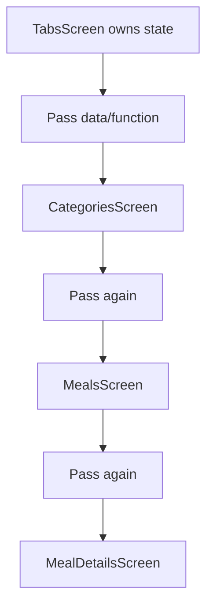

Prop drilling works, but it becomes annoying and hard to maintain as an app grows.

---

# Why This Module Matters

This module teaches the core navigation patterns used in real Flutter apps.

It also reveals a key limitation:

```text id="rjsarc"
Manual state passing works,
but it does not scale well.
```

That limitation is the motivation for learning state management tools such as Riverpod.

---

# Final App Architecture

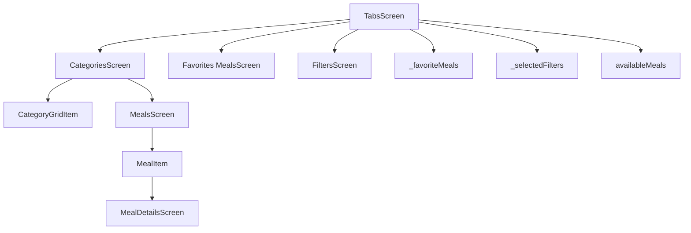

---

# Key Takeaways

| Topic               | Key Lesson                                                        |
| ------------------- | ----------------------------------------------------------------- |
| Navigator stack     | Screens are pushed and popped like a stack                        |
| `push()`            | Opens a new screen                                                |
| `pop()`             | Goes back or closes overlays like drawers                         |
| `pushReplacement()` | Replaces the current screen                                       |
| Bottom tabs         | Use `BottomNavigationBar` and selected index state                |
| Drawer              | Use `Scaffold.drawer` for side navigation                         |
| Returned data       | Use `Navigator.pop(context, result)` and `await Navigator.push()` |
| `PopScope`          | Intercept back navigation and return data                         |
| Filters             | Store selected filters and compute available meals                |
| Prop drilling       | Passing data/functions through layers works but scales poorly     |

---

# Practice Ideas

To reinforce this module, try building small variations of the Meals App:

* Add a new filter option
* Add a search screen
* Add a "Recently Viewed Meals" tab
* Filter favorites as well as category meals
* Replace manual navigation with named routes
* Try building the same navigation with `go_router`

---

# Summary

This module completed the Meals App and introduced essential Flutter navigation patterns.

You learned how to use `Navigator.push()`, `Navigator.pop()`, and `Navigator.pushReplacement()` to move between screens.

You also learned how to build tab navigation with `BottomNavigationBar`, drawer navigation with `Drawer`, and how to pass data both into and back from screens.

The module also introduced filter state, `PopScope`, returned navigation results, and the limitations of manually passing data and functions through many widget layers.

These concepts are important foundations for the next major topic: scalable state management with tools like Riverpod.
