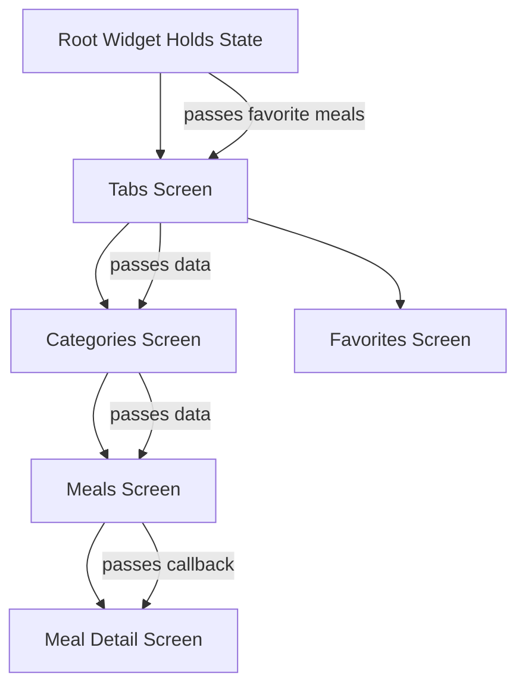
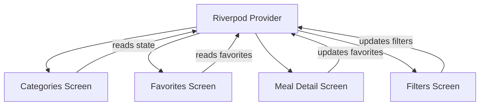
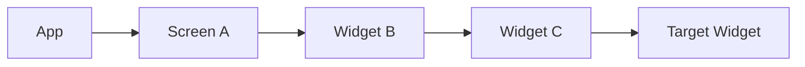
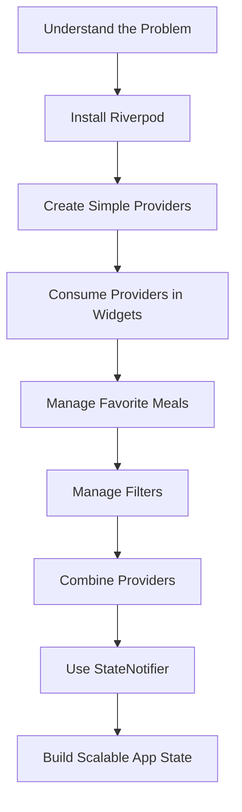

# Module Introduction: Riverpod State Management

## Overview

This module introduces **state management in Flutter** using the **Riverpod** package.

In the previous section, we built a multi-screen Meals App with features such as:

* Browsing meal categories
* Viewing meal details
* Marking meals as favorites
* Applying filters to show only certain meals

While building that app, we discovered that managing state across multiple screens can quickly become difficult when relying only on `setState`, manual callbacks, and prop drilling.

This module continues from that problem and introduces Riverpod as a cleaner, more scalable solution for managing application-wide and cross-widget state.

---

## Why State Management Becomes Difficult

In small apps, `setState()` is often enough.

However, as an app grows, state may need to be shared across many different widgets and screens. For example, in the Meals App:

* Favorite meals affect both the meal detail screen and the favorites screen
* Filters affect which meals appear in category screens
* Multiple screens need access to the same shared data
* Passing data through many widget layers becomes messy

This leads to a common problem: **state is no longer local to one widget**.

---

## The Problem With the Current Solution

In the previous implementation, state was managed manually by lifting state up and passing data or functions down through constructors.

This works, but it becomes cumbersome as the app grows.



The deeper the widget tree becomes, the more data and functions must be passed around manually.

This is often called **prop drilling**.

---

## What Is Riverpod?

**Riverpod** is a state management package for Flutter.

It is a modern alternative to the older Provider package and is designed to make shared state easier, safer, and more scalable.

Riverpod allows widgets to access shared state directly through providers, without needing to pass data through every widget in between.

---

## Riverpod Mental Model

Instead of storing shared state inside a widget and passing it down manually, Riverpod stores state inside **providers**.

Widgets can then listen to those providers whenever they need the data.



This makes the app easier to maintain because state is centralized and accessible where needed.

---

## What This Module Covers

This module will guide you through Riverpod step by step.

You will learn how to:

1. Understand the limitations of `setState`
2. Install and configure Riverpod
3. Create basic providers
4. Consume providers inside widgets
5. Manage shared state across screens
6. Combine multiple providers
7. Use more advanced provider patterns
8. Manage favorites and filters using Riverpod
9. Work with `StateNotifier` for more complex state logic

---

## Key Concepts

### Local State

Local state belongs to a single widget.

Example:

```dart
bool isExpanded = false;
```

This kind of state can often be managed with `setState()`.

---

### Shared State

Shared state is needed by multiple widgets or screens.

Examples:

```dart
List<Meal> favoriteMeals;
Map<Filter, bool> selectedFilters;
```

This kind of state is better managed with a dedicated state management solution like Riverpod.

---

### Prop Drilling

Prop drilling means passing data through many widgets just so a deeply nested widget can use it.



Even if only the target widget needs the data, every widget in between still has to receive and forward it.

Riverpod helps avoid this problem.

---

## Before Riverpod vs After Riverpod

| Without Riverpod                    | With Riverpod                   |
| ----------------------------------- | ------------------------------- |
| State is stored in widgets          | State is stored in providers    |
| Data is passed through constructors | Widgets read providers directly |
| Many callbacks are required         | State logic can be centralized  |
| Harder to scale                     | Easier to maintain              |
| More prop drilling                  | Less prop drilling              |

---

## Example Use Case in the Meals App

Before Riverpod, favorite meals may need to be passed manually from the root widget to multiple screens.

With Riverpod, favorite meals can be stored in a provider.

```dart
final favoriteMealsProvider = StateNotifierProvider<FavoritesNotifier, List<Meal>>(
  (ref) => FavoritesNotifier(),
);
```

Any screen that needs favorite meals can read or watch this provider.

```dart
final favoriteMeals = ref.watch(favoriteMealsProvider);
```

This removes the need to pass favorite data manually through the widget tree.

---

## Learning Flow



---

## Key Points

* State management becomes more complex as apps grow.
* `setState()` is useful for local state, but not ideal for app-wide state.
* Passing data and callbacks through many widgets can become messy.
* Riverpod helps manage shared state in a cleaner way.
* Providers make state accessible to the widgets that actually need it.
* This module refactors the Meals App away from manual state management.
* By the end of the module, favorites and filters will be managed using Riverpod.

---

## Tips

* Keep the widget tree in mind when learning Riverpod.
* First understand why the current `setState` solution becomes difficult.
* Think of providers as external state containers.
* Use `setState` for simple local UI state.
* Use Riverpod for shared or app-wide state.
* Review the Meals App structure before refactoring it.
* The official Riverpod documentation is a useful companion while learning.

---

## Summary

This module introduces Riverpod as a scalable solution for managing shared state in Flutter applications.

The Meals App from the previous section already has features like favorites and filters, but managing that state manually with `setState`, callbacks, and prop drilling becomes cumbersome as the app grows.

Riverpod solves this problem by moving shared state into providers, allowing widgets to access and update state without passing data through the entire widget tree.

By the end of this module, you will understand how to use Riverpod to manage cross-widget and application-wide state in a cleaner, safer, and more maintainable way.
