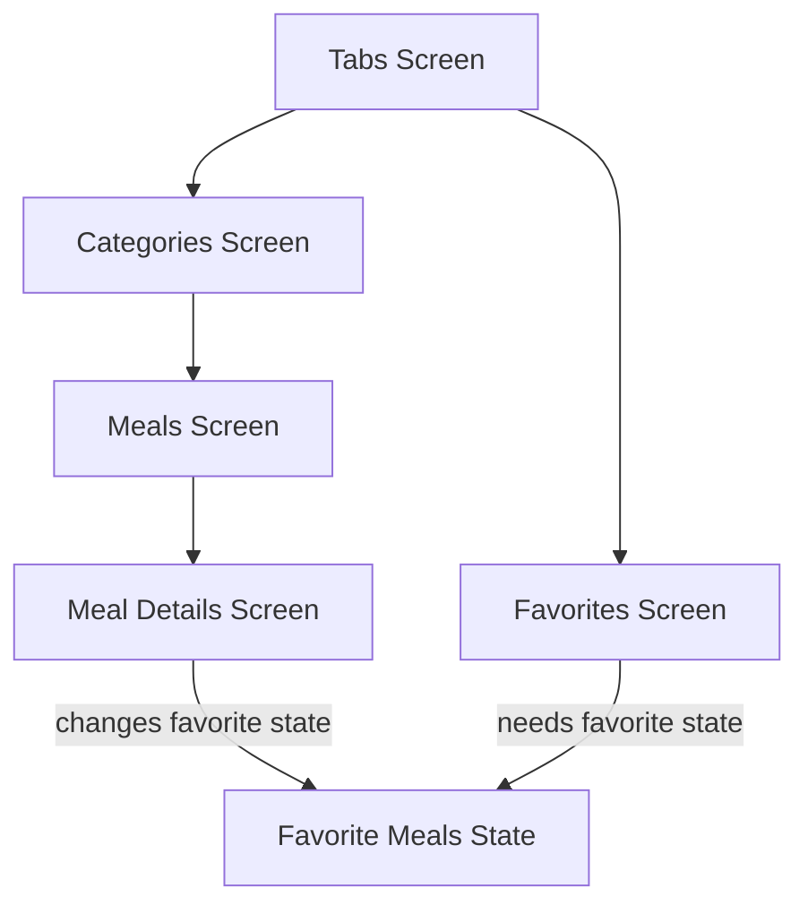
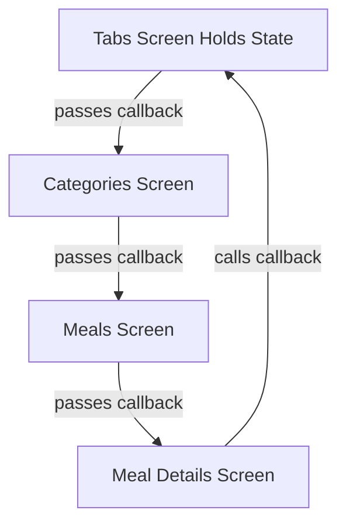
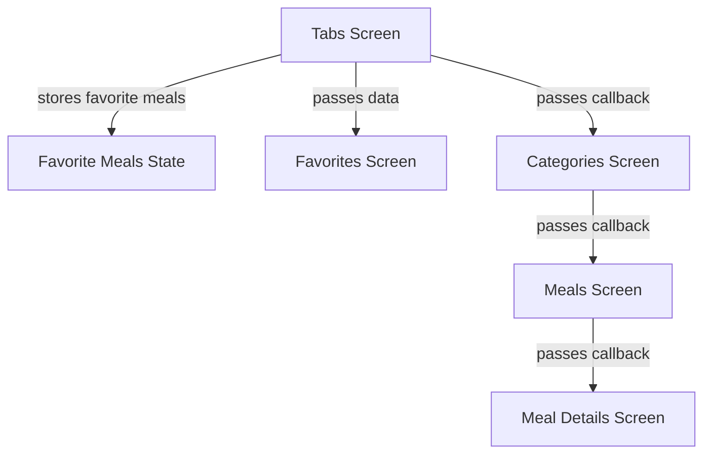
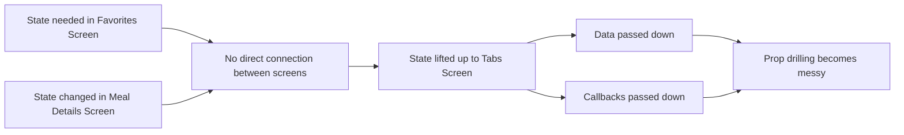

# What’s The Problem?

## Overview

This lecture explains the main problem with managing state manually in a Flutter app.

In the previous section, we built a multi-screen Meals App. The app allows users to browse meals, view meal details, mark meals as favorites, and view those favorite meals on a separate screen.

The problem is that the same piece of state — the list of favorite meals — is needed in one place but changed in another place.

This creates a state management problem.

---

## The Core Problem

In the Meals App:

* The **Favorites Screen** needs access to the list of favorite meals.
* The **Meal Details Screen** changes the favorite meals state.
* These two screens are not directly connected.
* They are reached through different navigation paths.

Because of this, the app cannot easily share state between them using only local widget state.

---

## Example Situation

The user marks or unmarks a meal as favorite from the **Meal Details Screen**.

However, the result must be shown on the **Favorites Screen**.



The problem is that the screen changing the state and the screen displaying the state are in different parts of the widget/navigation structure.

---

## Why This Is Difficult Without State Management

Flutter widgets normally communicate through constructor arguments.

That means data is passed **down** the widget tree.

If a deeply nested widget needs to update state owned by an ancestor, a callback must also be passed down.

This creates two directions of communication:



The `TabsScreen` owns the favorite meals state, but the `MealDetailsScreen` needs to trigger updates.

So the update method must be passed through every screen in between.

---

## Prop Drilling

Passing data or functions through multiple widget layers is called **prop drilling**.

In this app, the favorite toggle function must be passed from the `TabsScreen` down to the `MealDetailsScreen`.

```dart id="n5qx7q"
TabsScreen
  └── CategoriesScreen
        └── MealsScreen
              └── MealDetailsScreen
```

Even if `CategoriesScreen` and `MealsScreen` do not really need the favorite toggle function, they still have to receive it and forward it.

This makes the code harder to maintain.

---

## Callback Threading

Because the state is owned by a parent widget, child widgets cannot directly change it.

Instead, the parent creates a function and passes that function down.

```dart id="hb6x8o"
void _toggleMealFavoriteStatus(Meal meal) {
  setState(() {
    // update favorite meals
  });
}
```

Then this function is passed through multiple constructors:

```dart id="e7uu91"
CategoriesScreen(
  onToggleFavorite: _toggleMealFavoriteStatus,
);
```

Then again:

```dart id="cq7c21"
MealsScreen(
  onToggleFavorite: onToggleFavorite,
);
```

Then finally:

```dart id="s2mur7"
MealDetailsScreen(
  onToggleFavorite: onToggleFavorite,
);
```

This works, but it becomes inconvenient as the app grows.

---

## Why `setState()` Is Not Enough

`setState()` is useful for local state.

For example:

```dart id="q8b27p"
bool isExpanded = false;
```

This state belongs to one widget, so `setState()` is simple and appropriate.

But favorite meals are different.

```dart id="qmrjyz"
List<Meal> favoriteMeals = [];
```

This state is needed by multiple screens.

That makes it shared application state, not just local widget state.

---

## Local State vs Shared State

| Type           | Example                           | Good Solution              |
| -------------- | --------------------------------- | -------------------------- |
| Local state    | A button is expanded or collapsed | `setState()`               |
| Screen state   | A form input changes              | `setState()` or controller |
| Shared state   | Favorite meals                    | Riverpod                   |
| App-wide state | Filters, authentication, theme    | Riverpod                   |

The bigger the app becomes, the more shared state appears.

---

## The Current Manual Solution

The current solution is to lift the favorite meals state up to the `TabsScreen`.



This approach works, but it has problems:

* Too much state is stored high up in the widget tree
* Too many widgets receive data they do not use
* Too many callbacks must be forwarded
* Changing the state structure requires editing many files
* The app becomes harder to understand and maintain

---

## Main Pain Points

### 1. Unrelated Widgets Become Connected

Widgets that do not care about favorites still need to pass favorite-related data or callbacks.

This creates unnecessary coupling.

---

### 2. Constructor Lists Become Long

As more state is added, widget constructors become larger.

```dart id="xez774"
const MealsScreen({
  required this.meals,
  required this.onToggleFavorite,
  required this.availableFilters,
  required this.selectedCategory,
});
```

This makes the widget harder to reuse and maintain.

---

### 3. Updating State From Far Away Becomes Awkward

The widget that updates the state may be far away from the widget that owns the state.

This forces callback threading.

---

### 4. Adding New Features Becomes Fragile

If another screen also needs access to favorite meals, the data must be passed there too.

Each new feature may require changes across many widgets.

---

### 5. Large Rebuilds Can Happen

When state is stored high in the widget tree and `setState()` is called there, larger parts of the UI may rebuild than necessary.

This can make the app less efficient.

---

## Visual Summary of the Problem



---

## Why We Need a Better Solution

The current approach is not completely wrong.

For small apps, lifting state up and passing callbacks can work fine.

However, as the app grows, this approach becomes harder to manage.

A better solution should allow:

* Shared state to be stored outside the widget tree
* Multiple widgets to access the same state
* Deeply nested widgets to update state easily
* Less prop drilling
* Cleaner and more maintainable code

This is exactly the problem that Riverpod helps solve.

---

## Key Points

* The Favorites Screen needs favorite meals data.
* The Meal Details Screen updates favorite meals.
* These screens are not directly connected.
* Without a state management tool, state must be lifted up.
* Data and callbacks must be passed through many widget layers.
* This pattern is called prop drilling.
* `setState()` is good for local state but not ideal for shared app-wide state.
* Riverpod provides a cleaner way to manage shared state.

---

## Tips

* Draw the widget tree to understand where state lives.
* Identify which widgets need to read state.
* Identify which widgets need to update state.
* If many unrelated widgets need the same state, local `setState()` is probably not enough.
* If data or callbacks are being passed through widgets that do not use them, that is a sign of prop drilling.

---

## Summary

The main problem is that the Meals App has state that is needed across multiple screens.

The favorite meals state is displayed in the Favorites Screen, but it is changed from the Meal Details Screen. Since these screens are not directly connected, the state must be lifted up to a common parent and then passed down through multiple widget layers.

This leads to prop drilling, callback threading, unnecessary coupling, and code that becomes harder to maintain as the app grows.

This problem motivates the use of Riverpod, which allows shared state to be stored outside the widget tree and accessed directly by the widgets that need it.
