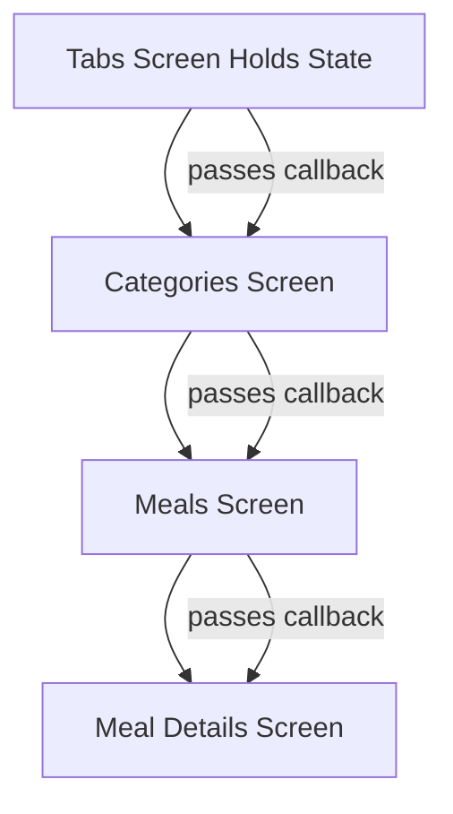
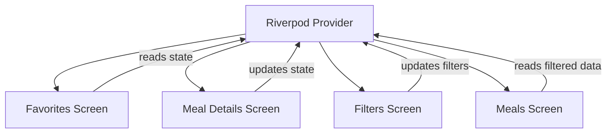
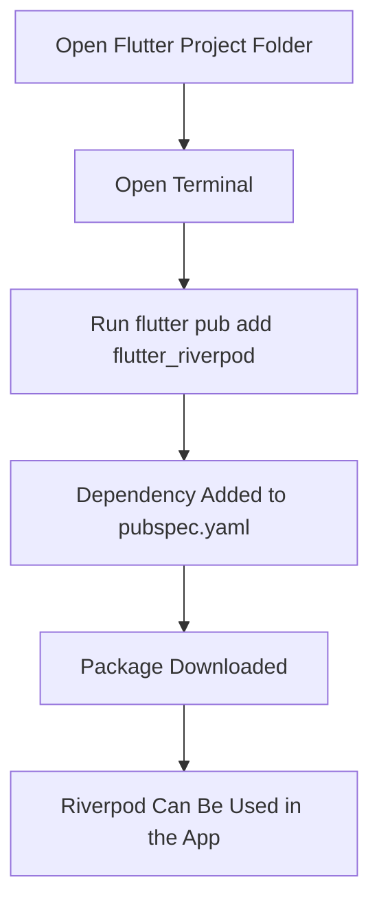
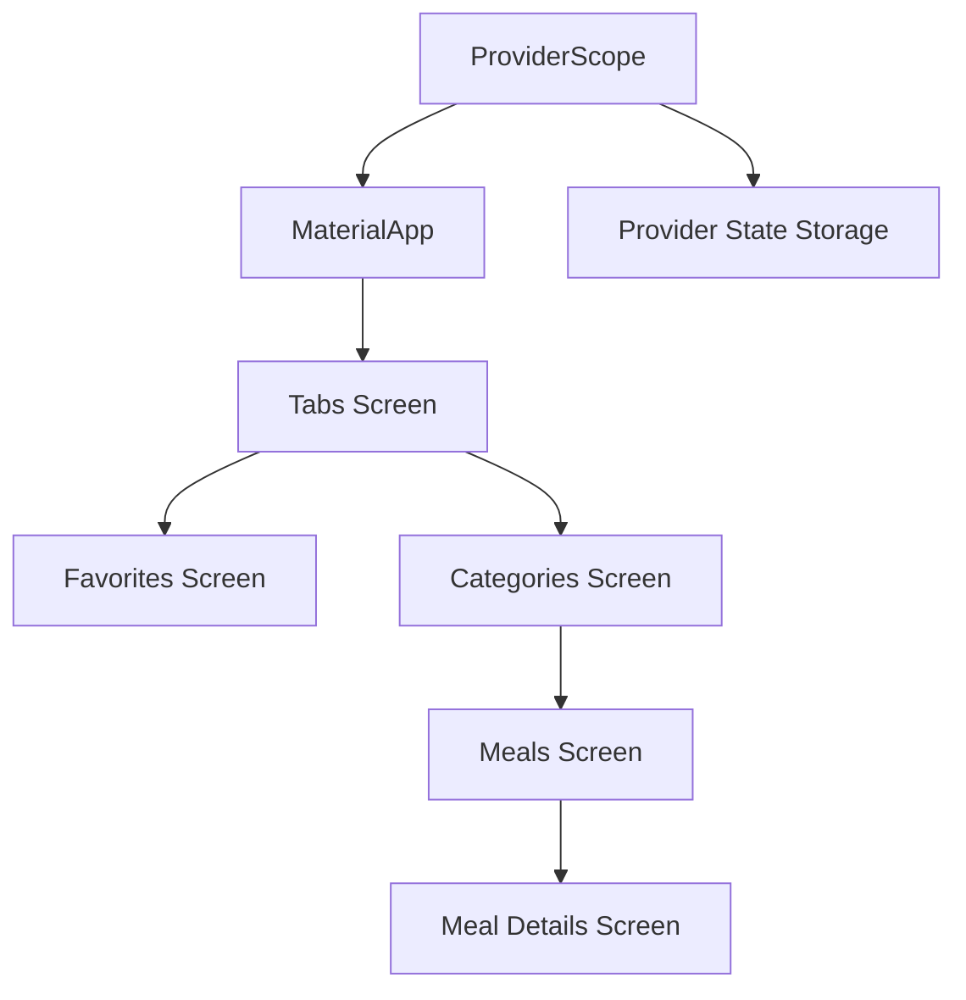
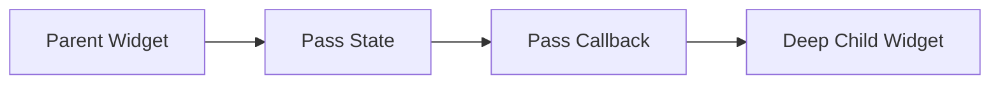
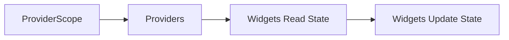

# Installing the Solution: Riverpod

## Overview

This lecture introduces **Riverpod** as the state management solution that will be used in the Flutter Meals App.

After seeing the limitations of manually managing cross-widget state with `setState`, prop drilling, and callback passing, the course now moves to a better solution: using a third-party package.

The package used in this course is:

```bash
flutter_riverpod
```

Riverpod helps simplify the process of managing state that is shared across multiple widgets or screens.

---

## Why Use Riverpod?

Riverpod is a third-party state management package for Flutter.

It is designed to make **cross-widget state management** easier, cleaner, and more scalable.

In the Meals App, Riverpod will help manage state such as:

* Favorite meals
* Selected filters
* Filtered meals
* Shared app-wide data

Without Riverpod, this state would need to be lifted up to a common parent widget and passed down through multiple widget layers.

---

## Riverpod Is Not the Only Option

Riverpod is not the only package for managing state in Flutter.

There are other popular options, such as:

* Provider
* Bloc
* Cubit
* GetX
* MobX
* Redux

However, this course uses **Riverpod**.

One important note is that Riverpod and Provider were created by the same creator. Riverpod can be seen as a more modern and improved alternative to Provider.

---

## Why Riverpod Instead of Provider?

Provider is also a popular state management package.

However, Riverpod improves on Provider in several ways.

| Provider                                  | Riverpod                       |
| ----------------------------------------- | ------------------------------ |
| Older package                             | More modern package            |
| Tied more closely to the widget tree      | More flexible provider system  |
| Can be harder to test in some cases       | Easier to test                 |
| Runtime issues can be easier to introduce | Safer provider access patterns |

For this course, Riverpod is chosen because it provides a cleaner and more modern way to manage shared state.

---

## The Problem Riverpod Solves

Before Riverpod, shared state had to be passed manually through the widget tree.



This works, but it becomes inconvenient as the app grows.

Riverpod allows widgets to access shared state through providers instead.



This reduces the need to pass state and callbacks through unrelated widgets.

---

## Installing Riverpod

To use Riverpod in a Flutter project, the package must first be installed.

The package name is:

```bash
flutter_riverpod
```

Run the following command inside the Flutter project folder:

```bash
flutter pub add flutter_riverpod
```

This command adds `flutter_riverpod` as a dependency in the project.

---

## Installation Flow



---

## What Happens in `pubspec.yaml`

After running the command, Flutter updates the `pubspec.yaml` file.

Example:

```yaml
dependencies:
  flutter:
    sdk: flutter
  flutter_riverpod: ^2.0.0
```

The exact version number may be different depending on the latest package version or the course version.

---

## Alternative Manual Installation

You can also add the dependency manually inside `pubspec.yaml`.

```yaml
dependencies:
  flutter:
    sdk: flutter
  flutter_riverpod: ^2.0.0
```

Then run:

```bash
flutter pub get
```

However, using `flutter pub add flutter_riverpod` is usually simpler because it updates the file automatically.

---

## Importing Riverpod

After installing the package, Riverpod can be imported into Dart files.

```dart
import 'package:flutter_riverpod/flutter_riverpod.dart';
```

This import gives access to Riverpod classes and tools such as:

* `ProviderScope`
* `Provider`
* `StateProvider`
* `ConsumerWidget`
* `WidgetRef`
* `ref.watch`
* `ref.read`

---

## Wrapping the App With `ProviderScope`

To use Riverpod providers in a Flutter app, the widget tree must be wrapped with `ProviderScope`.

This is usually done in `main.dart`.

```dart
import 'package:flutter/material.dart';
import 'package:flutter_riverpod/flutter_riverpod.dart';

void main() {
  runApp(
    const ProviderScope(
      child: MyApp(),
    ),
  );
}
```

`ProviderScope` makes Riverpod available to the entire app.

Without `ProviderScope`, widgets will not be able to access providers correctly.

---

## What Is `ProviderScope`?

`ProviderScope` is the root container for Riverpod providers.

It stores and manages provider state for the app.



By placing `ProviderScope` near the top of the app, all screens and widgets below it can use Riverpod providers.

---

## Recommended Setup

A typical Riverpod setup looks like this:

```dart
import 'package:flutter/material.dart';
import 'package:flutter_riverpod/flutter_riverpod.dart';

void main() {
  runApp(
    const ProviderScope(
      child: App(),
    ),
  );
}

class App extends StatelessWidget {
  const App({super.key});

  @override
  Widget build(BuildContext context) {
    return MaterialApp(
      home: const CategoriesScreen(),
    );
  }
}
```

This prepares the app for creating and consuming providers later.

---

## Before Riverpod Setup

Before installing Riverpod, the app depends on manual state passing.



This can become messy when many widgets need the same state.

---

## After Riverpod Setup

After installing Riverpod and adding `ProviderScope`, the app is ready to use providers.



This creates a cleaner foundation for managing shared state.

---

## Key Points

* Riverpod is a third-party state management package.
* It helps manage cross-widget and app-wide state.
* The course uses Riverpod instead of Provider.
* Riverpod is a more modern alternative to Provider.
* The Flutter-specific package is `flutter_riverpod`.
* Install it with `flutter pub add flutter_riverpod`.
* The dependency is added to `pubspec.yaml`.
* Riverpod can be imported with `package:flutter_riverpod/flutter_riverpod.dart`.
* The app should be wrapped with `ProviderScope` before using providers.

---

## Tips

* Run the install command from the root folder of the Flutter project.
* Use `flutter_riverpod` for Flutter apps, not just `riverpod`.
* Check `pubspec.yaml` after installation to confirm the dependency was added.
* Use `flutter pub get` if you add the dependency manually.
* Place `ProviderScope` at the top of the widget tree.
* Do not create providers before understanding what state should be shared.
* Use Riverpod for shared state, not for every small local UI change.

---

## Summary

This lecture installs Riverpod as the state management solution for the Meals App.

Riverpod is a third-party package that helps manage state shared across multiple widgets and screens. It reduces the need for prop drilling and callback passing, making the app easier to scale and maintain.

To install Riverpod, run:

```bash
flutter pub add flutter_riverpod
```

After installation, the app can import Riverpod and wrap the root widget with `ProviderScope`.

This setup prepares the project for the next step: creating providers and using them to manage shared application state.
