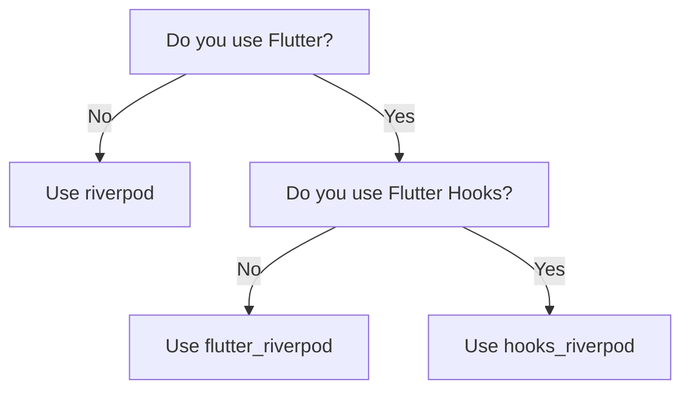
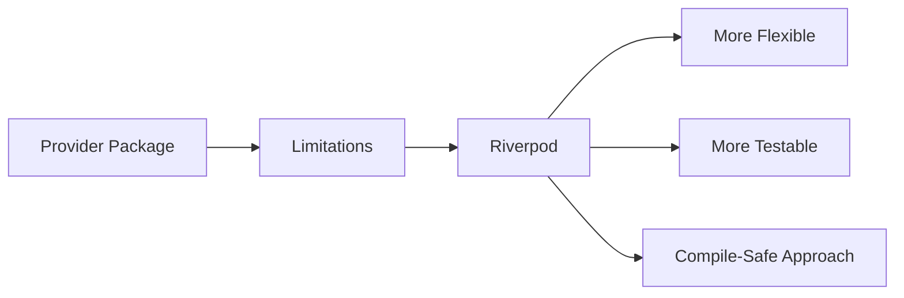
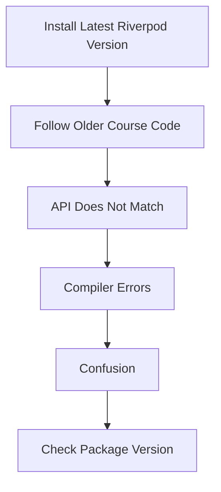

# Riverpod Versions

## Overview

This lecture explains the different Riverpod packages and version differences that students may encounter when using Riverpod in Flutter projects.

Riverpod is not just one package. There are multiple Riverpod-related packages on pub.dev, and choosing the wrong one can lead to confusion during setup.

For this course, the correct package is:

```bash id="e1dsp9"
flutter_riverpod
```

This is the standard Riverpod package for Flutter applications.

---

## Why This Matters

When following a course, it is important to use the same Riverpod package and version expected by the course examples.

If the installed version is too different from the version used in the course, some APIs may not match.

For example, older tutorials may use older Riverpod APIs, while newer versions may introduce new patterns, renamed classes, or code-generation options.

This can lead to errors even when the code seems to be copied correctly.

---

## Riverpod Package Variants

There are three main Riverpod package variants:

| Package            | Used For                | When To Use                          |
| ------------------ | ----------------------- | ------------------------------------ |
| `riverpod`         | Pure Dart apps          | When you are not using Flutter       |
| `flutter_riverpod` | Flutter apps            | Standard choice for Flutter projects |
| `hooks_riverpod`   | Flutter apps with Hooks | Only when using `flutter_hooks`      |

For this course, use:

```bash id="8kouv0"
flutter pub add flutter_riverpod
```

---

## Package Selection Diagram



---

## Why The Course Uses `flutter_riverpod`

The course uses `flutter_riverpod` because the project is a Flutter app.

`flutter_riverpod` provides Riverpod features that are designed to work naturally with Flutter widgets.

It gives access to Flutter-specific tools such as:

```dart id="3em850"
ConsumerWidget
WidgetRef
ProviderScope
ref.watch()
ref.read()
```

These tools make it possible for Flutter widgets to read and update shared state through providers.

---

## Riverpod vs Provider

Riverpod is related to the older `Provider` package.

Both were created by Remi Rousseau.

However, Riverpod was created to improve on Provider and solve some of its limitations.

Riverpod provides a more flexible and safer approach to managing shared state.



---

## Riverpod Version Differences

Riverpod has changed over time.

Different major versions may use slightly different APIs or recommend different patterns.

This is why students may sometimes see code examples online that do not match the course code.

For example:

| Older Riverpod Code           | Newer Riverpod Code                     |
| ----------------------------- | --------------------------------------- |
| `ScopedReader`                | `WidgetRef`                             |
| Older provider setup patterns | Newer `ref.watch` / `ref.read` patterns |
| Manual provider patterns only | Optional code-generation patterns       |

If you see different syntax in documentation, tutorials, or Stack Overflow answers, you may be looking at code from a different Riverpod version.

---

## Stable API Used In This Course

This course focuses on the common Riverpod API used for Flutter apps.

The main ideas are:

* Wrap the app with `ProviderScope`
* Create providers
* Read provider values with `ref.watch`
* Trigger provider logic with `ref.read`
* Use `StateNotifier` or similar state-holder patterns for more complex state

Example:

```dart id="6k4e2b"
final mealsProvider = Provider((ref) {
  return dummyMeals;
});
```

A widget can then access the provider:

```dart id="5of0z1"
final meals = ref.watch(mealsProvider);
```

---

## `ref.watch` vs `ref.read`

Two important Riverpod methods are `ref.watch` and `ref.read`.

| Method        | Purpose                                                          |
| ------------- | ---------------------------------------------------------------- |
| `ref.watch()` | Reads state and rebuilds the widget when the state changes       |
| `ref.read()`  | Reads state once or calls methods without listening for rebuilds |

Example:

```dart id="mtovey"
final favoriteMeals = ref.watch(favoriteMealsProvider);
```

This is useful when the UI should update whenever the favorite meals change.

Example:

```dart id="398o6b"
ref.read(favoriteMealsProvider.notifier).toggleMealFavoriteStatus(meal);
```

This is useful when calling a method that changes state.

---

## Version Mismatch Problem

A common problem is following a tutorial that uses one Riverpod version while your project uses another.



To avoid this, always check which Riverpod version the course expects.

---

## Pinning a Specific Version

Instead of always depending on the latest version automatically, it is often safer to pin the package version in `pubspec.yaml`.

Example:

```yaml id="h43w5m"
dependencies:
  flutter:
    sdk: flutter
  flutter_riverpod: ^2.0.0
```

The exact version should match the version used by the course or project.

Pinning a version helps prevent unexpected breaking changes after package upgrades.

---

## When To Check The Version

You should check the Riverpod version if:

* The course code does not compile
* A class or method does not exist
* Online examples use different syntax
* You see `WidgetRef` in one example but `ScopedReader` in another
* The documentation shows code-generation but the course does not use it
* The app worked before but breaks after running `flutter pub upgrade`

---

## Recommended Setup For This Course

For this course, the recommended setup is:

```bash id="kq18l7"
flutter pub add flutter_riverpod
```

Then import it with:

```dart id="dy15v5"
import 'package:flutter_riverpod/flutter_riverpod.dart';
```

And wrap the root app with `ProviderScope`:

```dart id="mix8vx"
void main() {
  runApp(
    const ProviderScope(
      child: App(),
    ),
  );
}
```

---

## Key Points

* Riverpod has different package variants.
* Use `flutter_riverpod` for Flutter apps.
* Use `riverpod` only for pure Dart apps.
* Use `hooks_riverpod` only if the project also uses Flutter Hooks.
* Different Riverpod versions may use different APIs.
* Version mismatches can cause confusing compiler errors.
* The course focuses on the standard Flutter Riverpod workflow.
* Always check the version in `pubspec.yaml` if code examples do not match.

---

## Tips

* Use the package version expected by the course.
* Do not mix code from different Riverpod versions without checking the API.
* Check the changelog before upgrading Riverpod.
* Prefer `flutter_riverpod` for normal Flutter apps.
* Use `hooks_riverpod` only when you intentionally use Flutter Hooks.
* If you see unfamiliar APIs, confirm whether the example is from another Riverpod version.
* Pin the version in `pubspec.yaml` to avoid unexpected breaking changes.

---

## Summary

This lecture clarifies which Riverpod package should be used in a Flutter project.

For this course, the correct package is `flutter_riverpod`, because it provides Riverpod integration for Flutter widgets.

Riverpod also has other variants, such as `riverpod` for pure Dart projects and `hooks_riverpod` for Flutter apps that use Flutter Hooks.

The lecture also warns that Riverpod APIs can differ between major versions. If your code does not match the course examples, the first thing to check is the installed Riverpod version.

Using the correct package and version helps avoid setup issues and makes it easier to follow the course examples.
