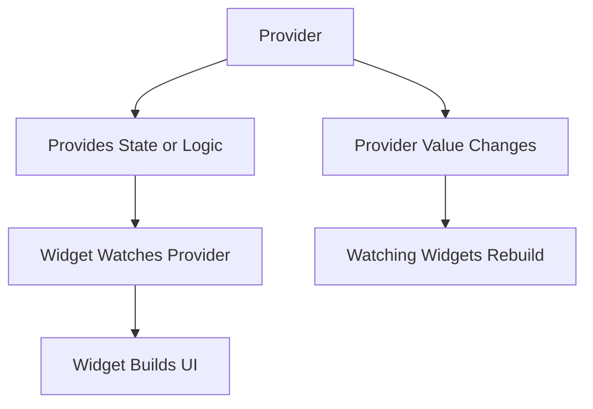
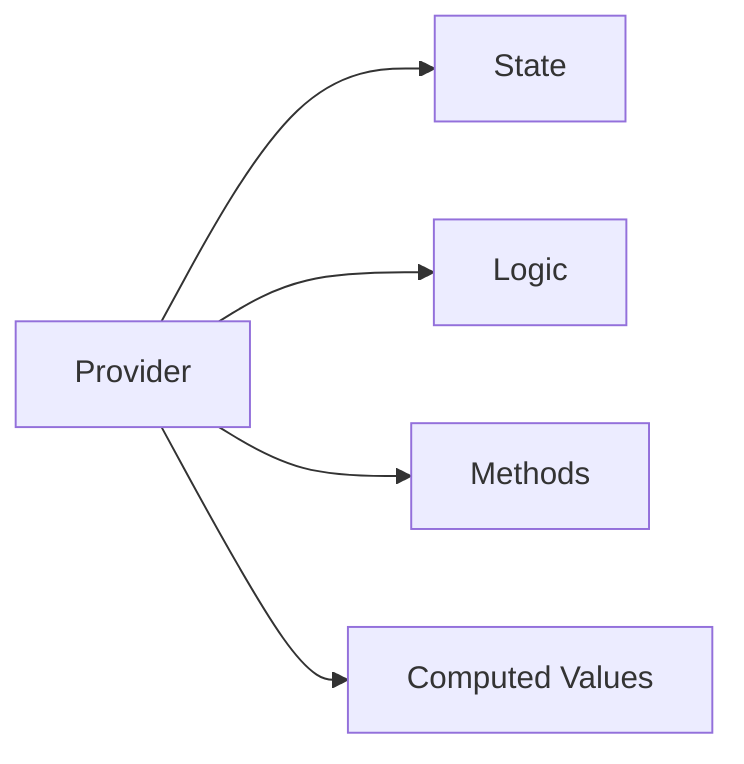
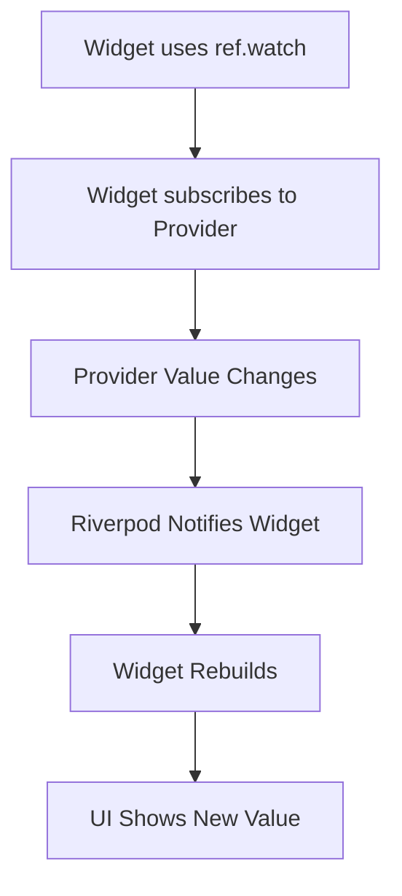
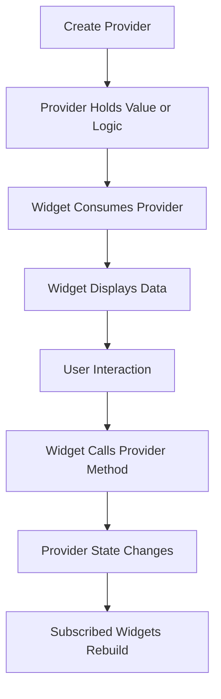
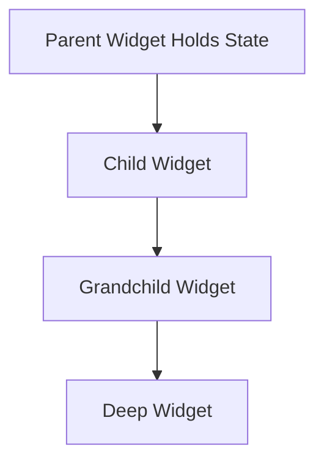
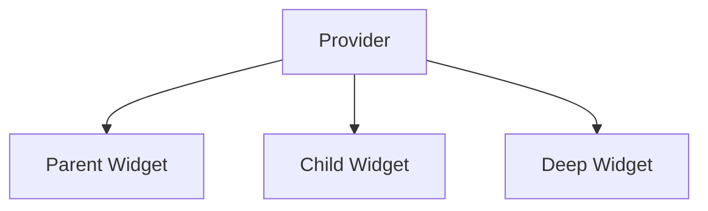
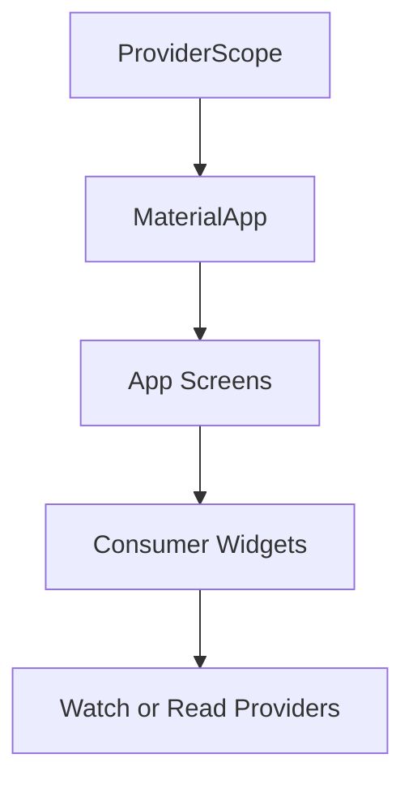
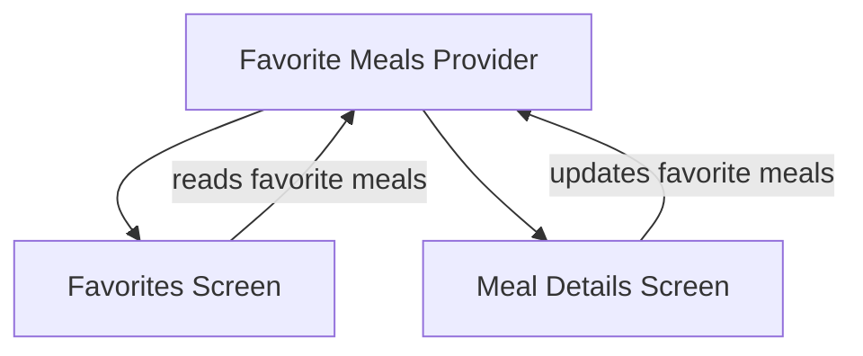

# How State Management with Riverpod Works

## Overview

This lecture explains the basic idea behind how **Riverpod** manages state in a Flutter application.

Riverpod works by creating **providers**. A provider is an object that can expose a value, state, or logic to the rest of the app.

Widgets can then connect to these providers and either:

* Listen to provider values
* Rebuild when provider values change
* Trigger methods that update provider state

This removes the need to manually pass shared state and callbacks through many widget layers.

---

## The Core Idea

In Riverpod, shared state is moved outside the widget tree and placed inside providers.

Widgets that need the state can directly connect to the provider.



Instead of passing data from parent to child, widgets can directly consume the provider they need.

---

## What Is a Provider?

A **provider** is an object created using Riverpod classes.

It can provide:

* A fixed value
* A dynamic value
* A list of data
* App state
* Business logic
* Methods that can update state

Example:

```dart id="lnyqys"
final greetingProvider = Provider<String>((ref) {
  return 'Hello Riverpod';
});
```

This provider exposes a `String` value to the app.

---

## Provider Mental Model

Think of a provider as a central source of data or logic.



In the Meals App, providers can later be used for:

| Provider                | Purpose                                  |
| ----------------------- | ---------------------------------------- |
| Meals provider          | Provides all available meals             |
| Favorite meals provider | Stores and updates favorite meals        |
| Filters provider        | Stores selected filter settings          |
| Filtered meals provider | Computes meals after filters are applied |

---

## What Is a Consumer?

A **consumer** is a widget that connects to a provider.

In Riverpod, widgets can become consumers by using special Riverpod widgets such as `ConsumerWidget`.

A consumer widget can access providers through a `ref` object.

Example:

```dart id="h12ruv"
class MyWidget extends ConsumerWidget {
  const MyWidget({super.key});

  @override
  Widget build(BuildContext context, WidgetRef ref) {
    final greeting = ref.watch(greetingProvider);

    return Text(greeting);
  }
}
```

Here, `MyWidget` watches `greetingProvider`.

---

## How `ref.watch()` Works

`ref.watch()` is used when a widget needs to listen to a provider.

```dart id="2pkr9m"
final value = ref.watch(myProvider);
```

When the provider value changes, the widget that watches it rebuilds automatically.



Use `ref.watch()` when the UI depends on the provider value.

---

## How `ref.read()` Works

`ref.read()` is used when a widget needs to access a provider once without subscribing to changes.

```dart id="tpsh76"
ref.read(myProvider);
```

This is commonly used inside callbacks, such as button presses.

Example:

```dart id="znm3t2"
IconButton(
  onPressed: () {
    ref.read(favoriteMealsProvider.notifier).toggleMealFavoriteStatus(meal);
  },
  icon: const Icon(Icons.star),
);
```

The button does not need to rebuild just because it calls a method. It only needs to trigger an action.

---

## `ref.watch()` vs `ref.read()`

| Method        | Purpose                  | Rebuilds Widget? | Common Use                   |
| ------------- | ------------------------ | ---------------- | ---------------------------- |
| `ref.watch()` | Listen to provider value | Yes              | Displaying state in the UI   |
| `ref.read()`  | Access provider once     | No               | Calling methods in callbacks |

---

## Basic Riverpod Flow

The general Riverpod flow looks like this:



This is the key cycle behind Riverpod state management.

---

## Why This Avoids Prop Drilling

Without Riverpod, shared state must be passed down manually.



With Riverpod, widgets can connect directly to the provider.



This means intermediate widgets do not need to receive or forward data they do not use.

---

## ProviderScope

`ProviderScope` is the widget that makes Riverpod work in the app.

It stores provider instances and allows widgets below it to access providers.

Usually, it wraps the root app in `main.dart`.

```dart id="w2zfuo"
void main() {
  runApp(
    const ProviderScope(
      child: App(),
    ),
  );
}
```

The basic structure looks like this:



Without `ProviderScope`, widgets cannot properly access Riverpod providers.

---

## Providers Live Outside the Widget Tree

One important Riverpod idea is that providers are usually declared outside widgets.

Example:

```dart id="v77j3n"
final greetingProvider = Provider<String>((ref) {
  return 'Hello Riverpod';
});
```

Then any consumer widget can access it.

```dart id="4u5qbn"
final greeting = ref.watch(greetingProvider);
```

This makes providers easier to test and reuse because they are not tied directly to one widget.

---

## Basic Example

```dart id="rowy35"
import 'package:flutter/material.dart';
import 'package:flutter_riverpod/flutter_riverpod.dart';

final greetingProvider = Provider<String>((ref) {
  return 'Hello Riverpod';
});

class GreetingText extends ConsumerWidget {
  const GreetingText({super.key});

  @override
  Widget build(BuildContext context, WidgetRef ref) {
    final greeting = ref.watch(greetingProvider);

    return Text(greeting);
  }
}
```

In this example:

1. `greetingProvider` provides a string.
2. `GreetingText` watches the provider.
3. The widget displays the provider value.
4. If the provider value changes, the widget can rebuild automatically.

---

## How This Applies to the Meals App

In the Meals App, Riverpod will allow different screens to access the same shared state.

For example:



The `FavoritesScreen` can read favorite meals.

The `MealDetailsScreen` can update favorite meals.

They no longer need a direct parent-child connection or manually passed callbacks.

---

## Before Riverpod

```dart id="o1x255"
MealDetailsScreen(
  onToggleFavorite: onToggleFavorite,
);
```

A callback must be passed through multiple widgets.

---

## With Riverpod

```dart id="knq4r9"
ref.read(favoriteMealsProvider.notifier).toggleMealFavoriteStatus(meal);
```

The widget can directly trigger provider logic.

---

## Key Points

* Riverpod manages state through providers.
* A provider can expose values, logic, and methods.
* Widgets can connect to providers as consumers.
* `ref.watch()` listens to provider changes and rebuilds the widget.
* `ref.read()` accesses a provider once without listening.
* `ProviderScope` stores provider instances for the app.
* Providers live outside the widget tree.
* Riverpod reduces prop drilling and callback passing.
* Any widget can access the provider it needs.

---

## Tips

* Use `ref.watch()` when the UI should update when state changes.
* Use `ref.read()` inside callbacks when you only want to trigger an action.
* Keep providers outside widget classes.
* Wrap the app with `ProviderScope` before using providers.
* Do not use Riverpod for every tiny local UI state.
* Use Riverpod when state is shared across widgets or screens.
* Think of providers as central sources of state and logic.

---

## Summary

Riverpod works by using providers to expose state and logic to the Flutter app.

Widgets can connect to these providers using `ref.watch()` or `ref.read()`. When a widget watches a provider, it automatically rebuilds when the provider value changes. When a widget only needs to trigger an action, it can use `ref.read()` without subscribing to updates.

The `ProviderScope` stores provider instances and makes them available throughout the widget tree.

This system allows widgets to access shared state directly, removing the need to pass state and callbacks through many layers of widgets. This is the foundation for managing favorites, filters, and other shared state in the Meals App.
