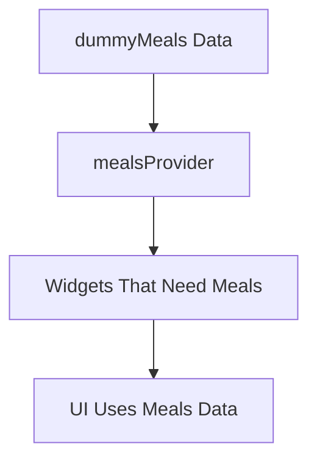
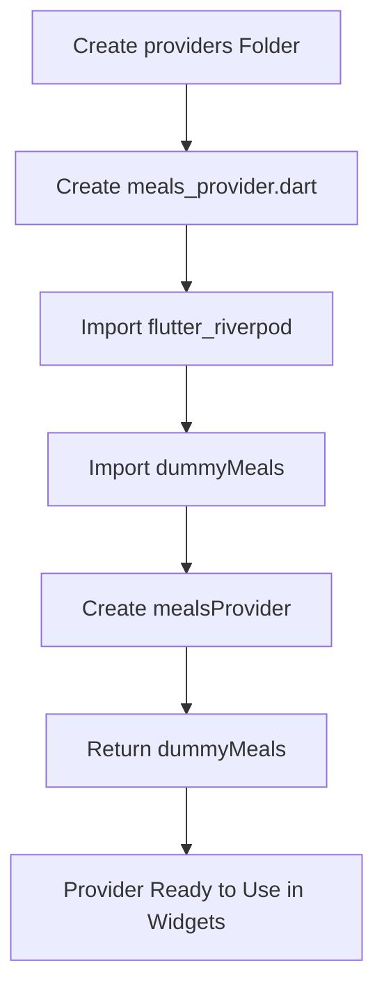
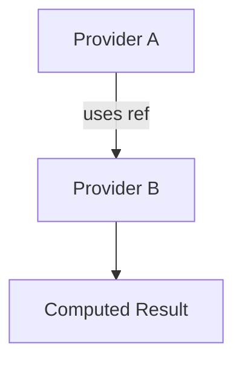
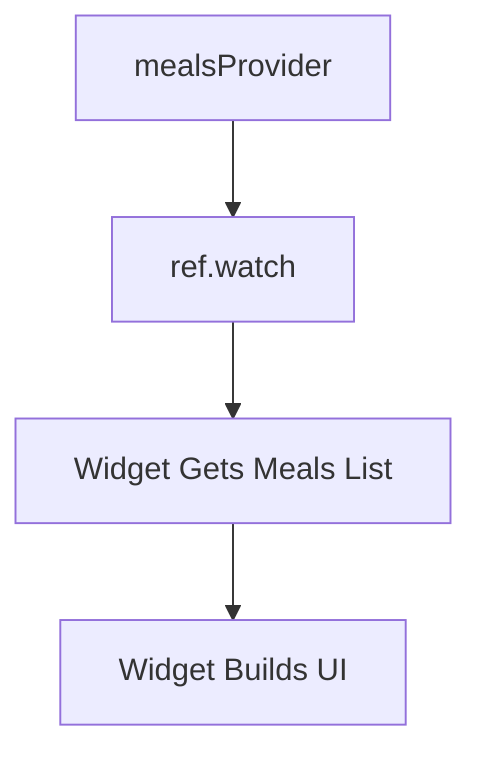
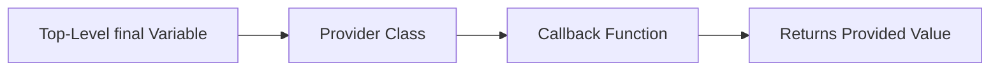

# Creating a Provider

## Overview

This lecture demonstrates how to create a basic **Riverpod provider**.

A provider is an object that can expose data, state, or logic to widgets in the Flutter app. In this first example, the provider will simply expose the existing `dummyMeals` list.

Even though `dummyMeals` could still be imported directly from the data file, wrapping it in a provider helps introduce the Riverpod workflow. Later, the same idea will be used for more complex and dynamic state such as favorites and filters.

---

## Why Create a Provider?

In the previous version of the Meals App, widgets imported and used `dummyMeals` directly.

That works for static data, but it does not scale well once the app needs shared, dynamic state.

Riverpod solves this by allowing data to be exposed through providers.



The provider becomes the central source through which widgets access the meals list.

---

## Creating a Providers Folder

Inside the `lib` folder, a new folder is created:

```text id="d205r3"
lib/
  providers/
```

This folder will contain provider files.

For the meals data, a new file is created:

```text id="n4s1kx"
lib/providers/meals_provider.dart
```

This file name makes it clear that the file contains a provider related to meals.

---

## Project Structure

```text id="f28l89"
lib/
  data/
    dummy_data.dart
  models/
    meal.dart
  providers/
    meals_provider.dart
  screens/
    tabs.dart
```

Keeping providers in their own folder helps organize shared app state and makes the code easier to maintain.

---

## Importing Riverpod

To create a provider, the file must import Riverpod.

```dart id="zcw08x"
import 'package:flutter_riverpod/flutter_riverpod.dart';
```

This import gives access to Riverpod classes such as:

* `Provider`
* `StateProvider`
* `StateNotifierProvider`
* `ConsumerWidget`
* `WidgetRef`

For this lecture, only the basic `Provider` class is needed.

---

## Importing Meals Data

Since this provider will expose `dummyMeals`, the dummy data file must also be imported.

```dart id="adlr9i"
import '../data/dummy_data.dart';
```

If the provider has a specific type, the `Meal` model should also be imported.

```dart id="kapdgy"
import '../models/meal.dart';
```

---

## Creating the Provider

A provider is usually declared as a top-level `final` variable.

```dart id="xgc0fq"
final mealsProvider = Provider<List<Meal>>((ref) {
  return dummyMeals;
});
```

This creates a provider named `mealsProvider`.

The provider exposes a list of meals:

```dart id="cld91g"
List<Meal>
```

The function passed to `Provider` returns the value that should be made available to the app.

---

## Complete Provider File

```dart id="p5um6x"
import 'package:flutter_riverpod/flutter_riverpod.dart';

import '../data/dummy_data.dart';
import '../models/meal.dart';

final mealsProvider = Provider<List<Meal>>((ref) {
  return dummyMeals;
});
```

This is the first basic provider in the app.

It provides the list of all dummy meals to any widget that wants to consume it.

---

## Provider Creation Flow



---

## Understanding the Provider Callback

The `Provider` constructor receives a function.

```dart id="j5d2oo"
Provider<List<Meal>>((ref) {
  return dummyMeals;
});
```

This function is called by Riverpod.

It receives a `ref` object.

```dart id="pjydfe"
(ref) {
  return dummyMeals;
}
```

The `ref` object can be used to read other providers.

In this simple example, no other provider is needed, so `ref` is not used yet.

---

## What Does `ref` Do?

The `ref` object allows one provider to interact with another provider.

For example, later in the course, one provider may read the selected filters provider and use it to calculate the available meals.

Conceptually:



For now, the provider only returns static dummy data.

---

## Why This Provider Is Simple

This provider is read-only.

It does not change the meals list.

```dart id="isbx2a"
final mealsProvider = Provider<List<Meal>>((ref) {
  return dummyMeals;
});
```

This is useful for static or derived values.

For mutable state, later lectures will introduce more advanced providers such as:

* `StateProvider`
* `StateNotifierProvider`

---

## Direct Import vs Provider

Technically, the app could still import `dummyMeals` directly.

```dart id="egybxz"
import '../data/dummy_data.dart';
```

However, using a provider prepares the app for a cleaner state management structure.

| Direct Import                        | Riverpod Provider                            |
| ------------------------------------ | -------------------------------------------- |
| Simple for static data               | Better for shared app state                  |
| Widgets depend directly on data file | Widgets depend on provider                   |
| Harder to combine with dynamic state | Easier to combine with filters and favorites |
| Fine for small examples              | Better for scalable apps                     |

---

## How Widgets Will Use This Provider

After creating `mealsProvider`, widgets can later access it with Riverpod.

For example, a consumer widget can watch the provider:

```dart id="ar76sr"
final meals = ref.watch(mealsProvider);
```

This gives the widget access to the list returned by the provider.



---

## Example Usage in `TabsScreen`

In the Meals App, the `TabsScreen` currently uses `dummyMeals` directly to calculate available meals based on filters.

Later, instead of importing `dummyMeals` directly, the screen can read the meals from `mealsProvider`.

Before Riverpod:

```dart id="pcracs"
final availableMeals = dummyMeals.where((meal) {
  return true;
}).toList();
```

With Riverpod:

```dart id="ielqrq"
final meals = ref.watch(mealsProvider);
```

This shifts the data source from a direct import to a provider-based structure.

---

## Provider Naming Convention

Provider names usually end with `Provider`.

Examples:

```dart id="w6z3a2"
mealsProvider
favoriteMealsProvider
filtersProvider
availableMealsProvider
```

This makes it easy to recognize provider objects in the code.

---

## Top-Level Provider Declaration

Providers are usually declared outside classes.

```dart id="nhb2jj"
final mealsProvider = Provider<List<Meal>>((ref) {
  return dummyMeals;
});
```

They should not be created inside a widget’s `build` method.

Good:

```dart id="xukxvn"
final mealsProvider = Provider<List<Meal>>((ref) {
  return dummyMeals;
});

class MyWidget extends ConsumerWidget {
  // ...
}
```

Avoid:

```dart id="foer8a"
class MyWidget extends ConsumerWidget {
  @override
  Widget build(BuildContext context, WidgetRef ref) {
    final mealsProvider = Provider((ref) => dummyMeals); // Avoid this
    return const Text('Meals');
  }
}
```

Declaring providers globally makes them stable and reusable.

---

## Basic Provider Structure



Example:

```dart id="mcmz31"
final mealsProvider = Provider<List<Meal>>((ref) {
  return dummyMeals;
});
```

---

## Key Points

* A provider exposes a value to the app.
* Providers are usually declared as top-level `final` variables.
* Provider files are commonly stored in a `providers` folder.
* The file for meals data can be named `meals_provider.dart`.
* The basic `Provider<T>` is used for read-only values.
* The provider callback receives a `ref` object.
* The callback returns the value that should be provided.
* In this example, `mealsProvider` returns `dummyMeals`.
* This setup prepares the app for more advanced Riverpod state management.

---

## Tips

* Keep provider declarations outside widget classes.
* Name providers clearly, such as `mealsProvider`.
* Use a dedicated `providers` folder to keep shared state organized.
* Use `Provider<T>` for simple read-only data.
* Use more advanced providers later for mutable state.
* Do not overcomplicate the first provider; start with a simple value.
* Remember that the `ref` object becomes useful when providers depend on other providers.

---

## Summary

This lecture creates the first basic Riverpod provider in the Meals App.

A new `providers` folder is added inside `lib`, and a file named `meals_provider.dart` is created. Inside this file, the `flutter_riverpod` package is imported, and a top-level `mealsProvider` variable is declared.

The provider uses `Provider<List<Meal>>` and returns the existing `dummyMeals` list.

Even though using a provider for static dummy data is not strictly necessary, it introduces the core Riverpod pattern: creating providers that expose data to widgets. This prepares the app for managing more complex shared state, such as favorite meals and filters, in later lectures.
