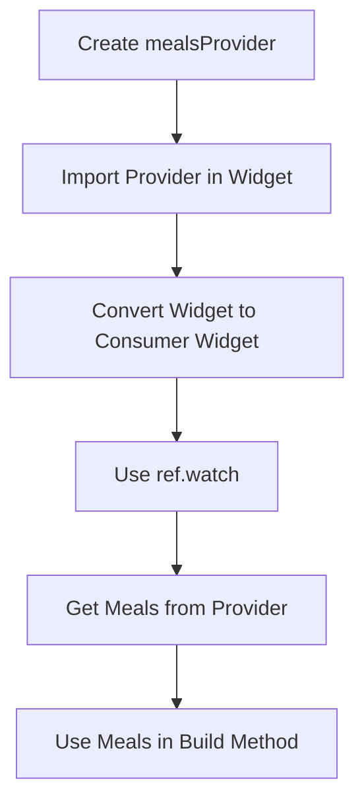
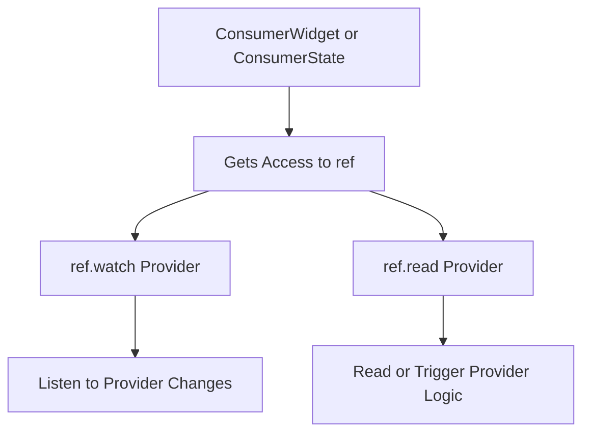
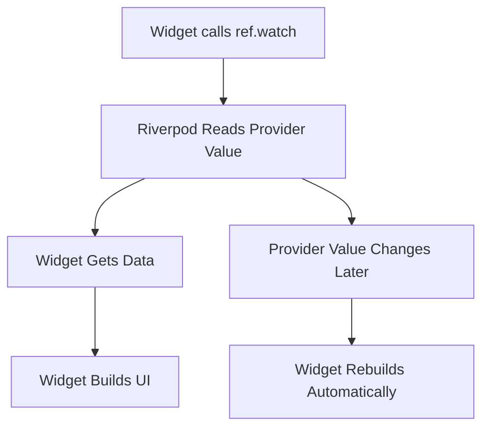
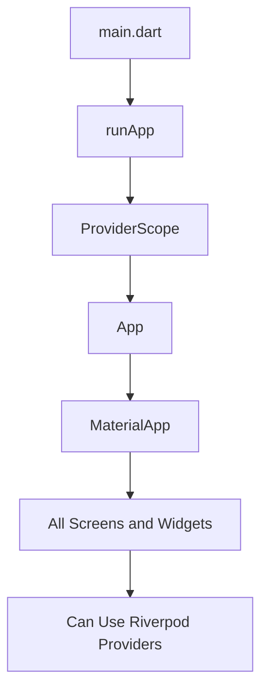
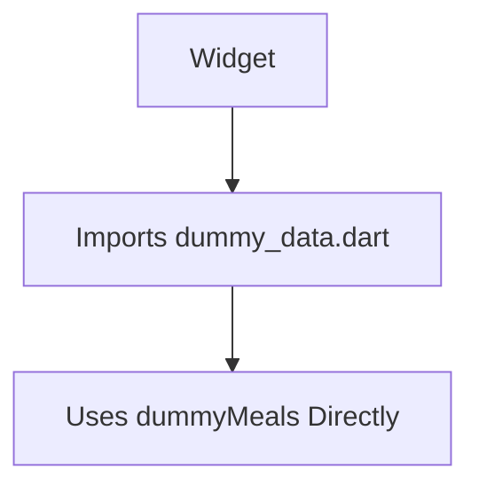
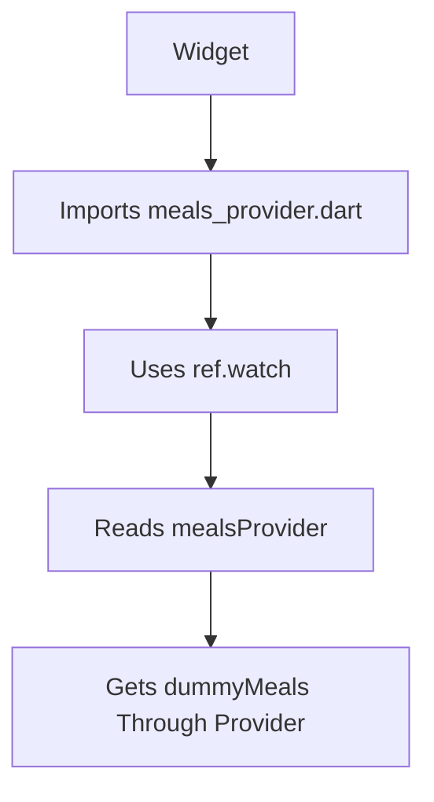

# Using a Provider

## Overview

This lecture explains how to **use a Riverpod provider inside a Flutter widget**.

In the previous lecture, a basic provider named `mealsProvider` was created. This provider returns the `dummyMeals` list.

Now, instead of importing `dummyMeals` directly inside a widget, the app will read the meals data through the provider.

To do that, widgets must become Riverpod-aware by using Riverpod consumer classes such as:

* `ConsumerWidget`
* `ConsumerStatefulWidget`
* `ConsumerState`

The lecture also shows that the app must be wrapped with `ProviderScope` in `main.dart` before providers can be used.

---

## Goal of This Lecture

The goal is to replace direct access to `dummyMeals` with provider-based access.

Before Riverpod:

```dart
import '../data/dummy_data.dart';

final availableMeals = dummyMeals;
```

With Riverpod:

```dart
final meals = ref.watch(mealsProvider);
```

This means the widget no longer depends directly on the dummy data file. Instead, it gets the data from Riverpod.

---

## Provider Usage Flow



---

## Importing the Provider

To use `mealsProvider`, the widget file must import the provider file.

Example:

```dart
import '../providers/meals_provider.dart';
```

The exact path depends on the project structure.

If the provider is located at:

```text
lib/providers/meals_provider.dart
```

Then a screen inside `lib/screens/` can usually import it like this:

```dart
import '../providers/meals_provider.dart';
```

---

## Importing Riverpod

The widget file must also import Riverpod.

```dart
import 'package:flutter_riverpod/flutter_riverpod.dart';
```

This gives access to Riverpod widget classes and the `ref` object.

---

## StatelessWidget vs ConsumerWidget

If a widget is currently a `StatelessWidget`, it can be changed to `ConsumerWidget`.

Before:

```dart
class MealsScreen extends StatelessWidget {
  const MealsScreen({super.key});

  @override
  Widget build(BuildContext context) {
    return const Text('Meals');
  }
}
```

After:

```dart
class MealsScreen extends ConsumerWidget {
  const MealsScreen({super.key});

  @override
  Widget build(BuildContext context, WidgetRef ref) {
    return const Text('Meals');
  }
}
```

The important difference is that `ConsumerWidget` gives the `build` method an extra parameter:

```dart
WidgetRef ref
```

This `ref` object is used to read or watch providers.

---

## StatefulWidget vs ConsumerStatefulWidget

In the lecture, the `TabsScreen` is a stateful widget.

Therefore, it cannot simply become a `ConsumerWidget`.

Instead, it must be changed from `StatefulWidget` to `ConsumerStatefulWidget`.

Before:

```dart
class TabsScreen extends StatefulWidget {
  const TabsScreen({super.key});

  @override
  State<TabsScreen> createState() {
    return _TabsScreenState();
  }
}
```

After:

```dart
class TabsScreen extends ConsumerStatefulWidget {
  const TabsScreen({super.key});

  @override
  ConsumerState<TabsScreen> createState() {
    return _TabsScreenState();
  }
}
```

The state class must also be changed.

Before:

```dart
class _TabsScreenState extends State<TabsScreen> {
  // ...
}
```

After:

```dart
class _TabsScreenState extends ConsumerState<TabsScreen> {
  // ...
}
```

---

## Consumer Classes Summary

| Normal Flutter Class | Riverpod Version         | Use Case                              |
| -------------------- | ------------------------ | ------------------------------------- |
| `StatelessWidget`    | `ConsumerWidget`         | Stateless widget that needs providers |
| `StatefulWidget`     | `ConsumerStatefulWidget` | Stateful widget that needs providers  |
| `State<T>`           | `ConsumerState<T>`       | State class that needs providers      |

---

## Why Use Consumer Classes?

Consumer classes add Riverpod functionality to widgets.

They allow widgets to access providers through `ref`.



Without these consumer classes, the widget cannot directly use `ref.watch()` or `ref.read()`.

---

## The `ref` Object

After extending `ConsumerState`, the state class gets access to a `ref` property.

This is similar to how a normal `State` class has access to `widget`.

```dart
class _TabsScreenState extends ConsumerState<TabsScreen> {
  @override
  Widget build(BuildContext context) {
    final meals = ref.watch(mealsProvider);

    return Scaffold(
      body: Text('Meals: ${meals.length}'),
    );
  }
}
```

The `ref` object is used to connect to Riverpod providers.

---

## Using `ref.watch`

To read the value from a provider and listen for changes, use:

```dart
final meals = ref.watch(mealsProvider);
```

This does two things:

1. It returns the current value from the provider.
2. It sets up a listener so the widget rebuilds when the provider value changes.



In this lecture, `mealsProvider` returns static dummy data, so the value does not actually change yet. However, this same pattern will become important when using dynamic providers later.

---

## `ref.watch` vs `ref.read`

Riverpod provides both `watch` and `read`.

| Method                | What It Does                           | Common Use                           |
| --------------------- | -------------------------------------- | ------------------------------------ |
| `ref.watch(provider)` | Reads provider and listens for changes | Building UI from state               |
| `ref.read(provider)`  | Reads provider once without listening  | Button callbacks or one-time actions |

The Riverpod documentation generally recommends using `watch` whenever possible, especially inside the `build` method.

This helps avoid bugs later if the provider becomes dynamic and the UI needs to rebuild when the value changes.

---

## Example: Using `mealsProvider` in `TabsScreen`

```dart
import 'package:flutter/material.dart';
import 'package:flutter_riverpod/flutter_riverpod.dart';

import '../providers/meals_provider.dart';

class TabsScreen extends ConsumerStatefulWidget {
  const TabsScreen({super.key});

  @override
  ConsumerState<TabsScreen> createState() {
    return _TabsScreenState();
  }
}

class _TabsScreenState extends ConsumerState<TabsScreen> {
  @override
  Widget build(BuildContext context) {
    final meals = ref.watch(mealsProvider);

    return Scaffold(
      body: Text('Number of meals: ${meals.length}'),
    );
  }
}
```

Here, `TabsScreen` reads the meals list from `mealsProvider`.

The widget no longer needs to import `dummy_data.dart` directly.

---

## Applying Filters With Provider Data

In the Meals App, `TabsScreen` previously used `dummyMeals` to calculate available meals based on selected filters.

Before:

```dart
final availableMeals = dummyMeals.where((meal) {
  if (_selectedFilters[Filter.glutenFree]! && !meal.isGlutenFree) {
    return false;
  }
  if (_selectedFilters[Filter.lactoseFree]! && !meal.isLactoseFree) {
    return false;
  }
  if (_selectedFilters[Filter.vegetarian]! && !meal.isVegetarian) {
    return false;
  }
  if (_selectedFilters[Filter.vegan]! && !meal.isVegan) {
    return false;
  }
  return true;
}).toList();
```

After importing and watching `mealsProvider`, the data can come from the provider:

```dart
final meals = ref.watch(mealsProvider);

final availableMeals = meals.where((meal) {
  if (_selectedFilters[Filter.glutenFree]! && !meal.isGlutenFree) {
    return false;
  }
  if (_selectedFilters[Filter.lactoseFree]! && !meal.isLactoseFree) {
    return false;
  }
  if (_selectedFilters[Filter.vegetarian]! && !meal.isVegetarian) {
    return false;
  }
  if (_selectedFilters[Filter.vegan]! && !meal.isVegan) {
    return false;
  }
  return true;
}).toList();
```

The filtering logic still exists in the widget for now, but the meals data comes from the provider.

Later, this filtering logic can also be moved into a provider.

---

## Important: Add `ProviderScope`

Creating and watching providers is not enough.

The app must also be wrapped with `ProviderScope`.

Without `ProviderScope`, Riverpod cannot manage provider state correctly, and the app may throw an error.

In `main.dart`, import Riverpod:

```dart
import 'package:flutter_riverpod/flutter_riverpod.dart';
```

Then wrap the app with `ProviderScope`:

```dart
void main() {
  runApp(
    const ProviderScope(
      child: App(),
    ),
  );
}
```

---

## What `ProviderScope` Does

`ProviderScope` enables Riverpod for the widget tree below it.

It stores and manages provider instances behind the scenes.



Because the whole app is wrapped with `ProviderScope`, every widget in the app can use Riverpod features.

---

## Why Wrap the Entire App?

In this course, Riverpod will be used across multiple screens.

For example:

* `TabsScreen`
* `FavoritesScreen`
* `MealsScreen`
* `MealDetailsScreen`
* `FiltersScreen`

Therefore, it makes sense to wrap the entire app.

```dart
runApp(
  const ProviderScope(
    child: App(),
  ),
);
```

If only one small part of the app needed Riverpod, only that part could be wrapped. But for application-wide state management, wrapping the whole app is the common approach.

---

## Full Setup Example

### `providers/meals_provider.dart`

```dart
import 'package:flutter_riverpod/flutter_riverpod.dart';

import '../data/dummy_data.dart';
import '../models/meal.dart';

final mealsProvider = Provider<List<Meal>>((ref) {
  return dummyMeals;
});
```

### `tabs.dart`

```dart
import 'package:flutter/material.dart';
import 'package:flutter_riverpod/flutter_riverpod.dart';

import '../providers/meals_provider.dart';

class TabsScreen extends ConsumerStatefulWidget {
  const TabsScreen({super.key});

  @override
  ConsumerState<TabsScreen> createState() {
    return _TabsScreenState();
  }
}

class _TabsScreenState extends ConsumerState<TabsScreen> {
  @override
  Widget build(BuildContext context) {
    final meals = ref.watch(mealsProvider);

    return Scaffold(
      body: Text('Meals loaded: ${meals.length}'),
    );
  }
}
```

### `main.dart`

```dart
import 'package:flutter/material.dart';
import 'package:flutter_riverpod/flutter_riverpod.dart';

import 'app.dart';

void main() {
  runApp(
    const ProviderScope(
      child: App(),
    ),
  );
}
```

---

## Before Using the Provider



The widget depends directly on the dummy data file.

---

## After Using the Provider



The widget now depends on the provider instead of the raw data file.

---

## Why This Is Useful

In this first example, the provider only returns static dummy data.

That means using Riverpod may feel unnecessary.

However, the pattern is important because later providers will manage dynamic state.

Examples:

```dart
favoriteMealsProvider
filtersProvider
availableMealsProvider
```

These providers will change over time, and widgets that use `ref.watch()` will rebuild automatically when the provider state changes.

---

## Key Points

* To use a provider in a widget, import the provider file.
* Also import `package:flutter_riverpod/flutter_riverpod.dart`.
* Use `ConsumerWidget` instead of `StatelessWidget` when a stateless widget needs providers.
* Use `ConsumerStatefulWidget` instead of `StatefulWidget` when a stateful widget needs providers.
* Use `ConsumerState<T>` instead of `State<T>` for the state class.
* `ref.watch(provider)` reads the provider value and listens for changes.
* The watched widget rebuilds when the provider value changes.
* The app must be wrapped with `ProviderScope` in `main.dart`.
* `ProviderScope` enables Riverpod for the widget tree below it.

---

## Tips

* Use `ref.watch()` inside the `build` method when the UI depends on provider data.
* Use `ref.read()` in callbacks when you only need to trigger an action.
* Do not forget to wrap the app with `ProviderScope`.
* Remove old direct imports such as `dummy_data.dart` when replacing them with providers.
* Use `ConsumerStatefulWidget` for stateful screens that need Riverpod.
* Use `ConsumerWidget` for stateless widgets that need Riverpod.
* Start with simple providers before moving to dynamic state.

---

## Summary

This lecture shows how to use a Riverpod provider inside a Flutter widget.

The `mealsProvider` created earlier is imported into `tabs.dart`, and the widget is converted from `StatefulWidget` to `ConsumerStatefulWidget`. Its state class is also changed from `State` to `ConsumerState`.

This gives the state class access to the `ref` object, which can be used to watch providers.

```dart
final meals = ref.watch(mealsProvider);
```

Using `ref.watch()` reads the provider value and sets up a listener so the widget can rebuild when the provider changes.

Finally, the app is wrapped with `ProviderScope` in `main.dart`, which enables Riverpod across the widget tree.

This completes the basic process of creating and using a simple provider.
