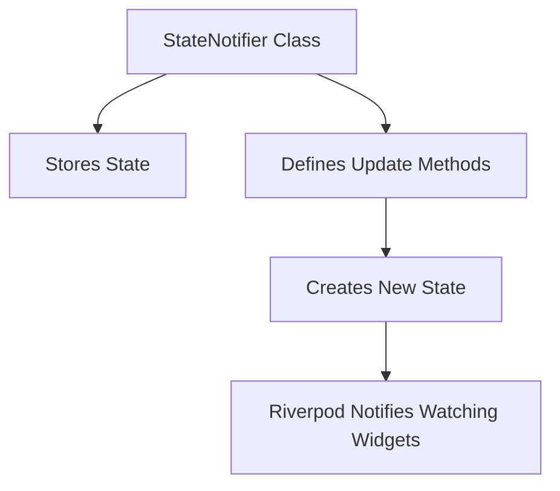
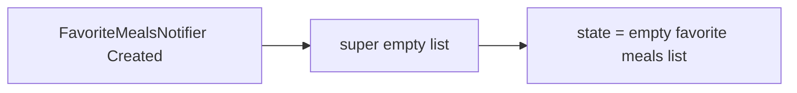
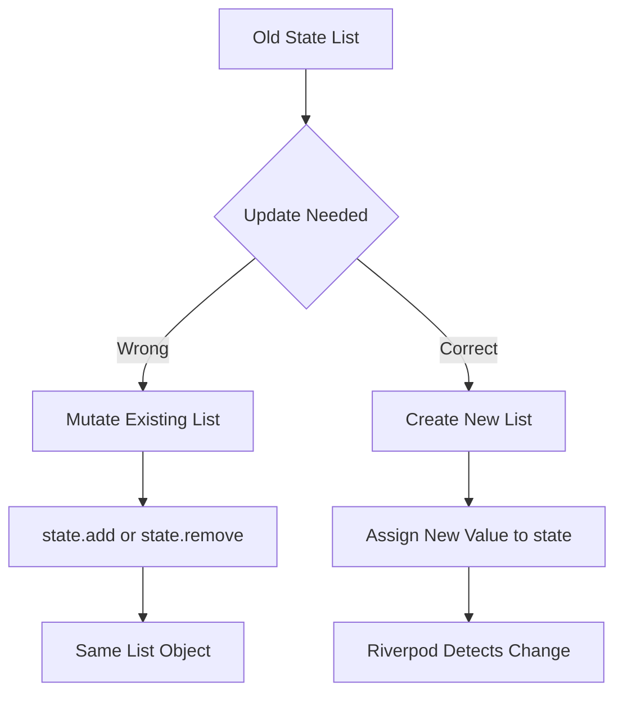
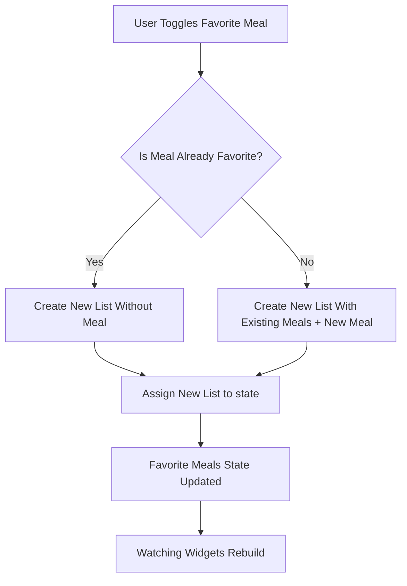
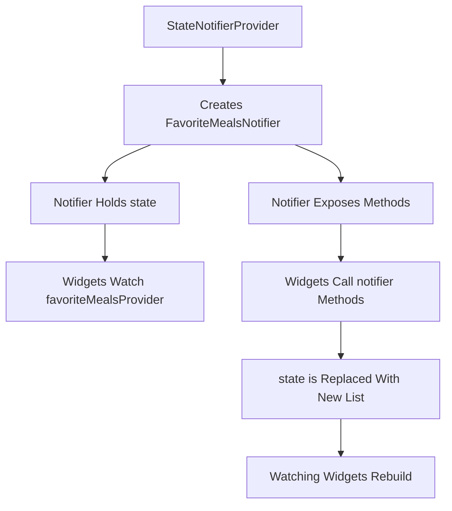

# Creating a More Complex Provider with StateNotifier

## Overview

This lecture introduces a more advanced Riverpod provider pattern using **StateNotifier** and **StateNotifierProvider**.

The first provider we created, `mealsProvider`, only returned static dummy data. That provider was useful for learning the basic Riverpod workflow, but it was not designed for state that changes over time.

Now, we need a provider that can manage dynamic state: the list of favorite meals.

To do that, we use:

* `StateNotifier`
* `StateNotifierProvider`

This pattern allows us to store state and define methods that update that state in a clean and organized way.

---

## Why a Basic Provider Is Not Enough

A normal `Provider` is good for simple values that do not change.

Example:

```dart id="fkr8yd"
final mealsProvider = Provider<List<Meal>>((ref) {
  return dummyMeals;
});
```

This works well for static data.

However, favorite meals are different.

The favorite meals list can change when the user:

* Marks a meal as favorite
* Removes a meal from favorites
* Views the updated favorites list

Because this state changes over time, a basic `Provider` is not the right choice.

---

## Provider Type Comparison

| Provider Type           | Best For                             | Can Manage Changing State? |
| ----------------------- | ------------------------------------ | -------------------------- |
| `Provider`              | Static or computed values            | Not directly               |
| `StateProvider`         | Simple mutable values                | Yes                        |
| `StateNotifierProvider` | More complex mutable state and logic | Yes                        |

For the favorites list, we use `StateNotifierProvider`.

---

## Creating a Favorites Provider File

To keep the project organized, a new provider file is created.

```text id="cjdh5x"
lib/
  providers/
    meals_provider.dart
    favorite_meals_provider.dart
```

The new file will contain:

1. A notifier class that manages the favorite meals state
2. A provider that exposes that notifier and its state to the app

---

## Importing Required Packages

Inside `favorite_meals_provider.dart`, import Riverpod:

```dart id="oc9q5z"
import 'package:flutter_riverpod/flutter_riverpod.dart';
```

Also import the `Meal` model:

```dart id="b5uql3"
import '../models/meal.dart';
```

The provider needs the `Meal` type because it will manage a list of meals.

---

## What Is `StateNotifier`?

`StateNotifier` is a class provided by Riverpod.

It is used to create your own class that manages state.

A `StateNotifier` class usually contains:

* The initial state
* Methods for changing the state
* Business logic related to that state



For favorite meals, the notifier will manage:

```dart id="t408mc"
List<Meal>
```

---

## Creating the Notifier Class

The custom notifier class is named `FavoriteMealsNotifier`.

By convention, notifier class names usually end with `Notifier`.

```dart id="riectu"
class FavoriteMealsNotifier extends StateNotifier<List<Meal>> {
  FavoriteMealsNotifier() : super([]);
}
```

Here:

* `FavoriteMealsNotifier` is our custom class
* `StateNotifier<List<Meal>>` means it manages a list of meals
* `super([])` sets the initial state to an empty list

---

## Initial State

The constructor sets the initial value of the state.

```dart id="j2yng6"
FavoriteMealsNotifier() : super([]);
```

This means that when the app starts, there are no favorite meals yet.



---

## The `state` Property

Inside a `StateNotifier`, Riverpod gives us a special property named `state`.

In this example, `state` represents the current list of favorite meals.

```dart id="i0jscc"
state
```

Because the notifier extends:

```dart id="n9tsxq"
StateNotifier<List<Meal>>
```

The `state` property has this type:

```dart id="y6wcvz"
List<Meal>
```

---

## Important Rule: Never Mutate State Directly

With `StateNotifier`, we should not directly mutate the existing state object.

Avoid this:

```dart id="t0imz4"
state.add(meal);    // Avoid
state.remove(meal); // Avoid
```

These methods modify the existing list in memory.

Instead, we must replace the state with a new list.

Good:

```dart id="uzg9wl"
state = [...state, meal];
```

Good:

```dart id="b2eial"
state = state.where((m) => m.id != meal.id).toList();
```

This is called an **immutable state update**.

---

## Mutable vs Immutable Update



Riverpod can reliably notify widgets when the state is replaced with a new value.

---

## Adding the Toggle Method

The notifier needs a method to add or remove meals from the favorites list.

```dart id="qof3ex"
void toggleMealFavoriteStatus(Meal meal) {
  final mealIsFavorite = state.contains(meal);

  if (mealIsFavorite) {
    state = state.where((m) => m.id != meal.id).toList();
  } else {
    state = [...state, meal];
  }
}
```

This method checks whether the meal is already a favorite.

If it is already a favorite, it removes the meal.

If it is not a favorite, it adds the meal.

---

## Toggle Logic Diagram



---

## Removing a Meal Immutably

To remove a meal, we do not call `remove`.

Instead, we create a new list that keeps every meal except the selected one.

```dart id="xrp540"
state = state.where((m) => m.id != meal.id).toList();
```

Explanation:

```dart id="mhorlu"
m.id != meal.id
```

This means:

* Keep meals whose ID is different from the selected meal ID
* Drop the meal whose ID matches the selected meal ID

So the selected meal is removed from the new list.

---

## Adding a Meal Immutably

To add a meal, we create a new list.

```dart id="m0wolq"
state = [...state, meal];
```

The spread operator copies all existing meals into the new list.

```dart id="u7dkq2"
...state
```

Then the selected meal is added at the end.

This creates a new list instead of modifying the old one.

---

## Complete Notifier Class

```dart id="ef1i4l"
import 'package:flutter_riverpod/flutter_riverpod.dart';

import '../models/meal.dart';

class FavoriteMealsNotifier extends StateNotifier<List<Meal>> {
  FavoriteMealsNotifier() : super([]);

  void toggleMealFavoriteStatus(Meal meal) {
    final mealIsFavorite = state.contains(meal);

    if (mealIsFavorite) {
      state = state.where((m) => m.id != meal.id).toList();
    } else {
      state = [...state, meal];
    }
  }
}
```

This class now has:

* Initial state: an empty list
* Logic for adding or removing favorite meals
* Immutable state updates

---

## Creating the StateNotifierProvider

The notifier class alone is not enough.

To use it in widgets, it must be exposed through a provider.

```dart id="gi4o6t"
final favoriteMealsProvider =
    StateNotifierProvider<FavoriteMealsNotifier, List<Meal>>((ref) {
  return FavoriteMealsNotifier();
});
```

This creates a `StateNotifierProvider`.

---

## Understanding the Generic Types

`StateNotifierProvider` uses two generic types:

```dart id="hs49wy"
StateNotifierProvider<FavoriteMealsNotifier, List<Meal>>
```

| Type                    | Meaning                                         |
| ----------------------- | ----------------------------------------------- |
| `FavoriteMealsNotifier` | The notifier class that contains update methods |
| `List<Meal>`            | The state value exposed by the provider         |

The first type tells Riverpod which notifier to use.

The second type tells Riverpod what kind of state that notifier exposes.

---

## Complete Provider File

```dart id="f9fi1l"
import 'package:flutter_riverpod/flutter_riverpod.dart';

import '../models/meal.dart';

class FavoriteMealsNotifier extends StateNotifier<List<Meal>> {
  FavoriteMealsNotifier() : super([]);

  void toggleMealFavoriteStatus(Meal meal) {
    final mealIsFavorite = state.contains(meal);

    if (mealIsFavorite) {
      state = state.where((m) => m.id != meal.id).toList();
    } else {
      state = [...state, meal];
    }
  }
}

final favoriteMealsProvider =
    StateNotifierProvider<FavoriteMealsNotifier, List<Meal>>((ref) {
  return FavoriteMealsNotifier();
});
```

This file now defines a complete dynamic provider for favorite meals.

---

## How Widgets Will Use This Provider

Widgets can use this provider in two different ways.

To get the current favorite meals list:

```dart id="x2yms2"
final favoriteMeals = ref.watch(favoriteMealsProvider);
```

To call a method on the notifier:

```dart id="d580gv"
ref
    .read(favoriteMealsProvider.notifier)
    .toggleMealFavoriteStatus(meal);
```

---

## Watching State vs Calling Methods

| Goal                                   | Riverpod Code                              |
| -------------------------------------- | ------------------------------------------ |
| Read and rebuild when favorites change | `ref.watch(favoriteMealsProvider)`         |
| Call the toggle method                 | `ref.read(favoriteMealsProvider.notifier)` |

Use `watch` when the UI depends on the current state.

Use `read` when triggering an action, such as pressing a favorite button.

---

## StateNotifierProvider Flow



---

## Why This Keeps Widgets Cleaner

Without a notifier, widgets would contain the logic for adding and removing favorite meals.

With `FavoriteMealsNotifier`, that logic is moved out of the widget.

The widget only triggers the action:

```dart id="n432mk"
ref.read(favoriteMealsProvider.notifier).toggleMealFavoriteStatus(meal);
```

The notifier handles the actual state update.

This keeps business logic separate from UI code.

---

## Benefits of This Pattern

Using `StateNotifier` and `StateNotifierProvider` gives several benefits:

* State logic is centralized
* Widgets become simpler
* State updates are easier to test
* The state is updated immutably
* Riverpod can notify only the widgets that depend on the state
* The same provider can be used across multiple screens

---

## Key Points

* `Provider` is useful for simple read-only values.
* `StateNotifierProvider` is better for state that changes over time.
* `StateNotifier` is used to create a custom state management class.
* The notifier class stores state and exposes methods to update it.
* The initial state is passed to `super()`.
* The `state` property holds the current state.
* State should not be mutated directly.
* Always assign a new value to `state`.
* For lists, use immutable updates such as `[...state, item]` or `.where().toList()`.
* The favorites list starts as an empty list.
* The toggle method adds a meal if it is not a favorite and removes it if it already is.

---

## Tips

* Keep notifier classes focused on one responsibility.
* Do not place complex state update logic directly inside widgets.
* Avoid `state.add()` and `state.remove()` in a `StateNotifier`.
* Use the spread operator to add items immutably.
* Use `where().toList()` to remove items immutably.
* Use clear provider names such as `favoriteMealsProvider`.
* Use clear notifier names such as `FavoriteMealsNotifier`.
* Use `ref.watch()` to read the state in the UI.
* Use `ref.read(provider.notifier)` to call notifier methods.

---

## Summary

This lecture introduces `StateNotifier` and `StateNotifierProvider` for managing more complex state with Riverpod.

The favorite meals list is dynamic because users can add or remove meals from it. A basic `Provider` is not enough for this kind of state.

To solve this, a `FavoriteMealsNotifier` class is created. It extends `StateNotifier<List<Meal>>`, starts with an empty list, and includes a method called `toggleMealFavoriteStatus`.

The state is updated immutably by assigning a new list to `state`, rather than modifying the existing list with `add` or `remove`.

Finally, the notifier is exposed through `favoriteMealsProvider`, which allows widgets to read the favorite meals list and trigger favorite updates from anywhere in the app.
