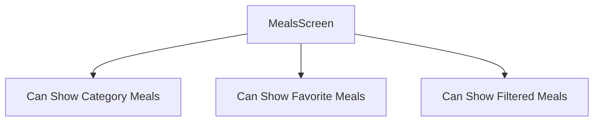
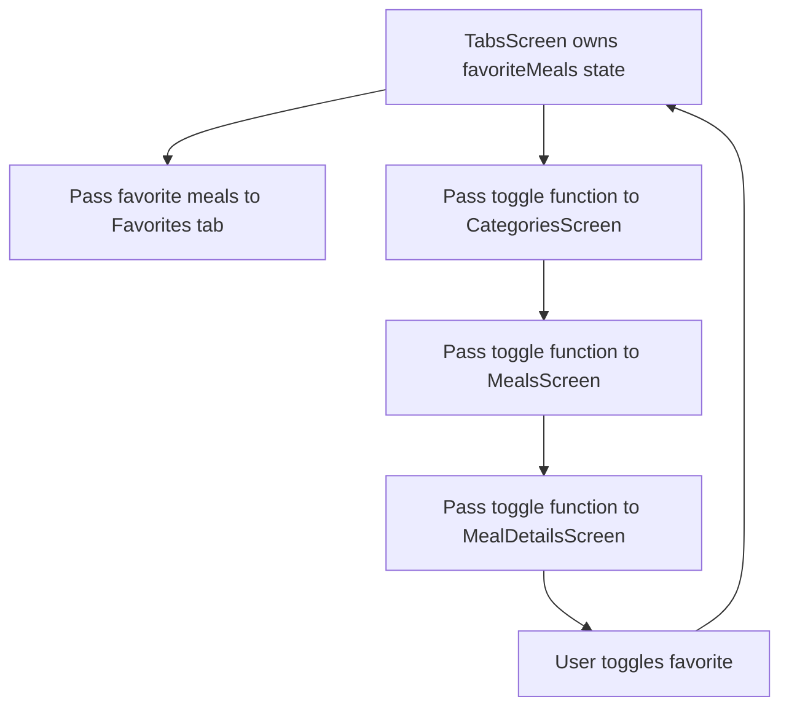
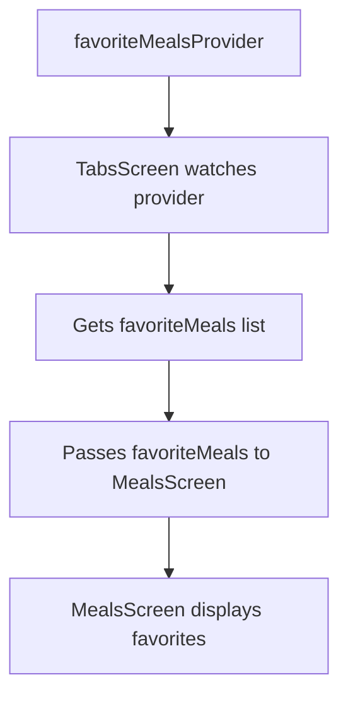
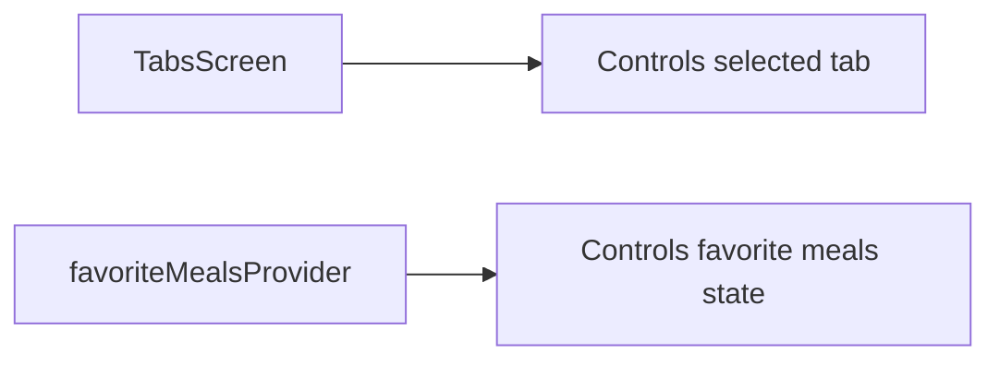
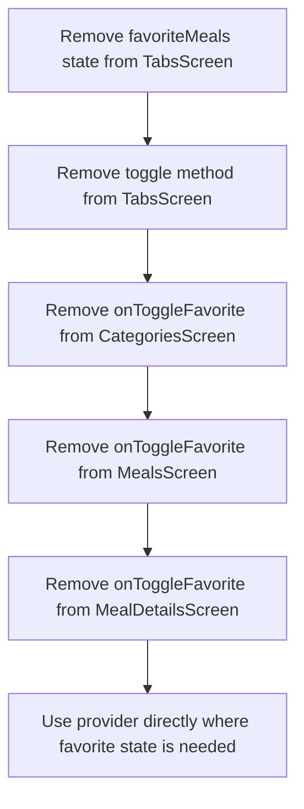
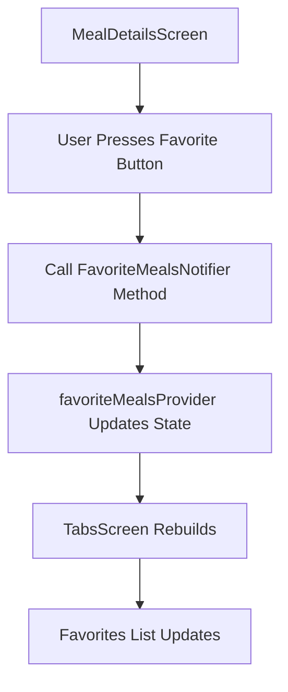

# Using the FavoritesProvider

## Overview

This lecture shows how to use the newly created `favoriteMealsProvider` in the Meals App.

The app already has a `FavoriteMealsNotifier` and a `StateNotifierProvider` that manage the list of favorite meals. Now, the next step is to read that list from the provider and pass it to the UI that displays favorite meals.

In this lecture, the `TabsScreen` watches `favoriteMealsProvider` and passes the resulting favorite meals list to `MealsScreen` when the Favorites tab is selected.

This replaces the old approach where favorite meals were stored directly inside `TabsScreen`.

---

## Why Use the Provider in `TabsScreen`?

The `MealsScreen` is reused in different parts of the app.

It can show:

* Meals from a selected category
* Favorite meals
* Filtered meals

Because of that, `MealsScreen` should stay configurable. It should receive the list of meals it needs to display through a parameter.



Therefore, instead of making `MealsScreen` directly read `favoriteMealsProvider`, the `TabsScreen` reads the favorite meals and passes them into `MealsScreen`.

---

## Previous Approach

Before Riverpod, `TabsScreen` stored the favorite meals state directly.

```dart id="sovl0d"
List<Meal> _favoriteMeals = [];

void _toggleMealFavoriteStatus(Meal meal) {
  final isExisting = _favoriteMeals.contains(meal);

  if (isExisting) {
    setState(() {
      _favoriteMeals.remove(meal);
    });
  } else {
    setState(() {
      _favoriteMeals.add(meal);
    });
  }
}
```

This worked, but it caused prop drilling because the toggle function had to be passed through multiple screens.

---

## Old Data Flow



The problem is that many widgets had to receive and forward a callback they did not really use.

---

## New Approach With Riverpod

With Riverpod, the favorite meals state is managed inside `favoriteMealsProvider`.

The `TabsScreen` no longer needs to store the favorites list manually.

Instead, it watches the provider.

```dart id="emf289"
final favoriteMeals = ref.watch(favoriteMealsProvider);
```

This gives the current list of favorite meals.

Whenever the favorites list changes, `TabsScreen` rebuilds automatically and passes the updated list to `MealsScreen`.

---

## New Data Flow



The favorite meals state no longer lives inside `TabsScreen`.

It lives inside the provider.

---

## Importing the Favorites Provider

To use `favoriteMealsProvider`, import the provider file in `tabs.dart`.

```dart id="eg7nhk"
import '../providers/favorites_provider.dart';
```

The exact path may depend on the project structure.

The file also needs Riverpod if it is not already imported:

```dart id="p58r7o"
import 'package:flutter_riverpod/flutter_riverpod.dart';
```

---

## Watching the Favorites Provider

Because `TabsScreen` already extends `ConsumerStatefulWidget` and its state class extends `ConsumerState`, it has access to `ref`.

Inside the `build` method, watch the provider:

```dart id="phuhak"
final favoriteMeals = ref.watch(favoriteMealsProvider);
```

When watching a `StateNotifierProvider` directly, `ref.watch` returns the provider state.

In this case, it returns:

```dart id="uxah40"
List<Meal>
```

It does not return the notifier object.

---

## Passing Favorites to `MealsScreen`

When the Favorites tab is selected, pass `favoriteMeals` to `MealsScreen`.

```dart id="qokfpe"
MealsScreen(
  meals: favoriteMeals,
)
```

This keeps `MealsScreen` reusable because it still receives the meals it should display from outside.

---

## Example in `TabsScreen`

```dart id="gk983c"
import 'package:flutter/material.dart';
import 'package:flutter_riverpod/flutter_riverpod.dart';

import '../providers/favorites_provider.dart';
import 'meals.dart';

class TabsScreen extends ConsumerStatefulWidget {
  const TabsScreen({super.key});

  @override
  ConsumerState<TabsScreen> createState() {
    return _TabsScreenState();
  }
}

class _TabsScreenState extends ConsumerState<TabsScreen> {
  int _selectedPageIndex = 0;

  @override
  Widget build(BuildContext context) {
    final favoriteMeals = ref.watch(favoriteMealsProvider);

    Widget activePage = const CategoriesScreen();
    var activePageTitle = 'Categories';

    if (_selectedPageIndex == 1) {
      activePage = MealsScreen(
        meals: favoriteMeals,
      );
      activePageTitle = 'Your Favorites';
    }

    return Scaffold(
      appBar: AppBar(
        title: Text(activePageTitle),
      ),
      body: activePage,
      bottomNavigationBar: BottomNavigationBar(
        currentIndex: _selectedPageIndex,
        onTap: (index) {
          setState(() {
            _selectedPageIndex = index;
          });
        },
        items: const [
          BottomNavigationBarItem(
            icon: Icon(Icons.set_meal),
            label: 'Categories',
          ),
          BottomNavigationBarItem(
            icon: Icon(Icons.star),
            label: 'Favorites',
          ),
        ],
      ),
    );
  }
}
```

This example shows the main idea: `favoriteMeals` now comes from the provider.

---

## Removing Old Favorite State From `TabsScreen`

Because the provider now manages favorite meals, the old state variable can be removed.

Remove this:

```dart id="mu5at4"
List<Meal> _favoriteMeals = [];
```

Also remove the old method:

```dart id="f8n7bd"
void _toggleMealFavoriteStatus(Meal meal) {
  // old setState logic
}
```

This logic now belongs inside `FavoriteMealsNotifier`.

---

## Why This Is Cleaner

Before Riverpod, `TabsScreen` had two responsibilities:

1. Managing tab navigation
2. Managing favorite meals state

After Riverpod, `TabsScreen` focuses more on screen selection, while the provider handles favorite meals state.



This separation makes the code easier to understand and maintain.

---

## Removing Callback Prop Drilling

Previously, the favorite toggle method was passed down through many widgets.

```dart id="tm1bix"
CategoriesScreen(
  onToggleFavorite: _toggleMealFavoriteStatus,
)
```

Then:

```dart id="l1c68c"
MealsScreen(
  onToggleFavorite: onToggleFavorite,
)
```

Then:

```dart id="p8dc27"
MealDetailsScreen(
  onToggleFavorite: onToggleFavorite,
)
```

With Riverpod, this callback chain can be removed.

---

## Cleanup Flow



This is one of the main benefits of Riverpod: widgets no longer need to pass state-changing functions through unrelated layers.

---

## What Still Needs To Be Done?

At this point, `TabsScreen` can read and display favorite meals through the provider.

However, the favorite status still needs to be changed from inside `MealDetailsScreen`.

That will be done by calling the notifier method from the provider:

```dart id="jqn9m7"
ref
    .read favoriteMealsProvider.notifier
    .toggleMealFavoriteStatus(meal);
```

Conceptually, the next step is:



---

## `ref.watch` vs `ref.read` With Favorites

| Goal                        | Code                                       |
| --------------------------- | ------------------------------------------ |
| Display favorite meals      | `ref.watch(favoriteMealsProvider)`         |
| Call favorite toggle method | `ref.read(favoriteMealsProvider.notifier)` |

Use `watch` when the UI needs the current list.

Use `read` when triggering an action.

---

## Important Detail

When using:

```dart id="qgb8w7"
final favoriteMeals = ref.watch(favoriteMealsProvider);
```

Riverpod returns the state managed by the notifier.

That state is:

```dart id="wpdwt6"
List<Meal>
```

If you want to access the notifier itself, you must use:

```dart id="orq268"
ref.read(favoriteMealsProvider.notifier)
```

This distinction is important.

---

## Key Points

* `favoriteMealsProvider` manages the favorite meals list.
* `TabsScreen` watches `favoriteMealsProvider`.
* `ref.watch(favoriteMealsProvider)` returns the current `List<Meal>`.
* The favorites list rebuilds automatically when the provider state changes.
* `MealsScreen` stays reusable by receiving meals as a parameter.
* The old `_favoriteMeals` state in `TabsScreen` can be removed.
* The old `_toggleMealFavoriteStatus` method in `TabsScreen` can be removed.
* Callback prop drilling can now be cleaned up.
* The next step is to update favorites directly from `MealDetailsScreen`.

---

## Tips

* Watch the provider where the UI needs the state.
* Keep reusable widgets configurable through parameters when they display different data in different contexts.
* Do not keep duplicate state in both a widget and a provider.
* Remove old callbacks once the provider owns the state.
* Use `ref.watch(provider)` for reading state.
* Use `ref.read(provider.notifier)` for calling methods.
* Clean up constructor parameters after moving logic into providers.

---

## Summary

This lecture shows how to use the `favoriteMealsProvider` to read favorite meals in the app.

The `TabsScreen` imports the favorites provider and watches it inside the `build` method:

```dart id="i27zk7"
final favoriteMeals = ref.watch(favoriteMealsProvider);
```

The resulting list is passed to `MealsScreen` when the Favorites tab is active.

Because favorite meals are now managed by the provider, the old favorite state and toggle method can be removed from `TabsScreen`. The callback chain through `CategoriesScreen`, `MealsScreen`, and `MealDetailsScreen` can also start to be removed.

This completes the read side of the favorites feature and prepares the app for the next step: updating the favorite meals state directly from `MealDetailsScreen`.
