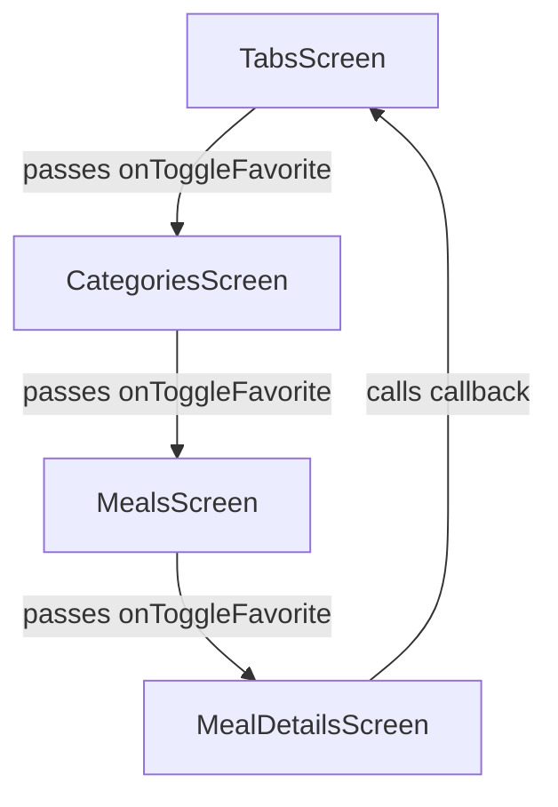
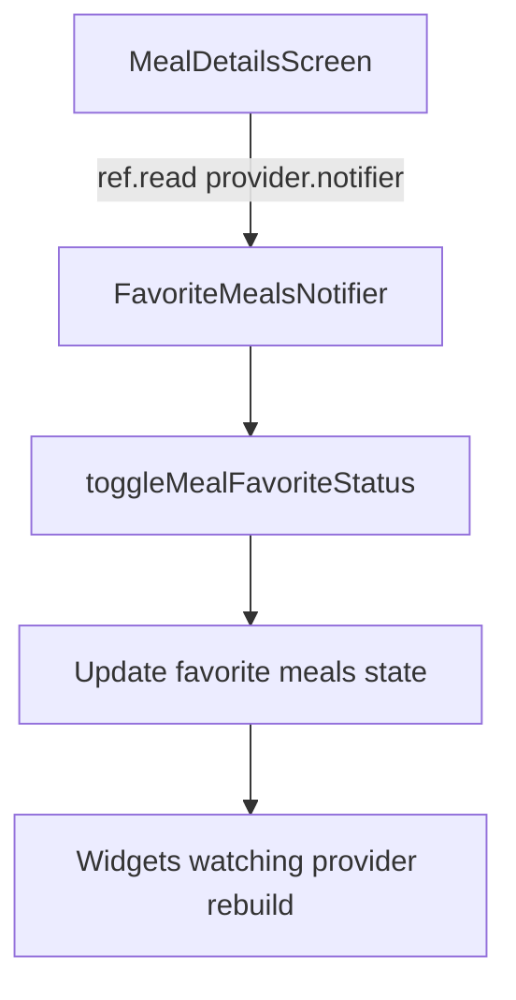
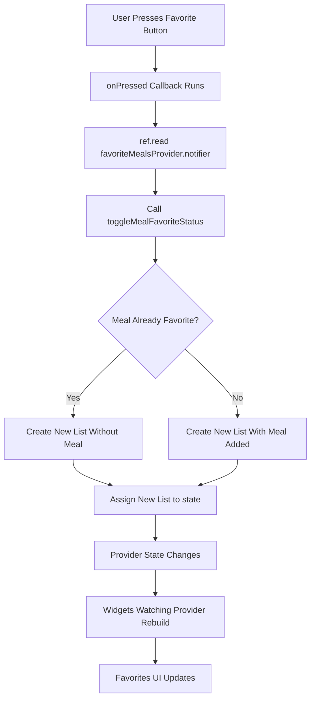
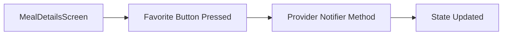

# Triggering a Notifier Method

## Overview

This lecture explains how to trigger a method inside a Riverpod `StateNotifier`.

In the previous lectures, we created a `favoriteMealsProvider` that manages the list of favorite meals. We also used `ref.watch(favoriteMealsProvider)` to read the current favorites list.

Now we need the write side of the feature.

The user should be able to press the favorite button inside the `MealDetailsScreen`, and that action should call the `toggleMealFavoriteStatus` method from `FavoriteMealsNotifier`.

To do this, we use:

```dart id="rhmx7y"
ref.read(favoriteMealsProvider.notifier)
```

This gives access to the notifier object, so we can call its methods.

---

## The Goal

The goal is to replace the old callback-based approach.

Before Riverpod, the app passed a function down through multiple widgets.



With Riverpod, the `MealDetailsScreen` can directly access the provider and trigger the notifier method.



This removes the need to pass the toggle function through unrelated widgets.

---

## Converting `MealDetailsScreen` to `ConsumerWidget`

To use `ref` inside `MealDetailsScreen`, the widget must become Riverpod-aware.

If `MealDetailsScreen` was a normal `StatelessWidget`, change it to `ConsumerWidget`.

Before:

```dart id="b5fltw"
class MealDetailsScreen extends StatelessWidget {
  const MealDetailsScreen({
    super.key,
    required this.meal,
  });

  final Meal meal;

  @override
  Widget build(BuildContext context) {
    // ...
  }
}
```

After:

```dart id="oup2pp"
class MealDetailsScreen extends ConsumerWidget {
  const MealDetailsScreen({
    super.key,
    required this.meal,
  });

  final Meal meal;

  @override
  Widget build(BuildContext context, WidgetRef ref) {
    // ...
  }
}
```

The important change is that the `build` method now receives:

```dart id="bozosp"
WidgetRef ref
```

This `ref` object allows the widget to interact with Riverpod providers.

---

## Required Imports

In `meal_details.dart`, import Riverpod:

```dart id="oemf2y"
import 'package:flutter_riverpod/flutter_riverpod.dart';
```

Also import the favorites provider:

```dart id="p62f50"
import '../providers/favorites_provider.dart';
```

The exact path depends on the project structure.

---

## `ref.watch` vs `ref.read`

This lecture highlights an important Riverpod rule.

Use `ref.watch` when the widget needs to listen to provider changes.

Use `ref.read` when triggering an action inside a callback.

| Method                | Use Case                           | Creates Rebuild Subscription? |
| --------------------- | ---------------------------------- | ----------------------------- |
| `ref.watch(provider)` | Reading state for UI rendering     | Yes                           |
| `ref.read(provider)`  | Calling methods in event callbacks | No                            |

Inside an `onPressed` callback, we should use `ref.read`.

---

## Why Use `ref.read` in `onPressed`?

The favorite button only needs to trigger an action when pressed.

It does not need to subscribe to provider changes at that exact point.

Correct:

```dart id="dd8jae"
onPressed: () {
  ref.read(favoriteMealsProvider.notifier);
}
```

Avoid:

```dart id="xbkl5d"
onPressed: () {
  ref.watch(favoriteMealsProvider.notifier); // Avoid inside callbacks
}
```

Using `watch` inside callbacks is not the right pattern because callbacks should not create reactive subscriptions.

---

## Accessing the Notifier

When using a `StateNotifierProvider`, there are two things you can access:

1. The state
2. The notifier

To get the state:

```dart id="xvx4u1"
final favoriteMeals = ref.watch(favoriteMealsProvider);
```

This returns:

```dart id="n8agqi"
List<Meal>
```

To get the notifier:

```dart id="lkcib1"
final notifier = ref.read(favoriteMealsProvider.notifier);
```

This returns:

```dart id="tr4d3x"
FavoriteMealsNotifier
```

The notifier contains the methods that can change the state.

---

## Calling the Toggle Method

Inside the favorite button callback, call the notifier method:

```dart id="zq5r07"
ref
    .read(favoriteMealsProvider.notifier)
    .toggleMealFavoriteStatus(meal);
```

This calls the method defined inside `FavoriteMealsNotifier`.

```dart id="qj0pj4"
bool toggleMealFavoriteStatus(Meal meal) {
  final mealIsFavorite = state.contains(meal);

  if (mealIsFavorite) {
    state = state.where((m) => m.id != meal.id).toList();
    return false;
  } else {
    state = [...state, meal];
    return true;
  }
}
```

The method updates the provider state, and any widgets watching `favoriteMealsProvider` rebuild automatically.

---

## Updating the Notifier Method to Return a Boolean

Previously, the toggle method may not have returned anything.

Now, it can return a `bool` to tell the widget whether the meal was added or removed.

```dart id="wf8tt8"
bool toggleMealFavoriteStatus(Meal meal) {
  final mealIsFavorite = state.contains(meal);

  if (mealIsFavorite) {
    state = state.where((m) => m.id != meal.id).toList();
    return false;
  } else {
    state = [...state, meal];
    return true;
  }
}
```

Return values:

| Return Value | Meaning                         |
| ------------ | ------------------------------- |
| `true`       | Meal was added to favorites     |
| `false`      | Meal was removed from favorites |

This allows the UI to show the correct message.

---

## Showing a SnackBar

After calling the notifier method, the result can be stored in a variable.

```dart id="sm9ht4"
final wasAdded = ref
    .read(favoriteMealsProvider.notifier)
    .toggleMealFavoriteStatus(meal);
```

Then we can show a `SnackBar` based on the result.

```dart id="jtyv0g"
ScaffoldMessenger.of(context).clearSnackBars();

ScaffoldMessenger.of(context).showSnackBar(
  SnackBar(
    content: Text(
      wasAdded
          ? 'Meal added as a favorite.'
          : 'Meal removed.',
    ),
  ),
);
```

This gives the user immediate feedback after pressing the favorite button.

---

## Complete Example

```dart id="wv8691"
import 'package:flutter/material.dart';
import 'package:flutter_riverpod/flutter_riverpod.dart';

import '../models/meal.dart';
import '../providers/favorites_provider.dart';

class MealDetailsScreen extends ConsumerWidget {
  const MealDetailsScreen({
    super.key,
    required this.meal,
  });

  final Meal meal;

  @override
  Widget build(BuildContext context, WidgetRef ref) {
    return Scaffold(
      appBar: AppBar(
        title: Text(meal.title),
        actions: [
          IconButton(
            onPressed: () {
              final wasAdded = ref
                  .read(favoriteMealsProvider.notifier)
                  .toggleMealFavoriteStatus(meal);

              ScaffoldMessenger.of(context).clearSnackBars();

              ScaffoldMessenger.of(context).showSnackBar(
                SnackBar(
                  content: Text(
                    wasAdded
                        ? 'Meal added as a favorite.'
                        : 'Meal removed.',
                  ),
                ),
              );
            },
            icon: const Icon(Icons.star),
          ),
        ],
      ),
      body: const SizedBox(),
    );
  }
}
```

This is the core pattern for triggering a notifier method from a widget.

---

## Full Update Flow



---

## Why This Is Better Than Prop Drilling

Before Riverpod, the toggle function had to be passed through several widgets.

With Riverpod, the widget where the action happens can directly trigger the state update.



This makes the app cleaner because:

* `TabsScreen` no longer owns favorite state
* `CategoriesScreen` no longer forwards callbacks
* `MealsScreen` no longer forwards callbacks
* `MealDetailsScreen` directly triggers the update
* The provider owns the favorite state logic

---

## Cleanup After This Change

After moving the favorite update logic into the provider, the old callback chain can be removed.

Remove `onToggleFavorite` from:

* `TabsScreen`
* `CategoriesScreen`
* `MealsScreen`
* `MealDetailsScreen`

The UI becomes leaner because widgets no longer receive parameters they do not need.

---

## Read State vs Trigger Change

The favorites feature now has two sides.

### Reading Favorites

Used when displaying the favorites list:

```dart id="d56sjy"
final favoriteMeals = ref.watch(favoriteMealsProvider);
```

### Updating Favorites

Used when pressing the favorite button:

```dart id="jwd4qh"
final wasAdded = ref
    .read(favoriteMealsProvider.notifier)
    .toggleMealFavoriteStatus(meal);
```

These two patterns should not be confused.

---

## Key Points

* `MealDetailsScreen` must become a `ConsumerWidget` to use `ref`.
* `ConsumerWidget` receives `WidgetRef ref` in the `build` method.
* Use `ref.read()` inside event callbacks.
* Use `.notifier` to access the `FavoriteMealsNotifier` object.
* Call `toggleMealFavoriteStatus(meal)` on the notifier.
* The notifier updates `state`.
* Widgets watching `favoriteMealsProvider` rebuild automatically.
* The toggle method can return a boolean to show the correct `SnackBar`.
* This removes the need for passing callbacks through multiple widget layers.

---

## Tips

* Use `ref.watch()` when building UI from provider state.
* Use `ref.read()` when triggering provider methods from callbacks.
* Do not use `ref.watch()` inside `onPressed`.
* Access the notifier with `.notifier`.
* Keep mutation logic inside the notifier, not inside the widget.
* Use the return value of notifier methods for UI feedback.
* Clear old snack bars before showing a new one.
* Remove old callback parameters after moving logic into providers.

---

## Summary

This lecture completes the write side of the favorites feature.

The `MealDetailsScreen` is converted from a `StatelessWidget` to a `ConsumerWidget`, giving it access to `WidgetRef ref`.

Inside the favorite button’s `onPressed` callback, the app uses:

```dart id="z8n8q3"
ref.read(favoriteMealsProvider.notifier)
```

This accesses the `FavoriteMealsNotifier`, allowing the widget to call:

```dart id="yli1f6"
toggleMealFavoriteStatus(meal)
```

The notifier updates the favorite meals state immutably. Any widget watching `favoriteMealsProvider` automatically rebuilds with the new favorites list.

This removes the old chain of passing callback functions through multiple widgets and makes the app cleaner, leaner, and easier to maintain.
