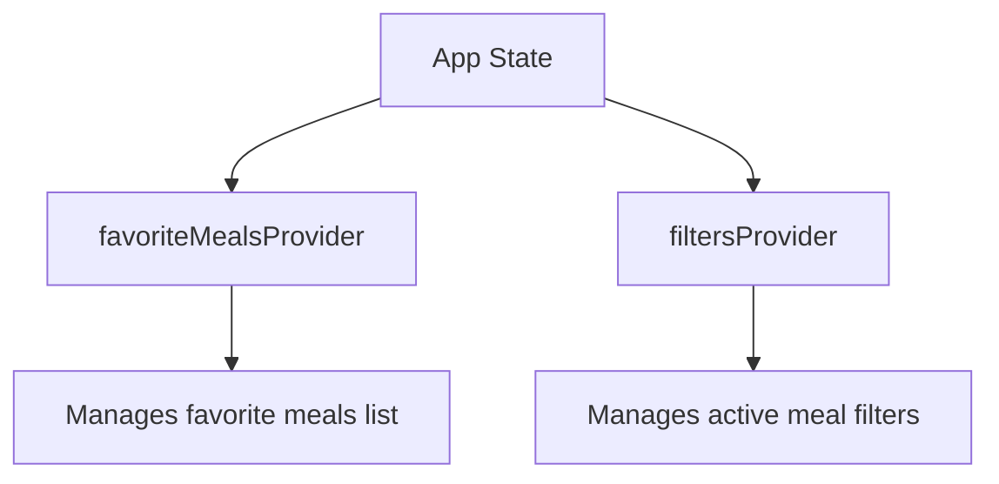
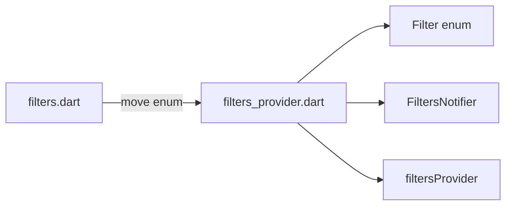
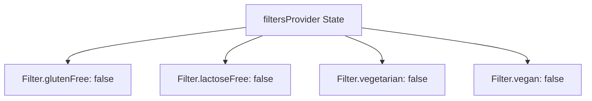
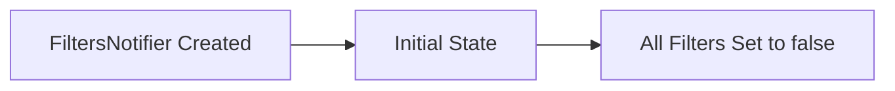
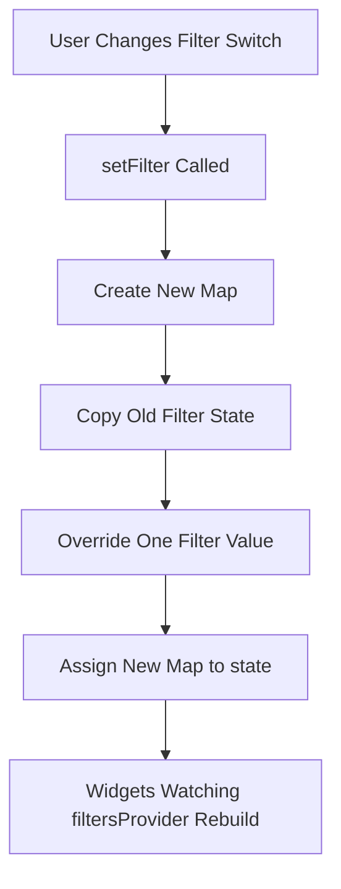
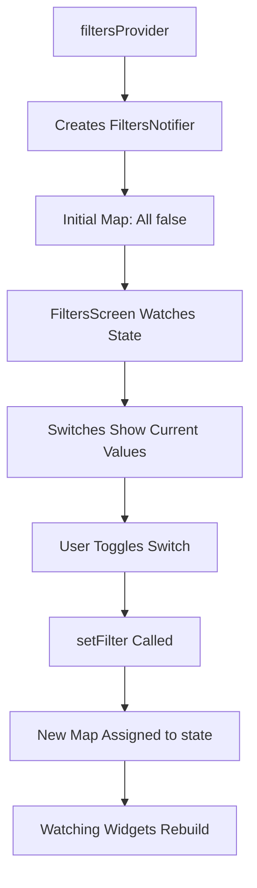
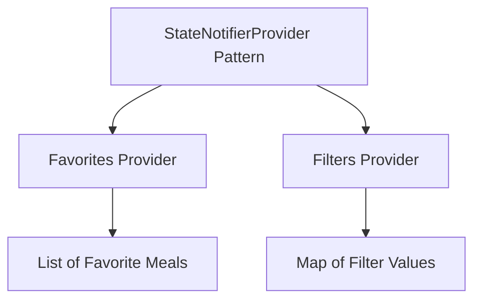

# Getting Started with Another Provider

## Overview

This lecture starts building another Riverpod provider for the Meals App.

Previously, we created `favoriteMealsProvider` to manage the list of favorite meals. That provider used `StateNotifier` and `StateNotifierProvider` because the favorites list can change over time.

Now, we use the same Riverpod pattern to manage another kind of state: **meal filters**.

The filters state controls which meals should be shown based on user preferences such as:

* Gluten-free
* Lactose-free
* Vegetarian
* Vegan

This state will be stored in a new provider called `filtersProvider`.

---

## Why Create Another Provider?

The favorites state and filters state are different concerns.

Favorites answer this question:

> Which meals has the user marked as favorites?

Filters answer this question:

> Which meal restrictions or preferences are currently active?

Because these are separate responsibilities, they should be managed by separate providers.



Keeping these concerns separate makes the code easier to understand, test, and maintain.

---

## Provider File

A new file is created inside the `providers` folder.

```text id="v2ry79"
lib/
  providers/
    meals_provider.dart
    favorites_provider.dart
    filters_provider.dart
```

The new file is named:

```text id="h1x7me"
filters_provider.dart
```

This file will contain:

1. The `Filter` enum
2. The `FiltersNotifier` class
3. The `filtersProvider`

---

## Importing Riverpod

Inside `filters_provider.dart`, import Riverpod.

```dart id="p6nvhm"
import 'package:flutter_riverpod/flutter_riverpod.dart';
```

This gives access to:

* `StateNotifier`
* `StateNotifierProvider`

These are needed because the filters state can change over time.

---

## The `Filter` Enum

The app needs a way to identify each filter.

Instead of using strings, the lecture uses a Dart `enum`.

```dart id="xtz6ce"
enum Filter {
  glutenFree,
  lactoseFree,
  vegetarian,
  vegan,
}
```

Using an enum is safer than using strings.

For example, this is risky:

```dart id="glq1o0"
'gluttenFree' // typo
```

But this is safer:

```dart id="yp3mjh"
Filter.glutenFree
```

If you mistype an enum value, Dart can catch the error during development.

---

## Moving the Enum

Previously, the `Filter` enum may have been defined inside the filters screen file.

Now, it is moved into `filters_provider.dart`.

This keeps all filter-related state definitions in one place.



After moving the enum, other files that need `Filter` must import `filters_provider.dart`.

---

## State Shape

The filters state is stored as a `Map`.

```dart id="bnz2i6"
Map<Filter, bool>
```

This means:

* The key is a `Filter`
* The value is a `bool`
* `true` means the filter is active
* `false` means the filter is inactive

Example:

```dart id="pgm4iq"
{
  Filter.glutenFree: false,
  Filter.lactoseFree: false,
  Filter.vegetarian: false,
  Filter.vegan: false,
}
```

---

## Filter State Diagram



At the beginning, all filters are turned off.

---

## Creating `FiltersNotifier`

The custom notifier class is named `FiltersNotifier`.

```dart id="layuwv"
class FiltersNotifier extends StateNotifier<Map<Filter, bool>> {
  FiltersNotifier()
      : super({
          Filter.glutenFree: false,
          Filter.lactoseFree: false,
          Filter.vegetarian: false,
          Filter.vegan: false,
        });
}
```

Here:

* `FiltersNotifier` is the custom notifier class
* It extends `StateNotifier<Map<Filter, bool>>`
* The state is a map of filters and boolean values
* The initial state sets all filters to `false`

---

## Initial State

The constructor calls `super()` and passes the initial state.

```dart id="mnyfgj"
FiltersNotifier()
    : super({
        Filter.glutenFree: false,
        Filter.lactoseFree: false,
        Filter.vegetarian: false,
        Filter.vegan: false,
      });
```

This creates the default filter setup.



---

## Why Use `StateNotifierProvider`?

The filter state can change when the user toggles switches on the filters screen.

Because the state changes over time, a basic `Provider` is not enough.

Instead, we use:

```dart id="twm7bs"
StateNotifierProvider
```

This gives us:

* A notifier class for update logic
* A provider that exposes the current state
* Automatic rebuilds when watched state changes

---

## Adding a Method to Update One Filter

The notifier needs a method for changing one filter at a time.

```dart id="tfufp9"
void setFilter(Filter filter, bool isActive) {
  state = {
    ...state,
    filter: isActive,
  };
}
```

This method receives:

| Parameter  | Meaning                                        |
| ---------- | ---------------------------------------------- |
| `filter`   | Which filter should be updated                 |
| `isActive` | Whether that filter should be turned on or off |

---

## Immutable Map Update

Just like with lists, we should not mutate the existing state directly.

Avoid this:

```dart id="be7tgm"
state[filter] = isActive; // Avoid
```

This mutates the existing map in memory.

Instead, create a new map:

```dart id="kyzp57"
state = {
  ...state,
  filter: isActive,
};
```

This copies all existing key-value pairs, then overrides the selected filter with the new value.

---

## How the Spread Operator Works With Maps

```dart id="mgg8gh"
state = {
  ...state,
  filter: isActive,
};
```

The spread operator copies the old map:

```dart id="erejou"
...state
```

Then this line updates one key:

```dart id="z2qv8i"
filter: isActive
```

If that filter already exists in the map, its value is replaced.

All other filters stay unchanged.

---

## Update Flow



---

## Adding a Method to Replace All Filters

Sometimes the app may need to set all filters at once.

For that, we can add another method:

```dart id="ug8ab8"
void setFilters(Map<Filter, bool> chosenFilters) {
  state = chosenFilters;
}
```

This method replaces the entire filters map.

It is useful when returning from a filters screen or applying a full set of selected filters.

---

## Complete `FiltersNotifier`

```dart id="vg50pc"
import 'package:flutter_riverpod/flutter_riverpod.dart';

enum Filter {
  glutenFree,
  lactoseFree,
  vegetarian,
  vegan,
}

class FiltersNotifier extends StateNotifier<Map<Filter, bool>> {
  FiltersNotifier()
      : super({
          Filter.glutenFree: false,
          Filter.lactoseFree: false,
          Filter.vegetarian: false,
          Filter.vegan: false,
        });

  void setFilter(Filter filter, bool isActive) {
    state = {
      ...state,
      filter: isActive,
    };
  }

  void setFilters(Map<Filter, bool> chosenFilters) {
    state = chosenFilters;
  }
}
```

This notifier now manages the filter state and provides methods for updating it.

---

## Creating `filtersProvider`

After creating the notifier, expose it through a `StateNotifierProvider`.

```dart id="bn3a4z"
final filtersProvider =
    StateNotifierProvider<FiltersNotifier, Map<Filter, bool>>((ref) {
  return FiltersNotifier();
});
```

This provider exposes:

1. The current filter state
2. The notifier methods for updating the state

---

## Understanding the Generic Types

```dart id="m18o39"
StateNotifierProvider<FiltersNotifier, Map<Filter, bool>>
```

| Generic Type        | Meaning                                   |
| ------------------- | ----------------------------------------- |
| `FiltersNotifier`   | The notifier class that manages the state |
| `Map<Filter, bool>` | The state exposed by the provider         |

This helps Dart understand the provider type correctly.

---

## Complete Provider File

```dart id="yryccs"
import 'package:flutter_riverpod/flutter_riverpod.dart';

enum Filter {
  glutenFree,
  lactoseFree,
  vegetarian,
  vegan,
}

class FiltersNotifier extends StateNotifier<Map<Filter, bool>> {
  FiltersNotifier()
      : super({
          Filter.glutenFree: false,
          Filter.lactoseFree: false,
          Filter.vegetarian: false,
          Filter.vegan: false,
        });

  void setFilter(Filter filter, bool isActive) {
    state = {
      ...state,
      filter: isActive,
    };
  }

  void setFilters(Map<Filter, bool> chosenFilters) {
    state = chosenFilters;
  }
}

final filtersProvider =
    StateNotifierProvider<FiltersNotifier, Map<Filter, bool>>((ref) {
  return FiltersNotifier();
});
```

---

## Using the Filter Enum in Other Files

Because the `Filter` enum now lives in `filters_provider.dart`, any file that uses `Filter` must import this provider file.

For example, in `tabs.dart`:

```dart id="epesdk"
import '../providers/filters_provider.dart';
```

This gives access to:

```dart id="tu2w7n"
Filter.glutenFree
Filter.lactoseFree
Filter.vegetarian
Filter.vegan
```

The same import is needed in `filters.dart` if the filters screen uses the `Filter` enum.

---

## Updating `FiltersScreen`

To use the provider inside the filters screen, the screen must become Riverpod-aware.

If it was a `StatefulWidget`, change it to `ConsumerStatefulWidget`.

Before:

```dart id="cg191d"
class FiltersScreen extends StatefulWidget {
  const FiltersScreen({super.key});

  @override
  State<FiltersScreen> createState() {
    return _FiltersScreenState();
  }
}
```

After:

```dart id="udw99v"
class FiltersScreen extends ConsumerStatefulWidget {
  const FiltersScreen({super.key});

  @override
  ConsumerState<FiltersScreen> createState() {
    return _FiltersScreenState();
  }
}
```

Then update the state class:

```dart id="m55ulm"
class _FiltersScreenState extends ConsumerState<FiltersScreen> {
  // ...
}
```

This gives the state class access to `ref`.

---

## Required Imports in `filters.dart`

```dart id="igppbf"
import 'package:flutter_riverpod/flutter_riverpod.dart';

import '../providers/filters_provider.dart';
```

Now the filters screen can read and update the filters provider.

---

## How the Filters Screen Will Update State

Once `FiltersScreen` has access to `ref`, it can call the notifier.

Example:

```dart id="hruzhh"
ref.read(filtersProvider.notifier).setFilter(
      Filter.glutenFree,
      isChecked,
    );
```

This updates one filter in the provider state.

---

## Reading Filter State

To read the current filters map:

```dart id="e4xsqn"
final activeFilters = ref.watch(filtersProvider);
```

This returns:

```dart id="r8hd24"
Map<Filter, bool>
```

The UI can then use this map to decide whether switches should be on or off.

---

## Watch vs Read for Filters

| Goal                          | Code                                                 |
| ----------------------------- | ---------------------------------------------------- |
| Display current filter values | `ref.watch(filtersProvider)`                         |
| Update one filter             | `ref.read(filtersProvider.notifier).setFilter(...)`  |
| Replace all filters           | `ref.read(filtersProvider.notifier).setFilters(...)` |

Use `watch` when the UI depends on the current state.

Use `read` inside callbacks that update state.

---

## Full Filter Provider Flow



---

## Why This Pattern Scales

The favorites provider and filters provider use the same basic Riverpod structure.



This shows that once the Riverpod pattern is understood, it can be reused for different types of state.

---

## Benefits of a Separate `filtersProvider`

Using a separate provider for filters has several benefits:

* Filter state is centralized
* The filters screen can update filters directly
* Other providers can later depend on the filters
* Widgets do not need to pass filter maps manually
* Filter logic becomes easier to test
* The code is organized by responsibility

---

## Key Points

* A new `filters_provider.dart` file is added.
* The `Filter` enum is moved into the provider file.
* `filtersProvider` manages a `Map<Filter, bool>`.
* All filters are initially set to `false`.
* `FiltersNotifier` extends `StateNotifier<Map<Filter, bool>>`.
* `setFilter` updates one filter.
* `setFilters` can replace all filters.
* Map state must be updated immutably.
* `StateNotifierProvider` exposes both the state and the notifier.
* Files that use `Filter` must import `filters_provider.dart`.
* `FiltersScreen` should become a `ConsumerStatefulWidget` to access `ref`.

---

## Tips

* Use enums instead of strings for fixed filter options.
* Keep filter-related types and logic in the provider file.
* Do not mutate map state directly with `state[filter] = value`.
* Use the spread operator to create a new map.
* Use `ref.watch(filtersProvider)` to read current filter values.
* Use `ref.read(filtersProvider.notifier)` to update filters.
* Keep separate providers for separate state responsibilities.
* Move shared state out of widgets and into providers.

---

## Summary

This lecture starts building another Riverpod provider for the Meals App.

The new `filtersProvider` manages the app’s filter settings, such as gluten-free, lactose-free, vegetarian, and vegan. These filters are represented by a `Filter` enum and stored in a `Map<Filter, bool>`.

A `FiltersNotifier` class is created by extending `StateNotifier<Map<Filter, bool>>`. It sets the initial state with all filters disabled and provides a `setFilter` method to update one filter at a time.

The state is updated immutably by creating a new map with the spread operator instead of modifying the existing map directly.

Finally, the notifier is exposed through `StateNotifierProvider`, allowing widgets to read filter state and trigger filter updates using Riverpod.
