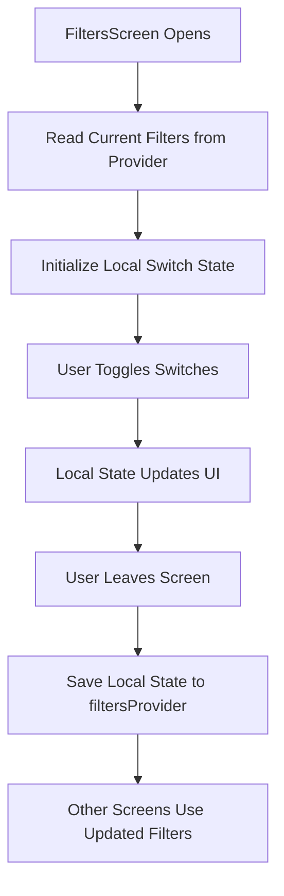
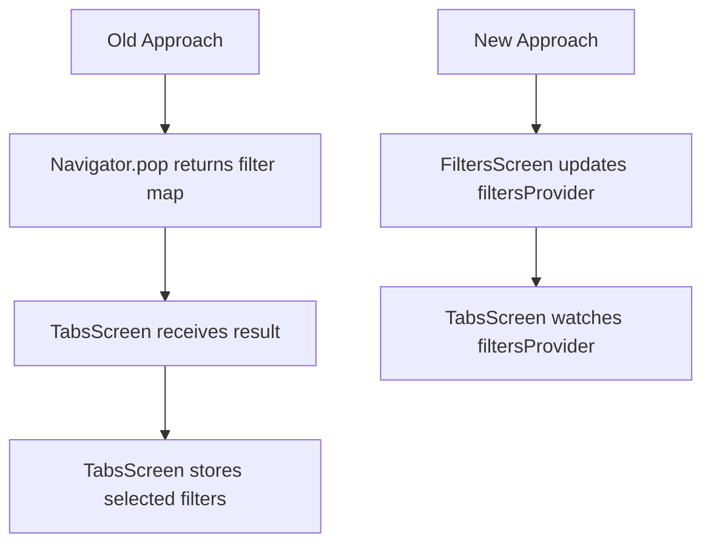
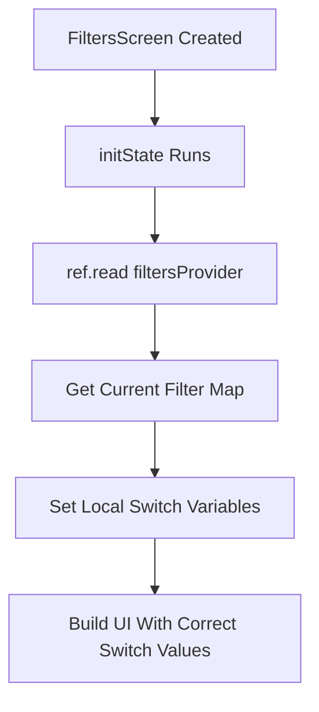
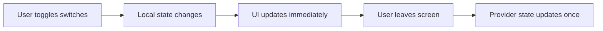
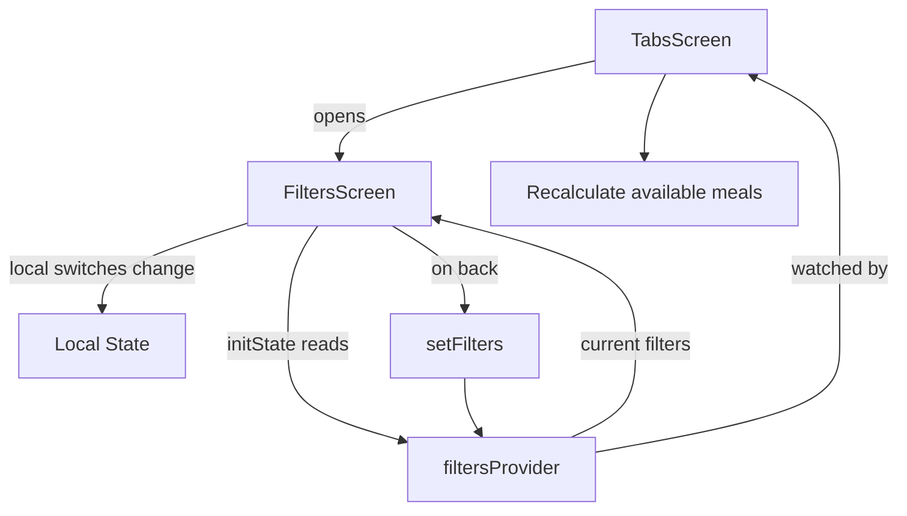

# Combining Local and Provider-managed State

## Overview

This lecture explains how to combine **local widget state** with **Riverpod provider-managed state**.

In the Meals App, the filters screen contains multiple switches:

* Gluten-free
* Lactose-free
* Vegetarian
* Vegan

The switch positions need to update immediately when the user taps them. That kind of temporary UI state can still be managed locally inside the widget.

However, the final selected filter values should be stored globally in the `filtersProvider`, because other screens also need access to those filters.

This creates a useful pattern:

* Use **local state** for immediate UI updates.
* Use **provider state** as the shared source of truth.

---

## Why Combine Local State and Provider State?

Not all state must be moved into Riverpod.

Some state only matters inside one screen. For example, while the user is changing filter switches, the UI should respond instantly.

However, once the user leaves the screen, those selected filters should be saved to the provider so the rest of the app can use them.



This gives both a responsive UI and centralized shared state.

---

## Local State vs Provider State

| State Type             | Purpose                                 | Example                          |
| ---------------------- | --------------------------------------- | -------------------------------- |
| Local state            | Controls temporary UI inside one widget | Current switch positions         |
| Provider state         | Stores shared app-wide data             | Active meal filters              |
| Local + provider state | UI edits locally, then saves globally   | Settings screen / filters screen |

In this lecture, `FiltersScreen` uses both.

---

## The Provider State

The global filter state is managed by `filtersProvider`.

```dart
final filtersProvider =
    StateNotifierProvider<FiltersNotifier, Map<Filter, bool>>((ref) {
  return FiltersNotifier();
});
```

The state shape is:

```dart
Map<Filter, bool>
```

Example:

```dart
{
  Filter.glutenFree: false,
  Filter.lactoseFree: false,
  Filter.vegetarian: false,
  Filter.vegan: false,
}
```

Each key represents one filter. Each boolean value tells whether that filter is active.

---

## The `FiltersNotifier`

The notifier manages the filter state.

```dart
class FiltersNotifier extends StateNotifier<Map<Filter, bool>> {
  FiltersNotifier()
      : super({
          Filter.glutenFree: false,
          Filter.lactoseFree: false,
          Filter.vegetarian: false,
          Filter.vegan: false,
        });

  void setFilter(Filter filter, bool isActive) {
    state = {
      ...state,
      filter: isActive,
    };
  }

  void setFilters(Map<Filter, bool> chosenFilters) {
    state = chosenFilters;
  }
}
```

The `setFilter` method updates one filter.

The `setFilters` method replaces all filters at once.

This second method is useful when the user leaves the filters screen and the app wants to save all selected filter values together.

---

## Why Add `setFilters`?

Previously, the app returned selected filters through `Navigator.pop`.

With Riverpod, that is no longer necessary.

Instead of returning data to the previous screen, the filters screen can update the provider directly.



This removes the need to manually pass filter data back through navigation.

---

## Making `FiltersScreen` Riverpod-aware

Because `FiltersScreen` needs both local state and provider access, it should use `ConsumerStatefulWidget`.

```dart
class FiltersScreen extends ConsumerStatefulWidget {
  const FiltersScreen({super.key});

  @override
  ConsumerState<FiltersScreen> createState() {
    return _FiltersScreenState();
  }
}
```

The state class extends `ConsumerState`.

```dart
class _FiltersScreenState extends ConsumerState<FiltersScreen> {
  // Local state goes here
}
```

This gives the state class access to `ref`.

---

## Required Imports

Inside `filters.dart`, import Riverpod:

```dart
import 'package:flutter_riverpod/flutter_riverpod.dart';
```

Also import the filters provider:

```dart
import '../providers/filters_provider.dart';
```

This gives access to:

```dart
filtersProvider
Filter.glutenFree
Filter.lactoseFree
Filter.vegetarian
Filter.vegan
```

---

## Local State in `FiltersScreen`

The filters screen still keeps local boolean variables.

```dart
var _glutenFreeFilterSet = false;
var _lactoseFreeFilterSet = false;
var _vegetarianFilterSet = false;
var _veganFilterSet = false;
```

These values control the visible switch positions.

When the user taps a switch, `setState()` updates the local value immediately.

```dart
onChanged: (isChecked) {
  setState(() {
    _glutenFreeFilterSet = isChecked;
  });
}
```

This is a good use case for local state because the switch UI belongs to this screen.

---

## Initializing Local State From the Provider

When the filters screen opens, it should show the current active filters.

To do that, read the provider once in `initState`.

```dart
@override
void initState() {
  super.initState();

  final activeFilters = ref.read(filtersProvider);

  _glutenFreeFilterSet = activeFilters[Filter.glutenFree]!;
  _lactoseFreeFilterSet = activeFilters[Filter.lactoseFree]!;
  _vegetarianFilterSet = activeFilters[Filter.vegetarian]!;
  _veganFilterSet = activeFilters[Filter.vegan]!;
}
```

Use `ref.read()` here, not `ref.watch()`.

---

## Why Use `ref.read()` in `initState`?

`initState()` only runs once when the widget is created.

So it does not make sense to set up a reactive listener there.

Correct:

```dart
final activeFilters = ref.read(filtersProvider);
```

Avoid:

```dart
final activeFilters = ref.watch(filtersProvider); // Avoid in initState
```

`ref.watch()` belongs in the build phase when the UI should rebuild after provider changes.

`ref.read()` is appropriate when reading a provider once.

---

## Initialization Flow



This ensures the filters screen starts with the current provider values.

---

## Updating Local State With Switches

Each switch updates local state when changed.

Example:

```dart
SwitchListTile(
  value: _glutenFreeFilterSet,
  onChanged: (isChecked) {
    setState(() {
      _glutenFreeFilterSet = isChecked;
    });
  },
  title: const Text('Gluten-free'),
  subtitle: const Text('Only include gluten-free meals.'),
)
```

This does not immediately update the provider.

It only updates the local UI state.

---

## Why Not Update the Provider Immediately?

You could update the provider every time a switch changes.

However, this lecture uses a different pattern:

1. Let the user adjust switches locally.
2. Save all selected filters when the user leaves the screen.

This is common for settings or form-like screens.



This keeps temporary UI interaction separate from global app state.

---

## Saving Filters When Leaving the Screen

When the user leaves the filters screen, the local state should be saved to `filtersProvider`.

The app can call the notifier method:

```dart
ref.read(filtersProvider.notifier).setFilters({
  Filter.glutenFree: _glutenFreeFilterSet,
  Filter.lactoseFree: _lactoseFreeFilterSet,
  Filter.vegetarian: _vegetarianFilterSet,
  Filter.vegan: _veganFilterSet,
});
```

Because this happens in an event handler, use `ref.read()`.

---

## Example With Back Navigation

The lecture updates the provider when the user leaves the filters screen.

Conceptually:

```dart
onWillPop: () async {
  ref.read(filtersProvider.notifier).setFilters({
    Filter.glutenFree: _glutenFreeFilterSet,
    Filter.lactoseFree: _lactoseFreeFilterSet,
    Filter.vegetarian: _vegetarianFilterSet,
    Filter.vegan: _veganFilterSet,
  });

  return true;
}
```

Returning `true` allows Flutter to continue with the normal pop action.

Previously, the app manually popped the screen to pass data back. With Riverpod, that is no longer needed.

---

## Complete `FiltersScreen` Example

```dart
import 'package:flutter/material.dart';
import 'package:flutter_riverpod/flutter_riverpod.dart';

import '../providers/filters_provider.dart';

class FiltersScreen extends ConsumerStatefulWidget {
  const FiltersScreen({super.key});

  @override
  ConsumerState<FiltersScreen> createState() {
    return _FiltersScreenState();
  }
}

class _FiltersScreenState extends ConsumerState<FiltersScreen> {
  var _glutenFreeFilterSet = false;
  var _lactoseFreeFilterSet = false;
  var _vegetarianFilterSet = false;
  var _veganFilterSet = false;

  @override
  void initState() {
    super.initState();

    final activeFilters = ref.read(filtersProvider);

    _glutenFreeFilterSet = activeFilters[Filter.glutenFree]!;
    _lactoseFreeFilterSet = activeFilters[Filter.lactoseFree]!;
    _vegetarianFilterSet = activeFilters[Filter.vegetarian]!;
    _veganFilterSet = activeFilters[Filter.vegan]!;
  }

  Future<bool> _saveFilters() async {
    ref.read(filtersProvider.notifier).setFilters({
      Filter.glutenFree: _glutenFreeFilterSet,
      Filter.lactoseFree: _lactoseFreeFilterSet,
      Filter.vegetarian: _vegetarianFilterSet,
      Filter.vegan: _veganFilterSet,
    });

    return true;
  }

  @override
  Widget build(BuildContext context) {
    return WillPopScope(
      onWillPop: _saveFilters,
      child: Scaffold(
        appBar: AppBar(
          title: const Text('Your Filters'),
        ),
        body: Column(
          children: [
            SwitchListTile(
              value: _glutenFreeFilterSet,
              onChanged: (isChecked) {
                setState(() {
                  _glutenFreeFilterSet = isChecked;
                });
              },
              title: const Text('Gluten-free'),
              subtitle: const Text('Only include gluten-free meals.'),
            ),
            SwitchListTile(
              value: _lactoseFreeFilterSet,
              onChanged: (isChecked) {
                setState(() {
                  _lactoseFreeFilterSet = isChecked;
                });
              },
              title: const Text('Lactose-free'),
              subtitle: const Text('Only include lactose-free meals.'),
            ),
            SwitchListTile(
              value: _vegetarianFilterSet,
              onChanged: (isChecked) {
                setState(() {
                  _vegetarianFilterSet = isChecked;
                });
              },
              title: const Text('Vegetarian'),
              subtitle: const Text('Only include vegetarian meals.'),
            ),
            SwitchListTile(
              value: _veganFilterSet,
              onChanged: (isChecked) {
                setState(() {
                  _veganFilterSet = isChecked;
                });
              },
              title: const Text('Vegan'),
              subtitle: const Text('Only include vegan meals.'),
            ),
          ],
        ),
      ),
    );
  }
}
```

This example shows the hybrid pattern clearly:

* Provider state initializes the screen.
* Local state controls the switches.
* Provider state is updated when leaving the screen.

---

## Updating `TabsScreen`

Because filter state now lives in `filtersProvider`, `TabsScreen` no longer needs to manage `_selectedFilters`.

Remove the old local filter state from `TabsScreen`.

Before:

```dart
Map<Filter, bool> _selectedFilters = {
  Filter.glutenFree: false,
  Filter.lactoseFree: false,
  Filter.vegetarian: false,
  Filter.vegan: false,
};
```

Now, read the active filters from the provider.

```dart
final activeFilters = ref.watch(filtersProvider);
```

Then use `activeFilters` for filtering meals.

---

## Filtering Meals With Provider State

```dart
final activeFilters = ref.watch(filtersProvider);
final meals = ref.watch(mealsProvider);

final availableMeals = meals.where((meal) {
  if (activeFilters[Filter.glutenFree]! && !meal.isGlutenFree) {
    return false;
  }
  if (activeFilters[Filter.lactoseFree]! && !meal.isLactoseFree) {
    return false;
  }
  if (activeFilters[Filter.vegetarian]! && !meal.isVegetarian) {
    return false;
  }
  if (activeFilters[Filter.vegan]! && !meal.isVegan) {
    return false;
  }
  return true;
}).toList();
```

Now `TabsScreen` gets filter data from the provider instead of owning it locally.

---

## Updating Navigation to `FiltersScreen`

Previously, `TabsScreen` may have passed current filters to `FiltersScreen`.

```dart
FiltersScreen(
  currentFilters: _selectedFilters,
)
```

That is no longer needed.

Now, `FiltersScreen` reads current filters from the provider.

```dart
const FiltersScreen()
```

Because the screen no longer requires constructor data, it can be marked as `const`.

---

## No More Returned Filter Result

Previously, `FiltersScreen` may have returned selected filters through `Navigator.pop`.

With Riverpod, it no longer needs to return data.

Old idea:

```dart
final result = await Navigator.of(context).push(...);
```

New idea:

```dart
Navigator.of(context).push(
  MaterialPageRoute(
    builder: (ctx) => const FiltersScreen(),
  ),
);
```

The filters are stored in `filtersProvider`, so `TabsScreen` can simply watch the provider.

---

## Updated Data Flow



The provider replaces the old navigation-based data passing.

---

## Why This Is Better

This approach simplifies the app because:

* `FiltersScreen` no longer needs `currentFilters` as a constructor argument.
* `TabsScreen` no longer needs `_selectedFilters`.
* The app no longer needs to return filter data through `Navigator.pop`.
* Filter state is stored in one central provider.
* Any widget can watch the filter state when needed.

---

## Key Points

* `ConsumerStatefulWidget` lets a widget use both local state and Riverpod.
* `ConsumerState` gives the state class access to `ref`.
* Local switch state is initialized from `filtersProvider`.
* Use `ref.read(filtersProvider)` in `initState`.
* Do not use `ref.watch()` in `initState`.
* Local state controls immediate switch UI updates.
* Provider state stores the shared filter settings.
* Use `ref.read(filtersProvider.notifier).setFilters(...)` when saving filters.
* `TabsScreen` watches `filtersProvider` to apply filtering.
* Navigation no longer needs to return selected filter data.

---

## Tips

* Use local state for temporary UI changes.
* Use provider state for shared app data.
* Use `ref.read()` in `initState` when initializing local state from a provider.
* Use `ref.watch()` in `build` when the UI depends on provider state.
* Use `ref.read(provider.notifier)` in callbacks or event handlers.
* Avoid duplicating provider state unless it is only temporary UI state.
* After moving state into a provider, remove old constructor parameters and `Navigator.pop` result handling.

---

## Summary

This lecture shows how local widget state and Riverpod provider state can work together.

The `FiltersScreen` still uses local state to control the switch values while the user interacts with the screen. However, those local values are initialized from `filtersProvider` when the screen opens.

When the user leaves the screen, the local values are saved back into the provider with:

```dart
ref.read(filtersProvider.notifier).setFilters(...)
```

The `TabsScreen` no longer stores selected filters locally. Instead, it watches `filtersProvider` and uses the active filter map to calculate which meals should be displayed.

This pattern is useful for settings screens, forms, and any UI where temporary local edits should eventually update shared provider-managed state.
