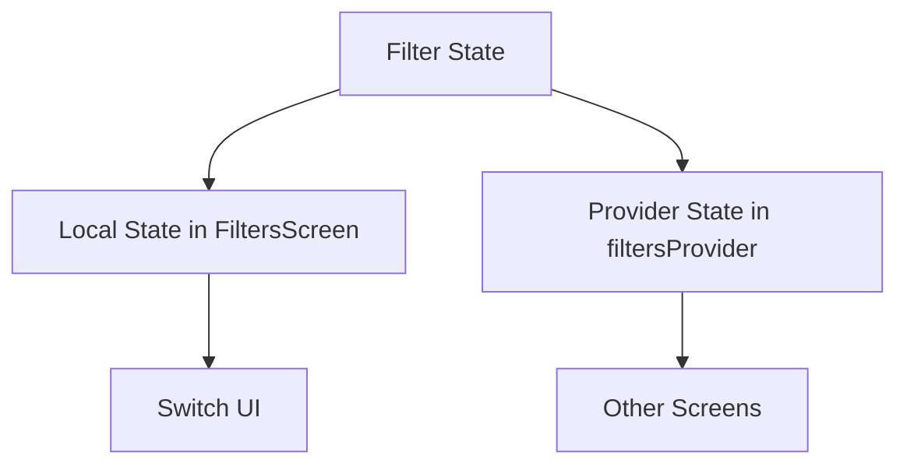
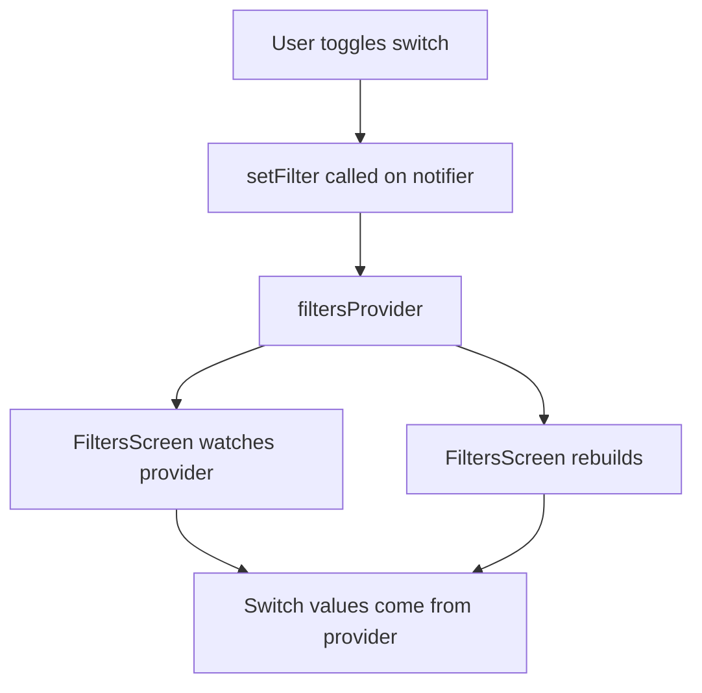
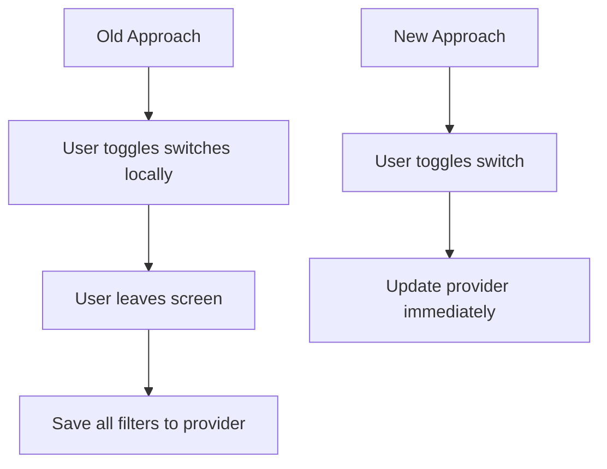
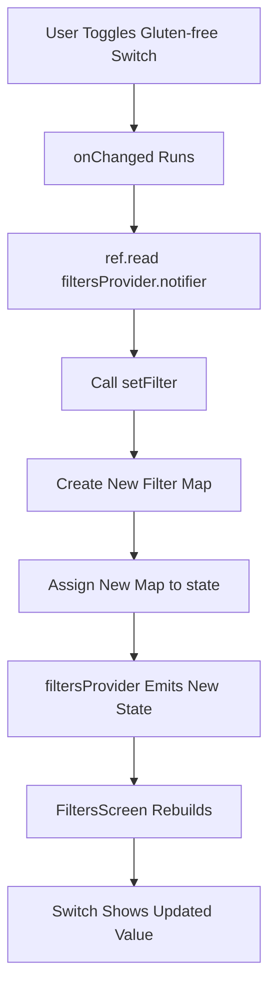
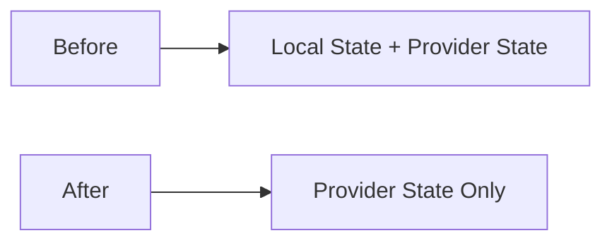
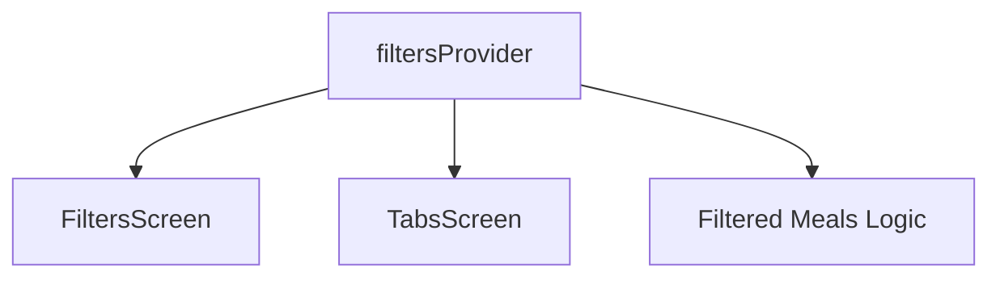

# Outsourcing State Into The Provider

## Overview

This lecture refactors the `FiltersScreen` so that all filter state is managed directly by the Riverpod provider.

In the previous lecture, the screen used a hybrid approach:

* The provider stored the global filter state.
* The screen also kept local state for the switch values.
* When the user left the screen, the local state was saved back to the provider.

That approach worked, but it required more code than necessary.

In this lecture, the local state is removed completely. The `filtersProvider` becomes the single source of truth, and the `FiltersScreen` reads and updates the provider directly.

---

## Previous Approach

Previously, `FiltersScreen` was a `ConsumerStatefulWidget`.

It used local variables like this:

```dart id="y2up7g"
var _glutenFreeFilterSet = false;
var _lactoseFreeFilterSet = false;
var _vegetarianFilterSet = false;
var _veganFilterSet = false;
```

These values were initialized from the provider in `initState`.

```dart id="gcr6ys"
final activeFilters = ref.read(filtersProvider);

_glutenFreeFilterSet = activeFilters[Filter.glutenFree]!;
_lactoseFreeFilterSet = activeFilters[Filter.lactoseFree]!;
_vegetarianFilterSet = activeFilters[Filter.vegetarian]!;
_veganFilterSet = activeFilters[Filter.vegan]!;
```

Then, when the user left the screen, the local values were saved back to the provider.

This worked, but it duplicated the same state in two places.

---

## The Problem With Duplicated State

Duplicating state means the same information exists in two places:



This can make the code harder to reason about.

If the provider already stores the filter state, the screen does not always need a separate local copy.

---

## New Approach

The new approach removes local state from `FiltersScreen`.

Instead:

* The switch values come directly from `filtersProvider`.
* Every switch update directly changes `filtersProvider`.
* The UI rebuilds automatically when the provider state changes.



The provider becomes the only source of truth.

---

## Why This Works

Riverpod makes this simple because `ref.watch()` automatically rebuilds the widget when the provider state changes.

```dart id="v7ha09"
final activeFilters = ref.watch(filtersProvider);
```

When a switch is toggled, the provider state changes.

```dart id="nhvlml"
ref.read(filtersProvider.notifier).setFilter(
      Filter.glutenFree,
      isChecked,
    );
```

Because the widget is watching `filtersProvider`, it rebuilds and displays the updated switch value.

---

## Removing `ConsumerStatefulWidget`

Since the screen no longer manages local state, it no longer needs to be stateful.

Before:

```dart id="nwyghq"
class FiltersScreen extends ConsumerStatefulWidget {
  const FiltersScreen({super.key});

  @override
  ConsumerState<FiltersScreen> createState() {
    return _FiltersScreenState();
  }
}
```

After:

```dart id="71n0np"
class FiltersScreen extends ConsumerWidget {
  const FiltersScreen({super.key});

  @override
  Widget build(BuildContext context, WidgetRef ref) {
    // ...
  }
}
```

This makes the widget much simpler.

---

## Removing the State Class

Because `FiltersScreen` becomes a `ConsumerWidget`, the entire state class can be removed.

Remove:

```dart id="37h6og"
class _FiltersScreenState extends ConsumerState<FiltersScreen> {
  // local state
  // initState
  // build
}
```

The screen now only needs one class.

```dart id="8x2rki"
class FiltersScreen extends ConsumerWidget {
  const FiltersScreen({super.key});

  @override
  Widget build(BuildContext context, WidgetRef ref) {
    // read and update provider here
  }
}
```

---

## Removing `initState`

The old `initState` method is no longer needed.

Before, `initState` was used to copy provider state into local state.

```dart id="zutx39"
@override
void initState() {
  super.initState();

  final activeFilters = ref.read(filtersProvider);

  _glutenFreeFilterSet = activeFilters[Filter.glutenFree]!;
  _lactoseFreeFilterSet = activeFilters[Filter.lactoseFree]!;
  _vegetarianFilterSet = activeFilters[Filter.vegetarian]!;
  _veganFilterSet = activeFilters[Filter.vegan]!;
}
```

Now the screen simply watches the provider in the `build` method.

```dart id="cwl93n"
final activeFilters = ref.watch(filtersProvider);
```

---

## Removing Back Navigation State Saving

Previously, the app saved the filters when the user left the screen.

That required logic such as `WillPopScope`, `PopScope`, or a manual navigation callback.

Now this is no longer needed because each switch updates the provider immediately.



This removes extra navigation-related code.

---

## Watching the Provider

At the beginning of the `build` method, watch `filtersProvider`.

```dart id="4uh7w6"
final activeFilters = ref.watch(filtersProvider);
```

This returns the current filter map:

```dart id="ofo9qu"
Map<Filter, bool>
```

The screen uses this map to decide whether each switch is on or off.

---

## Reading Switch Values From Provider State

Each switch gets its value directly from `activeFilters`.

```dart id="pqr9fa"
value: activeFilters[Filter.glutenFree]!,
```

The exclamation mark is used because Dart sees that the map lookup could return `null`.

However, the app knows that every filter key is always included in the provider state.

---

## Updating One Filter

Each switch updates one filter through the notifier.

```dart id="3py25i"
onChanged: (isChecked) {
  ref.read(filtersProvider.notifier).setFilter(
        Filter.glutenFree,
        isChecked,
      );
}
```

Use `ref.read()` here because this code runs inside an event callback.

The screen is not trying to subscribe inside the callback. It only wants to trigger an update.

---

## Watch vs Read in This Screen

| Task                  | Code                                                | Why                                       |
| --------------------- | --------------------------------------------------- | ----------------------------------------- |
| Display switch values | `ref.watch(filtersProvider)`                        | The UI should rebuild when filters change |
| Update a switch value | `ref.read(filtersProvider.notifier).setFilter(...)` | This is an event callback                 |

This is a very common Riverpod pattern:

```dart id="79bnf0"
final state = ref.watch(provider);
ref.read(provider.notifier).method();
```

---

## Complete Refactored `FiltersScreen`

```dart id="nmihj6"
import 'package:flutter/material.dart';
import 'package:flutter_riverpod/flutter_riverpod.dart';

import '../providers/filters_provider.dart';

class FiltersScreen extends ConsumerWidget {
  const FiltersScreen({super.key});

  @override
  Widget build(BuildContext context, WidgetRef ref) {
    final activeFilters = ref.watch(filtersProvider);

    return Scaffold(
      appBar: AppBar(
        title: const Text('Your Filters'),
      ),
      body: Column(
        children: [
          SwitchListTile(
            value: activeFilters[Filter.glutenFree]!,
            onChanged: (isChecked) {
              ref.read(filtersProvider.notifier).setFilter(
                    Filter.glutenFree,
                    isChecked,
                  );
            },
            title: const Text('Gluten-free'),
            subtitle: const Text('Only include gluten-free meals.'),
          ),
          SwitchListTile(
            value: activeFilters[Filter.lactoseFree]!,
            onChanged: (isChecked) {
              ref.read(filtersProvider.notifier).setFilter(
                    Filter.lactoseFree,
                    isChecked,
                  );
            },
            title: const Text('Lactose-free'),
            subtitle: const Text('Only include lactose-free meals.'),
          ),
          SwitchListTile(
            value: activeFilters[Filter.vegetarian]!,
            onChanged: (isChecked) {
              ref.read(filtersProvider.notifier).setFilter(
                    Filter.vegetarian,
                    isChecked,
                  );
            },
            title: const Text('Vegetarian'),
            subtitle: const Text('Only include vegetarian meals.'),
          ),
          SwitchListTile(
            value: activeFilters[Filter.vegan]!,
            onChanged: (isChecked) {
              ref.read(filtersProvider.notifier).setFilter(
                    Filter.vegan,
                    isChecked,
                  );
            },
            title: const Text('Vegan'),
            subtitle: const Text('Only include vegan meals.'),
          ),
        ],
      ),
    );
  }
}
```

---

## Provider Code

The provider still manages the filter map.

```dart id="o56k90"
import 'package:flutter_riverpod/flutter_riverpod.dart';

enum Filter {
  glutenFree,
  lactoseFree,
  vegetarian,
  vegan,
}

class FiltersNotifier extends StateNotifier<Map<Filter, bool>> {
  FiltersNotifier()
      : super({
          Filter.glutenFree: false,
          Filter.lactoseFree: false,
          Filter.vegetarian: false,
          Filter.vegan: false,
        });

  void setFilter(Filter filter, bool isActive) {
    state = {
      ...state,
      filter: isActive,
    };
  }

  void setFilters(Map<Filter, bool> chosenFilters) {
    state = chosenFilters;
  }
}

final filtersProvider =
    StateNotifierProvider<FiltersNotifier, Map<Filter, bool>>((ref) {
  return FiltersNotifier();
});
```

The `setFilter` method is now especially important because each switch calls it directly.

---

## Direct Provider Update Flow



This creates immediate UI updates without local widget state.

---

## Why This Is Simpler

The new version removes:

* Local filter variables
* `initState`
* `setState`
* `ConsumerStatefulWidget`
* `ConsumerState`
* Back navigation saving logic
* Manual syncing between local and provider state

The provider now manages all filter data.



---

## Single Source of Truth

The key idea is that the provider becomes the **single source of truth**.



Any part of the app that needs filter data can read it from the provider.

There is no separate local copy that must be synchronized.

---

## Effect on `TabsScreen`

`TabsScreen` can continue watching `filtersProvider`.

```dart id="1ffpt2"
final activeFilters = ref.watch(filtersProvider);
```

When a switch changes in `FiltersScreen`, the provider updates.

Because `TabsScreen` watches the same provider, it can recalculate available meals using the latest filter state.

---

## Filtering Example

```dart id="0lej2u"
final activeFilters = ref.watch(filtersProvider);
final meals = ref.watch(mealsProvider);

final availableMeals = meals.where((meal) {
  if (activeFilters[Filter.glutenFree]! && !meal.isGlutenFree) {
    return false;
  }
  if (activeFilters[Filter.lactoseFree]! && !meal.isLactoseFree) {
    return false;
  }
  if (activeFilters[Filter.vegetarian]! && !meal.isVegetarian) {
    return false;
  }
  if (activeFilters[Filter.vegan]! && !meal.isVegan) {
    return false;
  }
  return true;
}).toList();
```

This logic will later be a good candidate for moving into another provider.

---

## Before vs After

| Before                            | After                             |
| --------------------------------- | --------------------------------- |
| `ConsumerStatefulWidget`          | `ConsumerWidget`                  |
| Local boolean variables           | Provider map only                 |
| `initState` reads provider once   | `build` watches provider          |
| Switches update local state       | Switches update provider directly |
| Filters saved when leaving screen | Filters saved immediately         |
| More boilerplate                  | Less boilerplate                  |
| Two state sources                 | One state source                  |

---

## Key Points

* The filters screen no longer needs local state.
* `filtersProvider` becomes the single source of truth.
* The screen can be changed from `ConsumerStatefulWidget` to `ConsumerWidget`.
* `ref.watch(filtersProvider)` gives the current filter values.
* Switch values are read directly from the provider state.
* Switch callbacks call `setFilter` directly on the notifier.
* `ref.read(filtersProvider.notifier)` is used inside `onChanged`.
* The UI rebuilds automatically when the provider state changes.
* There is no need to save filter data when leaving the screen.

---

## Tips

* Avoid duplicating state when the provider can be the source of truth.
* Use `ConsumerWidget` when no local state is needed.
* Use `ref.watch()` in `build` to display provider state.
* Use `ref.read()` in callbacks to trigger provider methods.
* Keep provider state immutable.
* Remove old `setState` logic after moving state into providers.
* Prefer simpler code when local state does not provide a clear benefit.

---

## Summary

This lecture refactors the filters feature by moving all state management into `filtersProvider`.

Instead of storing switch values locally in `FiltersScreen`, the screen now watches the provider directly:

```dart id="lyuikl"
final activeFilters = ref.watch(filtersProvider);
```

Each switch reads its value from `activeFilters` and updates the provider immediately through the notifier:

```dart id="1yvsib"
ref.read(filtersProvider.notifier).setFilter(
      Filter.glutenFree,
      isChecked,
    );
```

Because the screen no longer manages local state, it can be simplified from `ConsumerStatefulWidget` to `ConsumerWidget`.

This makes the code shorter, cleaner, and easier to maintain. The provider is now the single source of truth for all filter state.
