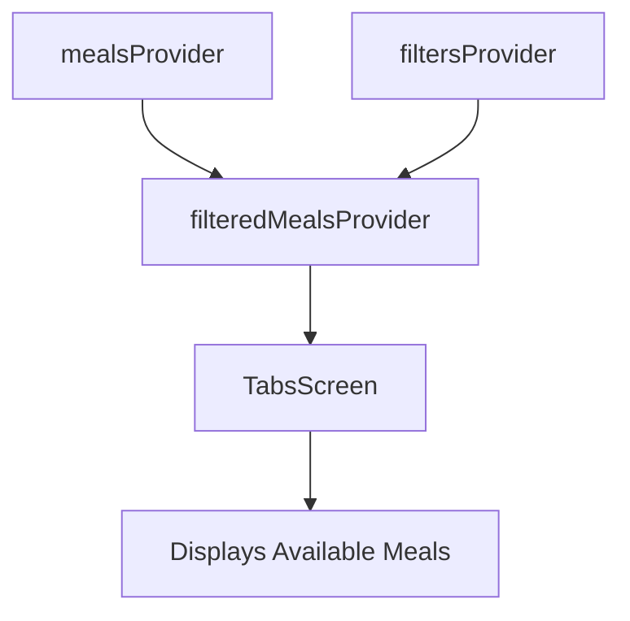
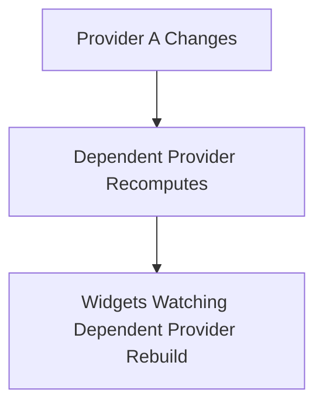
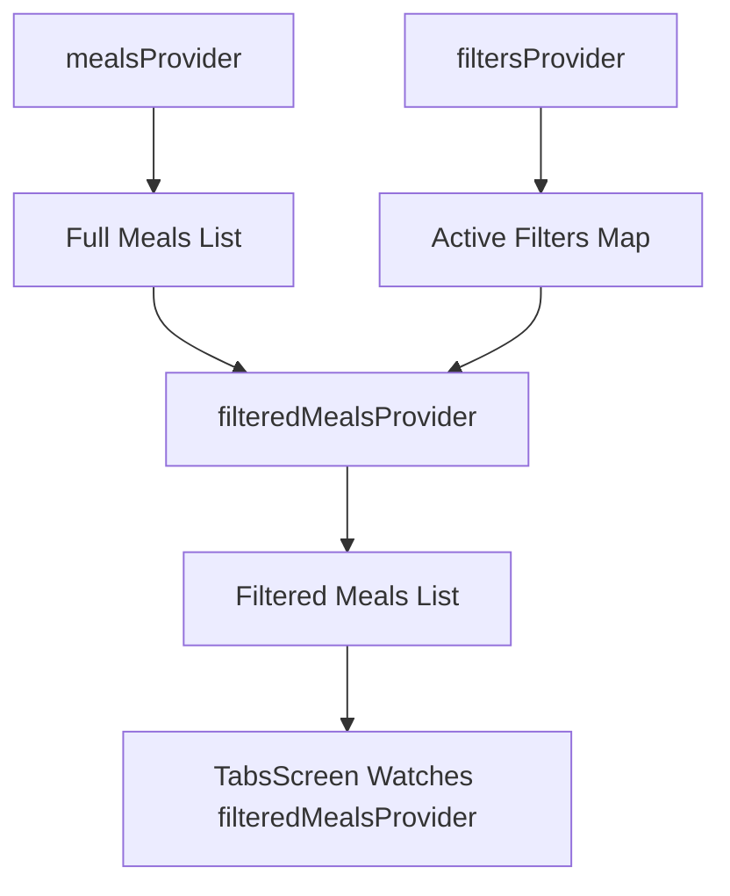
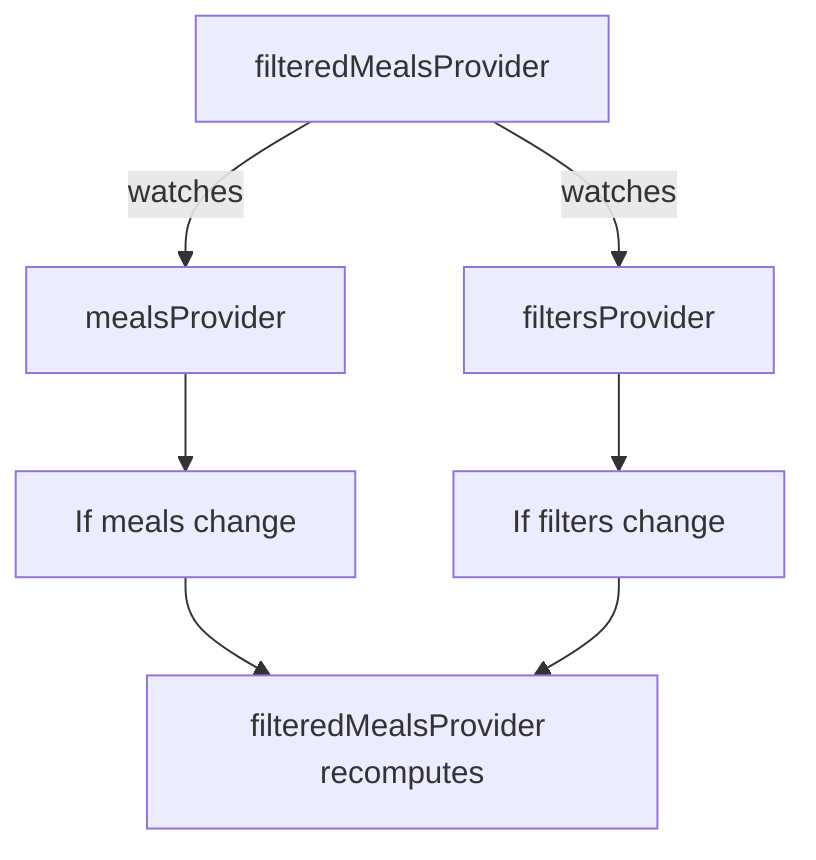
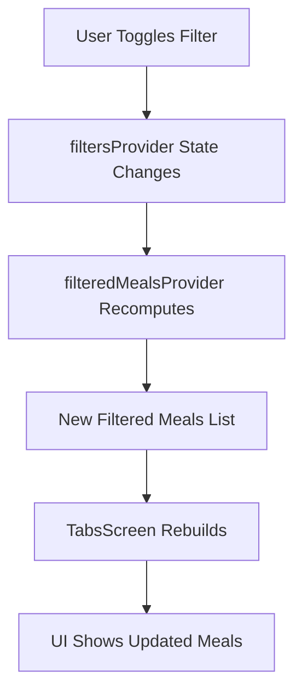
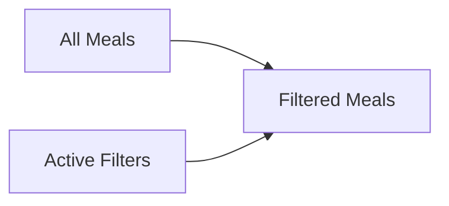
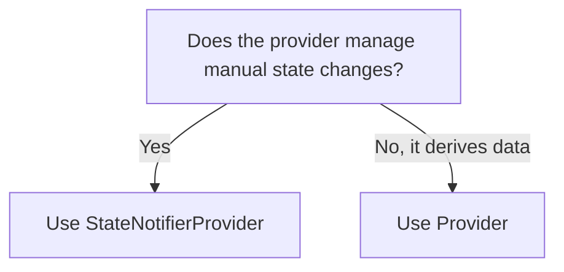

# Connecting Multiple Providers With Each Other: Dependent Providers

## Overview

This lecture demonstrates how to create a Riverpod provider that depends on other providers.

So far, the app has several providers:

* `mealsProvider` provides the full list of meals.
* `filtersProvider` stores the active filter settings.
* `favoriteMealsProvider` stores the user's favorite meals.

In this lecture, we create a new provider called `filteredMealsProvider`.

This provider combines data from:

* `mealsProvider`
* `filtersProvider`

It then returns a filtered list of meals.

This is called a **dependent provider** because its value depends on other providers.

---

## Why Create a Dependent Provider?

Before this refactor, the filtering logic was inside the `TabsScreen` build method.

The screen watched the meals provider, watched the filters provider, and manually calculated the available meals.

That worked, but it meant the widget contained business logic.

A better approach is to move this filtering logic into a provider.



Now the widget only watches the final result: the filtered meals.

---

## Before Refactoring

Previously, `TabsScreen` had to do the filtering directly.

```dart id="wn5pry"
final meals = ref.watch(mealsProvider);
final activeFilters = ref.watch(filtersProvider);

final availableMeals = meals.where((meal) {
  if (activeFilters[Filter.glutenFree]! && !meal.isGlutenFree) {
    return false;
  }
  if (activeFilters[Filter.lactoseFree]! && !meal.isLactoseFree) {
    return false;
  }
  if (activeFilters[Filter.vegetarian]! && !meal.isVegetarian) {
    return false;
  }
  if (activeFilters[Filter.vegan]! && !meal.isVegan) {
    return false;
  }
  return true;
}).toList();
```

This made the screen responsible for both UI and filtering logic.

---

## After Refactoring

After creating `filteredMealsProvider`, the `TabsScreen` becomes simpler.

```dart id="u5zzid"
final availableMeals = ref.watch(filteredMealsProvider);
```

The filtering logic is now handled by the provider.

This keeps the widget cleaner and makes the filtering logic reusable.

---

## What Is a Dependent Provider?

A dependent provider is a provider that watches other providers.

Inside a provider callback, you can use:

```dart id="olndeg"
ref.watch(otherProvider)
```

This allows one provider to depend on another provider.

If the watched provider changes, Riverpod automatically recomputes the dependent provider.



In this lecture:

```dart id="lwiz4e"
filteredMealsProvider
```

depends on:

```dart id="aa5rhz"
mealsProvider
filtersProvider
```

---

## Why `filteredMealsProvider` Is a Normal Provider

`filteredMealsProvider` does not manually change state.

It only calculates a value from other providers.

Therefore, it does not need `StateNotifierProvider`.

It can be a regular `Provider`.

```dart id="efvpyy"
final filteredMealsProvider = Provider<List<Meal>>((ref) {
  // derive filtered meals here
});
```

This kind of provider is called a **derived provider** because its value is derived from other state.

---

## Provider Dependency Flow



Whenever the filter settings change, `filteredMealsProvider` recalculates the filtered meals list.

---

## Creating `filteredMealsProvider`

Because filtering is closely related to filter state, the new provider can be placed inside `filters_provider.dart`.

```dart id="bguurb"
final filteredMealsProvider = Provider<List<Meal>>((ref) {
  final meals = ref.watch(mealsProvider);
  final activeFilters = ref.watch(filtersProvider);

  return meals.where((meal) {
    if (activeFilters[Filter.glutenFree]! && !meal.isGlutenFree) {
      return false;
    }
    if (activeFilters[Filter.lactoseFree]! && !meal.isLactoseFree) {
      return false;
    }
    if (activeFilters[Filter.vegetarian]! && !meal.isVegetarian) {
      return false;
    }
    if (activeFilters[Filter.vegan]! && !meal.isVegan) {
      return false;
    }
    return true;
  }).toList();
});
```

This provider returns a `List<Meal>` containing only the meals that match the active filters.

---

## Required Imports

Because `filteredMealsProvider` uses `Meal` and `mealsProvider`, the file needs the correct imports.

```dart id="q4orlb"
import 'package:flutter_riverpod/flutter_riverpod.dart';

import '../models/meal.dart';
import 'meals_provider.dart';
```

The `filtersProvider` is already in the same file, so it does not need to be imported separately.

---

## Complete `filters_provider.dart`

```dart id="opv5e9"
import 'package:flutter_riverpod/flutter_riverpod.dart';

import '../models/meal.dart';
import 'meals_provider.dart';

enum Filter {
  glutenFree,
  lactoseFree,
  vegetarian,
  vegan,
}

class FiltersNotifier extends StateNotifier<Map<Filter, bool>> {
  FiltersNotifier()
      : super({
          Filter.glutenFree: false,
          Filter.lactoseFree: false,
          Filter.vegetarian: false,
          Filter.vegan: false,
        });

  void setFilter(Filter filter, bool isActive) {
    state = {
      ...state,
      filter: isActive,
    };
  }

  void setFilters(Map<Filter, bool> chosenFilters) {
    state = chosenFilters;
  }
}

final filtersProvider =
    StateNotifierProvider<FiltersNotifier, Map<Filter, bool>>((ref) {
  return FiltersNotifier();
});

final filteredMealsProvider = Provider<List<Meal>>((ref) {
  final meals = ref.watch(mealsProvider);
  final activeFilters = ref.watch(filtersProvider);

  return meals.where((meal) {
    if (activeFilters[Filter.glutenFree]! && !meal.isGlutenFree) {
      return false;
    }
    if (activeFilters[Filter.lactoseFree]! && !meal.isLactoseFree) {
      return false;
    }
    if (activeFilters[Filter.vegetarian]! && !meal.isVegetarian) {
      return false;
    }
    if (activeFilters[Filter.vegan]! && !meal.isVegan) {
      return false;
    }
    return true;
  }).toList();
});
```

---

## How `ref.watch` Works Inside a Provider

The `ref` object inside a provider works similarly to the `ref` object inside a widget.

In a widget:

```dart id="zv2a7t"
final activeFilters = ref.watch(filtersProvider);
```

Inside another provider:

```dart id="mn6e8q"
final activeFilters = ref.watch(filtersProvider);
```

The difference is that inside a provider, `ref.watch` creates a provider-to-provider dependency.



---

## Automatic Recalculation

The main benefit of dependent providers is automatic recalculation.

When a filter switch changes:

1. `filtersProvider` updates its state.
2. `filteredMealsProvider` detects the change.
3. `filteredMealsProvider` recalculates the filtered meals.
4. Widgets watching `filteredMealsProvider` rebuild.



No manual recalculation is needed.

---

## Updating `TabsScreen`

After creating `filteredMealsProvider`, the filtering logic can be removed from `TabsScreen`.

Before:

```dart id="kdmfbx"
final meals = ref.watch(mealsProvider);
final activeFilters = ref.watch(filtersProvider);

final availableMeals = meals.where((meal) {
  // filtering logic
}).toList();
```

After:

```dart id="reqzjs"
final availableMeals = ref.watch(filteredMealsProvider);
```

This makes the build method shorter and easier to read.

---

## Importing the New Provider in `tabs.dart`

In `tabs.dart`, import `filters_provider.dart`.

```dart id="e4b0s8"
import '../providers/filters_provider.dart';
```

This gives access to:

```dart id="gmo6vd"
filteredMealsProvider
```

If `tabs.dart` no longer directly uses `mealsProvider`, the old `meals_provider.dart` import can be removed.

---

## Simplified `TabsScreen` Logic

```dart id="vcyk50"
@override
Widget build(BuildContext context) {
  final availableMeals = ref.watch(filteredMealsProvider);
  final favoriteMeals = ref.watch(favoriteMealsProvider);

  Widget activePage = CategoriesScreen(
    availableMeals: availableMeals,
  );

  var activePageTitle = 'Categories';

  if (_selectedPageIndex == 1) {
    activePage = MealsScreen(
      meals: favoriteMeals,
    );
    activePageTitle = 'Your Favorites';
  }

  return Scaffold(
    appBar: AppBar(
      title: Text(activePageTitle),
    ),
    body: activePage,
  );
}
```

The screen now receives ready-to-use filtered meals instead of calculating them itself.

---

## Why This Is Better

Moving filtering logic into a dependent provider improves the app structure.

| Before                              | After                                          |
| ----------------------------------- | ---------------------------------------------- |
| Filtering logic inside `TabsScreen` | Filtering logic inside `filteredMealsProvider` |
| Widget watches multiple providers   | Widget watches one derived provider            |
| More code in build method           | Cleaner build method                           |
| Business logic mixed with UI        | Business logic separated from UI               |
| Harder to reuse filtering logic     | Easier to reuse filtering logic                |

---

## Derived State

`filteredMealsProvider` is an example of derived state.

Derived state is state that can be calculated from other state.



The app does not need to manually store filtered meals separately.

It can calculate them whenever the dependencies change.

This avoids duplicate state.

---

## Why Not Use `StateNotifierProvider` Here?

`StateNotifierProvider` is useful when state must be changed manually through methods.

For example:

```dart id="ak2b9k"
favoriteMealsProvider
filtersProvider
```

But `filteredMealsProvider` does not need manual mutation.

It simply derives a result from existing providers.

So a regular `Provider` is enough.



---

## Dependent Provider Pattern

The general pattern looks like this:

```dart id="f0r1ce"
final derivedProvider = Provider<SomeValue>((ref) {
  final valueA = ref.watch(providerA);
  final valueB = ref.watch(providerB);

  return combine(valueA, valueB);
});
```

In the Meals App:

```dart id="wvjyln"
final filteredMealsProvider = Provider<List<Meal>>((ref) {
  final meals = ref.watch(mealsProvider);
  final activeFilters = ref.watch(filtersProvider);

  return meals.where((meal) {
    // filtering rules
  }).toList();
});
```

---

## Key Points

* Providers can depend on other providers.
* Use `ref.watch()` inside a provider callback to watch another provider.
* A dependent provider recomputes automatically when its dependencies change.
* `filteredMealsProvider` depends on `mealsProvider` and `filtersProvider`.
* `filteredMealsProvider` is a regular `Provider`, not a `StateNotifierProvider`.
* It returns derived data, not manually managed state.
* Moving filtering logic into a provider keeps widgets cleaner.
* `TabsScreen` can now watch only `filteredMealsProvider`.

---

## Tips

* Use a regular `Provider` for derived values.
* Use `StateNotifierProvider` for state that needs mutation methods.
* Keep filtering, sorting, and computed logic out of widgets when possible.
* Use `ref.watch()` inside providers to create dependencies.
* Remove unused imports after moving logic into a provider.
* Avoid storing derived state separately if it can be calculated from existing providers.
* Put closely related providers in the same file when it improves organization.

---

## Summary

This lecture demonstrates one of Riverpod's most powerful features: connecting providers together.

A new `filteredMealsProvider` is created. It watches both `mealsProvider` and `filtersProvider`.

```dart id="yfmsmy"
final meals = ref.watch(mealsProvider);
final activeFilters = ref.watch(filtersProvider);
```

It then returns a filtered list of meals based on the active filters.

Because this provider watches its dependencies, Riverpod automatically recalculates the filtered meals whenever the meals list or filter settings change.

The `TabsScreen` no longer needs to contain filtering logic. It can simply watch:

```dart id="xi0ju7"
final availableMeals = ref.watch(filteredMealsProvider);
```

This keeps business logic out of the widget and makes the app cleaner, more reactive, and easier to maintain.
