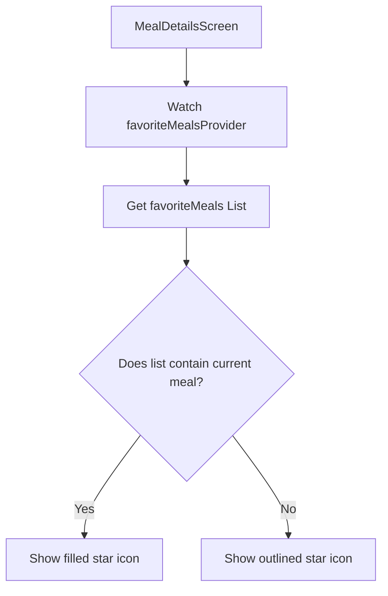
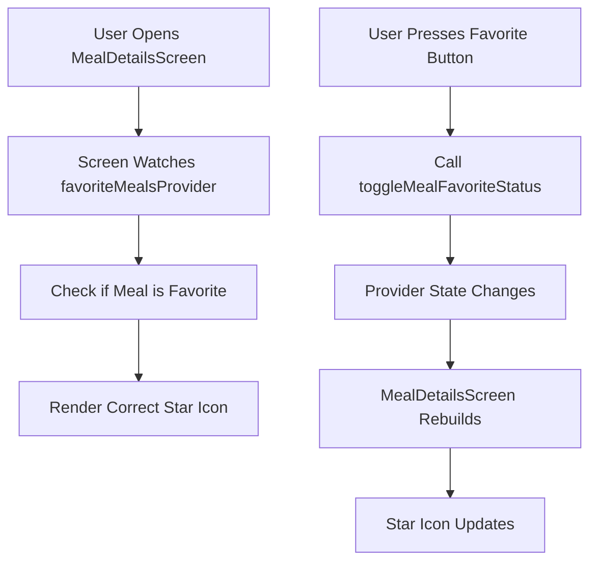

# Swapping The Favorite Button Based On Provider State

## Overview

This lecture makes one final improvement to the favorites feature.

The favorite button already works: when the user taps it, the current meal is added to or removed from the favorites list.

However, the icon should also visually reflect the current favorite status.

If the meal is already a favorite, the button should show a filled star.

If the meal is not a favorite, the button should show an outlined star.

This is done by watching `favoriteMealsProvider` inside the meal details screen and checking whether the current meal is part of the favorites list.

---

## Goal

The goal is to dynamically switch the favorite icon based on provider state.



This keeps the UI synchronized with the actual favorite state.

---

## Why Watch the Provider Here?

The `MealDetailsScreen` needs to know whether the currently displayed meal is already a favorite.

That information lives inside `favoriteMealsProvider`.

So the screen watches the provider:

```dart id="ddu402"
final favoriteMeals = ref.watch(favoriteMealsProvider);
```

This returns the current list of favorite meals.

Then the screen checks whether the current meal is inside that list:

```dart id="huyqmc"
final isFavorite = favoriteMeals.contains(meal);
```

The result is a boolean value.

```dart id="kuh53k"
true  // the meal is a favorite
false // the meal is not a favorite
```

---

## Favorite Icon Logic

Once we know whether the meal is a favorite, we can choose the correct icon.

```dart id="o86slp"
Icon(
  isFavorite ? Icons.star : Icons.star_border,
)
```

This uses a ternary expression.

| Condition             | Icon                |
| --------------------- | ------------------- |
| `isFavorite == true`  | `Icons.star`        |
| `isFavorite == false` | `Icons.star_border` |

---

## Important Change: Remove `const`

Before this change, the icon may have been constant.

```dart id="fkl0dz"
icon: const Icon(Icons.star),
```

But now the icon depends on a dynamic value.

Therefore, `const` must be removed.

```dart id="frt2r1"
icon: Icon(
  isFavorite ? Icons.star : Icons.star_border,
),
```

The icon can now change whenever the provider state changes.

---

## Complete Example

```dart id="pey1kq"
import 'package:flutter/material.dart';
import 'package:flutter_riverpod/flutter_riverpod.dart';

import '../models/meal.dart';
import '../providers/favorites_provider.dart';

class MealDetailsScreen extends ConsumerWidget {
  const MealDetailsScreen({
    super.key,
    required this.meal,
  });

  final Meal meal;

  @override
  Widget build(BuildContext context, WidgetRef ref) {
    final favoriteMeals = ref.watch(favoriteMealsProvider);
    final isFavorite = favoriteMeals.contains(meal);

    return Scaffold(
      appBar: AppBar(
        title: Text(meal.title),
        actions: [
          IconButton(
            icon: Icon(
              isFavorite ? Icons.star : Icons.star_border,
            ),
            onPressed: () {
              final wasAdded = ref
                  .read(favoriteMealsProvider.notifier)
                  .toggleMealFavoriteStatus(meal);

              ScaffoldMessenger.of(context).clearSnackBars();

              ScaffoldMessenger.of(context).showSnackBar(
                SnackBar(
                  content: Text(
                    wasAdded
                        ? 'Meal added as a favorite.'
                        : 'Meal removed.',
                  ),
                ),
              );
            },
          ),
        ],
      ),
      body: const SizedBox(),
    );
  }
}
```

---

## Reading and Writing Provider State in the Same Widget

This screen now uses both `ref.watch` and `ref.read`.

```dart id="nul6e1"
final favoriteMeals = ref.watch(favoriteMealsProvider);
```

This reads the current favorite meals and rebuilds the widget when the list changes.

```dart id="t7glvm"
ref.read(favoriteMealsProvider.notifier).toggleMealFavoriteStatus(meal);
```

This calls the notifier method when the user presses the favorite button.

---

## Watch vs Read in This Screen

| Task                                 | Code                                       | Purpose                          |
| ------------------------------------ | ------------------------------------------ | -------------------------------- |
| Check whether the meal is a favorite | `ref.watch(favoriteMealsProvider)`         | Rebuild UI when favorites change |
| Toggle the favorite status           | `ref.read(favoriteMealsProvider.notifier)` | Trigger an action in a callback  |

This is a common Riverpod pattern.

Use `watch` for UI state.

Use `read` for event actions.

---

## Update Flow



No manual `setState()` is needed.

Riverpod handles the rebuild automatically.

---

## Why No `setState()` Is Needed

The icon is based on provider state.

When the favorite list changes, Riverpod notifies the widgets that are watching the provider.

Since `MealDetailsScreen` watches `favoriteMealsProvider`, the screen rebuilds automatically.

```dart id="gul3sx"
final favoriteMeals = ref.watch(favoriteMealsProvider);
```

So the UI updates without local widget state.

---

## Small Equality Note

The expression below checks whether the current meal exists in the favorites list:

```dart id="ilelj7"
favoriteMeals.contains(meal)
```

This works correctly if the same `Meal` object instances are used throughout the app.

In larger apps, it is often safer to compare by ID:

```dart id="fhzu39"
final isFavorite = favoriteMeals.any((m) => m.id == meal.id);
```

This avoids problems if two different `Meal` objects represent the same meal.

---

## Key Points

* The favorite icon should reflect provider state.
* `MealDetailsScreen` watches `favoriteMealsProvider`.
* `ref.watch(favoriteMealsProvider)` returns the current favorites list.
* `favoriteMeals.contains(meal)` checks if the current meal is a favorite.
* A ternary expression chooses between `Icons.star` and `Icons.star_border`.
* `const` must be removed from the icon because the icon is now dynamic.
* `ref.read(favoriteMealsProvider.notifier)` is still used inside the button callback.
* The icon updates automatically when the provider state changes.
* No manual `setState()` is required.

---

## Tips

* Use `ref.watch()` when the UI should reflect provider state.
* Use `ref.read()` when triggering a provider method from a callback.
* Remove `const` when widget values become dynamic.
* Keep UI state derived from provider state when possible.
* Consider comparing model objects by `id` if object identity could be unreliable.

---

## Summary

This lecture improves the favorite button UI in `MealDetailsScreen`.

The screen watches `favoriteMealsProvider` to get the current favorites list:

```dart id="xsdebe"
final favoriteMeals = ref.watch(favoriteMealsProvider);
```

Then it checks whether the current meal is part of that list:

```dart id="xblwnl"
final isFavorite = favoriteMeals.contains(meal);
```

That boolean value is used to switch between a filled star and an outlined star:

```dart id="rhcyca"
Icon(
  isFavorite ? Icons.star : Icons.star_border,
)
```

When the user toggles the favorite status, the provider updates, the screen rebuilds automatically, and the icon changes immediately.

This keeps the UI fully synchronized with the provider-managed favorites state.
