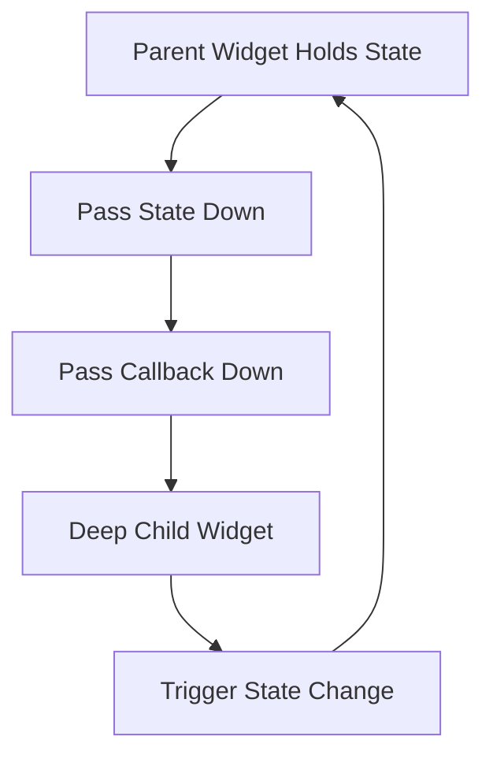
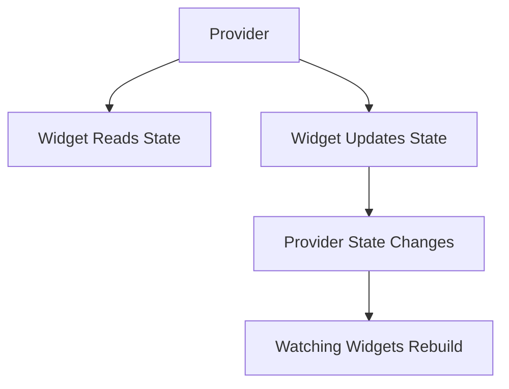
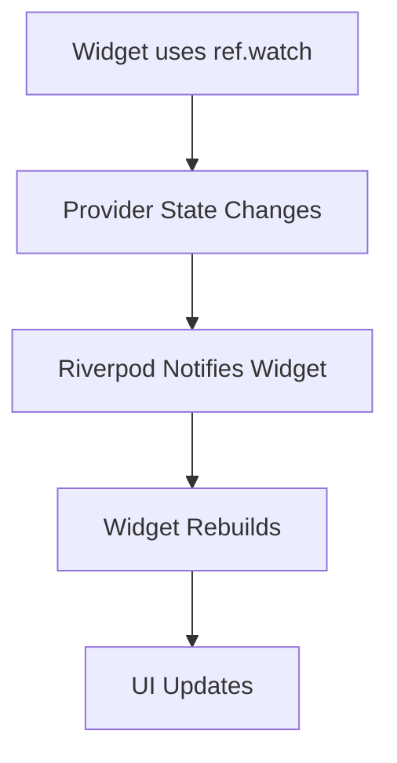
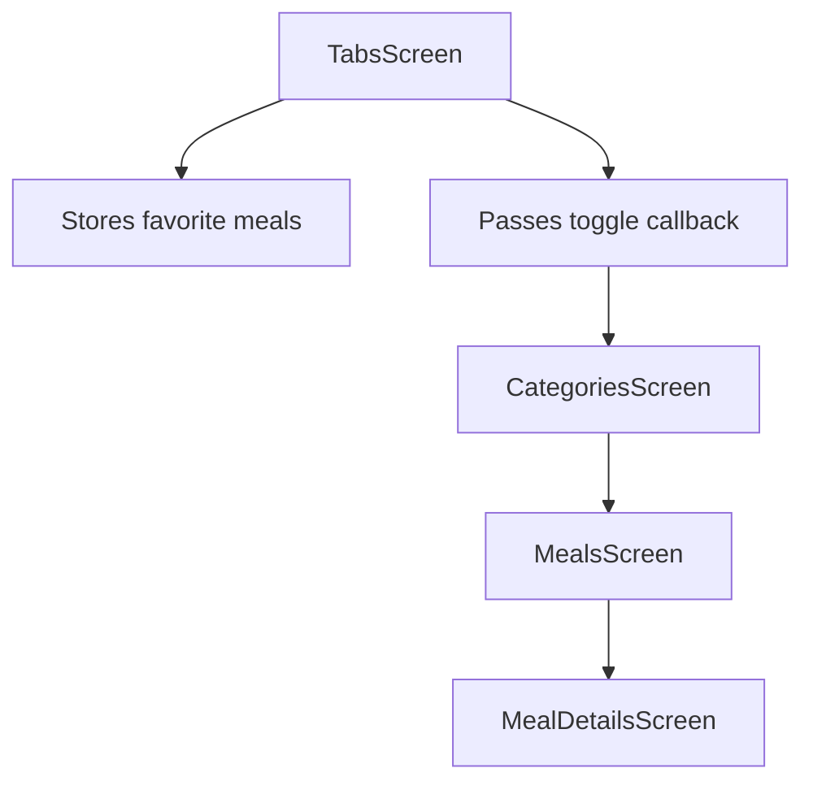
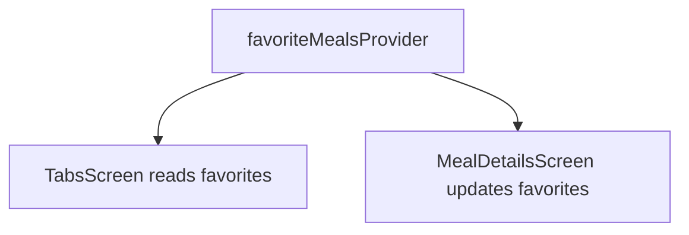
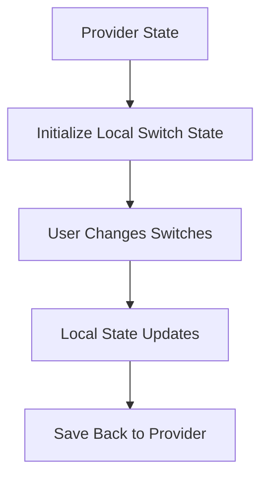
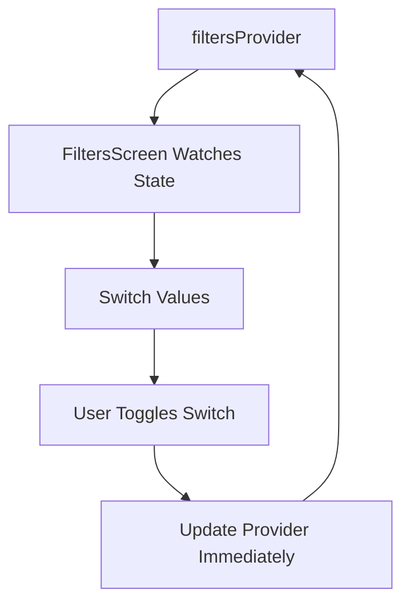
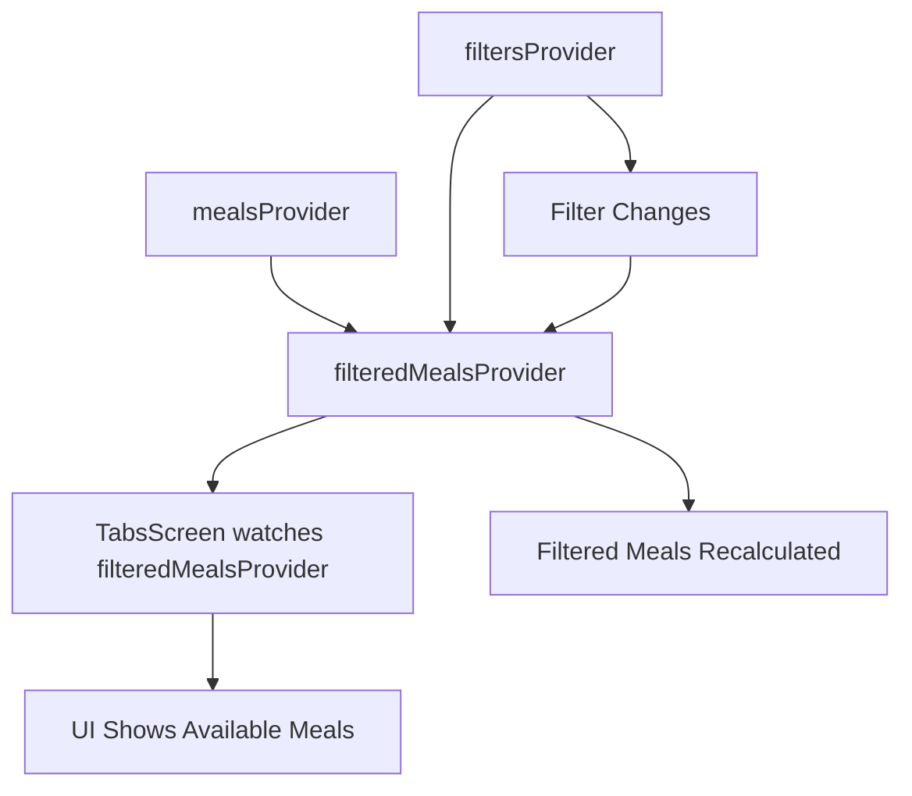
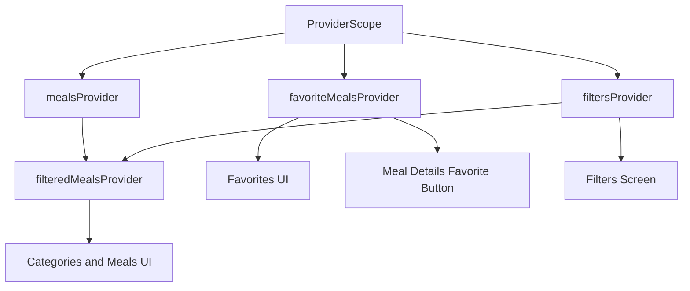

# Module Summary

## Overview

This lecture summarizes the entire Riverpod state management module.

Throughout this module, we started with a common problem in Flutter apps: managing state that is needed in multiple places.

In the Meals App, favorites and filters were needed across different screens. Without a proper state management solution, this required passing data and functions through many widget layers.

Riverpod solved this problem by allowing shared state to live inside providers, which can then be accessed from any widget that needs them.

---

## The Main Problem

In more complex Flutter apps, state is often not used and changed in the same widget.

For example, in the Meals App:

* Favorite meals are displayed in the Favorites tab.
* Favorite meals are changed in the Meal Details screen.
* Filters are changed in the Filters screen.
* Filtered meals are displayed in the Categories and Meals screens.

Without Riverpod, this caused prop drilling and callback passing.



This approach works in small apps, but it becomes hard to maintain as the app grows.

---

## What Riverpod Solves

Riverpod allows state to be stored outside the widget tree.

Widgets can then directly read or update that state through providers.



This removes the need to pass data and functions through every intermediate widget.

---

## Riverpod Setup

After installing `flutter_riverpod`, the app must be wrapped with `ProviderScope`.

```dart id="sp0kgn"
void main() {
  runApp(
    const ProviderScope(
      child: App(),
    ),
  );
}
```

`ProviderScope` enables Riverpod for all widgets below it.

In most apps, it is placed around the root app widget.

---

## Providers Created in This Module

This module introduced several providers.

| Provider                | Type                    | Purpose                                       |
| ----------------------- | ----------------------- | --------------------------------------------- |
| `mealsProvider`         | `Provider<List<Meal>>`  | Provides the full meals list                  |
| `favoriteMealsProvider` | `StateNotifierProvider` | Manages favorite meals                        |
| `filtersProvider`       | `StateNotifierProvider` | Manages active filters                        |
| `filteredMealsProvider` | `Provider<List<Meal>>`  | Derives filtered meals from meals and filters |

Together, these providers replaced the old manual state management approach.

---

## Simple Provider

The first provider was a simple `Provider`.

```dart id="b5m9jr"
final mealsProvider = Provider<List<Meal>>((ref) {
  return dummyMeals;
});
```

This provider exposes static meal data.

A simple `Provider<T>` is useful for:

* Static data
* Read-only values
* Derived values
* Values computed from other providers

It is not ideal for state that must be changed manually.

---

## StateNotifierProvider

For dynamic state, the module introduced `StateNotifier` and `StateNotifierProvider`.

This pattern was used for favorite meals.

```dart id="ol5sv9"
class FavoriteMealsNotifier extends StateNotifier<List<Meal>> {
  FavoriteMealsNotifier() : super([]);

  bool toggleMealFavoriteStatus(Meal meal) {
    final mealIsFavorite = state.contains(meal);

    if (mealIsFavorite) {
      state = state.where((m) => m.id != meal.id).toList();
      return false;
    } else {
      state = [...state, meal];
      return true;
    }
  }
}
```

Then the notifier was exposed through a provider.

```dart id="n88ddn"
final favoriteMealsProvider =
    StateNotifierProvider<FavoriteMealsNotifier, List<Meal>>((ref) {
  return FavoriteMealsNotifier();
});
```

This allows widgets to read the favorites list and trigger favorite updates.

---

## Immutable State Updates

A key rule with `StateNotifier` is that state should be updated immutably.

Avoid mutating the existing object directly.

Avoid:

```dart id="cok6yi"
state.add(meal);
state.remove(meal);
```

Use immutable updates instead:

```dart id="ue4b38"
state = [...state, meal];
```

```dart id="kl7yd7"
state = state.where((m) => m.id != meal.id).toList();
```

This ensures Riverpod can detect changes and notify listening widgets.

---

## Consumer Widgets

To access providers inside widgets, the module introduced Riverpod consumer classes.

| Normal Flutter Class | Riverpod Version         |
| -------------------- | ------------------------ |
| `StatelessWidget`    | `ConsumerWidget`         |
| `StatefulWidget`     | `ConsumerStatefulWidget` |
| `State<T>`           | `ConsumerState<T>`       |

A `ConsumerWidget` receives `WidgetRef ref` in its `build` method.

```dart id="kxcu6p"
class MealDetailsScreen extends ConsumerWidget {
  const MealDetailsScreen({super.key});

  @override
  Widget build(BuildContext context, WidgetRef ref) {
    // use ref here
  }
}
```

A `ConsumerState` has access to `ref` directly inside the state class.

---

## `ref.watch`

Use `ref.watch()` when the widget should listen to provider changes.

```dart id="o9x3c4"
final favoriteMeals = ref.watch(favoriteMealsProvider);
```

When the provider state changes, the widget rebuilds automatically.



Use `watch` inside `build` when the UI depends on provider state.

---

## `ref.read`

Use `ref.read()` when accessing a provider once, usually inside callbacks.

```dart id="wdsetp"
ref
    .read(favoriteMealsProvider.notifier)
    .toggleMealFavoriteStatus(meal);
```

This is useful when pressing a button or triggering an action.

`ref.read()` does not create a rebuild subscription.

---

## `ref.watch` vs `ref.read`

| Method                        | Use Case                     | Rebuild Subscription? |
| ----------------------------- | ---------------------------- | --------------------- |
| `ref.watch(provider)`         | Display provider state in UI | Yes                   |
| `ref.read(provider)`          | Read once or call methods    | No                    |
| `ref.read(provider.notifier)` | Call notifier methods        | No                    |

A common pattern is:

```dart id="u1b3ls"
final state = ref.watch(myProvider);

ref.read(myProvider.notifier).someMethod();
```

Watch for UI.

Read for actions.

---

## Managing Favorites

The favorites feature was moved out of `TabsScreen` and into `favoriteMealsProvider`.

Before Riverpod:



After Riverpod:



This made the app much cleaner because the callback chain could be removed.

---

## Managing Filters

The filters feature was also moved into a provider.

```dart id="aa24t7"
enum Filter {
  glutenFree,
  lactoseFree,
  vegetarian,
  vegan,
}
```

The filter state was stored as:

```dart id="akw6x2"
Map<Filter, bool>
```

Each filter could be updated with:

```dart id="d7hx8r"
void setFilter(Filter filter, bool isActive) {
  state = {
    ...state,
    filter: isActive,
  };
}
```

This made `filtersProvider` the single source of truth for filter settings.

---

## Local State vs Provider State

The module also showed two approaches for filter state.

First, the app combined local state and provider state:



Then the module simplified the approach by moving all filter state directly into the provider.



The final version used `ConsumerWidget` instead of `ConsumerStatefulWidget`.

---

## Dependent Providers

One of Riverpod's most powerful features is that providers can depend on other providers.

The module created `filteredMealsProvider`, which watches both `mealsProvider` and `filtersProvider`.

```dart id="ag3l0k"
final filteredMealsProvider = Provider<List<Meal>>((ref) {
  final meals = ref.watch(mealsProvider);
  final activeFilters = ref.watch(filtersProvider);

  return meals.where((meal) {
    if (activeFilters[Filter.glutenFree]! && !meal.isGlutenFree) {
      return false;
    }
    if (activeFilters[Filter.lactoseFree]! && !meal.isLactoseFree) {
      return false;
    }
    if (activeFilters[Filter.vegetarian]! && !meal.isVegetarian) {
      return false;
    }
    if (activeFilters[Filter.vegan]! && !meal.isVegan) {
      return false;
    }
    return true;
  }).toList();
});
```

This provider automatically recomputes when the meals list or active filters change.

---

## Dependent Provider Flow



This moved filtering logic out of the widget and into a derived provider.

---

## Favorite Button UI

The module also improved the favorite button.

The `MealDetailsScreen` watches the favorite meals list:

```dart id="qsg3hb"
final favoriteMeals = ref.watch(favoriteMealsProvider);
final isFavorite = favoriteMeals.contains(meal);
```

Then it changes the icon dynamically:

```dart id="yhnw4f"
Icon(
  isFavorite ? Icons.star : Icons.star_border,
)
```

This keeps the UI synchronized with provider state.

No `setState()` is needed.

---

## Final App State Architecture



Each provider has a clear responsibility.

Widgets only consume the state they need.

---

## Before Riverpod vs After Riverpod

| Before Riverpod                      | After Riverpod                           |
| ------------------------------------ | ---------------------------------------- |
| State stored in widgets              | State stored in providers                |
| Data passed through constructors     | Widgets read providers directly          |
| Callbacks passed through many layers | Widgets call notifier methods directly   |
| Filtering logic inside build methods | Filtering logic inside derived providers |
| More coupling between widgets        | Cleaner separation of concerns           |
| Harder to scale                      | Easier to maintain                       |

---

## Key Concepts Reviewed

### `ProviderScope`

Wraps the app and enables Riverpod.

```dart id="qsnq1w"
const ProviderScope(
  child: App(),
)
```

### `Provider<T>`

Provides read-only or derived values.

```dart id="s5dmrx"
final mealsProvider = Provider<List<Meal>>((ref) {
  return dummyMeals;
});
```

### `StateNotifier`

Stores state and exposes methods to update it.

```dart id="bh5h2v"
class FavoriteMealsNotifier extends StateNotifier<List<Meal>> {
  FavoriteMealsNotifier() : super([]);
}
```

### `StateNotifierProvider`

Exposes a notifier and its state to widgets.

```dart id="e1lqmk"
final favoriteMealsProvider =
    StateNotifierProvider<FavoriteMealsNotifier, List<Meal>>((ref) {
  return FavoriteMealsNotifier();
});
```

### `ConsumerWidget`

Allows a stateless widget to use providers.

```dart id="u8hv5t"
class MyWidget extends ConsumerWidget {
  @override
  Widget build(BuildContext context, WidgetRef ref) {
    // use ref here
  }
}
```

### `ConsumerStatefulWidget`

Allows a stateful widget to use providers.

```dart id="xgrs86"
class MyScreen extends ConsumerStatefulWidget {
  const MyScreen({super.key});

  @override
  ConsumerState<MyScreen> createState() {
    return _MyScreenState();
  }
}
```

---

## Key Points

* Riverpod helps manage cross-widget state.
* `ProviderScope` must wrap the part of the widget tree that uses providers.
* Simple providers can expose static or derived data.
* `StateNotifierProvider` is useful for mutable state.
* `StateNotifier` classes contain state-changing methods.
* State should be updated immutably.
* Widgets use `ref.watch()` to listen to provider state.
* Widgets use `ref.read()` to trigger actions or read once.
* Providers can depend on other providers.
* Derived providers help move business logic out of widgets.
* Riverpod reduces prop drilling and callback passing.

---

## Tips

* Keep providers organized in dedicated provider files.
* Use clear provider names such as `mealsProvider`, `filtersProvider`, and `favoriteMealsProvider`.
* Use `Provider<T>` for static or computed values.
* Use `StateNotifierProvider` when state needs methods for changing it.
* Avoid mutating state directly inside `StateNotifier`.
* Use `ref.watch()` inside `build`.
* Use `ref.read()` inside callbacks.
* Move filtering and computed logic into derived providers when possible.
* Let providers be the single source of truth for shared state.
* Keep widgets focused on UI instead of business logic.

---

## Summary

This module introduced Riverpod as a solution for managing cross-widget and application-wide state in Flutter.

The Meals App started with a prop-drilling problem: state was needed in one part of the app but changed in another. Without Riverpod, this required passing data and callback functions through multiple widget layers.

With Riverpod, shared state was moved into providers.

The module covered simple providers, `StateNotifierProvider`, `ConsumerWidget`, `ConsumerStatefulWidget`, `ref.watch`, `ref.read`, immutable updates, and dependent providers.

By the end of the module, favorites and filters were fully managed through Riverpod, and filtering logic was moved into a derived provider.

Riverpod made the app cleaner, more reactive, easier to maintain, and easier to scale.
