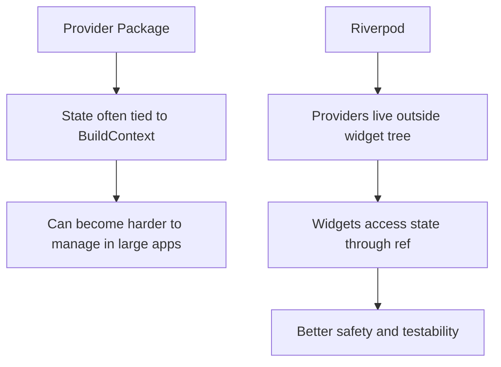
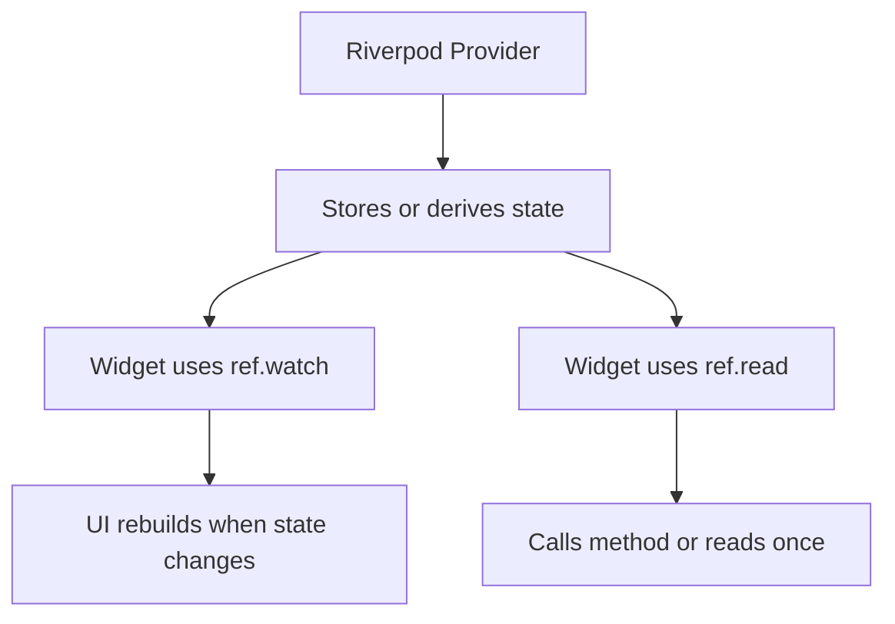
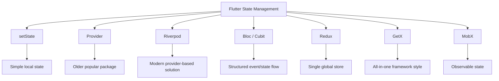
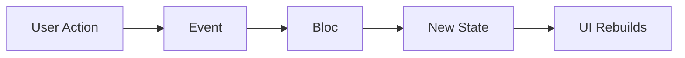
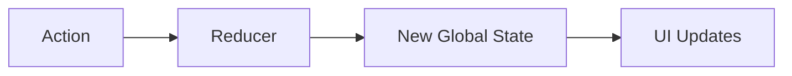
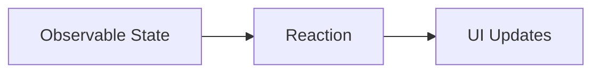
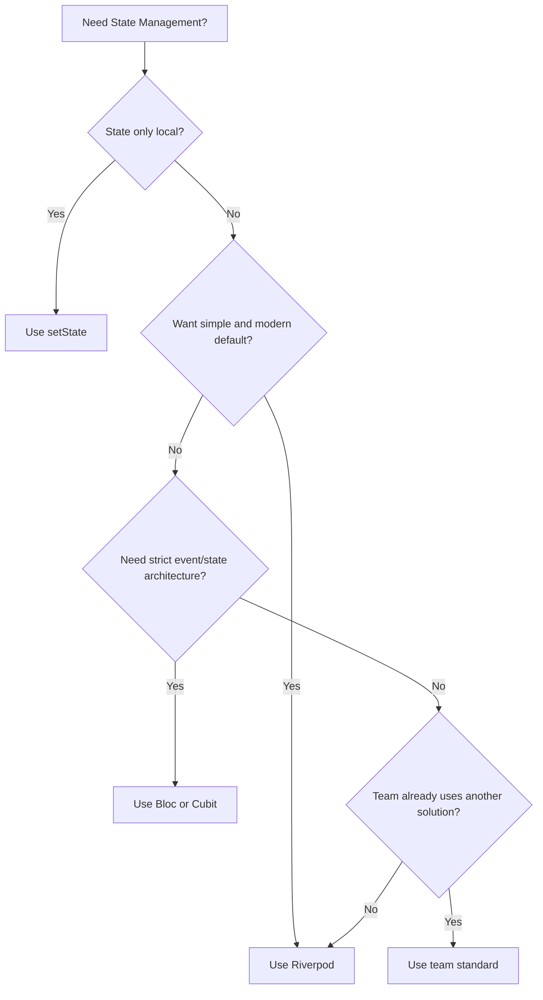

# Riverpod vs Provider: There Are Many Alternatives

## Overview

This lecture gives a broader view of state management options in Flutter.

In this course, we used **Riverpod** to manage cross-widget and app-wide state. However, Riverpod is not the only solution available.

Older versions of the course used the **Provider** package. Provider is still popular, but Riverpod was created by the same developer as a more modern rewrite that fixes several limitations of Provider.

Besides Provider and Riverpod, Flutter developers may also use other solutions such as Bloc, Cubit, Redux, GetX, MobX, or even plain `setState` for smaller apps.

The goal of this lecture is not to say that only one solution is correct. Instead, it helps you understand why Riverpod was chosen in this course and how it compares to other alternatives.

---

## Why This Course Uses Riverpod

Riverpod was created by the same developer who created Provider.

You can think of Riverpod as a more modern redesign of Provider.

Provider is useful and widely used, but Riverpod improves on it by offering:

* Better compile-time safety
* Less dependency on `BuildContext`
* More flexible provider composition
* Better testability
* Cleaner support for provider-to-provider dependencies

That is why this course uses Riverpod instead of Provider.

---

## Provider vs Riverpod

| Feature               | Provider                         | Riverpod                               |
| --------------------- | -------------------------------- | -------------------------------------- |
| Created by            | Remi Rousseau                    | Remi Rousseau                          |
| Relationship          | Older package                    | Modern rewrite / improvement           |
| Flutter dependency    | Tightly connected to widget tree | Providers can live outside widget tree |
| Access pattern        | Often depends on `BuildContext`  | Uses `ref`                             |
| Compile-time safety   | Weaker                           | Stronger                               |
| Testability           | Good, but less flexible          | Easier to test                         |
| Provider dependencies | Possible, but less elegant       | Very natural with `ref.watch`          |
| Course choice         | Used in older versions           | Used in this version                   |

---

## Why Riverpod Improves on Provider

Provider is based heavily on Flutter's widget tree and `BuildContext`.

Riverpod changes the model by allowing providers to be declared outside the widget tree.

This gives Riverpod a cleaner mental model:



Riverpod keeps the main idea of Provider but improves the architecture.

---

## Riverpod Mental Model

With Riverpod, state is stored in providers.

Widgets can read or watch those providers.



This pattern avoids passing data and callbacks through many widget layers.

---

## Other Flutter State Management Alternatives

Riverpod is only one option.

Flutter has many state management approaches.

| Solution        | Main Idea                                 | Best For                                    |
| --------------- | ----------------------------------------- | ------------------------------------------- |
| `setState`      | Local widget state                        | Small, simple UI state                      |
| InheritedWidget | Built-in dependency sharing               | Custom low-level state sharing              |
| Provider        | Widget-tree-based state management        | Simple to medium Flutter apps               |
| Riverpod        | Provider-like but safer and more flexible | Most modern Flutter apps                    |
| Bloc / Cubit    | Event/state architecture                  | Large, structured, enterprise apps          |
| Redux           | Single global store and reducers          | Apps needing strict predictable state flow  |
| GetX            | State + routing + dependency injection    | Fast development with opinionated structure |
| MobX            | Observables and reactions                 | Reactive programming style                  |

---

## State Management Alternatives Diagram



---

## `setState`

`setState` is Flutter's built-in way to update local widget state.

Example:

```dart id="xhgbsa"
setState(() {
  isSelected = true;
});
```

It is simple and effective when the state only belongs to one widget.

Good use cases:

* Toggle button state
* Local animation state
* Temporary form field UI
* Expanding or collapsing a widget

However, `setState` becomes difficult when state is needed across many unrelated widgets.

---

## Provider

Provider is a popular state management package and was used in older versions of this course.

It helps share state through the widget tree.

Provider is still useful, especially for simple apps or teams already familiar with it.

However, compared to Riverpod, Provider can feel more limited because it is more closely tied to `BuildContext`.

---

## Riverpod

Riverpod is the package used in this course.

It is a strong default choice because it offers a good balance between simplicity and power.

Riverpod supports:

* Simple providers
* Mutable state with `StateNotifierProvider`
* Derived providers
* Provider-to-provider dependencies
* Better testing
* Safer state access

Example:

```dart id="d2bc6w"
final mealsProvider = Provider<List<Meal>>((ref) {
  return dummyMeals;
});
```

Example with state mutation:

```dart id="dyhi0r"
final favoriteMealsProvider =
    StateNotifierProvider<FavoriteMealsNotifier, List<Meal>>((ref) {
  return FavoriteMealsNotifier();
});
```

---

## Bloc and Cubit

Bloc and Cubit provide a more structured approach to state management.

They are popular in larger applications because they clearly separate:

* Events or actions
* Business logic
* State output
* UI rendering

Bloc can involve more boilerplate than Riverpod, but it can be very explicit and predictable.



Cubit is a simpler version of Bloc that does not require explicit event classes.

---

## Redux

Redux is based on a single global store.

State is changed through actions and reducers.



Redux is predictable and strict, but it can feel verbose in Flutter compared to Riverpod or Bloc.

It is more common in projects where the team already likes Redux-style architecture.

---

## GetX

GetX is an all-in-one package.

It can handle:

* State management
* Navigation
* Dependency injection
* Dialogs and snackbars

It is popular because it can be quick and simple to use.

However, it is also more opinionated. In larger projects, some teams prefer more explicit and modular approaches such as Riverpod or Bloc.

---

## MobX

MobX uses observable state and reactions.

The basic idea is:



MobX may feel familiar to developers from other reactive programming ecosystems.

It is less commonly used in many Flutter learning paths than Provider, Riverpod, or Bloc, but it is still a valid option.

---

## Choosing a State Management Solution

There is no single perfect state management package for every project.

The right choice depends on:

* Project size
* Team experience
* App complexity
* Testing needs
* Preferred architecture
* Amount of boilerplate your team accepts



---

## Why Learning Riverpod Is Valuable

Even if you later use another package, Riverpod teaches important state management principles.

These principles apply almost everywhere:

* Separate UI from state logic
* Keep shared state outside individual widgets
* Use one source of truth
* Update state reactively
* Avoid prop drilling
* Keep business logic testable
* Rebuild only the widgets that need updated state

So the main value is not only learning Riverpod syntax. It is learning how to think about shared state.

---

## Riverpod in This Course

In this course module, Riverpod was used to manage:

| Feature         | Provider                |
| --------------- | ----------------------- |
| Full meals list | `mealsProvider`         |
| Favorite meals  | `favoriteMealsProvider` |
| Active filters  | `filtersProvider`       |
| Filtered meals  | `filteredMealsProvider` |

This showed how Riverpod can handle:

* Static data
* Mutable state
* Derived state
* Dependent providers
* Cross-widget state updates

---

## Comparing Common Choices

| Package      | Strength                            | Trade-off                           |
| ------------ | ----------------------------------- | ----------------------------------- |
| `setState`   | Simple and built-in                 | Not good for complex shared state   |
| Provider     | Simple and popular                  | Less flexible than Riverpod         |
| Riverpod     | Safe, flexible, testable            | Requires learning provider patterns |
| Bloc / Cubit | Very structured and predictable     | More boilerplate                    |
| Redux        | Strict and predictable global state | Verbose for many Flutter apps       |
| GetX         | Fast and convenient                 | Opinionated and broad in scope      |
| MobX         | Reactive observable style           | Less common in Flutter courses      |

---

## Key Points

* Riverpod is not the only Flutter state management solution.
* Older versions of this course used Provider.
* Riverpod was created by the same developer as Provider.
* Riverpod improves on several limitations of Provider.
* Riverpod is a strong default choice for many Flutter apps.
* Bloc and Cubit are good for highly structured apps.
* Redux offers strict global state management.
* GetX is convenient but more opinionated.
* MobX uses observable and reaction patterns.
* `setState` is still valid for simple local state.
* The best solution depends on the project and team.

---

## Tips

* Do not try to learn every state management package at once.
* Understand one solution deeply first.
* Use `setState` for simple local UI state.
* Use Riverpod when state is shared across widgets or screens.
* Consider Bloc or Cubit when your app needs very explicit architecture.
* Follow your team's existing standard when working on a real project.
* Focus on the core idea: separating state logic from UI.

---

## Summary

Flutter has many state management options.

Older versions of this course used Provider, but this version uses Riverpod. Riverpod was created by the same developer as Provider and can be seen as a modern rewrite that fixes several limitations of Provider.

Riverpod provides compile-time safety, better testability, less dependence on `BuildContext`, and strong support for provider dependencies.

Other alternatives such as Bloc, Cubit, Redux, GetX, MobX, and plain `setState` are also valid depending on the project.

For this course, Riverpod is chosen because it offers a practical balance of simplicity, flexibility, and power for managing cross-widget state in Flutter apps.
